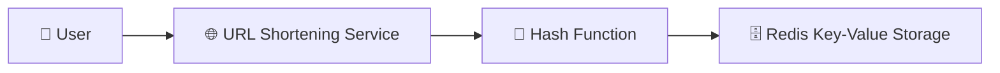

# Amazon System Design Cheats v02
Date: 2024-06-22

I am grateful for the opportunity to express myself through writing.


1. **URL Shortening Service**
   - Hint: Use hash functions for URL mapping, a key-value store like Redis for storage, handle collisions with re-hashing or suffix addition, and ensure the system scales horizontally.
   - Diagram:

```mermaid
   graph LR
   A[👤 User] --> B[🌐 URL Shortening Service]
   B --> C[🔀 Hash Function]
   C --> D[🗄️ Redis Key-Value Storage]
```

2. **Cache System for a Web Application**
   - Hint: Use in-memory caches like Redis or Memcached, implement cache eviction policies (LRU, LFU), and ensure cache invalidation on data update.
   - Diagram:
   ```mermaid
   graph LR
   A[👤 User] --> B[🌐 Web App]
   B --> C[🗄️ In-Memory Cache Redis/Memcached]
   ```

3. **Scalable Web Crawling System**
   - Hint: Use distributed worker nodes, task queues like RabbitMQ or Kafka, URL deduplication, politeness policies (rate limiting), and storage for crawled data.
   - Diagram:
   ```mermaid
   graph LR
   A[🌐 Web] --> B[🐇 RabbitMQ Task Queue]
   B --> C[🏗️ Workers]
   C --> D[🗂️ Storage]
   ```

4. **Online Ticket Booking System**
   - Hint: Implement ACID transactions for ticket purchases, use seat locking mechanisms, handle concurrency with optimistic/pessimistic locking, and use load balancers to distribute traffic.
   - Diagram:
   ```mermaid
   graph LR
   A[👤 User] --> B[🌐 Ticket Booking System]
   B --> C[💳 Payment Service]
   B --> D[🏷️ Seat Locking Mechanism]
   D --> E[🗄️ Database]
   ```

5. **Social Media Feed System**
   - Hint: Use a publish-subscribe model with Kafka, maintain denormalized tables for feeds, use ranking algorithms for content relevance, and cache results for fast retrieval.
   - Diagram:
   ```mermaid
   graph LR
   A[👤 User] --> B[🌐 Social Media]
   B --> C[📨 Kafka Pub-Sub]
   C --> D[🗂️ Feed Storage]
   D --> E[🗃️ Cache]
   ```

6. **File Storage and Sharing Service**
   - Hint: Utilize object storage like AWS S3, implement data redundancy and replication, handle file metadata in a relational database, and secure access with ACLs and encryption.
   - Diagram:
   ```mermaid
   graph LR
   A[👤 User] --> B[🌐 File Storage Service]
   B --> C[🗄️ Metadata DB]
   B --> D[🗂️ Object Storage AWS S3]
   ```

7. **Search Autocomplete System**
   - Hint: Use trie or prefix tree data structures, cache popular queries, implement type-ahead search with fuzzy matching, and optimize for low-latency responses.
   - Diagram:
   ```mermaid
   graph LR
   A[👤 User] --> B[🌐 Search System]
   B --> C[🌲 Trie Data Structure]
   C --> D[🗃️ Cache]
   ```

8. **Global Content Distribution Network (CDN)**
   - Hint: Deploy edge servers close to users, use caching strategies (TTL, cache hierarchy), implement load balancing, and ensure content invalidation.
   - Diagram:
   ```mermaid
   graph LR
   A[👤 User] --> B[🌐 CDN]
   B --> C[🌎🌍🌏 Edge Servers]
   ```

9. **Messaging System like WhatsApp**
   - Hint: Use message brokers like Kafka for message queuing, end-to-end encryption for security, store messages in partitioned databases, and ensure high availability.
   - Diagram:
   ```mermaid
   graph LR
   A[👤 User] --> B[🌐 Messaging Service]
   B --> C[🔐 Encryption]
   B --> D[📨 Kafka Message Queue]
   D --> E[🗂️ Partitioned DB]
   ```

10. **Online Payment System**
    - Hint: Ensure security with PCI compliance, use transactional databases, idempotent API endpoints, and multi-layered authentication (2FA, tokens).
    - Diagram:
    ```mermaid
    graph LR
    A[👤 User] --> B[🌐 Payment System]
    B --> C[🏦 Bank]
    B --> D[🔒 Security Service]
    ```

11. **Real-Time Collaborative Document Editing**
    - Hint: Implement operational transformation (OT) or conflict-free replicated data types (CRDTs), use WebSockets for real-time updates, and version control for document states.
    - Diagram:
    ```mermaid
    graph LR
    A[👤 User] --> B[🌐 Doc Editing Service]
    B --> C[🕸️ WebSocket]
    C --> D[📝 Document State]
    ```

12. **Scalable Notification Service**
    - Hint: Use a message queue for asynchronous processing, push notification services (e.g., Firebase), store user preferences, and ensure delivery guarantees.
    - Diagram:
    ```mermaid
    graph LR
    A[👤 User] --> B[🌐 Notification Service]
    B --> C[📨 Queue]
    C --> D[📲 Push Service]
    ```

13. **Recommendation System for E-commerce**
    - Hint: Implement collaborative filtering, content-based filtering, use real-time data processing with Spark or Flink, and personalize recommendations with user profiles.
    - Diagram:
    ```mermaid
    graph LR
    A[👤 User] --> B[🌐 E-commerce]
    B --> C[🧠 ML Model]
    C --> D[🗄️ User Profile]
    ```

14. **Ride-Sharing Service**
    - Hint: Use GPS tracking, implement real-time matching algorithms, use scalable databases for storing ride details, and ensure low-latency communication.
    - Diagram:
    ```mermaid
    graph LR
    A[👤 User] --> B[📍 GPS]
    B --> C[🌐 Ride-Sharing Service]
    C --> D[🧮 Matching Algorithm]
    D --> E[🗄️ Database]
    ```

15. **Real-Time Analytics System**
    - Hint: Use stream processing frameworks like Apache Flink, data warehouses like Redshift, and real-time visualization tools like Grafana or Tableau.
    - Diagram:
    ```mermaid
    graph LR
    A[👤 User] --> B[🌐 Analytics Service]
    B --> C[📊 Flink]
    C --> D[🗂️ Data Warehouse]
    D --> E[📉 Visualization Tool]
    ```

16. **Managing User Sessions Across Devices**
    - Hint: Implement centralized session storage with Redis, use session tokens or JWTs, secure cookies, and ensure session expiration policies.
    - Diagram:
    ```mermaid
    graph LR
    A[👤 User] --> B[🌐 App]
    B --> C[🗄️ Redis Session Store]
    C --> D[🔑 Session Token]
    ```

17. **Video Streaming Service**
    - Hint: Use CDNs for content delivery, adaptive bitrate streaming for various network conditions, video encoding with formats like H.264, and scalable storage for video files.
    - Diagram:
    ```mermaid
    graph LR
    A[👤 User] --> B[🌐 Video Service]
    B --> C[📹 Encoder]
    C --> D[🌎🌍🌏 CDN]
    ```

18. **Server Performance Monitoring System**
    - Hint: Use metrics collection tools like Prometheus, alerting systems like Grafana, log aggregation with ELK stack, and visualize performance data on dashboards.
    - Diagram:
    ```mermaid
    graph LR
    A[👤 User] --> B[🌐 Monitoring Service]
    B --> C[📊 Prometheus]
    C --> D[📉 Grafana]
    ```

19. **API Rate Limiter**
    - Hint: Implement token bucket algorithms, use distributed rate limiting with Redis, and provide throttling to prevent abuse, logging and monitoring for insights.
    - Diagram:
    ```mermaid
    graph LR
    A[👤 User] --> B[🌐 API]
    B --> C[⏳ Token Bucket]
    C --> D[🗄️ Redis]
    ```

20. **Distributed Database**
    - Hint: Use data partitioning (sharding), implement replication (master-slave, multi-master), handle consistency with protocols like Paxos or Raft, and optimize for CAP theorem trade-offs.
    - Diagram:
    ```mermaid
    graph LR
    A[👤 User] --> B[🌐 App]
    B --> C[📊 Sharding]
    C --> D[🗄️ Distributed DB]
    ```

21. **Log Collection and Analysis**
    - Hint: Use log aggregation tools like ELK stack, store logs in a distributed file system, index logs for fast search, and analyze logs with Kibana or Grafana.
    - Diagram:
    ```mermaid
    graph LR
    A[👤 User] --> B[🌐 Log Service]
    B --> C[📋 ELK Stack]
    C --> D[📊 Kibana]
    ```

22. **Microservices Architecture for E-commerce**
    - Hint: Implement service discovery (Consul, Eureka), API gateways (Kong, Nginx), container orchestration with Kubernetes, and inter-service communication with gRPC or REST.
    - Diagram:
    ```mermaid
    graph LR
    A[👤 User] --> B[🌐 E-commerce]
    B --> C[🗄️ Services]
    C --> D[🚢 K8s]
    ```

23. **Fault-Tolerant Distributed System**
    - Hint: Implement redundancy with replication, use consensus algorithms like Raft, ensure automatic failover, and handle network partitions gracefully.
    - Diagram:
    ```mermaid
    graph LR
    A[👤 User] --> B[🌐 System]
    B --> C[🔄 Redundancy]
    C --> D[🗄️ DB]
    ```

24. **Scalable Chat Application**
    - Hint: Use WebSockets for real-time communication, message queues for asynchronous processing, partition databases for horizontal scaling, and implement read replicas.
    - Diagram:
    ```mermaid
    graph LR
    A[👤 User] --> B[🌐 Chat Service]
    B --> C[🕸️ WebSocket]
    C --> D[📨 Queue]
    D --> E[🗄️ Partitioned DB]
    ```

25. **Processing Large-Scale Data Streams**
    - Hint: Use stream processing frameworks like Kafka Streams, Apache Flink, or Spark Streaming, and scalable storage solutions like HDFS or S3.
    - Diagram:
    ```mermaid
    graph LR
    A[👤 User] --> B[🌐 Data Processing]
    B --> C[📨 Kafka Streams]
    C --> D[🗂️ HDFS]
    ```

26. **Geographically Distributed System**
    - Hint: Implement data replication across regions, use load balancing to optimize latency, and handle eventual consistency with conflict resolution mechanisms.
    - Diagram:
    ```mermaid
    graph LR
    A[👤 User] --> B[🌐 System]
    B --> C[🌎🌍🌏 Regions]
    C --> D[🔄 Replication]
    ```

27. **Load Balancer**
    - Hint: Use reverse proxies like Nginx or HAProxy, implement consistent hashing for stateful services, and perform health checks to route traffic away from unhealthy nodes.
    - Diagram:
    ```mermaid
    graph LR
    A[👤 User] --> B[🌐 Load Balancer]
    B --> C[🌀 Balancer]
    C --> D[🗄️ DB]
    ```

28. **Web Analytics System**
    - Hint: Use event tracking with tools like Google Analytics or custom solutions, data warehousing with BigQuery, and real-time processing with Spark Streaming.
    - Diagram:
    ```mermaid
    graph LR
    A[👤 User] --> B[🌐 Analytics]
    B --> C[📊 Event Tracking]
    C --> D[🗂️ Data Warehouse]
    ```

29. **Search Engine for E-commerce Website**
    - Hint: Implement inverted indexes, use Elasticsearch or Solr, relevance ranking algorithms, and cache search results for performance.
    - Diagram:
    ```mermaid
    graph LR
    A[👤 User] --> B[🌐 E-commerce Search]
    B --> C[🔍 Inverted Index]
    C --> D[🗂️ Elasticsearch]
    ```

30. **Real-Time Bidding System for Online Advertising**
    - Hint: Use low-latency data processing with Apache Kafka, auction algorithms, bidder management systems, and ensure scalability.
    - Diagram:
    ```mermaid
    graph LR
    A[👤 User] --> B[🌐 Ad Bidding]
    B --> C[📨 Kafka]
    C --> D[🗂️ Bidder Management]
    ```

31. **Content Recommendation Engine**
    - Hint: Implement machine learning models for personalized recommendations, use collaborative and content-based filtering, and perform A/B testing for evaluation.
    - Diagram:
    ```mermaid
    graph LR
    A[👤 User] --> B[🌐 Recommendation Engine]
    B --> C[🧠 ML Model]
    C --> D[🗄️ User Profile]
    ```

32. **Multi-Tenant SaaS Application**
    - Hint: Implement tenant isolation with separate databases or schemas, use shared infrastructure for efficiency, and manage tenant-specific configurations.
    - Diagram:
    ```mermaid
    graph LR
    A[👤 User] --> B[🌐 SaaS App]
    B --> C[🗄️ Tenants]
    C --> D[🔒 Isolation]
    ```

33. **Fraud Detection in Transactions**
    - Hint: Use anomaly detection algorithms, real-time data processing with Kafka or Flink, machine learning models, and implement alerts for suspicious activities.
    - Diagram:
    ```mermaid
    graph LR
    A[👤 User] --> B[🌐 Fraud Detection]
    B --> C[🧠 Anomaly Detection]
    C --> D[🚨 Alerts]
    ```

34. **Distributed File System**
    - Hint: Use data replication for fault tolerance, implement erasure coding for storage efficiency, handle consistency models, and provide a unified namespace.
    - Diagram:
    ```mermaid
    graph LR
    A[👤 User] --> B[🌐 File System]
    B --> C[🗄️ Replication]
    C --> D[🌐 Consistency]
    ```

35. **Scalable API Gateway**
    - Hint: Use Kong or Nginx for API management, implement rate limiting, authentication, and service discovery, and provide logging and monitoring.
    - Diagram:
    ```mermaid
    graph LR
    A[👤 User] --> B[🌐 API Gateway]
    B --> C[🌀 Kong]
    C --> D[🗄️ Services]
    ```

36. **User Permissions and Roles Management**
    - Hint: Implement Role-Based Access Control (RBAC), use ACLs for fine-grained permissions, and maintain audit logs for security compliance.
    - Diagram:
    ```mermaid
    graph LR
    A[👤 User] --> B[🌐 App]
    B --> C[🔐 RBAC]
    C --> D[🗄️ ACLs]
    ```

37. **Notification System for Social Media Platform**
    - Hint: Use message brokers for queueing notifications, store user preferences, implement delivery guarantees, and provide push notifications.
    - Diagram:
    ```mermaid
    graph LR
    A[👤 User] --> B[🌐 Social Media]
    B --> C[📨 Queue]
    C --> D[📲 Push Service]
    ```

38. **Metrics Collection and Aggregation System**
    - Hint: Use time-series databases like InfluxDB, collect metrics with Prometheus, aggregate data for analysis, and visualize with Grafana.
    - Diagram:
    ```mermaid
    graph LR
    A[👤 User] --> B[🌐 Metrics Service]
    B --> C[📊 Prometheus]
    C --> D[🗄️ InfluxDB]
    D --> E[📉 Grafana]
    ```

39. **A/B Testing System**
    - Hint: Implement experiment management, use user segmentation for targeting, collect and analyze data for statistical significance, and iterate based on results.
    - Diagram:
    ```mermaid
    graph LR
    A[👤 User] --> B[🌐 A/B Testing]
    B --> C[🔀 Experiment Management]
    C --> D[📊 Analysis]
    ```

40. **Database Sharding Strategy**
    - Hint: Use horizontal partitioning, choose appropriate shard keys, handle rebalancing and resharding, and ensure consistency and availability.
    - Diagram:
    ```mermaid
    graph LR
    A[👤 User] --> B[🌐 App]
    B --> C[📊 Sharding]
    C --> D[🗄️ Sharded DB]
    ```

41. **Handling High-Traffic Spikes**
    - Hint: Implement autoscaling with cloud services, use load balancers to distribute traffic, and implement queueing mechanisms to handle bursts.
    - Diagram:
    ```mermaid
    graph LR
    A[👤 User] --> B[🌐 App]
    B --> C[🌀 Load Balancer]
    C --> D[🗄️ DB]
    ```

42. **Service Discovery for Microservices**
    - Hint: Use service registries like Consul or Eureka, implement health checks, provide dynamic configuration, and ensure high availability.
    - Diagram:
    ```mermaid
    graph LR
    A[👤 User] --> B[🌐 Microservices]
    B --> C[🗄️ Service Registry]
    C --> D[🔍 Consul]
    ```

43. **Scalable Leaderboard System**
    - Hint: Use sorted sets in Redis for ranking, implement efficient query mechanisms, handle updates in real-time, and cache results for performance.
    - Diagram:
    ```mermaid
    graph LR
    A[👤 User] --> B[🌐 Leaderboard]
    B --> C[🗄️ Redis]
    C --> D[🏆 Ranking]
    ```

44. **Real-Time Event Processing System**
    - Hint: Use event-driven architecture with Kafka or Kinesis, implement stream processing with Flink, and ensure scalability and fault tolerance.
    - Diagram:
    ```mermaid
    graph LR
    A[👤 User] --> B[🌐 Event Processing]
    B --> C[📨 Kafka]
    C --> D[📊 Flink]
    ```

45. **Backup and Disaster Recovery System**
    - Hint: Implement regular data snapshots, automate backups, ensure data redundancy, and create failover plans for quick recovery.
    - Diagram:
    ```mermaid
    graph LR
    A[👤 User] --> B[🌐 System]
    B --> C[🗄️ Backup]
    C --> D[🔄 Disaster Recovery]
    ```

46. **High-Availability System for Critical Services**
    - Hint: Use redundancy, implement failover mechanisms, ensure low-latency data replication, and meet SLAs for uptime.
    - Diagram:
    ```mermaid
    graph LR
    A[👤 User] --> B[🌐 Critical Service]
    B --> C[🔄 Redundancy]
    C --> D[🗄️ DB]
    ```

47. **Workflow Orchestration System**
    - Hint: Use workflow engines like Apache Airflow, define task dependencies, implement retries and error handling, and provide monitoring.
    - Diagram:
    ```mermaid
    graph LR
    A[👤 User] --> B[🌐 Workflow]
    B --> C[🧩 Task Dependencies]
    C --> D[📊 Monitoring]
    ```

48. **Rate-Limiting System for APIs**
    - Hint: Implement token bucket or leaky bucket algorithms, use distributed rate limiting with Redis, monitor usage patterns, and provide alerts.
    - Diagram:
    ```mermaid
    graph LR
    A[👤 User] --> B[🌐 API]
    B --> C[⏳ Token Bucket]
    C --> D[🗄️ Redis]
    ```

49. **Data Synchronization Across Multiple Regions**
    - Hint: Implement eventual consistency, use conflict resolution strategies, replicate data with tools like Cassandra or DynamoDB, and optimize for low-latency access.
    - Diagram:
    ```mermaid
    graph LR
    A[👤 User] --> B[🌐 App]
    B --> C[🌎🌍🌏 Regions]
    C --> D[🔄 Synchronization]
    ```

50. **High-Performance In-Memory Data Store**
    
    - Hint: Use in-memory databases like Redis or Memcached, partition data for scalability, ensure replication for high availability, and optimize data structures for performance.
    - Diagram:
    ```mermaid
    graph LR
    A[👤 User] --> B[🌐 App]
    B --> C[🗄️ Redis]
    C --> D[💾 In-Memory Storage]
    ```