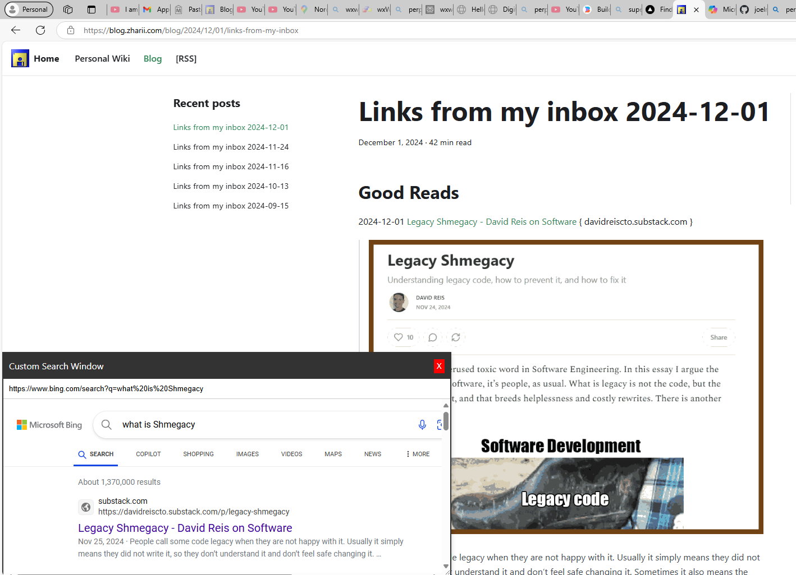

# Dynamic Draggable and Resizable Search Window Bookmarklet
Date: 2024-12-02

**Inspiration:**

- https://gwern.net/
-  [explainers-by-googlers/companion-windows: lightweight windows which accompany the user around a site](https://github.com/explainers-by-googlers/companion-windows) { github.com }

> This project involves creating a JavaScript bookmarklet that allows users to interact with a custom search interface directly within any webpage. When the bookmarklet is clicked, it launches a small, draggable, resizable window containing an iframe. This iframe displays the search results from a selected search provider based on a user-provided query. The window must include specific features such as a read-only URL bar, proper resizing behavior, and a close button. The functionality and requirements are outlined in detail below to eliminate ambiguity or errors during implementation.

