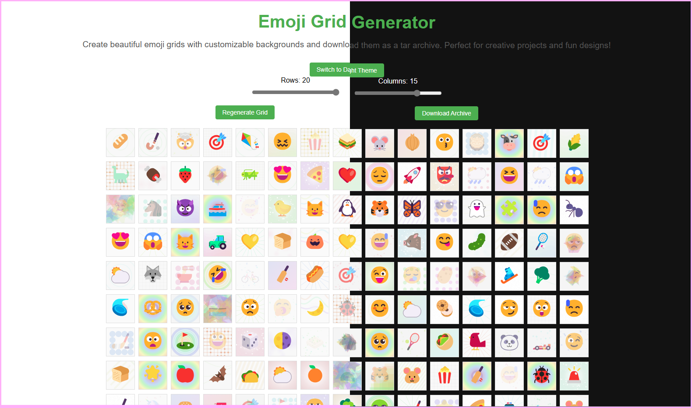

# Emoji Grid Generator

Welcome to the **Emoji Grid Generator**, a delightful fusion of creativity and technology! Imagine a world where emojis come alive in vibrant grids, each nestled within a unique, artistic background. Whether you're a designer, a social media enthusiast, or just someone who loves a splash of color and fun, this tool is your gateway to endless possibilities.

## Why Emoji Grids?

Emojis are more than just tiny icons; they are a universal language of emotion and expression. With the Emoji Grid Generator, you can transform these symbols into stunning visual compositions. Think of it as your personal canvas, where every emoji tells a story, and every background adds depth and character.

## What Can You Do?

- **Design Your Grid**: Use intuitive sliders to set the number of rows and columns. Whether you want a compact 3x3 grid or a sprawling 10x10 masterpiece, the choice is yours.
- **Discover Randomness**: Each grid cell is filled with a randomly selected emoji from a collection of over 200 unique icons. No two grids are ever the same!
- **Explore Artistic Backgrounds**: Behind every emoji lies a randomly generated background pattern. From soft gradients to psychedelic waves, these designs are crafted to complement the emojis while adding a touch of elegance.
- **Switch Themes**: Toggle between light and dark modes to match your mood or environment.
- **Download Your Creation**: With a single click, save your entire grid as a tar archive. Each emoji is preserved as a high-quality PNG file, ready for use in your projects.

## How to Use It

1. **Set Up Your Grid**: Adjust the sliders at the top of the page to define the grid's dimensions. Watch as the layout updates in real-time.
2. **Generate Magic**: Click the "Regenerate Grid" button to populate the grid with random emojis and backgrounds. Feel free to click it multiple times until you find the perfect combination.
3. **Customize the Look**: Switch between light and dark themes using the toggle button. It's a small touch that makes a big difference.
4. **Save Your Work**: When you're happy with your creation, click "Download Archive" to save the grid. Each emoji is stored as a separate PNG file, making it easy to use them individually or as a set.

## Use Cases

- **Social Media Brilliance**: Create eye-catching posts, stories, or profile decorations that stand out in the digital crowd.
- **Design Inspiration**: Use the patterns and layouts as a springboard for your next graphic design project.
- **Educational Fun**: Teach concepts like randomness, patterns, or grids in a way that's engaging and interactive.
- **Personal Touch**: Add a creative flair to greeting cards, posters, or digital art.

## The Bigger Picture

The Emoji Grid Generator is more than just a tool; it's a celebration of creativity. It invites you to play, experiment, and discover. It's about finding joy in the unexpected and turning simple emojis into something extraordinary. So go ahead, dive in, and let your imagination run wild. Who knows what you'll create?
