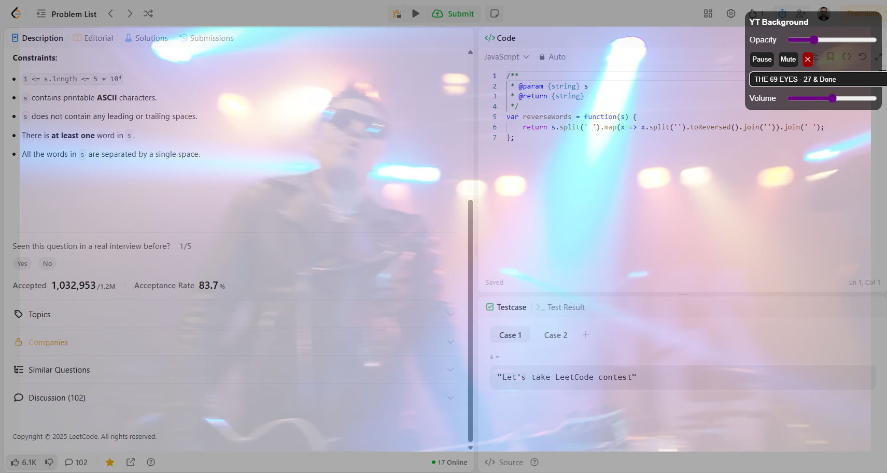

# Bookmarklet Specification: YouTube Background Player
Date: 2025-07-15





### 1. Purpose

Provide in–page background playback of selected YouTube clips while preserving usability of the host webpage.

### 2. Functional Requirements

1. Inject an iframe that fills the entire viewport with the selected YouTube video; autoplay on load, loop, and mute enabled by default.
2. Render a draggable floating control panel that stays above page content by using the highest practical z-index.
3. Allow switching among predefined clips listed in an internal JavaScript array; change starts immediately without page refresh.
4. Provide real-time opacity adjustment of the video background (range 10 % to 100 %).
5. Provide Play / Pause toggle.
6. Provide Mute / Unmute toggle with volume slider.
7. Provide Close button to remove iframe and control panel and restore original page styles.
8. Persist the last used opacity and selected clip for the active page session (window.sessionStorage).
9. Execute entirely from a single bookmarklet URL; no external network calls except the YouTube embed.

### 3. Non-Functional Requirements

1. Operates in modern Chromium-based browsers and Firefox.
2. Does not alter existing page styles or global variables outside the chosen CSS prefix and namespace.
3. Cleans up all injected elements, event listeners, and timers on Close.
4. Handles multiple executions gracefully by first removing any previous instance before reinjecting.
5. Runs without third-party libraries; plain ES2020.

### 4. User Interface

#### 4.1 Background Video

- Full-viewport iframe with style `position:fixed; top:0; left:0; width:100vw; height:100vh; pointer-events:none; opacity:0.8;`.

#### 4.2 Control Panel

- Container: 240 px width, auto height, `position:fixed; top:20px; right:20px; cursor:move;`
- Components in vertical flow:
  1. Title bar showing current clip title and acting as drag handle.
  2. Opacity range input `type="range"` 10-100; displays numeric value.
  3. Play / Pause button.
  4. Mute / Unmute button.
  5. Volume range input 0-100.
  6. Clip selector `<select>` populated at runtime from predefined array.
  7. Close button.

### 5. Data Model

```javascript
const ytbgPlaylist = [
  { id: "ScMzIvxBSi4", title: "Lo-fi chill beats" },
  { id: "tAGnKpE4NCI", title: "Smells Like Teen Spirit" },
  { id: "dQw4w9WgXcQ", title: "Never Gonna Give You Up" }
];
```

### 6. CSS Guidelines

1. Prefix: `ytbm-` applied to every class, id, keyframe, and custom property.
2. All styles injected via a `<style>` tag created by the script.
3. Control panel uses flex column layout and a light translucent background `rgba(0,0,0,0.6)` with 12 px border-radius and 8 px padding.
4. Slider and buttons styled for high-contrast white on black; no shadow leakage to host page.

### 7. JavaScript Architecture

1. Immediately-invoked function expression wrapped in `(function(){...})();`.
2. Use `const ROOT_ID = "ytbm-root"` to avoid collision; on start, remove any existing element with that id.
3. Build DOM: root div → iframe element + control panel.
4. Use YouTube embed URL format `https://www.youtube.com/embed/${id}?autoplay=1&controls=0&loop=1&mute=1&playlist=${id}`.
5. Attach event listeners:
   - `input` on opacity slider adjusts iframe.style.opacity.
   - `click` on Play / Pause toggles via `postMessage` to iframe `{"event":"command","func":"playVideo"}` or `pauseVideo`.
   - `click` on Mute toggles volume; volume slider uses iframe API to set volume.
   - `change` on selector updates iframe.src accordingly.
   - `mousedown` + `mousemove` + `mouseup` on title bar to implement drag.
   - `click` on Close removes root div and stored session data.
6. Load YouTube Iframe API dynamically if not present.
7. Keep all variables inside the IIFE scope except `window.sessionStorage` keys `ytbm-opacity` and `ytbm-lastClip`.

### 8. Security and Privacy

1. Iframe sandbox attributes `allow='autoplay; fullscreen'` only.
2. No user data collected; playlist is static.

### 9. Compatibility and Graceful Degradation

1. If iframe API fails to load, fallback to basic `<iframe>` with no controls except opacity and Close.
2. If browser disallows autoplay with sound, script starts muted; user can unmute manually.