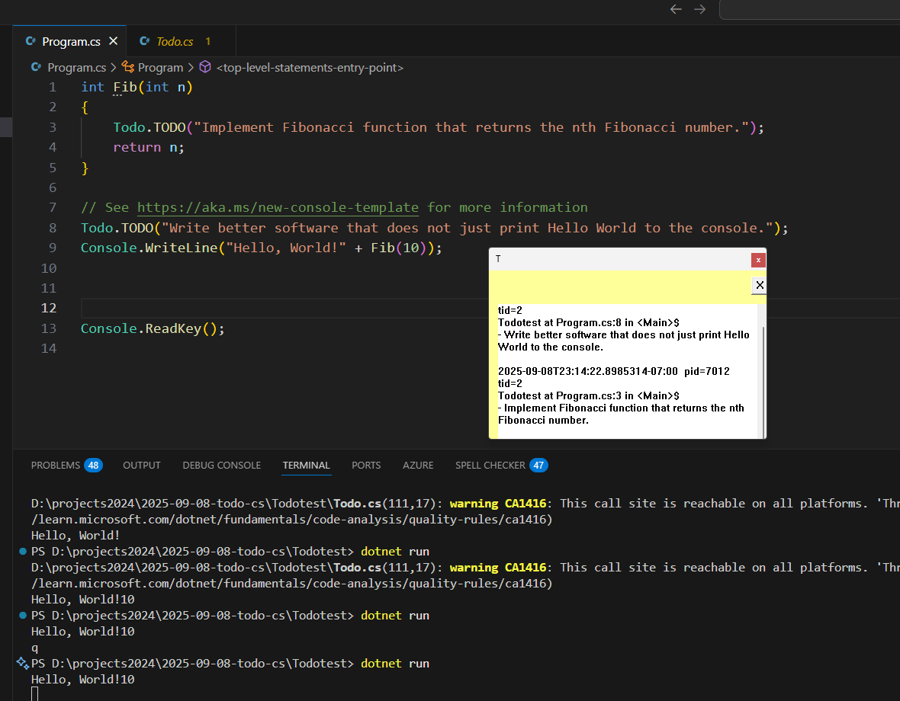

# Implementation specification: single file TODO utility for .NET

Date: 2025-09-08

## Goals

- Single C# source file, drop in to any modern .NET project.
- One public API: static method TODO(string message).
- No-op in Release builds.
- In Debug:
  - On Windows desktop: show or create a draggable sticky note window and append deduped entries.
  - On non Windows or environments without a desktop: write a single formatted line to the console.
- Deduplicate by call site and message to avoid flooding in loops.
- Include useful debug metadata: file, line, member, timestamp, thread id, process id.




## Public API

```csharp
// File: Todo.cs
using System.Runtime.CompilerServices;

public static class Todo
{
    // Add Conditional so calls are removed in Release
    [System.Diagnostics.Conditional("DEBUG")]
    public static void TODO(
        string message,
        [CallerFilePath] string? file = null,
        [CallerLineNumber] int line = 0,
        [CallerMemberName] string? member = null)
    {
        TodoImpl.Log(message, file, line, member);
    }
}
```

## Build behavior

- DEBUG symbol controls inclusion. In Release, the attribute removes call sites at compile time.
- Target frameworks: net6.0 and later.
- Unsafe code not required.

## Platform behavior

- If OperatingSystem.IsWindows() and a desktop session is likely available, use Win32 PInvoke to render a sticky note window.
- Otherwise fall back to console logging via Console.WriteLine only.

Desktop heuristics for Windows:

- Detect user interactive: Environment.UserInteractive == true.
- Optional: skip if process is Windows service by checking Environment.UserInteractive.

## Call site identity and deduplication

- Identity key: SHA1 or stable string of $"{file}|{line}|{member}|{message}".
- Keep a ConcurrentDictionary<string, bool> seen.
- If key already present, do nothing.
- Store the first occurrence timestamp for display.

## Information captured per entry

- Message text.
- Source file name only (Path.GetFileName(file)). Full path optional.
- Line number.
- Member name.
- Timestamp in local time ISO 8601.
- Thread id: Environment.CurrentManagedThreadId.
- Process id and name: Environment.ProcessId, AppDomain.CurrentDomain.FriendlyName.

## Threading model

- Maintain a single background UI thread on Windows that owns the sticky note window and message pump.
- The first TODO call spins up this thread via new Thread(TodoWindowThread) { IsBackground = true, Name = "TodoStickyNoteUI" }.
- Non Windows path does not allocate background threads.

## Windows sticky note UI

- One top level window per process.
- Yellow background, border and drop shadow.
- Draggable anywhere by clicking client area.
- Close button inside the window client area.
- Read only multi line text area for entries with vertical scroll.
- Always on top is off by default; can be toggled later if desired.

Window style

- CreateWindowEx with:
  - WS_EX_TOOLWINDOW
  - WS_EX_APPWINDOW omitted when toolwindow is used
  - Optional WS_EX_LAYERED not needed
- Styles:
  - WS_OVERLAPPED | WS_CAPTION | WS_SYSMENU | WS_MINIMIZEBOX
  - Use custom client area hit test to allow dragging from anywhere if desired.

Controls

- Child EDIT control, styles: WS_CHILD | WS_VISIBLE | ES_MULTILINE | ES_READONLY | ES_AUTOVSCROLL | WS_VSCROLL.
- Child BUTTON control labeled X for close.

Painting and appearance

- Background brush: CreateSolidBrush(RGB(255, 255, 153)).
- In WM_CTLCOLORSTATIC return a lighter yellow for the EDIT background or set it transparent and paint parent.

Window geometry

- Default size 380x240 device independent pixels. Position at right side of primary monitor with 24 px margin from right and top using GetSystemMetrics and EnumDisplaySettings or GetDpiForWindow to adjust for DPI.

Drag behavior

- Handle WM_NCHITTEST: return HTCAPTION when hit in client area except over the EDIT or BUTTON rectangles, to allow moving.

Close behavior

- Close button posts WM_CLOSE. On WM_CLOSE, DestroyWindow and stop the UI thread. Dictionary of seen keys remains; further TODO calls will recreate the window.

Lifetime

- Window exists while process runs or until user closes it. On process exit the background thread ends naturally.

## Non Windows output

- Console format:
  - "[TODO] 2025-09-09T12:34:56-07:00 pid=1234 tid=9 Program.Main at File.cs:42 - Implement feature X"
- Use a single WriteLine per new unique key.

## Inter thread communication

- UI thread owns HWND. Non UI threads call TODO which enqueues entries and posts a custom message to HWND.
- Structures:
  - ConcurrentQueue _pending.
  - PostMessage(hwnd, WM_APP + 1, IntPtr.Zero, IntPtr.Zero) to request UI update.
- UI thread dequeues and appends to the EDIT control.

## Single file internal implementation plan

```csharp
internal static class TodoImpl
{
    private static readonly System.Collections.Concurrent.ConcurrentDictionary<string, bool> _seen = new();
    private static readonly System.Collections.Concurrent.ConcurrentQueue<TodoEntry> _pending = new();

    private static volatile nint _hwnd; // HWND as nint
    private static Thread? _uiThread;

    internal static void Log(string message, string? file, int line, string? member)
    {
        if (!IsDebug())
            return;

        if (!TryMarkSeen(message, file, line, member))
            return;

        var entry = TodoEntry.Create(message, file, line, member);

        if (IsWindowsDesktop())
        {
            EnsureWindow();
            _pending.Enqueue(entry);
            var hwnd = _hwnd;
            if (hwnd != 0)
                PostMessage(hwnd, WM_TODO_APPEND, 0, 0);
        }
        else
        {
            Console.WriteLine(entry.ToConsoleLine());
        }
    }

    private static bool IsDebug()
    {
#if DEBUG
        return true;
#else
        return false;
#endif
    }

    private static bool IsWindowsDesktop()
    {
        return OperatingSystem.IsWindows() && Environment.UserInteractive;
    }

    private static bool TryMarkSeen(string message, string? file, int line, string? member)
    {
        string key = $"{file}|{line}|{member}|{message}";
        return _seen.TryAdd(key, true);
    }

    private static void EnsureWindow()
    {
        if (_hwnd != 0) return;
        if (_uiThread != null) return;

        _uiThread = new Thread(TodoWindowThread) { IsBackground = true, Name = "TodoStickyNoteUI" };
        _uiThread.SetApartmentState(ApartmentState.STA);
        _uiThread.Start();
        // Optional: wait with a short spin until _hwnd != 0 to avoid dropping first message
        var sw = System.Diagnostics.Stopwatch.StartNew();
        while (_hwnd == 0 && sw.ElapsedMilliseconds < 500) Thread.Yield();
    }

    // UI thread procedure: register class, create window, create controls, message loop.
    private static void TodoWindowThread()
    {
        // PInvoke usage shown below in PInvoke section.
    }

    private const int WM_APP = 0x8000;
    private const int WM_TODO_APPEND = WM_APP + 1;

    private struct TodoEntry
    {
        public string TimeIso;
        public int Pid;
        public int Tid;
        public string ProcessName;
        public string FileName;
        public int Line;
        public string Member;
        public string Message;

        public static TodoEntry Create(string message, string? file, int line, string? member)
        {
            return new TodoEntry
            {
                TimeIso = DateTimeOffset.Now.ToString("O"),
                Pid = Environment.ProcessId,
                Tid = Environment.CurrentManagedThreadId,
                ProcessName = AppDomain.CurrentDomain.FriendlyName,
                FileName = file is null ? "unknown" : System.IO.Path.GetFileName(file),
                Line = line,
                Member = member ?? "unknown",
                Message = message
            };
        }

        public string ToConsoleLine()
            => $"[TODO] {TimeIso} pid={Pid} tid={Tid} {ProcessName} at {FileName}:{Line} in {Member} - {Message}";

        public string ToDisplayBlock()
            => $"{TimeIso}  pid={Pid} tid={Tid}\r\n{ProcessName} at {FileName}:{Line} in {Member}\r\n- {Message}\r\n";
    }
}
```

## Windows UI details and message handling

- Register a window class with WNDPROC.
- CreateWindowEx for main note window.
- Create child EDIT and BUTTON. Keep their HWNDs in static fields.
- Handle messages:
  - WM_CREATE: create child controls, set fonts, set yellow brush.
  - WM_CTLCOLORSTATIC: set EDIT background to yellow; return brush.
  - WM_SIZE: resize children to fit client area. Leave margins for padding and close button.
  - WM_COMMAND: if HIWORD(wParam) == BN_CLICKED and lParam == close button HWND, PostMessage(hwnd, WM_CLOSE, 0, 0).
  - WM_TODO_APPEND: drain _pending and append text to EDIT using EM_SETSEL + EM_REPLACESEL or GetWindowTextLength + SetWindowText.
  - WM_NCHITTEST: return HTCAPTION when not over controls to allow dragging.
  - WM_DESTROY: set _hwnd = 0; PostQuitMessage(0).

## PInvoke surface

```csharp
private const int WS_OVERLAPPED = 0x00000000;
private const int WS_CAPTION = 0x00C00000;
private const int WS_SYSMENU = 0x00080000;
private const int WS_MINIMIZEBOX = 0x00020000;
private const int WS_VISIBLE = 0x10000000;
private const int WS_CHILD = 0x40000000;
private const int WS_VSCROLL = 0x00200000;
private const int ES_MULTILINE = 0x0004;
private const int ES_READONLY = 0x0800;
private const int ES_AUTOVSCROLL = 0x0040;

private const int SW_SHOW = 5;
private const int CW_USEDEFAULT = unchecked((int)0x80000000);
private const int WM_CREATE = 0x0001;
private const int WM_SIZE = 0x0005;
private const int WM_COMMAND = 0x0111;
private const int WM_CLOSE = 0x0010;
private const int WM_DESTROY = 0x0002;
private const int WM_CTLCOLORSTATIC = 0x0138;
private const int WM_NCHITTEST = 0x0084;
private const int HTCAPTION = 2;

[System.Runtime.InteropServices.StructLayout(LayoutKind.Sequential, CharSet = System.Runtime.InteropServices.CharSet.Unicode)]
private struct WNDCLASSEX
{
    public uint cbSize;
    public uint style;
    public nint lpfnWndProc;
    public int cbClsExtra;
    public int cbWndExtra;
    public nint hInstance;
    public nint hIcon;
    public nint hCursor;
    public nint hbrBackground;
    public string lpszMenuName;
    public string lpszClassName;
    public nint hIconSm;
}

[System.Runtime.InteropServices.UnmanagedFunctionPointer(System.Runtime.InteropServices.CallingConvention.Winapi)]
private delegate nint WndProc(nint hWnd, uint msg, nint wParam, nint lParam);

[System.Runtime.InteropServices.DllImport("user32.dll", CharSet = System.Runtime.InteropServices.CharSet.Unicode, SetLastError = true)]
private static extern ushort RegisterClassEx(ref WNDCLASSEX lpwcx);

[System.Runtime.InteropServices.DllImport("user32.dll", CharSet = System.Runtime.InteropServices.CharSet.Unicode, SetLastError = true)]
private static extern nint CreateWindowEx(
    int dwExStyle, string lpClassName, string lpWindowName, int dwStyle,
    int x, int y, int nWidth, int nHeight,
    nint hWndParent, nint hMenu, nint hInstance, nint lpParam);

[System.Runtime.InteropServices.DllImport("user32.dll")]
private static extern nint DefWindowProc(nint hWnd, uint msg, nint wParam, nint lParam);

[System.Runtime.InteropServices.DllImport("user32.dll")]
private static extern sbyte GetMessage(out MSG lpMsg, nint hWnd, uint wMsgFilterMin, uint wMsgFilterMax);

[System.Runtime.InteropServices.DllImport("user32.dll")]
private static extern bool TranslateMessage(ref MSG lpMsg);

[System.Runtime.InteropServices.DllImport("user32.dll")]
private static extern nint DispatchMessage(ref MSG lpMsg);

[System.Runtime.InteropServices.DllImport("user32.dll")]
private static extern bool PostMessage(nint hWnd, uint Msg, nint wParam, nint lParam);

[System.Runtime.InteropServices.DllImport("user32.dll")]
private static extern nint SendMessage(nint hWnd, uint Msg, nint wParam, nint lParam);

[System.Runtime.InteropServices.DllImport("user32.dll")]
private static extern bool DestroyWindow(nint hWnd);

[System.Runtime.InteropServices.DllImport("gdi32.dll")]
private static extern nint CreateSolidBrush(int colorRef);

[System.Runtime.InteropServices.DllImport("user32.dll")]
private static extern int GetSystemMetrics(int nIndex);

[System.Runtime.InteropServices.StructLayout(System.Runtime.InteropServices.LayoutKind.Sequential)]
private struct MSG
{
    public nint hwnd;
    public uint message;
    public nint wParam;
    public nint lParam;
    public uint time;
    public int pt_x;
    public int pt_y;
}
```

## UI thread body outline

```csharp
private static nint _hwndEdit, _hwndCloseBtn;
private static nint _yellowBrush;
private static WndProc? _wndProcKeepAlive;

private static void TodoWindowThread()
{
    _yellowBrush = CreateSolidBrush((255) | (255 << 8) | (153 << 16));

    _wndProcKeepAlive = WndProcImpl;
    var cls = new WNDCLASSEX
    {
        cbSize = (uint)System.Runtime.InteropServices.Marshal.SizeOf<WNDCLASSEX>(),
        lpfnWndProc = System.Runtime.InteropServices.Marshal.GetFunctionPointerForDelegate(_wndProcKeepAlive),
        hbrBackground = _yellowBrush,
        lpszClassName = "TodoStickyNoteClass",
        lpszMenuName = "",
        hInstance = System.Diagnostics.Process.GetCurrentProcess().Handle
    };
    RegisterClassEx(ref cls);

    int width = 380, height = 240;
    int x = GetSystemMetrics(0) - width - 24; // SM_CXSCREEN
    int y = 24;

    var hwnd = CreateWindowEx(
        0,
        "TodoStickyNoteClass",
        "TODO",
        WS_OVERLAPPED | WS_CAPTION | WS_SYSMENU | WS_MINIMIZEBOX | WS_VISIBLE,
        x, y, width, height,
        0, 0, cls.hInstance, 0);

    _hwnd = hwnd;

    var editStyle = WS_CHILD | WS_VISIBLE | ES_MULTILINE | ES_READONLY | ES_AUTOVSCROLL | WS_VSCROLL;
    _hwndEdit = CreateWindowEx(0, "EDIT", "", editStyle, 12, 44, width - 24, height - 56, hwnd, 0, cls.hInstance, 0);

    _hwndCloseBtn = CreateWindowEx(0, "BUTTON", "X", WS_CHILD | WS_VISIBLE, width - 36, 8, 24, 24, hwnd, 0, cls.hInstance, 0);

    MSG msg;
    while (GetMessage(out msg, 0, 0, 0) != 0)
    {
        TranslateMessage(ref msg);
        DispatchMessage(ref msg);
    }
}

private static nint WndProcImpl(nint hWnd, uint msg, nint wParam, nint lParam)
{
    switch (msg)
    {
        case WM_CREATE:
            return 0;
        case WM_CTLCOLORSTATIC:
            return _yellowBrush;
        case WM_SIZE:
            // Resize children accordingly
            break;
        case WM_COMMAND:
            // If from _hwndCloseBtn, post WM_CLOSE
            break;
        case WM_TODO_APPEND:
            while (_pending.TryDequeue(out var entry))
            {
                // Append with CRLF separator
                AppendToEdit(entry.ToDisplayBlock());
            }
            break;
        case WM_NCHITTEST:
            // Return HTCAPTION to allow dragging when not over child controls
            break;
        case WM_CLOSE:
            DestroyWindow(hWnd);
            return 0;
        case WM_DESTROY:
            _hwnd = 0;
            // PostQuitMessage
            PostMessage(0, 0, 0, 0);
            return 0;
    }
    return DefWindowProc(hWnd, msg, wParam, lParam);
}

private static void AppendToEdit(string text)
{
    const int WM_SETTEXT = 0x000C;
    const int WM_GETTEXTLENGTH = 0x000E;
    const int EM_SETSEL = 0x00B1;
    const int EM_REPLACESEL = 0x00C2;

    int len = (int)SendMessage(_hwndEdit, WM_GETTEXTLENGTH, 0, 0);
    SendMessage(_hwndEdit, EM_SETSEL, len, len);
    unsafe
    {
        fixed (char* p = text)
            SendMessage(_hwndEdit, EM_REPLACESEL, 0, (nint)p);
    }
}
```

## Example usage in your code

```csharp
class Program
{
    static void Main()
    {
        Todo.TODO("Implement user settings load");
        for (int i = 0; i < 100; i++)
        {
            // Will add once only due to dedupe
            Todo.TODO("Check loop invariant");
        }
        DoWork();
        Console.ReadKey();
    }

    static void DoWork()
    {
        Todo.TODO("Wire up cancellation tokens");
    }
}
```

## Example console output on Linux or headless

```
[TODO] 2025-09-09T10:22:05.1234567-07:00 pid=4242 tid=7 Example at Program.cs:7 in Main - Implement user settings load
[TODO] 2025-09-09T10:22:05.1250000-07:00 pid=4242 tid=7 Example at Program.cs:12 in Main - Check loop invariant
[TODO] 2025-09-09T10:22:05.1300000-07:00 pid=4242 tid=8 Example at Program.cs:21 in DoWork - Wire up cancellation tokens
```

## Example sticky note content on Windows

```
2025-09-09T10:22:05.1234567-07:00  pid=4242 tid=7
Example at Program.cs:7 in Main
- Implement user settings load

2025-09-09T10:22:05.1250000-07:00  pid=4242 tid=7
Example at Program.cs:12 in Main
- Check loop invariant

2025-09-09T10:22:05.1300000-07:00  pid=4242 tid=8
Example at Program.cs:21 in DoWork
- Wire up cancellation tokens
```

## Error handling and safety

- All PInvoke calls should check for zero or null handles and ignore failures gracefully, falling back to console print.
- Wrap UI thread body in try catch to avoid crashing the host process; log exceptions to console in Debug.
- Do not throw from TODO.

## Testing checklist

- Verify Release build removes calls.
- Verify Windows GUI appears once and dedupes in loops.
- Verify window can be dragged and closed.
- Verify non Windows prints to console.
- Verify multiple threads calling TODO do not deadlock and order is acceptable.
- Verify closing the window and calling TODO again recreates it.

## Future extensions

- Allow opt in AlwaysOnTop via environment variable TODO_TOPMOST=1.
- Add grouping by file name with section headers.
- Add hotkey to clear note content.


