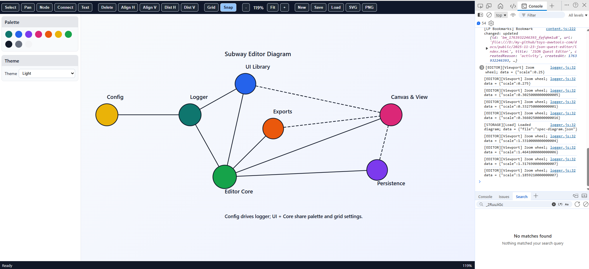
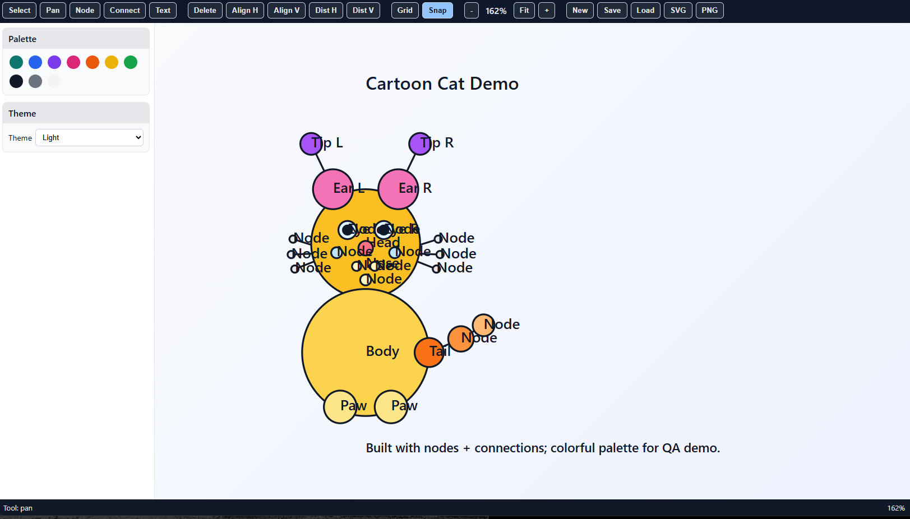

# Subway Vector Editor
Date: 2025-11-23
https://chatgpt.com/c/69236e99-03b0-832c-bc26-65ed94fe0aff

**A01 Overview 01**
This project is a focused vector editor for building map-like diagrams made of circles connected by straight or diagonal lines. Visually it feels similar to a simplified subway map or an RPG skill tree: nodes represented as circles, connected by clear line segments that show progression or relationships. The editor runs on a scrollable, zoomable canvas and provides a minimal, opinionated toolset optimized for this diagram style rather than being a general-purpose graphics editor.

The implementation must use plain HTML, CSS, and vanilla JavaScript. There are no build tools, bundlers, or external dependencies. All JavaScript is loaded via classic script tags without ES6 modules, and all public APIs are exposed on the global namespace so that the editor can run from a local file system with no tooling.

**B01 Goals and Use Cases 01**
 The primary goal is to allow a user to quickly sketch and refine structured diagrams composed of labeled circles connected by straight or diagonal lines, then export them as images for documentation, presentations, or planning. Typical use cases include RPG-style skill trees, feature roadmaps, learning paths, project dependency graphs, and stylized subway-like maps where each circle is a station or milestone and connections reflect possible paths or prerequisites.

The product prioritizes simplicity and speed over maximum flexibility. The shape set is small, the color palette is limited and opinionated, and the toolset is intentionally constrained. The editor should feel fast to start, easy to understand, and safe to experiment with through undo and redo.

**C01 Core User Workflow 01**
 A user opens index.html locally in a browser and sees an empty diagram canvas with a small toolbar. They pan and zoom to position their working area. Using a node tool, they click to add circles representing tasks or milestones. They assign text labels near or inside circles and choose colors from a predefined palette.

To connect circles, the user selects a connection tool, clicks a source circle and then a target circle. A straight line segment is created between them. The user can drag circles to refine layout, with connections updating automatically. They zoom out to see the whole progression and zoom in for detailed editing.

At any time the user can save the diagram to a local JSON file for later editing, and export to SVG or PNG for sharing. Undo and redo allow them to experiment without risk.

**D01 Functional Requirements 01**

Editor shell and canvas
 The application exposes a single main canvas area inside the browser window. The canvas supports a large logical coordinate space. The user can pan the view and zoom in and out. Optionally a subtle background grid helps with alignment and can be toggled on or off.

Node creation and editing
 The editor exposes a node tool that creates circular nodes when the user clicks on the canvas. Each node has a position, radius, fill color, stroke color, and text label. The user can select a node by clicking on it and move it by dragging. Node properties can be edited through a simple property panel or inline controls, including label text, label placement (inside, above, below, left, right relative to the circle), fill color from a palette, and discrete size presets for radius. When a node is deleted, all connections attached to it are also removed.

Connections between nodes
 The editor exposes a connection tool that creates straight-line connections between two nodes. The user clicks a source node, then a target node. A line segment is added, visually connecting their perimeters. Connections react when nodes move, updating positions in real time. Connections can be selected, deleted, and optionally styled with arrowheads or dashed lines.

Text and legends
 The editor allows standalone text labels for titles, legends, or annotations. A text tool lets the user click to create a text element, then type its content. Text can use a small set of font size presets and colors taken from the same palette as nodes. Legend areas can be constructed manually using nodes, connections, and text.

Color palette and styles
 The system exposes a fixed, small palette of colors suitable for maps: for example several strong line colors plus neutrals for background and text. Users can choose a fill color for each node and optionally a color for connections. The palette is visible in a compact color picker UI backed by the internal UI library.

Viewport and navigation
 The canvas supports panning and zooming. Panning is done by dragging on empty space or using a dedicated pan mode. Zooming is controlled via mouse wheel, trackpad pinch where available, and plus or minus buttons in the UI. Zoom is centered around the cursor when using wheel or trackpad. A fit-to-diagram command adjusts view to show all content.

Selection and manipulation
 The editor supports selection of nodes, connections, and text by clicking. A drag rectangle enables multi-selection. Selected items can be moved, deleted, or duplicated. Optional alignment commands place selected nodes on common horizontal or vertical lines and distribute them evenly.

Project management and persistence
 The application can create a new diagram, load a diagram from a JSON file, and save the current diagram to JSON. Loading and saving use browser file APIs initiated by user actions. Export functions generate SVG for vector output and PNG for raster output. Exports operate entirely in the browser with no server.

History and undo
 The editor maintains an undo and redo stack containing user actions that modify the diagram. These actions include node creation and deletion, property changes, movement, connection operations, and text edits. Undo reverts the last action, redo reapplies an undone action. The maximum depth can be configurable but must be large enough for typical use.

Keyboard and interaction shortcuts
 Common keyboard shortcuts improve efficiency. Delete or Backspace removes selected items. Ctrl or Cmd plus Z performs undo, and Ctrl or Cmd plus Shift plus Z performs redo. Arrow keys nudge selected elements by small amounts in the four directions. A dedicated key can toggle pan mode, and another key can reset the view.

**E01 Non Functional Requirements 01**

Performance
 The editor should remain responsive with at least several hundred nodes and connections in a modern desktop browser. Panning, zooming, and dragging should appear smooth. Rendering and hit testing should minimize unnecessary work, for example by redrawing only affected elements.

Cross platform behavior
 The application must run in modern desktop browsers without any server-side components or local services. It should work when opened as a local file, meaning no assumptions about HTTP hosting. Mobile is not a target platform initially but the design must avoid hard blockers for future adaptation.

Usability
 The UI must be discoverable and predictable. Tool icons should be clear. When operations cannot be completed, such as trying to create a connection without a valid second node, the system must show visual feedback rather than failing silently.

Reliability
 The data model must avoid inconsistent states such as orphaned connections or duplicated identifiers. Save and load operations must be robust, with clear error messages when JSON files have invalid format.

**F01 Data Model 01**

Diagram entity
 A diagram represents a complete document. It contains metadata such as title and timestamps, plus collections of nodes, connections, and free text elements. It also carries display settings like background color, grid visibility, and current zoom level when saved.

Node entity
 A node has a unique identifier, x and y coordinates in diagram coordinates, radius or size preset, fill color identifier, stroke color identifier, label text, label placement type, and optional metadata for integration with external systems.

Connection entity
 A connection has a unique identifier, source and target node identifiers, line style (solid or dashed), an optional arrowhead specification, an optional label, and metadata such as connection type.

Text entity
 A text element has a unique identifier, x and y coordinates, text content, font preset identifier, color identifier, and alignment relative to the coordinate anchor.

Settings and preferences
 Settings include grid snapping enabled or disabled, snap size, chosen theme variant, default node size, and default colors. These can be stored in diagram JSON or separately in local storage.

**G01 Architecture 01**

Overall architecture
 The application is a single-page editor implemented entirely in vanilla JavaScript. The main HTML file contains the canvas container, toolbar containers, and script tags that load the core editor library and a reusable UI helper library. There are no modules or bundlers; all code is loaded via classic script tags and attached to the global namespace on the window object.

Rendering layer
 Rendering is implemented using either SVG elements inside the document or a canvas element combined with an internal scene graph. SVG is preferred for the first version because it simplifies hit testing and integrates well with DOM events. Each node is rendered as an SVG circle plus an SVG text element. Each connection is rendered as an SVG line or path. Each free text item is rendered as an SVG text element. Selection and hover states are reflected by adjusting attributes such as stroke width, stroke style, or additional overlay shapes.

State management
 The diagram state is stored in plain JavaScript objects in memory. A central state object contains nodes, connections, text elements, and settings. All user actions are implemented as functions that take the current state, apply changes, and then trigger a re-render. Undo and redo are implemented by storing snapshots of state or reversible actions on stacks.

Interaction and input handling
 Mouse and keyboard events are captured on the canvas and UI controls. For example, mousedown, mousemove, and mouseup on the canvas are used to create nodes, drag elements, and pan the view depending on the current tool mode. Keyboard events are used for shortcuts such as delete and undo. The interaction logic is separated from rendering so that the same state changes can be triggered from UI buttons and keyboard shortcuts.

Persistence
 Saving and loading diagrams use the browser File API. The core editor library can produce a diagram JSON object from internal state and can hydrate state from JSON. Export to SVG is implemented by serializing the SVG DOM subtree into a string and triggering a download. Export to PNG is implemented by drawing the SVG or logical scene to a hidden canvas and exporting as a data URL.

**H01 Rendering and Interaction Details 01**

Coordinate system and transforms
 The editor maintains a logical coordinate system for diagram content. Nodes and text store their coordinates in this logical space. The viewport state includes an origin offset and a zoom scale. Rendering converts logical coordinates into pixel coordinates by applying the viewport transform. Panning changes the origin, zooming changes the scale. The transform is also used for hit testing, translating mouse event pixel positions back into logical coordinates.

Snap and alignment behavior
 When snap-to-grid is enabled, node placement and movement seal coordinates to the nearest grid step. Snap can be temporarily disabled via a modifier key during drag. When creating connections, anchor points on the node perimeter are computed in the direction of the other node so that the line visually meets the circle edge rather than its center. Optional alignment helpers display temporary lines when nodes share x or y coordinates or align with other elements.

Hit testing and selection
 Hit testing uses the shapes rendered on the canvas. For SVG, pointer events on shapes are used directly. For canvas, simple geometric tests are implemented: checking distance from a node center against its radius, and distance from a point to a line segment for connections. The interaction layer gathers all objects under the pointer, prioritizing nodes over connections over background when determining what the user clicked.

Interaction modes
 The editor maintains a current tool or mode such as select, pan, node creation, connection creation, or text creation. Mouse events are interpreted differently depending on mode. For example, in node mode a click creates a node, while in select mode a click selects an object and a drag moves it. The modes can be switched through toolbar buttons provided by the UI library and through keyboard shortcuts.

I01 Future Enhancements and Brainstorming 01
 Future versions may add layout presets that auto-arrange nodes into tree or radial structures, semantic metadata layers encoding prerequisites or categories, interactive path highlighting to visualize progression routes, or integrations with external systems such as project management tools. Real-time collaboration is a possible long-term extension where multiple users edit the same diagram with presence indicators and conflict resolution.

J00 Runtime Environment and Technology Constraints 00

The editor must run as a static HTML page opened directly in a browser, including from the local file system. No server-side code, build steps, or package managers are required.

The following constraints apply.

All code uses vanilla JavaScript with no frameworks or libraries. There are no ES6 modules, no import or export statements, and no bundlers such as Webpack, Rollup, or Vite. All scripts are loaded via classic script tags with src attributes or inline script tags. All public functionality is exposed on the global window object via named objects or functions. The application must work in modern browsers in standards mode and should use modern APIs where they do not conflict with the no-dependency requirement.

**K00 File and Script Organization 00**

The recommended file layout is simple and fully manual. An index.html file contains the DOM structure and references to one or more script files. A style.css file contains all shared styles. Two JavaScript files provide the core logic: a UI helper library and the main editor library.

An example structure is as follows, expressed conceptually rather than as a list. The root folder contains index.html, style.css, ui-lib.js, editor-core.js, and optionally additional small files such as icons or images.

Script tags in index.html load ui-lib.js first and editor-core.js second to ensure that the UI helpers are available globally before the editor initializes. Additional inline script at the bottom of index.html can invoke an initialization function on the global editor object to bind the editor to specific DOM containers.

L00 Global Namespace API Design 00

The system defines two primary global objects on the window.

The first is a UI helper library object, for example window.SubwayUI, that contains reusable functions for creating controls, dialogs, and panels. This object abstracts DOM creation and wiring for buttons, sliders, color pickers, and layout containers, while remaining independent of the diagram model.

The second is the editor core object, for example window.SubwayEditor, that implements diagram state, rendering, and interaction logic. It exposes initialization and control functions such as creating an editor instance, loading and saving diagrams, and triggering exports.

A typical initialization flow uses a function such as SubwayEditor.createEditor, which takes an options object containing references to DOM elements for the canvas container, toolbar container, and status bar. The function returns an editor instance object that itself exposes methods such as loadFromJSON, exportAsSVG, exportAsPNG, and getStateSnapshot. The instance is stored by application code in a global variable or closure in index.html.

The UI library object exposes functions to construct common controls. For example, a function to create a toolbar button accepts a label, icon configuration, and click handler; a function to create a color palette control accepts a list of colors and a callback invoked when the user selects a color; and a function to create a zoom control bar handles the plus, minus, and reset zoom buttons and wiring to editor methods.

**M00 Internal UI Library Specification 00**

The UI library is responsible for creating and managing reusable UI elements used by the editor. It is implemented as a single script file that attaches a namespaced object to window. This object contains only plain functions and constants. There is no reliance on class or module systems.

Core responsibilities of the UI library include rendering the main toolbar, side panels, and status bar; creating buttons and toggle buttons with consistent styling; creating range controls such as zoom sliders and size selectors; creating color palette selectors; and handling basic layout behaviors such as responsive toolbar wrapping and panel resizing.

UI elements are created by functions that generate DOM nodes using document.createElement, configure their attributes, attach event listeners, and append them to parent containers. The UI library does not store application state beyond what is strictly needed for the functioning of the controls themselves. Instead, event handlers call callbacks passed in from the editor core at creation time.

Button creation functions accept parameters including parent element reference, label text or icon class name, optional tooltip text, and a callback. When the user clicks the button, the callback is invoked. Toggle buttons maintain internal pressed state and visually indicate on or off states. The editor core can query or set toggle states via small accessors returned by the creation function.

For zoom control, the UI library provides a composite control containing three elements: zoom out button, zoom display text, and zoom in button. Clicking the buttons calls callbacks that the editor core provides, such as onZoomIn and onZoomOut. The UI library exposes a method to update the displayed zoom percentage based on notifications from the editor core.

For canvas panning navigation, the UI library can provide optional directional buttons, but the primary panning behavior is handled directly by mouse interactions on the canvas.

The UI library also defines CSS class names and basic styles, either injected via a link to style.css or inserted at runtime into a style element. The goal is visual consistency and minimal theming complexity.

N00 Initialization and Lifecycle Flow 00

When index.html loads, the browser parses the DOM and then executes script tags in the order they appear. The UI library script runs first, attaching its global object to window. The editor core script runs second, attaching its own global object. Finally, an inline script or a small bootstrap script runs after both libraries are loaded.

The bootstrap code waits for DOMContentLoaded. Once the DOM is ready, it locates required container elements via document.getElementById or similar. It then invokes SubwayEditor.createEditor with these container references and configuration options such as initial grid visibility and palette.

The createEditor function builds the SVG or canvas elements inside the canvas container, sets up internal state, registers input event handlers, and uses the UI library to populate toolbars and panels with controls. It wires UI callbacks to internal editor methods, such as setting the current tool, changing colors, and triggering save or export.

After initialization, the editor enters an idle state awaiting user input. User interactions result in state changes and re-renders. On window unload the editor can optionally auto-save to local storage or prompt the user to save.

**O00 Input Handling and Interaction Logic 00**

Mouse and pointer events are attached to the main canvas element and to UI controls. For canvas interactions, the editor listens for mousedown, mousemove, mouseup, and wheel events. It translates screen coordinates to diagram coordinates using the inverse of the current viewport transform.

In selection mode, a mousedown on a node selects it. A subsequent mousemove with the button held initiates a drag, updating the node position as the cursor moves. On mouseup, the drag completes and the editor records an undoable move action. In multi-select mode, a mousedown on empty space begins a selection rectangle; mousemove adjusts the rectangle; mouseup computes which objects intersect the rectangle and updates selection.

In pan mode or when pan is temporarily activated through a keyboard modifier, a mousedown on empty space stores the starting viewport origin and pointer position. Mousemove updates the viewport origin based on pointer delta. On mouseup, panning stops.

Wheel events adjust zoom, with direction controlling zoom in or out and the pointer position used as a pivot. Zoom steps are small and clamped between minimum and maximum values. The editor updates the viewport scale and re-renders the scene, and also informs the UI library so it can update zoom display text.

Keyboard events are attached to the window or canvas container. The editor listens for keys corresponding to delete, undo and redo combinations, mode switching, and view operations. It ensures that text input fields in the UI are not affected by global shortcuts by checking event target before acting.

**P00 Saving, Loading, and Export Operations 00**

Saving a diagram involves serializing the internal state object to JSON using JSON.stringify and then triggering a download of a file with a .json extension via the browser. Loading involves presenting the user with a file input element, reading selected files using FileReader, parsing JSON, validating it, and then replacing the current editor state.

Export to SVG is implemented by cloning the SVG root element used for rendering, adjusting dimensions and viewBox as needed, serializing the result to a string, and downloading it as an .svg file. Styling must be preserved by either inlining relevant CSS rules or ensuring that style classes referenced in the SVG are included within the exported SVG.

Export to PNG is implemented by rendering the SVG or scene graph onto an off-screen canvas. The editor sets canvas dimensions, applies the same transform as the current viewport or a transform that captures the full diagram, draws nodes, connections, and text manually or via SVG to canvas conversion, and then calls canvas.toDataURL. The resulting data URL is used to trigger a PNG download.

**Q00 Error Handling and Validation 00**

The editor core validates actions that depend on existing objects. When creating a connection, it checks that both nodes exist and prevents creating connections from a node to itself unless explicitly allowed. When loading JSON, it verifies that node identifiers are unique and that all connection references resolve to existing nodes.

User feedback on errors is presented through simple modal dialogs or inline notifications built with the UI library. For example, attempting to load invalid JSON triggers a message explaining that the file could not be parsed or did not match the expected structure.

**R00 Extensibility Considerations 00**

Although the current implementation avoids modules and external libraries, the internal structure of the code should be organized to allow future refactoring. Functions should be grouped logically within the global objects, with clear boundaries between UI helpers, editor state, rendering, interaction, and persistence.

Configuration objects and extension points can be used instead of hard-coded behavior where it does not significantly increase complexity. For example, the color palette can be defined in a single configuration object, and layout behaviors can be encapsulated in separate functions that can be swapped or extended later.

This specification now describes both the functional behavior of the editor and the technical design required to implement it in plain HTML, CSS, and vanilla JavaScript without modules, bundlers, or external dependencies, exposing a global UI helper library and a global editor core library.

