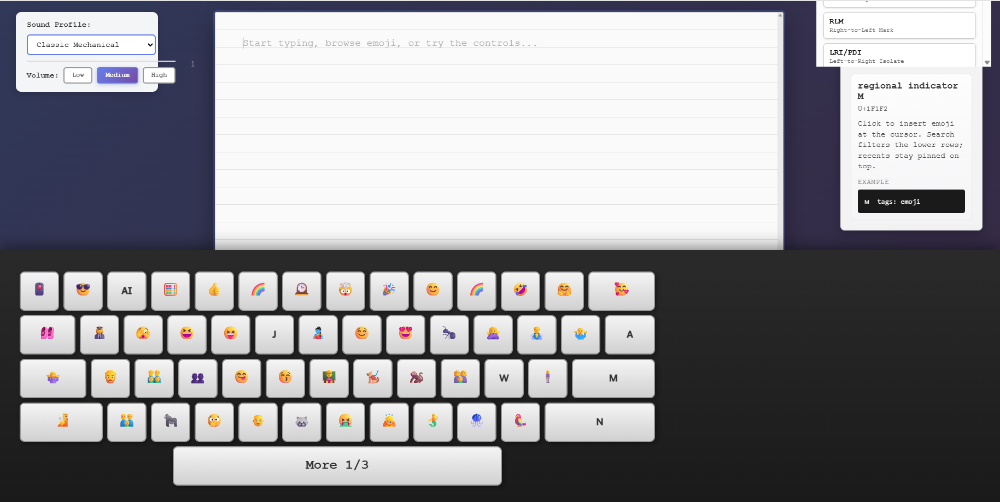
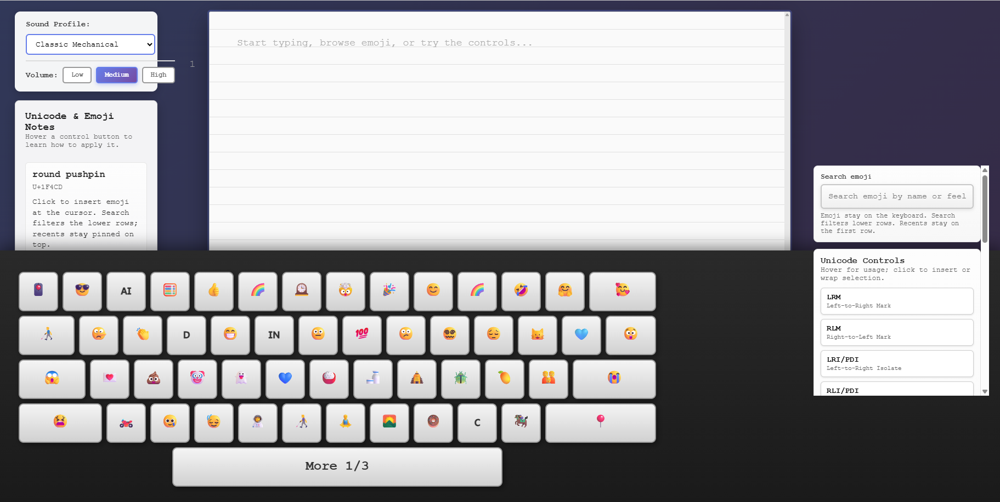
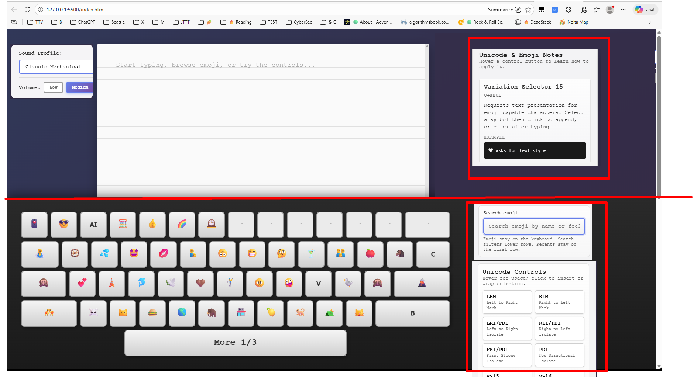
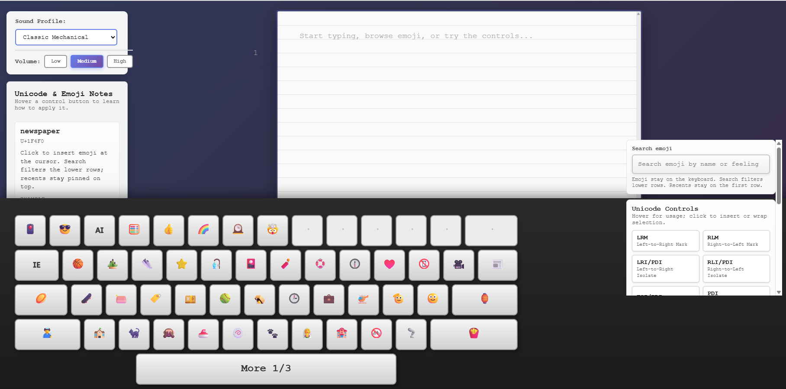
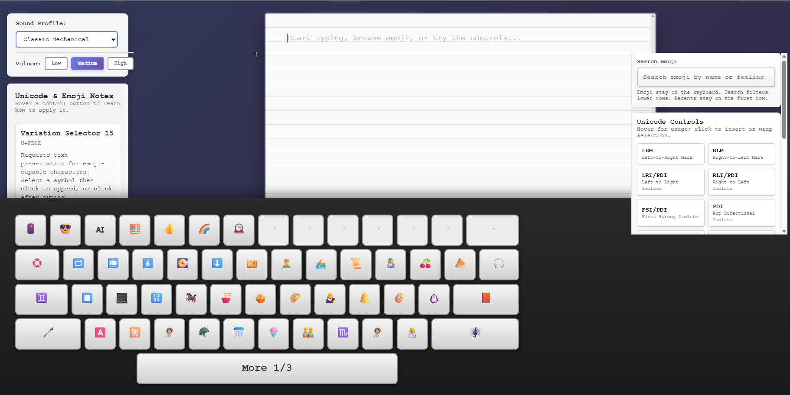
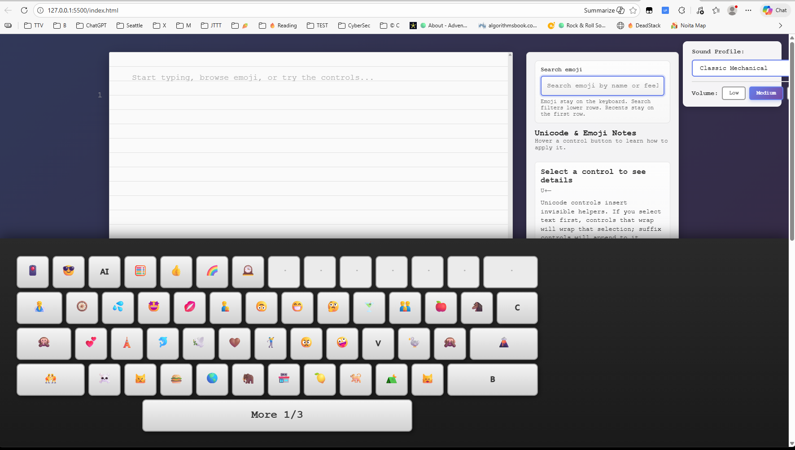
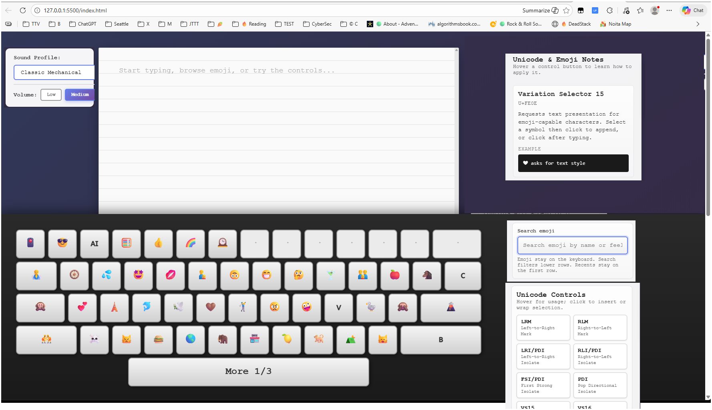
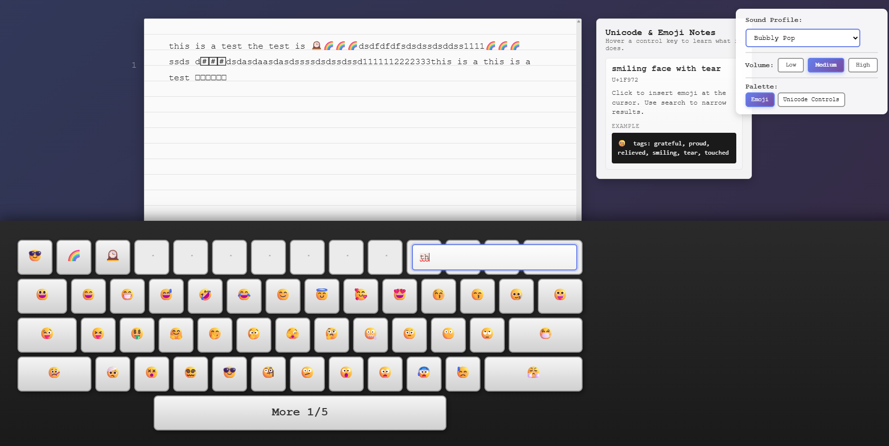
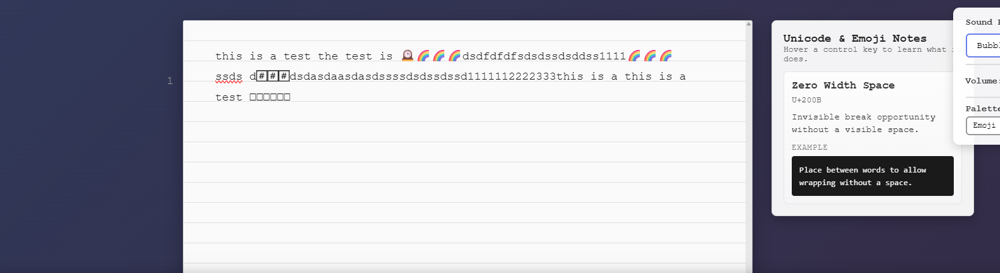
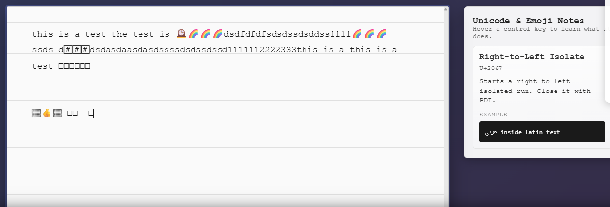

# Hello
Date: 2025-12-05

Actual with bugs:

Expected:

## Wave 3

## Wave 2 bugs

2025-12-05

Layout Actual: 

**Expected**

1. Move emoji search to the keyboard pane on right top 
2. Move Unicode Controls to the keyboard pane on the right, below emoji search, make sure the controls are accessible, for instance you can allow all scroll bars. 
3. Move Unicode Emoji notes to the left of the paper sheet, so that it is always visible
4. Move "Sound Profile"  to the left of the sheet. Fix padding and layout issues. 

## Wave 1 Bugs

Bug 1: 2025-12-05

Layout isue. we have empty space on the right, while search bar covers keyboard. we can rather reuse right side empty space for unicode palette, so that emoji are always available on keybroard and control pallete is always available on right pane, so there is no need to switch and no need to put unicode control on keycups.  LEt emoji only be there so move search bar to the right and put unicode control palette  below search bar. 

When I hover on palette, the hint should show usage.

Bug 2: 2025-12-05

descriptions should be more clear how to use Unicode controls. Should I select text and then apply Unicode Control? Tell the user what to do. 

Also, can control be applied to selected text? We definatelly want to segregate behavior for control when the text is selected and control can be applied to selected range and the cases when control only inserts an invisible character. In case when control inserts invisible character, we should NOT replace the selected text. Maybe report a warning to the user, like some popup near cursor. 

Bug 3: 2025-12-05

I've tried to apply "Tone" for 👍, but I simply cannot,  maybe for palette we need to reach controls, allowing to select predefined values or something. 

