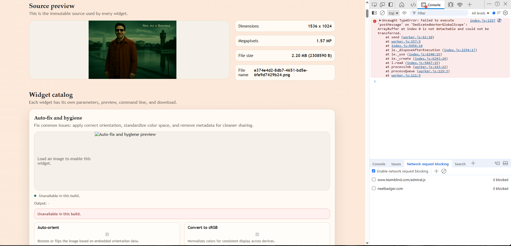

# Hello
Date: 2026-01-03





So, I'm very impressed with the initial result, but we need to fix some issues, some errors, and the one error is the following one with the postMessage, so basically none of the components are able to process the image right now, and we need to figure out what happened there and fix this issue.

Console error:

```
index.js:2257 
 Uncaught TypeError: Failed to execute 'postMessage' on 'DedicatedWorkerGlobalScope': ArrayBuffer at index 0 is not detachable and could not be transferred.
    at send (worker.js:62:10)
    at worker.js:157:5
    at index.js:9456:14
    at le._disposeAfterExecution (index.js:2254:17)
    at ie._use (index.js:6240:15)
    at ie._create (index.js:6243:24)
    at l.read (index.js:9447:15)
    at processJob (worker.js:143:22)
    at processQueue (worker.js:119:3)
    at worker.js:111:5


```


Suggested logging: 


Another thing now is that we need to implement telemetry, good telemetry, good verbose telemetry to understand what is going on. And here, for that, I think we need to create our own logging format. And this is the format that I'm suggesting. So I want to use some kind of structured logging here. But how we do this, we will just, like, you know, when we mention when we use some variable. So basically, it should be somehow connected with the code. So basically, for instance, for example, if we have, like, a start processing, like, a file, and we have, like, a file name, for instance, a variable. So we put this file name equals to, and then in the quotes, in the single quotes, we just put some variable. So every time we use, so we kind of mix the regular text with the identifiers in the code so that, like, you know, it just makes it more clear from, more clear to correlate, like, logs to the source code. And we also want to put a module and a logging level. So module can be, you know, you can use your best judgment to split those, our source code by modules, like some logical, even some logical module, not just app, but just, like, you know, logical module in general, logical module categories. And then you can use those so that it will be clear. What's going on? And I really want to have, like, a verbose logging. So you can just, using your best judgment, your best judgment, introduce a nice verbosity level and cover all the errors, cover all the code path, and also introduce, like, some kind of global variable here where I can set the log verbosity. For instance, I can set it to info or to verbose or to error only or to warning, something like that. So I want you to go through all the source code and instrument all the important parts, like doing something with the logging, so that next time the error will be very clear and faster to find.

Example:

```
[MODULE][INFO] Started processing file='file_name.here.jpg' file.sizeBytes='700000'
```


You can implement logging fix, without trying to fix the original error and ask me to try to test and reproduce and provide more logging information for you
