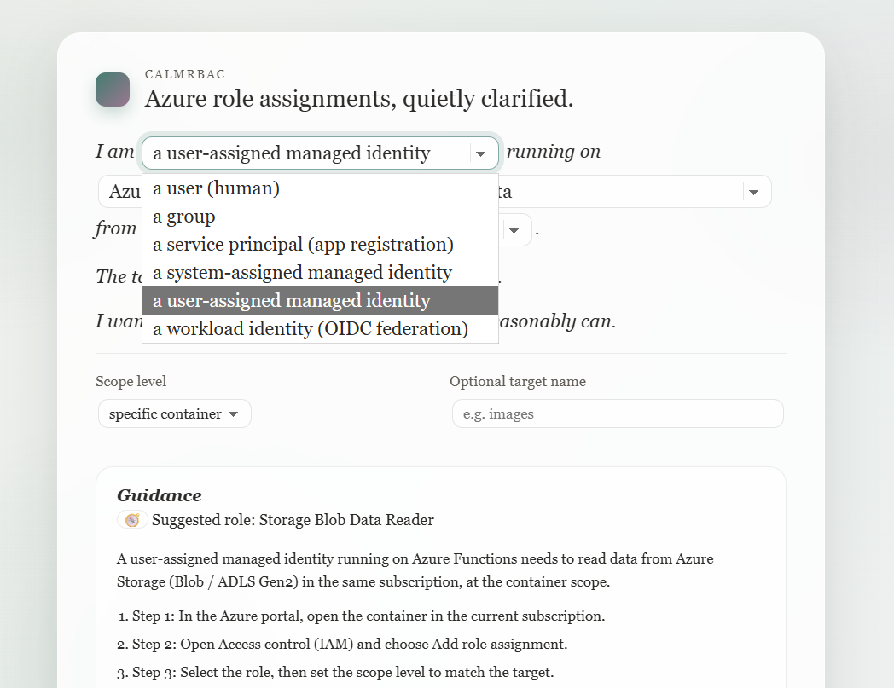

## Bugs


Screenshot




The overall direction is strong: the page reads like a single editorial note, the controls are embedded, and the generated guidance sits in a calmer secondary region. The screenshot also shows several concrete UI bugs and a few design choices that drift toward “default form” rather than “typographic tool.” Below are the main issues, prioritized by impact.

The inline control sizing is inconsistent in a way that looks accidental. “read data” appears to expand to a much wider select than the others, which makes the line feel like a stretched form row rather than prose with embedded choices. All inline selects should follow the same sizing rule (content-fit with a sensible min and max width), so the sentence remains visually balanced. Related, the baseline alignment is slightly off: the selects sit a touch “heavy” relative to the italic text, and the dropdown chevrons pull attention. You want the controls to feel like gentle inlays, not like form elements interrupting the line.

The narrative line breaks look uncomposed. The sentence wraps mid-phrase (“running on” at the end of a line, then the runtime select starts the next line), which reads like a responsive accident rather than an intentionally typeset paragraph. The fix is to enforce wrap groups (keep “running on [runtime]” together, keep “read data” with its preceding phrase) using inline wrappers that are allowed to wrap as a unit. This single change will materially improve the “edited note” feel.

The “Scope level” control currently reads as a chip inside a tinted field rather than a clearly interactive selector. It looks like a selected value pill sitting in a container, with no visible dropdown affordance. If it is a select, it should look like one; if it is a pill-select, it should look intentionally pill-select with a clear affordance and consistent styling with the inline narrative controls. Right now it sits in between and feels like a UI artifact. Also, that scope section is visually disconnected from the sentence “I want the assignment to stay as narrow as it reasonably can.” You likely want the scope selector to be semantically connected to that statement, either by embedding it inline (preferred) or by visually tethering the “Scope level” row to that sentence with spacing and micro-typography, not just a divider.

The guidance steps have a copy bug: each list item begins with “1. Step 1:” (and so on), which duplicates numbering and reads clumsy. Choose one convention: either “Step 1:” as a sequence without numerals, or “1.” with the sentence content, but not both. In addition, the portal action text varies in capitalization and specificity (“Open Access control (IAM)” vs “choose Add role assignment”). You want consistent, mechanically precise verbs, because this is an instruction generator. Minor, but it affects perceived quality.

The callouts are visually heavy and a bit repetitive. All three callouts use a similar border and icon treatment, so the eye does not know what is “always true” versus “situational.” The first callout is a prerequisite and should read like a stable requirement; the managed identity note is a “concept reminder”; the network note is a troubleshooting fork. They should share a family style but differ subtly in emphasis. Also, the code token “Microsoft.Authorization/roleAssignments/write” appears low-contrast and slightly cramped, and the line wrapping inside the callout risks awkward breaks. This will become more obvious on smaller screens.

The “Diagram” section reveals two clear bugs. First, the legend text at the bottom-right is clipped (“Arrows sh…”), and the resizable corner handle overlaps the content area. This is a layout defect: the SVG needs internal padding or the legend needs to avoid the resizer zone, and the container should reserve space for the resize affordance. Second, the edge label on the Runtime -> Target connection appears to collide with the target node and the arrow, creating a muddled cluster of text and stroke right where the user’s attention goes. It reads as “re…” overlapping the arrow and node border. This is a classic label placement bug and will happen often if labels are anchored without collision checks.

The arrow geometry also looks slightly wrong: the arrowhead appears to terminate inside the target node rather than stopping cleanly at the node boundary. That makes the diagram feel less “crafted” and more “programmatically drawn.” The arrow should end at the node’s outer stroke, with the arrowhead clearly outside or exactly touching the border, never intruding into the node fill.

Stylistically, the diagram currently reads more “wireframe” than “handwritten whiteboard.” The shapes are very geometric, the strokes look uniform and computer-perfect, and the overall palette is close to the UI’s neutral borders. If the goal is a hand-drawn feel, you need subtle stroke wobble, rounded joins, and slight irregularity that is deterministic (so it does not jitter on every change). Right now, the diagram looks like a normal SVG with rounded corners and a faint shadow. It is not a failure, but it does not deliver on the “handwritten” promise yet.

The diagram’s hierarchy is also slightly unclear. The role and scope text appears in the top-right of the subscription container, but it is not visually attached to the Runtime -> Target edge label, so it can be misread as a container-level annotation rather than permission on a relationship. Permissions should be “on the arrow” (or immediately adjacent to it) and visually grouped with the intent badge, so the meaning is unambiguous at a glance.

There is a small “template smell” in the Guidance card structure: a card inside the main paper card, with another set of bordered callouts inside, and then another card for the diagram. The nested rectangles are subtle, but they push the UI toward typical component layouts. You can reduce this by using one primary surface (the paper card) and treating Guidance and Diagram as sections within it, using typographic separators and gentle background shifts rather than multiple boxed panels.

Finally, there are a few “polish” opportunities that will matter because the design is otherwise quiet. The micro-brand area (mark + CALMRBAC + title) is good, but the title line and mark spacing could be tightened slightly so the top feels intentional rather than airy by accident. The inline select chevrons are visually prominent; consider toning them down so they do not compete with the prose. The optional target name placeholder is fine, but the label alignment and spacing across the two-column row could be more deliberate (right now it feels like a standard form row dropped into an editorial page).

If you address just these points, the screenshot will move from “already nice” to “clearly crafted.” The biggest correctness items are the duplicated step numbering, the diagram legend clipping, the arrow/label overlap at the target edge, and the ambiguous scope selector affordance. The biggest design items are the composed line wrapping for the narrative and reducing the nested-card feel so the page stays editorial rather than template-like.


R00 Change specification: Copy, clarity, and visual emphasis improvements

This document specifies required changes to the narrative text, the generated guidance, and the visual emphasis rules so the UI reads correctly for different principal types and so the guidance is operationally clearer. The goal is to remove semantic mismatches (for example, "I am a user running on Azure Functions"), reduce ambiguity around "scope level", and increase readability by consistently emphasizing Azure terms and key decisions.

R10 Problem statements and design goals

R11 Current problems to fix

The narrative implies the principal itself "runs" on a runtime. This is incorrect for user and group principals and confusing even for service principals, because the runtime is where code executes, not what the identity "is".

The guidance steps are too generic and do not explain what scope means in portal terms. Users cannot reliably map "scope level" to where they click or what resource they choose.

Callouts contain important prerequisite information but lack emphasis on the critical terms (permission name and the three common roles that grant it). The use of "and" weakens the meaning because the user needs one of those roles, not all.

Azure terms (role names, permission strings, portal menu names) are not visually distinct enough from narrative prose, reducing scanability.

R12 Design goals

The narrative must always be literally true in plain language for every principal type.

The generated guidance must be concrete about what to click, where the assignment is created, and what "scope" maps to.

Key Azure terms must be consistently emphasized in a calm, typographic way, without turning the page into a component-heavy UI.

The UI must remain editorial and fluent. No dashboard patterns. No multi-panel form layout. No generic template styling.

R20 Narrative model: separate "principal" from "workload context"

R21 Replace "I am X running on Y" with a two-part model

The narrative must be rewritten so that:
Part 1 identifies the principal being granted access.
Part 2 identifies the context that will use that access (interactive user access, or workload runtime for code).

The narrative must remain a small number of short sentences with embedded controls.

R22 Principal category determines the sentence template

Define two principal categories.

Category A, interactive principals: user, group.
Category B, application principals: service principal (app registration), managed identity (system-assigned), managed identity (user-assigned), workload identity (OIDC federation) if retained.

The narrative template must change based on category.

R23 Category A template (user, group)

Replace the runtime phrase with an "access method" phrase. A user or group does not "run on" Azure Functions.

Required narrative text structure:

Sentence 1:
"I am granting access to" [principal selector].

Sentence 2:
"I will use this access via" [access method selector] "as" [authentication selector if needed].

Sentence 3:
"I need to" [intent selector] "from" [target service selector] "."

Sentence 4:
"The target lives in" [subscription relation selector] "."

Sentence 5:
"I want the assignment to stay as narrow as it reasonably can."

Notes:
The access method selector replaces the runtime selector. The runtime selector is hidden in Category A.

R24 Category B template (service principal, managed identities, workload identity)

Keep runtime, but move it to refer to the workload, not the principal.

Required narrative text structure:

Sentence 1:
"I am granting access to" [principal selector] "used by" [workload selector].

Sentence 2:
"The workload needs to" [intent selector] "from" [target service selector] "."

Sentence 3:
"The target lives in" [subscription relation selector] "."

Sentence 4:
"I want the assignment to stay as narrow as it reasonably can."

Notes:
The phrase "used by" is required because it prevents the principal itself from being described as the execution environment.

R25 Workload selector behavior

In Category B, show the workload selector. Use the existing runtime values but rename the control label and its inline wording:

Display label: "workload"
Inline wording: "used by" rather than "running on"

Allowed values (minimum set):
Azure Functions, Azure App Service, VM or VM scale set, AKS, Logic Apps, CI/CD pipeline, Other.

R26 Access method selector behavior (Category A)

In Category A, show the access method selector instead of workload.

Allowed values (minimum set):
Azure portal, Azure CLI, Azure PowerShell, SDK or code on my machine, CI/CD pipeline, Other.

R27 Default selection rules

If principal is user-assigned managed identity, default workload is Azure Functions.

If principal is user (human), default access method is Azure portal.

R30 Guidance content: restructure for clarity and actionability

R31 Output header must become a compact summary block

Immediately below "Suggested role", the output must include a summary line with three labeled fields, each visually emphasized:

"Role:" [role name]
"Scope:" [scope label plus what it means]
"Where:" [target subscription or current subscription]

This summary is not a table. It is a single line or two lines, wrapping naturally on small screens.

R32 Scope explanation must be explicit and consistent

Every time scope is referenced, the output must include a short definition in plain language:

"Scope determines where the permission applies. Narrower scope means less access."

Additionally, the output must map the selected scope level to the concrete Azure object the user is expected to select in the portal. The mapping must be service-specific.

Examples of required mappings:
For Storage Blob:
"Specific container means the role assignment is created on the container, not the storage account."
For Azure Files:
"Specific file share means the role assignment is created on the share, not the storage account."
For Service Bus:
"Queue or topic means the role assignment is created on that queue or topic, not the namespace."

R33 Steps must be rewritten with deterministic portal actions

Replace generic steps with explicit actions and include the scope selection in a way that matches the portal flow.

Required step structure (always 5 steps, same numbering, same verbs):

Step 1:
"Open the target resource in the Azure portal in the [target subscription/current subscription]."

Step 2:
"Open" [term: Access control (IAM)] "and choose" [term: Add role assignment] "."

Step 3:
"In" [term: Role] ", select" [term: role name] "."

Step 4:
"In" [term: Members] ", select" [term: principal type] "and choose the specific principal instance. Confirm the assignment."

Step 5:
"Validate with a minimal action: perform a single small [read/write] operation against the target."

Notes:
If the portal uses "Managed identity" selection semantics, the text must say "choose Managed identity, then pick the correct identity" for managed identity principals.

R34 Cross-subscription guidance must be concrete

When cross-subscription is selected and both IDs are valid, include this sentence in the summary area:

"The role assignment is created in the target subscription at the chosen scope, even if the principal is defined elsewhere."

If IDs are missing or invalid, show a single callout that blocks diagram rendering (as already specified) and also blocks subscription-specific wording in the steps.

R35 Service-specific quality improvements

Add one additional service-specific note line for Azure Files:

"Azure Files access often depends on identity integration and SMB semantics. This tool selects roles and scope, but it does not configure identity-based access."

This note is informational and must not expand into troubleshooting.

R40 Term emphasis rules (typographic highlighting)

R41 Introduce a single emphasis component: Term Chip

All Azure terms must be wrapped in a calm inline "term chip" style that looks like typeset annotation, not a UI badge.

Term chip styling requirements:
Monospaced font.
Subtle border.
Very light background tint.
Small padding.
No bright colors.

R42 What must be emphasized

Always emphasize:
Role names (for example Storage Blob Data Reader).
Permission action strings (for example Microsoft.Authorization/roleAssignments/write).
Portal blade and menu names (for example Access control (IAM), Add role assignment, Role, Members).
Scope keywords when used as a decision (for example container, file share, namespace, queue, event hub).

R43 What must not be emphasized

Do not emphasize ordinary prose, verbs, or repeated words. Avoid turning the paragraph into a field of chips.

R50 Prerequisite callout: fix semantics and emphasis

R51 Replace "include Owner, User Access Administrator, and Role Based Access Control Administrator"

The callout must use OR, not AND, and it must visually emphasize the three role names.

Required callout copy:

"To create role assignments at this scope you need" [term: Microsoft.Authorization/roleAssignments/write] ". Common roles that grant this include" [term: Owner] ", " [term: User Access Administrator] ", or " [term: Role Based Access Control Administrator] "."

R52 Increase readability of prerequisite callout

Increase base font size of callouts by a small amount relative to output body, or increase line height, so the callout is easier to read without feeling louder than the prose.

R60 Managed identity callout: tighten wording

The managed identity callout must remain, but it must be phrased as a direct rule:

"For managed identities, configure the workload to use this identity and request a Microsoft Entra token at runtime. The target service does not pull the identity on its own."

Emphasize "Microsoft Entra token" as a term chip.

R70 Network reminder callout: constrain and clarify

Keep the network reminder, but constrain it to one sentence and ensure it does not look like a troubleshooting guide.

Required copy:

"If RBAC looks correct but access still fails, check network restrictions such as firewalls, private endpoints, or public network access settings."

Emphasize the three restriction terms as term chips.

R80 Copy improvements for principal-specific correctness

R81 User principal flow must never imply a runtime

When principal is user or group, the narrative must not show the workload selector. It must show the access method selector.

The output steps must not reference configuring a runtime identity. The managed identity callout must not appear.

R82 Service principal flow must avoid anthropomorphic "I am"

When principal is service principal, keep the "I am granting access to" framing. Do not write "I am a service principal running on ...". The narrative must remain about granting access, not about identity self-description.

R83 Group principal flow must be phrased as granting to a group

Groups are not actors. The narrative must still say "I am granting access to a group" and treat the access method as the user's intended usage context.

R90 Visual fluency improvements (non-template enforcement)

R91 Inline selections must be visibly selectable but not look like form fields

Maintain the editorial inline look. Additionally implement "completed" highlighting when a value differs from default, but keep it calm.

Completed highlighting must affect:
Border tone slightly.
Background tint slightly.
Optionally a subtle underline.

Completed highlighting must not:
Change layout size.
Use bright colors.
Animate aggressively.

R92 Generated content separation must be clearer

The generated guidance section must look like a continuation but still distinct.

Required separation changes:
A slightly different background tint for the guidance block.
A clear "Guidance" title.
A "Generated and read-only" subtitle line in small italic, consistent with the diagram subtitle style.

R93 Increase output readability

Increase spacing between:
Scenario recap paragraph and steps.
Steps and validation sentence.
Validation sentence and callouts.

The steps must remain compact, but each step must have enough vertical spacing to scan.

R100 Acceptance checks for the changes in this document

The narrative reads correctly for each principal type:
User: uses access method language, no runtime phrasing.
Group: same as user, no runtime phrasing.
Service principal: uses "granting access" plus "used by workload".
Managed identities: uses "granting access" plus "used by workload", includes managed identity callout.
Workload identity: same pattern as managed identity, without managed identity-specific callout unless explicitly desired.

The guidance header contains Role, Scope, and Where summary fields.

The word "scope" is always explained in plain language and mapped to a concrete resource selection.

The prerequisite callout uses OR semantics and highlights the three role names as terms.

Portal terms and role names are consistently displayed as term chips.

No new UI resembles a generic dashboard template. The prose-first editorial layout remains dominant.

The diagram section, when present, follows the existing diagram appendix rules and does not distract from the improved narrative and guidance.


## New feature: Code generation

S00 Appendix: Auto-generated PowerShell and Bicep examples (read-only, scenario-driven)

S10 Purpose and scope

This feature adds two read-only code examples to the Guidance section: a PowerShell example and a Bicep example. Each example is automatically generated from the same scenario model that powers the Suggested role, Scope, and Where summary. The user cannot edit the generated code inside the page. The user can only copy it.

The goal is not to provide a complete automation framework. The goal is to provide a minimal, correct, copy-pasteable starting point that (a) selects the correct subscription context, (b) uses the correct role definition, (c) applies the correct scope string, and (d) uses the correct principal identifier for the chosen principal type.

S20 UI and UX requirements

S21 Placement and presentation

Below the existing procedural steps, add a section titled "Examples". Under it, render two labeled code panels: "PowerShell (Az)" and "Bicep".

The panels must visually match the CalmRBAC editorial style: calm border, subtle background tint, generous padding, readable font size, and a clear copy button aligned to the top-right of each panel.

Each panel must include a one-sentence preface in normal prose immediately above the code block, explaining what the snippet will do in plain language. Do not add long explanations inside the prose. Put short, beginner-friendly comments inside the code itself.

S22 Auto-regeneration rules

Both code panels must update immediately when any scenario input changes (principal type, intent, service, scope level, subscription relation, and any required identifiers described in S30).

Updates must not cause layout flicker. The code panel containers stay mounted; only the code text changes.

S23 Readability rules for code blocks

Use a monospaced font with a slightly larger size than typical terminal defaults. The code block must have sufficient line height to be readable by a user unfamiliar with PowerShell or Bicep.

Use comments to explain intent in simple sentences. Do not exceed one comment per logical step.

The code must be formatted with short lines and explicit variables near the top.

S30 Required identifiers and minimal data entry

S31 New scenario fields required for code generation

To generate correct PowerShell and Bicep, the tool needs enough information to construct a real scope string and a real principalId. The current "Optional target name" is not sufficient for scripting.

Add a compact "Identifiers" subsection that is conditionally shown only when the Examples section is visible. The Examples section is always visible, but it may show placeholders if identifiers are missing.

The Identifiers subsection must collect the minimum required fields for the chosen target service and scope level:

Common fields (always potentially needed):
Target subscription ID (only in cross-subscription mode).
Target resource group name (required for most resource-scoped examples unless the user provides a full scope string).
PrincipalId (objectId) value if it cannot be derived from within a Bicep deployment.

Service-specific fields (only when needed):
Storage Blob:
Storage account name required for account/container scope.
Container name required for container scope.

Storage Files:
Storage account name required for account/file share scope.
File share name required for file share scope.

Key Vault:
Vault name required for vault scope.

Service Bus:
Namespace name required for namespace scope.
Queue name required for queue scope.
Topic name required for topic scope.
Subscription name required for topic subscription scope.

Event Hubs:
Namespace name required for namespace scope.
Event hub name required for event hub scope.
Consumer group name required for consumer group scope.

S32 Full-scope override (advanced but minimal)

Provide an optional "Scope resource ID (advanced)" input. If this value is present and syntactically looks like an Azure resource ID string, it takes precedence over all service-specific name inputs and is used verbatim as the scope in both PowerShell and Bicep examples.

If the user provides the full scope resource ID, the UI should de-emphasize the service-specific inputs (keep them visible but clearly secondary) to avoid conflicting sources of truth.

S33 PrincipalId sourcing rule

Bicep cannot discover Microsoft Entra principals by name at deployment time. Therefore, the Bicep example must always use a principalId parameter unless the identity is explicitly declared inside the same Bicep file.

Implement a single switch labeled "PrincipalId source" with two values:
"Paste principalId" (default).
"From an existing resource in this Bicep template" (advanced).

If "Paste principalId" is selected, require a principalId input and use it in both examples.

If "From an existing resource in this Bicep template" is selected, require a Bicep expression input for principalId (for example, "myUai.properties.principalId") and use it in the generated Bicep. The PowerShell example still uses the pasted principalId field, unless the implementer chooses to support lookup helpers as described in S50.

S40 PowerShell example specification (Az modules)

S41 Command correctness requirements

The PowerShell example must use:
Connect-AzAccount to authenticate. This is the canonical entry point for Az PowerShell. (Connect-AzAccount documentation confirms purpose and behavior.) ([Microsoft Learn](https://learn.microsoft.com/en-us/powershell/module/az.accounts/connect-azaccount?view=azps-15.2.0&utm_source=chatgpt.com))
Set-AzContext to select the correct subscription context using -SubscriptionId or its alias. (Set-AzContext documentation confirms SubscriptionId alias.) ([Microsoft Learn](https://learn.microsoft.com/en-us/powershell/module/az.accounts/set-azcontext?view=azps-15.2.0&utm_source=chatgpt.com))
New-AzRoleAssignment to create the role assignment with explicit scope. (New-AzRoleAssignment documentation confirms assigning at scopes and specifying subject.) ([Microsoft Learn](https://learn.microsoft.com/en-us/powershell/module/az.resources/new-azroleassignment?view=azps-15.2.0&utm_source=chatgpt.com))

S42 Generated PowerShell structure

The snippet must always follow this structure:
A short header comment describing what will be created.
Step 1: Connect-AzAccount.
Step 2: Set-AzContext to the subscription that contains the target scope.
Step 3: Define variables: principalId, roleDefinitionId, scope.
Step 4: New-AzRoleAssignment using -ObjectId, -RoleDefinitionId, and -Scope.
Step 5: A minimal verification line: Get-AzRoleAssignment filtered by objectId and scope.

S43 Generated PowerShell example template

The tool must generate this code with scenario-derived substitutions. Values shown in angle brackets are placeholders that must be replaced with user-provided fields or scenario-selected roleDefinitionId.

```powershell
# Creates an Azure RBAC role assignment at the chosen scope.

# Step 1: Sign in to Azure (interactive browser login by default).
Connect-AzAccount

# Step 2: Select the subscription that contains the target resource.
$TargetSubscriptionId = "<target-subscription-guid>"
Set-AzContext -SubscriptionId $TargetSubscriptionId

# Step 3: Fill in the three values that define the role assignment.
$PrincipalObjectId = "<principal-id-guid>"          # Microsoft Entra objectId (principalId)
$RoleDefinitionId  = "<role-definition-guid>"       # Built-in role definition GUID
$Scope             = "<scope-resource-id>"          # Full Azure resource ID for the scope

# Step 4: Create the role assignment.
New-AzRoleAssignment `
  -ObjectId $PrincipalObjectId `
  -RoleDefinitionId $RoleDefinitionId `
  -Scope $Scope

# Step 5: Verify the assignment exists.
Get-AzRoleAssignment -ObjectId $PrincipalObjectId -Scope $Scope
```

RoleDefinitionId must be the GUID from the internal reference dataset for the selected role. The tool must not emit the role name here, because the scenario reference data is already GUID-based and avoids name ambiguity across clouds and tenants.

S44 Scope string construction rules for PowerShell

If "Scope resource ID (advanced)" is provided, use it verbatim as $Scope.

Otherwise, construct $Scope deterministically from service-specific fields. Construction must align with Azure resource ID conventions used by Azure RBAC scopes. ([Microsoft Learn](https://learn.microsoft.com/en-us/azure/role-based-access-control/role-assignments?utm_source=chatgpt.com))

For Storage Blob container scope, the scope must be the container resource ID:
"/subscriptions//resourceGroups//providers/Microsoft.Storage/storageAccounts//blobServices/default/containers/"

For Storage Files file share scope, the scope must be the file share resource ID. If the implementer does not yet have the canonical file share resource ID format locked down, the UI must require the full scope resource ID for file share scope and show a clear message: "For this scope level, paste the full scope resource ID."

S50 Optional PowerShell lookup helpers (minimal, gated)

S51 Goal and constraints

Lookup helpers are optional and must not complicate the default experience. Many users can paste principalId from the portal. The default example must remain the template in S43.

If lookup helpers are implemented, show them collapsed behind a calm disclosure line: "Optional: find principalId by name". This disclosure does not exist in Bicep.

S52 Allowed helper patterns

If the principal type is user-assigned managed identity, allow a helper that uses Get-AzUserAssignedIdentity to retrieve PrincipalId. The cmdlet exists and is documented. ([Microsoft Learn](https://learn.microsoft.com/en-us/powershell/module/az.managedserviceidentity/get-azuserassignedidentity?view=azps-15.2.0&utm_source=chatgpt.com))

Example helper (only when principal type is user-assigned managed identity and the user provided identity name and resource group name):

```powershell
# Optional: resolve a user-assigned managed identity to its PrincipalId.
$Uai = Get-AzUserAssignedIdentity -ResourceGroupName "<identity-rg>" -Name "<identity-name>"
$PrincipalObjectId = $Uai.PrincipalId
```

If principal type is user or service principal, any helper that depends on additional directory lookup cmdlets must be treated as advanced and may be deferred. If implemented, it must be clearly labeled optional and must not replace the simple "paste principalId" flow.

S60 Bicep example specification

S61 Command correctness requirements

The Bicep example must define a resource of type Microsoft.Authorization/roleAssignments with apiVersion 2022-04-01 or later. The template reference confirms principalId, principalType, and roleDefinitionId properties. ([Microsoft Learn](https://learn.microsoft.com/en-us/azure/templates/microsoft.authorization/roleassignments?utm_source=chatgpt.com))

The example must use a deterministic role assignment name generated by guid(). This prevents redeploy collisions and matches common Bicep RBAC patterns described in Microsoft RBAC Bicep scenarios. ([Microsoft Learn](https://learn.microsoft.com/en-us/azure/azure-resource-manager/bicep/scenarios-rbac?utm_source=chatgpt.com))

S62 Generated Bicep structure

The Bicep snippet must always include:
Parameters for principalId, roleDefinitionId, and the minimum target identifiers.
An existing target resource declaration, or direct use of scope when "Scope resource ID" is provided via deployment targeting.
A roleAssignments resource with properties principalId, principalType, and roleDefinitionId.
A stable name expression using guid() based on scope and principalId.

S63 Bicep example template (resource group deployment, common case)

This template assumes the target resource exists and is in the current resource group. It is intentionally minimal. When the user selects cross-subscription or a different resource group, the UI must either switch to a module-based approach or require full scope resource ID and provide a warning that cross-scope deployments require explicit deployment scoping.

```bicep
targetScope = 'resourceGroup'

@description('Microsoft Entra principalId (objectId) of the user, group, service principal, or managed identity.')
param principalId string

@description('Built-in role definition GUID, for example Storage Blob Data Reader.')
param roleDefinitionGuid string

@description('Existing storage account name.')
param storageAccountName string

@description('Container name when assigning at container scope.')
param containerName string

// Existing storage account
resource stg 'Microsoft.Storage/storageAccounts@2022-09-01' existing = {
  name: storageAccountName
}

// Existing container (container scope). For account scope, assign on stg instead.
resource container 'Microsoft.Storage/storageAccounts/blobServices/containers@2022-09-01' existing = {
  name: '${storageAccountName}/default/${containerName}'
}

// Role assignment at container scope.
resource ra 'Microsoft.Authorization/roleAssignments@2022-04-01' = {
  name: guid(container.id, principalId, roleDefinitionGuid)
  scope: container
  properties: {
    principalId: principalId
    principalType: 'ServicePrincipal'
    roleDefinitionId: subscriptionResourceId('Microsoft.Authorization/roleDefinitions', roleDefinitionGuid)
  }
}
```

Notes that must be applied by the generator:
The existing container resource type and naming pattern must match the Microsoft.Storage container template format. ([Microsoft Learn](https://learn.microsoft.com/en-us/azure/templates/microsoft.storage/storageaccounts/blobservices/containers?utm_source=chatgpt.com))
principalType must be derived from the principal selection. Use:
User for user.
Group for group.
ServicePrincipal for service principal, system-assigned managed identity, user-assigned managed identity, and workload identity. This aligns with the allowed values for principalType in the roleAssignments template reference. ([Microsoft Learn](https://learn.microsoft.com/en-us/azure/templates/microsoft.authorization/roleassignments?utm_source=chatgpt.com))

S64 Bicep scope selection rules

If the scenario scope is at storage account level, set scope to stg and generate the role assignment name from stg.id instead of container.id.

If the scenario is not Storage Blob, the generator must switch the existing resource type and scope anchor accordingly, or require full scope resource ID input and emit a minimal "extension resource at explicit scope" form.

If cross-subscription is selected, the Bicep snippet must include a warning line in prose above the code: "Cross-subscription role assignments require deploying the role assignment at the target scope. Use a separate deployment targeting the target subscription, or a module deployed at that scope." This is consistent with how Bicep scoping works for extension resources. ([Microsoft Learn](https://learn.microsoft.com/en-us/azure/azure-resource-manager/bicep/scenarios-rbac?utm_source=chatgpt.com))

S70 Dynamic substitution rules (both PowerShell and Bicep)

The roleDefinitionGuid inserted must match the role chosen by the scenario engine.

The scope must match the chosen scope level. If the engine cannot construct a correct scope string for that level with the available identifiers, the snippet must not guess. It must:
Use "" placeholder.
Render a calm callout: "To generate a runnable script for this scope, paste the full Scope resource ID."

The PowerShell snippet must always set subscription context to the subscription that contains the target scope. Use current subscription when same-subscription is selected; use target subscription when cross-subscription is selected.

S80 Acceptance checks

Changing principal type from managed identity to user immediately changes the prose above code to refer to an interactive principal and removes managed identity-specific language, but keeps role assignment mechanics intact.

Changing scope level from account to container updates:
PowerShell $Scope construction or placeholder rules.
Bicep scope anchor from stg to container and updates the guid() input accordingly.

Changing subscription relation to cross-subscription updates:
PowerShell to Set-AzContext to the target subscription ID.
Bicep to show the cross-subscription deployment warning and, if implemented, switches to a targetScope subscription/module approach rather than silently emitting an incorrect resourceGroup-scoped deployment.

Both code panels remain readable, copyable, and stable without UI flicker.