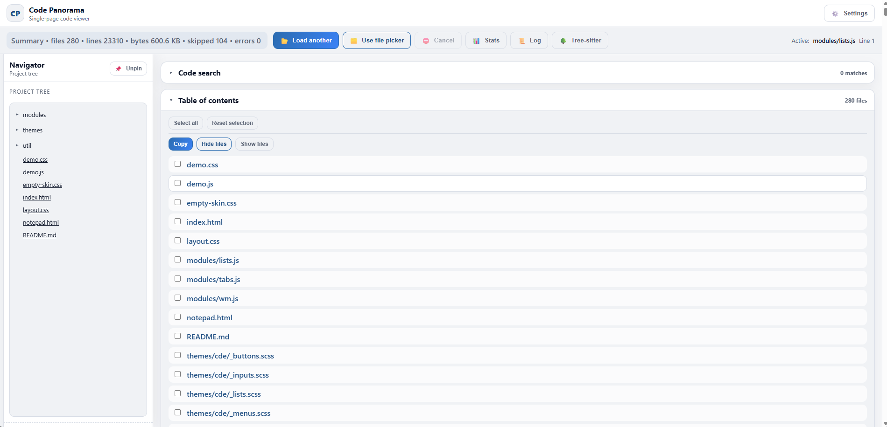
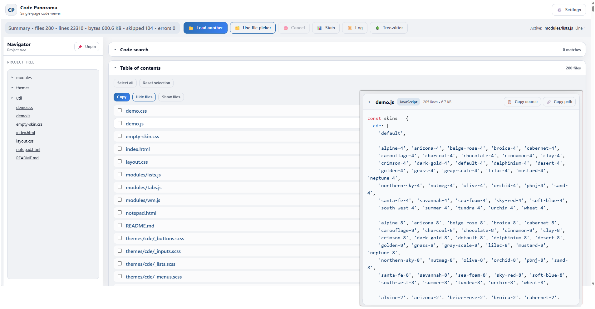

# Hello
Date: 2025-12-28


Screenshot: 

Current application state before implementation:



Screenshot: 

Suggested implementation mockup:



Please note, the mockup does not include all requested features in the spec, it is there only to demonstrate the idea of the code preview window. 


A00 Purpose and outcome

This specification defines a hover-activated Preview Window for the Code Panorama Table of Contents (TOC). The Preview Window lets a user inspect a file's already-rendered source view without navigating away from their current reading position. The preview is created by cloning an existing DOM subtree for that file (the same subtree that is rendered in the main document after the file is loaded), then displaying the clone inside a single reusable floating window.

The system must not attempt to fetch or render file contents on demand. It must only preview content that is already present in the DOM and marked as loaded.

B00 Problem being solved

In the TOC, users frequently want to quickly check a file's contents to decide whether to open it, copy from it, or compare it to another file. Today that requires clicking, scrolling, or switching context.

This feature reduces time-to-insight by enabling "scan then decide" behavior directly from the TOC. It also avoids performance overhead by cloning already-rendered DOM rather than triggering any parsing or rendering pipeline.

C00 Scope

In scope:
The TOC supports hover previews for file entries. A single floating Preview Window is shown near the hovered TOC entry when, and only when, the corresponding file content is already loaded in the document DOM. The Preview Window stays within the viewport and supports internal scrolling. Hovering a different file swaps the preview content inside the same window. The window auto-dismisses after a period of inactivity.

Out of scope:
Multiple concurrent preview windows, pinning, keyboard shortcuts, link tracking, in-preview edits, search inside preview, incremental rendering within preview, and any network or file loading behavior triggered by the preview feature.

D00 Definitions and core concepts

TOC Entry: A UI row in the central "Table of contents" list representing a file (for example "demo.js" or "modules/lists.js"). This spec concerns hover over these entries.

Source Content Element: The DOM element in the document that contains the rendered file content for a specific file. This is the element that already exists after the application loads and renders that file "at the bottom of the page" (or wherever Code Panorama renders file content). The preview system clones this element (or a stable sub-element within it) as the preview content.

Loaded File: A file is "loaded" when its Source Content Element exists in the DOM and is ready for display without additional async operations. This must be checked deterministically before showing a preview.

Preview Window: A single fixed-position floating container with a header and scrollable content area. It is reused across hover events. It displays a clone of the Source Content Element.

Inactivity: Lack of pointer interaction with both the TOC entry and the Preview Window.

E00 User value and intended UX

The preview should feel like an instantaneous, lightweight "peek." The user should be able to sweep the mouse down the TOC list and see previews update without clicking.

The preview must not appear for files that are not loaded. In that situation, the UI should remain unchanged (no placeholder window, no spinner) to avoid implying that hover will load content.

The user must be able to move the pointer from the TOC entry into the Preview Window without the window disappearing, then scroll and read within it. When the user is done and stops interacting, the preview should disappear automatically.

F00 Functional requirements

F01 Activation trigger

F01.1 The preview is triggered by hovering a TOC Entry. Hover must be recognized when the pointer enters any interactive area of the entry, including text and surrounding row padding.

F01.2 The preview must not require click. Clicking behavior of the TOC must remain unchanged.

F01.3 The system must support event delegation so that dynamically added TOC entries also receive hover behavior without per-row listeners.

F02 Eligibility and loaded-state gating

F02.1 The preview must only be shown if the corresponding file is Loaded.

F02.2 If the file is not Loaded, the system must do nothing visible: no preview window, no placeholder, no tooltip, no loading indicator.

F02.3 Loaded-state check must be performed immediately when hover begins and again immediately before showing the window if an open delay is used (see F03). This prevents a stale decision from showing an empty preview.

F02.4 The mapping from TOC Entry to Source Content Element must be deterministic and stable. The implementation must define a single canonical identifier for a file (for example a file path string) and use that identifier to locate the Source Content Element.

F02.5 If the mapping fails (no matching Source Content Element found, or element found but empty/unrendered), treat the file as not Loaded and do nothing visible.

F03 Timing, debounce, and flicker control

F03.1 The preview must not flicker when the pointer briefly crosses entries. Use an open delay of 150ms before showing a preview for a hovered entry.

F03.2 If the pointer leaves the entry before the open delay elapses, the preview must not open.

F03.3 When moving from one entry directly to another, the preview content must switch to the newly hovered entry with no additional open delay beyond 75ms. This supports rapid scanning while still filtering accidental passes.

F03.4 When switching between entries, the same Preview Window instance must be reused (single-window rule). Only its content and header title may change.

F04 Preview Window behavior

F04.1 Single instance: At most one Preview Window may exist at any time. Creating a new preview while one exists must update the existing window instead of creating another.

F04.2 Content source: The preview content must be produced by cloning the Source Content Element (or a stable descendant that represents the rendered file body) using a deep clone. The clone must be inserted into the Preview Window content area.

F04.3 The preview must not mutate the original Source Content Element. The clone must not keep references that can change the original DOM.

F04.4 The Preview Window header must display the file name (or file path) for the hovered entry. If the file name cannot be determined, display a generic label "Preview."

F04.5 The Preview Window content area must be scrollable in both directions as needed (vertical required, horizontal allowed if code lines require it). Scrolling must not scroll the underlying page while the pointer is over the Preview Window content area, except at scroll boundaries where the browser naturally propagates (no custom scroll trapping is required beyond default behavior).

F04.6 The user must be able to move the pointer from the TOC Entry into the Preview Window without dismissing it. Hover state is considered active if either the TOC Entry or the Preview Window contains the pointer.

F04.7 The Preview Window must support text selection inside the content area. The header may remain non-selectable.

F05 Geometry and viewport constraints

F05.1 The Preview Window must always remain fully within the visible viewport. It must not extend beyond the right, left, top, or bottom edge of the current visible screen.

F05.2 If the content is larger than the available window size, the Preview Window must constrain its size and allow internal scrolling.

F05.3 Default size: width 420px, height 280px.

F05.4 Minimum size: width 260px, height 160px.

F05.5 Maximum size: width must be at most (viewport width minus 16px total margin). Height must be at most (viewport height minus 16px total margin). The margin is 8px on each side.

F05.6 Positioning rule: The window should prefer to appear adjacent to the hovered TOC Entry with a 10px gap.
If there is enough space to the right of the entry to fit the window, place it to the right.
Else if enough space to the left, place it to the left.
Else clamp horizontally to remain fully visible.
For vertical placement, prefer below the entry if it fits, else above, else clamp vertically to remain fully visible.

F05.7 When clamping causes overlap with the hovered entry, overlap is allowed; visibility and containment within viewport take priority.

F06 Dismissal and lifetime

F06.1 The Preview Window must auto-dismiss after 9000ms of inactivity.

F06.2 Inactivity timer resets on any of the following:
Pointer enters or moves within the Preview Window (header or content).
Pointer enters a TOC Entry that is eligible (Loaded) and would show a preview.
Pointer moves within the currently hovered eligible TOC Entry.

F06.3 The Preview Window must dismiss immediately when the user clicks or taps outside the Preview Window. Clicking inside the Preview Window must not dismiss it.

F06.4 The Preview Window must dismiss when the user leaves both the TOC Entry area and the Preview Window area and the inactivity timeout elapses. It must not dismiss immediately on pointerleave to allow normal movement into the window.

F06.5 When dismissed, the Preview Window DOM must be removed (not only hidden) unless the existing codebase requires retention for performance. If retained, it must be fully inert and not intercept pointer events.

F07 Interaction with application loading and dynamic updates

F07.1 The application loads files gradually. The preview system must not assume that a TOC Entry implies a loaded file.

F07.2 If a hover begins while the file is not Loaded and then becomes Loaded shortly after, the preview may appear only if the pointer is still hovering the same entry at the time the Loaded check passes (after open delay). If the pointer has moved away, do nothing.

F07.3 If the Source Content Element is replaced or re-rendered by the application while the preview is open, the preview must not automatically refresh. The preview remains a snapshot clone taken at the moment the preview was shown or last switched.

F07.4 If the TOC Entry is removed from the DOM while its preview is showing, the preview remains visible until dismissed by inactivity or outside click.

G00 System state model

G01 States

Idle: No Preview Window exists.

PendingOpen(fileId): Pointer is hovering a TOC Entry for fileId, open delay has started, preview not yet visible.

Visible(fileId): Preview Window exists and shows content for fileId.

H01 State transitions

Idle -> PendingOpen(fileId) on pointer entering a TOC Entry that maps to fileId.

PendingOpen(fileId) -> Visible(fileId) after open delay if fileId is Loaded at that moment and pointer is still within the same TOC Entry.

PendingOpen(fileId) -> Idle if pointer leaves the entry before open delay elapses, or if fileId is not Loaded at open time.

Visible(fileA) -> Visible(fileB) when pointer enters another TOC Entry for fileB and fileB is Loaded (switch delay applies). This updates title and content in the existing window.

Visible(fileId) -> Idle on outside click, or when inactivity timeout expires.

H00 Validation rules and error handling

H01 Mapping validation

If fileId cannot be derived from the TOC Entry, treat as not eligible and do nothing visible.

If the Source Content Element query returns null, treat as not Loaded and do nothing visible.

If the Source Content Element exists but is clearly unrendered (for example, empty content container), treat as not Loaded and do nothing visible.

H02 Defensive behavior

No exceptions thrown by the preview system should break TOC interaction. Errors must be caught and cause a no-op for that hover attempt.

The preview system must not block scrolling the main page when the preview is not visible.

I00 UI requirements

I01 Placement in UI

The feature applies to the central Table of Contents list (the file list). It does not apply to the left Navigator tree unless explicitly extended later.

I02 Visual style

The Preview Window should use the existing preview window component styling already present in the codebase (as provided in the demo). The spec does not require design changes, only correct behavior and integration.

I03 Z-index and overlay behavior

The Preview Window must appear above the page content and controls such that it is not occluded by the TOC container or code panes. It must not block interaction with the TOC except where the window overlaps it.

J00 User workflows (narrative scenarios)

J01 Rapid scan to find the right file

1. The user moves the pointer down the TOC list, pausing briefly over several file names.
2. For each file that is already loaded, a Preview Window appears near that row after a short delay and shows the file content snapshot.
3. As the user continues to the next row, the Preview Window updates to the next file without opening a new window.
4. The user stops on a file whose preview shows the desired function and then clicks the TOC entry (normal navigation) to open it fully.

J02 Inspect details without losing scroll position

1. The user is reading a section of a long file further down the page and does not want to scroll away.
2. The user moves to the TOC and hovers "modules/lists.js".
3. The preview appears and shows the rendered code for that file.
4. The user moves the pointer into the Preview Window and scrolls within it to confirm a detail.
5. The user moves away; after inactivity the preview dismisses, leaving the main document scroll position unchanged.

J03 Hover over an unloaded file

1. The user hovers a TOC entry for a file that has not been loaded yet by the application.
2. The system checks Loaded state, finds the Source Content Element is missing, and shows nothing.
3. The user continues working with no distraction or misleading placeholder.
4. Later, after the application loads that file and renders its content, hovering the same entry produces a preview normally.

J04 Switching between two files to compare

1. The user hovers file A and reads a code fragment in the preview.
2. Without clicking, the user moves to file B in the TOC; the preview swaps to show file B.
3. The user alternates between A and B by hovering each entry and visually comparing the content in the preview.
4. The user decides which file to open and clicks it, ending the scan.

J05 Dismiss by outside click while keeping the pointer in the TOC area

1. The user hovers a file and the preview appears.
2. The user decides the preview is in the way and clicks an empty area of the page.
3. The preview dismisses immediately.
4. The user continues interacting with the TOC normally; the preview can reappear on a later hover.

K00 Specification by example (observable outcomes)

K01 Edge placement near the bottom of the viewport

Given the user hovers a TOC entry near the bottom of the visible screen and the preview height would extend beyond the bottom edge,
When the preview opens,
Then the preview is positioned such that its bottom edge is within the viewport and the content area becomes scrollable as needed.

K02 Hover leaves and enters preview without dismissal

Given the preview is visible for file A,
When the user moves the pointer from the TOC entry into the preview window,
Then the preview remains visible and usable, including scroll and text selection.

K03 File becomes loaded during hover

Given the user hovers a TOC entry and the file was not Loaded at hover start,
When the file becomes Loaded before the open delay completes and the pointer is still on the same entry,
Then the preview may open normally after the delay.
If the pointer has left the entry, then no preview opens.

K04 Switching to an unloaded file while a preview is visible

Given the preview is visible for file A,
When the user hovers file B that is not Loaded,
Then the preview must not switch to file B and must either remain showing file A until dismissal or until the user hovers another Loaded file. The system must not show an empty preview.

K05 Fast sweep across entries

Given the user moves the pointer across multiple entries without pausing at least 150ms on any single entry,
Then no preview opens.

L00 Integration requirements for Codex implementation

L01 TOC entry identification

The implementation must identify TOC entries in the central Table of contents list and derive a canonical file identifier from each entry. The canonical file identifier must match the identifier used by the rendered Source Content Element.

L02 Source Content Element discovery

The implementation must define a single query strategy to find the Source Content Element for a given file identifier. The strategy must be stable across incremental loading. Example strategies include:
A data attribute on the rendered content root containing the file identifier.
An id convention derived from file identifier.
A lookup map already present in the codebase that maps file identifier to rendered element.

The chosen strategy must satisfy F02 and H01 without introducing new loading behavior.

L03 Single-window reuse

The implementation must reuse the existing preview window component already present (the demo-style window) and adapt it to TOC hover triggers and file-content cloning. The preview window must not be re-instantiated per hover.

M00 Non-functional requirements

M01 Performance

Hovering a loaded entry must not trigger expensive reflow-heavy operations beyond cloning and inserting the DOM subtree. The system should avoid repeated cloning when hovering the same file repeatedly within a short time; if a cache is implemented, it must be bounded and must invalidate naturally when the file content is replaced (best-effort is acceptable since the preview is a snapshot).

M02 Robustness

The preview feature must not break when some files fail to load, when the TOC list is filtered, or when the application loads files out of order. Any error must degrade to "no preview."

N00 Explicit exclusions

No preview is shown for unloaded files.

No spinners or placeholders for preview.

No iframe-based loading.

No second preview window.

No pin button.

No keyboard shortcuts or keybindings.

No link tracking or special behavior for clicks inside the preview beyond default browser behavior.


## Appendix ZA01: Floating preview window example

```html
<!doctype html>
<html lang="en">
  <head>
    <meta charset="utf-8" />
    <meta name="viewport" content="width=device-width,initial-scale=1" />
    <title>Simple Preview Window (Div Content)</title>
    <link rel="stylesheet" href="./styles.css" />
  </head>
  <body>
    <main class="page">
      <h1>Simple preview window demo</h1>

      <p>
        This page shows how to open a preview window near a clicked element, and load content into it from a cloned DOM node.
      </p>

      <div class="demo-row">
        <a href="#" class="demo-trigger" data-source="#source-a">Open preview A</a>
        <a href="#" class="demo-trigger" data-source="#source-b">Open preview B</a>
      </div>

      <section class="sources">
        <article id="source-a" class="source-card">
          <h2>Preview content A</h2>
          <p>
            This content is cloned from the page and inserted into the preview window. There is no iframe, no URL loading.
          </p>
          <p>
            Resize the preview by grabbing its edges or corners. Drag it by the header bar.
          </p>
        </article>

        <article id="source-b" class="source-card">
          <h2>Preview content B</h2>
          <p>
            The preview auto-destroys after a timeout. Click anywhere outside the preview to dismiss immediately.
          </p>
          <ul>
            <li>Uses a div for content.</li>
            <li>Supports drag and resize.</li>
            <li>No pinning, no keybindings, no link tracking.</li>
          </ul>
        </article>
      </section>
    </main>

    <script src="./app.js"></script>
  </body>
</html>
```

```css
:root {
  --pw-bg: #121316;
  --pw-surface: #1a1c21;
  --pw-border: #2b2f3a;
  --pw-text: #e9edf3;
  --pw-muted: #aeb6c4;
  --pw-shadow: 0 12px 34px rgba(0, 0, 0, 0.45);
  --pw-radius: 10px;
  --pw-handle: 10px;
  --pw-header-h: 38px;
  --pw-min-w: 260px;
  --pw-min-h: 160px;
}

* { box-sizing: border-box; }
html, body { height: 100%; }
body {
  margin: 0;
  font-family: ui-sans-serif, system-ui, -apple-system, Segoe UI, Roboto, Arial, sans-serif;
  color: #141824;
  background: #f4f6fb;
}

.page {
  max-width: 980px;
  margin: 40px auto;
  padding: 0 18px 60px;
}

.demo-row {
  display: flex;
  gap: 14px;
  margin: 16px 0 28px;
}

.demo-trigger {
  display: inline-flex;
  align-items: center;
  padding: 10px 12px;
  border-radius: 8px;
  background: white;
  border: 1px solid #d8ddea;
  color: #0f172a;
  text-decoration: none;
}

.demo-trigger:hover {
  border-color: #b9c2da;
}

.sources {
  display: grid;
  gap: 16px;
  grid-template-columns: 1fr 1fr;
}

.source-card {
  background: white;
  border: 1px solid #d8ddea;
  border-radius: 10px;
  padding: 14px 14px 12px;
}

.source-card h2 {
  margin: 0 0 8px;
  font-size: 16px;
}

.source-card p {
  margin: 0 0 10px;
  color: #2a3246;
}

/* Preview window */
.pw-root {
  position: fixed;
  left: 0;
  top: 0;
  z-index: 2147483647;
  background: var(--pw-surface);
  color: var(--pw-text);
  border: 1px solid var(--pw-border);
  border-radius: var(--pw-radius);
  box-shadow: var(--pw-shadow);
  overflow: hidden;
  user-select: none;
}

.pw-header {
  height: var(--pw-header-h);
  display: flex;
  align-items: center;
  gap: 10px;
  padding: 0 12px;
  background: linear-gradient(180deg, rgba(255,255,255,0.06), rgba(255,255,255,0.02));
  border-bottom: 1px solid var(--pw-border);
  cursor: grab;
}

.pw-header:active {
  cursor: grabbing;
}

.pw-title {
  font-size: 13px;
  color: var(--pw-muted);
  white-space: nowrap;
  overflow: hidden;
  text-overflow: ellipsis;
}

.pw-content {
  height: calc(100% - var(--pw-header-h));
  padding: 12px;
  overflow: auto;
  user-select: text;
}

.pw-content h1,
.pw-content h2,
.pw-content h3 {
  margin: 0 0 10px;
  color: var(--pw-text);
}

.pw-content p,
.pw-content li {
  color: #d8dfec;
  line-height: 1.35;
}

.pw-content a {
  color: #b9d6ff;
}

.pw-content .source-card {
  background: transparent;
  border: none;
  padding: 0;
}

.pw-resize-cursor-n  { cursor: ns-resize; }
.pw-resize-cursor-s  { cursor: ns-resize; }
.pw-resize-cursor-e  { cursor: ew-resize; }
.pw-resize-cursor-w  { cursor: ew-resize; }
.pw-resize-cursor-ne { cursor: nesw-resize; }
.pw-resize-cursor-sw { cursor: nesw-resize; }
.pw-resize-cursor-nw { cursor: nwse-resize; }
.pw-resize-cursor-se { cursor: nwse-resize; }
```

```javascript
(() => {
  function clamp(n, min, max) {
    return Math.min(max, Math.max(min, n));
  }

  function rectOf(el) {
    const r = el.getBoundingClientRect();
    return { left: r.left, top: r.top, right: r.right, bottom: r.bottom, width: r.width, height: r.height };
  }

  function makeTextSpan(className, text) {
    const s = document.createElement("span");
    s.className = className;
    s.textContent = text;
    return s;
  }

  class PreviewWindow {
    constructor(options = {}) {
      this.state = {
        x: 40,
        y: 40,
        width: options.width ?? 420,
        height: options.height ?? 280,
        minWidth: options.minWidth ?? 260,
        minHeight: options.minHeight ?? 160,
        destroyAfterMs: options.destroyAfterMs ?? 9000
      };

      this._destroyTimer = null;
      this._activePointerId = null;
      this._drag = null;
      this._resize = null;

      this.root = document.createElement("div");
      this.root.className = "pw-root";
      this.root.setAttribute("role", "dialog");
      this.root.setAttribute("aria-label", "Preview");

      this.header = document.createElement("div");
      this.header.className = "pw-header";

      this.title = makeTextSpan("pw-title", "Preview");
      this.header.appendChild(this.title);

      this.content = document.createElement("div");
      this.content.className = "pw-content";

      this.root.appendChild(this.header);
      this.root.appendChild(this.content);

      document.body.appendChild(this.root);

      this.setupDragHandlers();
      this.setupResizeHandlers();
      this.updateGeometry();
      this.scheduleDestroy(this.state.destroyAfterMs);
    }

    destroy() {
      this.stopResize();
      this.cancelDrag();
      if (this._destroyTimer) {
        clearTimeout(this._destroyTimer);
        this._destroyTimer = null;
      }
      if (this.root && this.root.isConnected) {
        this.root.remove();
      }
      this._teardownOutsideClick?.();
    }

    scheduleDestroy(ms) {
      if (this._destroyTimer) clearTimeout(this._destroyTimer);
      this._destroyTimer = setTimeout(() => this.destroy(), ms);
    }

    setTitle(text) {
      this.title.textContent = text || "Preview";
    }

    loadContent(node) {
      this.content.replaceChildren();
      if (!node) return;

      if (node.nodeType === Node.DOCUMENT_FRAGMENT_NODE) {
        this.content.appendChild(node);
        return;
      }

      this.content.appendChild(node);
    }

    positionWindowNearElement(el) {
      const r = rectOf(el);
      const gap = 10;

      const vw = window.innerWidth;
      const vh = window.innerHeight;

      const w = clamp(this.state.width, this.state.minWidth, vw);
      const h = clamp(this.state.height, this.state.minHeight, vh);

      const rightSpace = vw - r.right;
      const leftSpace = r.left;
      const belowSpace = vh - r.bottom;
      const aboveSpace = r.top;

      let x;
      let y;

      if (rightSpace >= w + gap) x = r.right + gap;
      else if (leftSpace >= w + gap) x = r.left - w - gap;
      else x = clamp(r.left, 0, vw - w);

      if (belowSpace >= h + gap) y = r.bottom + gap;
      else if (aboveSpace >= h + gap) y = r.top - h - gap;
      else y = clamp(r.top, 0, vh - h);

      this.state.x = clamp(x, 0, vw - w);
      this.state.y = clamp(y, 0, vh - h);
      this.state.width = w;
      this.state.height = h;

      this.updateGeometry();
    }

    updateGeometry() {
      const { x, y, width, height } = this.state;
      this.root.style.transform = `translate(${Math.round(x)}px, ${Math.round(y)}px)`;
      this.root.style.width = `${Math.round(width)}px`;
      this.root.style.height = `${Math.round(height)}px`;
    }

    applyResizeConstraints(next) {
      const vw = window.innerWidth;
      const vh = window.innerHeight;

      const w = clamp(next.width, this.state.minWidth, vw);
      const h = clamp(next.height, this.state.minHeight, vh);

      const x = clamp(next.x, 0, vw - w);
      const y = clamp(next.y, 0, vh - h);

      return { x, y, width: w, height: h };
    }

    setupDragHandlers() {
      const onPointerDown = (e) => {
        if (e.button !== 0) return;
        if (this._resize) return;

        this._activePointerId = e.pointerId;
        this.header.setPointerCapture(e.pointerId);

        this._drag = {
          startX: e.clientX,
          startY: e.clientY,
          startWinX: this.state.x,
          startWinY: this.state.y
        };

        this.scheduleDestroy(this.state.destroyAfterMs);
        e.preventDefault();
      };

      const onPointerMove = (e) => {
        if (!this._drag) return;
        if (e.pointerId !== this._activePointerId) return;

        const dx = e.clientX - this._drag.startX;
        const dy = e.clientY - this._drag.startY;

        const next = this.applyResizeConstraints({
          x: this._drag.startWinX + dx,
          y: this._drag.startWinY + dy,
          width: this.state.width,
          height: this.state.height
        });

        this.state.x = next.x;
        this.state.y = next.y;
        this.updateGeometry();
        e.preventDefault();
      };

      const onPointerUp = (e) => {
        if (!this._drag) return;
        if (e.pointerId !== this._activePointerId) return;

        this.cancelDrag();
        e.preventDefault();
      };

      const onPointerCancel = (e) => {
        if (!this._drag) return;
        if (e.pointerId !== this._activePointerId) return;

        this.cancelDrag();
      };

      this.header.addEventListener("pointerdown", onPointerDown);
      this.header.addEventListener("pointermove", onPointerMove);
      this.header.addEventListener("pointerup", onPointerUp);
      this.header.addEventListener("pointercancel", onPointerCancel);

      this._teardownOutsideClick = this._installOutsideClickToDismiss();
    }

    cancelDrag() {
      this._drag = null;
      this._activePointerId = null;
    }

    setupResizeHandlers() {
      const handleSize = 10;

      const getHitRegion = (e) => {
        const r = this.root.getBoundingClientRect();
        const x = e.clientX - r.left;
        const y = e.clientY - r.top;

        const onLeft = x >= 0 && x <= handleSize;
        const onRight = x >= r.width - handleSize && x <= r.width;
        const onTop = y >= 0 && y <= handleSize;
        const onBottom = y >= r.height - handleSize && y <= r.height;

        if (onTop && onLeft) return "nw";
        if (onTop && onRight) return "ne";
        if (onBottom && onLeft) return "sw";
        if (onBottom && onRight) return "se";
        if (onTop) return "n";
        if (onBottom) return "s";
        if (onLeft) return "w";
        if (onRight) return "e";
        return null;
      };

      const applyCursorClass = (region) => {
        this.root.classList.remove(
          "pw-resize-cursor-n",
          "pw-resize-cursor-s",
          "pw-resize-cursor-e",
          "pw-resize-cursor-w",
          "pw-resize-cursor-ne",
          "pw-resize-cursor-nw",
          "pw-resize-cursor-se",
          "pw-resize-cursor-sw"
        );
        if (!region) return;
        this.root.classList.add(`pw-resize-cursor-${region}`);
      };

      const onPointerMoveHover = (e) => {
        if (this._resize) return;
        const region = getHitRegion(e);
        applyCursorClass(region);
      };

      const onPointerDown = (e) => {
        if (e.button !== 0) return;
        const region = getHitRegion(e);
        if (!region) return;

        this.startResize(e, region);
        e.preventDefault();
      };

      const onPointerMove = (e) => {
        if (!this._resize) return;
        if (e.pointerId !== this._resize.pointerId) return;
        this.performResize(e);
        e.preventDefault();
      };

      const onPointerUp = (e) => {
        if (!this._resize) return;
        if (e.pointerId !== this._resize.pointerId) return;
        this.stopResize();
        e.preventDefault();
      };

      const onPointerCancel = (e) => {
        if (!this._resize) return;
        if (e.pointerId !== this._resize.pointerId) return;
        this.cancelResize();
      };

      this.root.addEventListener("pointermove", onPointerMoveHover);
      this.root.addEventListener("pointerdown", onPointerDown);
      this.root.addEventListener("pointermove", onPointerMove);
      this.root.addEventListener("pointerup", onPointerUp);
      this.root.addEventListener("pointercancel", onPointerCancel);
    }

    startResize(e, region) {
      this._resize = {
        pointerId: e.pointerId,
        region,
        startClientX: e.clientX,
        startClientY: e.clientY,
        start: { x: this.state.x, y: this.state.y, width: this.state.width, height: this.state.height }
      };

      this.root.setPointerCapture(e.pointerId);
      this.scheduleDestroy(this.state.destroyAfterMs);
    }

    performResize(e) {
      const rz = this._resize;
      if (!rz) return;

      const dx = e.clientX - rz.startClientX;
      const dy = e.clientY - rz.startClientY;

      let next = { ...rz.start };

      const hasN = rz.region.includes("n");
      const hasS = rz.region.includes("s");
      const hasW = rz.region.includes("w");
      const hasE = rz.region.includes("e");

      if (hasE) next.width = rz.start.width + dx;
      if (hasS) next.height = rz.start.height + dy;

      if (hasW) {
        next.width = rz.start.width - dx;
        next.x = rz.start.x + dx;
      }
      if (hasN) {
        next.height = rz.start.height - dy;
        next.y = rz.start.y + dy;
      }

      next = this.applyResizeConstraints(next);

      this.state.x = next.x;
      this.state.y = next.y;
      this.state.width = next.width;
      this.state.height = next.height;
      this.updateGeometry();
    }

    stopResize() {
      this._resize = null;
    }

    cancelResize() {
      const rz = this._resize;
      if (!rz) return;

      const snap = this.applyResizeConstraints(rz.start);
      this.state.x = snap.x;
      this.state.y = snap.y;
      this.state.width = snap.width;
      this.state.height = snap.height;
      this.updateGeometry();

      this._resize = null;
    }

    _installOutsideClickToDismiss() {
      const onPointerDown = (e) => {
        if (!this.root.isConnected) return;
        if (this.root.contains(e.target)) return;
        this.destroy();
      };

      document.addEventListener("pointerdown", onPointerDown, true);
      return () => document.removeEventListener("pointerdown", onPointerDown, true);
    }
  }

  const PreviewManager = (() => {
    let current = null;

    function ensureWindow() {
      if (current && current.root.isConnected) return current;
      current = new PreviewWindow({
        width: 420,
        height: 280,
        minWidth: 260,
        minHeight: 160,
        destroyAfterMs: 9000
      });
      return current;
    }

    function destroyCurrent() {
      if (!current) return;
      current.destroy();
      current = null;
    }

    function cloneFromSelector(selector) {
      const el = document.querySelector(selector);
      if (!el) return null;
      return el.cloneNode(true);
    }

    function showNearElement(anchorEl, contentNode, opts = {}) {
      const w = ensureWindow();

      if (typeof opts.title === "string") w.setTitle(opts.title);
      else w.setTitle("Preview");

      const nodeToInsert = contentNode;
      w.loadContent(nodeToInsert);

      if (anchorEl) w.positionWindowNearElement(anchorEl);

      if (typeof opts.destroyAfterMs === "number") w.scheduleDestroy(opts.destroyAfterMs);
      else w.scheduleDestroy(w.state.destroyAfterMs);

      return w;
    }

    return { showNearElement, destroyCurrent, cloneFromSelector };
  })();

  function wireDemoTriggers() {
    document.addEventListener("click", (e) => {
      const a = e.target.closest(".demo-trigger");
      if (!a) return;

      e.preventDefault();

      const selector = a.getAttribute("data-source");
      const cloned = PreviewManager.cloneFromSelector(selector);
      if (!cloned) return;

      PreviewManager.showNearElement(a, cloned, {
        title: "Preview",
        destroyAfterMs: 9000
      });
    });
  }

  wireDemoTriggers();

  window.SimplePreview = {
    showNearElement: PreviewManager.showNearElement,
    destroy: PreviewManager.destroyCurrent
  };
})(); 
```


## Appendix ZB01: Acceptance validation checklist

-  A00 Document control
  -  A00.1 Checklist applies to the Preview Window for TOC hover previews only (central Table of contents list).
  -  A00.2 Checklist is evaluated against observable UI behavior, DOM behavior, and event handling (not code style).
-  B00 Target surface and trigger wiring
  -  B00.1 Preview triggers on pointer hover over a TOC Entry row in the central Table of contents list.
    -  B00.1.1 Hover is recognized when the pointer enters the file row, including padding around the text (not text-only hover).
    -  B00.1.2 Trigger does not require click.
    -  B00.1.3 Clicking the TOC Entry still performs its original action and is not blocked by preview logic.
  -  B00.2 Event wiring supports dynamically added TOC entries.
    -  B00.2.1 No per-row listener requirement for new rows; behavior works after TOC updates (filtering, incremental load, re-render).
  -  B00.3 Preview behavior is not enabled on the left Navigator tree (unless explicitly extended later).
    -  B00.3.1 Hovering items in Navigator tree produces no preview.
-  C00 File identifier mapping and eligibility
  -  C00.1 Each TOC Entry deterministically maps to a canonical file identifier (for example, file path string).
    -  C00.1.1 The identifier is stable across incremental loading and TOC re-renders.
    -  C00.1.2 The identifier used for preview matches the identifier used by the rendered file content element(s).
  -  C00.2 Source Content Element discovery is deterministic and stable.
    -  C00.2.1 For a given file identifier, the system can locate the corresponding Source Content Element via a single defined query strategy.
    -  C00.2.2 The query strategy works even when files are loaded out of order.
  -  C00.3 Loaded-state gating is enforced.
    -  C00.3.1 If Source Content Element does not exist, file is treated as not Loaded.
    -  C00.3.2 If Source Content Element exists but is empty/unrendered, file is treated as not Loaded.
    -  C00.3.3 If mapping fails (cannot derive identifier), treat as not Loaded.
    -  C00.3.4 When not Loaded, the system does nothing visible (no window, no tooltip, no placeholder, no spinner).
-  D00 Timing, debounce, and flicker control
  -  D00.1 Open delay filters accidental passes.
    -  D00.1.1 Preview does not open until hover persists for 150ms on an eligible (Loaded) entry.
    -  D00.1.2 If pointer leaves entry before 150ms completes, preview does not open.
  -  D00.2 Switch delay supports scanning.
    -  D00.2.1 When a preview is already visible and the user hovers a different eligible entry, content switches with no more than 75ms additional delay.
    -  D00.2.2 Switching does not recreate the preview window (same instance reused).
  -  D00.3 Loaded-state is checked at correct times.
    -  D00.3.1 Loaded-state is checked immediately on hover start (or as part of scheduling).
    -  D00.3.2 Loaded-state is checked again immediately before opening (after delay) to avoid stale opens.
-  E00 Single Preview Window instance rule
  -  E00.1 At most one Preview Window exists at any time.
    -  E00.1.1 Hovering new eligible entries updates the existing window.
    -  E00.1.2 No duplicate windows appear under rapid hover, re-hover, or TOC updates.
  -  E00.2 Dismissal removes the window or makes it fully inert.
    -  E00.2.1 If removed: DOM node is not present after dismissal.
    -  E00.2.2 If retained: it does not intercept pointer events, does not display, and does not affect layout.
-  F00 Content cloning and isolation
  -  F00.1 Preview content comes from cloning existing rendered DOM only.
    -  F00.1.1 The preview does not trigger any file loading, parsing, or rendering pipeline.
    -  F00.1.2 The preview does not fetch via network or load via iframe.
  -  F00.2 Deep clone is used for the Source Content Element (or defined stable descendant).
    -  F00.2.1 The cloned content is inserted into the preview content area.
    -  F00.2.2 The preview shows a snapshot of the rendered file content at clone time.
  -  F00.3 Original DOM is not mutated by preview.
    -  F00.3.1 Interacting with preview does not alter the original Source Content Element.
    -  F00.3.2 Selecting text in preview does not impact selection state in the original content beyond normal browser behavior.
  -  F00.4 Snapshot behavior is correct during re-render.
    -  F00.4.1 If the app replaces/re-renders Source Content Element while preview is open, preview does not auto-refresh.
    -  F00.4.2 Next hover-triggered open/switch uses the newly rendered content (new clone) if Loaded.
-  G00 Preview header and labeling
  -  G00.1 Header displays file name or file path for the hovered entry.
    -  G00.1.1 The label matches the TOC entry text (or canonical representation).
  -  G00.2 Fallback label behavior.
    -  G00.2.1 If label cannot be derived, header shows "Preview" (exact string).
-  H00 Scroll, selection, and pointer interaction within preview
  -  H00.1 Content area is scrollable.
    -  H00.1.1 Vertical scroll works for long content.
    -  H00.1.2 Horizontal scroll works when code lines exceed width (if applicable to rendering).
  -  H00.2 Page scroll behavior is acceptable.
    -  H00.2.1 When pointer is over preview content, scroll wheel scrolls the preview content (not the page) while the preview can scroll.
    -  H00.2.2 At scroll boundaries, default browser propagation is acceptable (no custom scroll trapping required).
  -  H00.3 Text selection works inside preview content.
    -  H00.3.1 User can select and copy text from preview.
    -  H00.3.2 Header remains non-selectable if that is part of the existing component behavior.
  -  H00.4 Pointer transitions do not cause premature dismissal.
    -  H00.4.1 User can move pointer from TOC entry into preview without the preview disappearing.
    -  H00.4.2 Hover is considered active if pointer is in either the TOC entry or the preview window.
-  I00 Geometry, placement, and viewport constraints
  -  I00.1 Preview window stays fully within viewport.
    -  I00.1.1 No overflow beyond right edge of visible screen.
    -  I00.1.2 No overflow beyond left edge of visible screen.
    -  I00.1.3 No overflow beyond top edge of visible screen.
    -  I00.1.4 No overflow beyond bottom edge of visible screen.
  -  I00.2 Default and minimum sizing.
    -  I00.2.1 Default size is 420px x 280px.
    -  I00.2.2 Minimum size is 260px x 160px.
  -  I00.3 Maximum sizing respects margins.
    -  I00.3.1 Width <= viewport width - 16px.
    -  I00.3.2 Height <= viewport height - 16px.
    -  I00.3.3 Effective margin is 8px from each edge.
  -  I00.4 Positioning relative to hovered entry is correct.
    -  I00.4.1 Uses 10px gap from the hovered entry where possible.
    -  I00.4.2 Prefers right side if space permits.
    -  I00.4.3 Otherwise prefers left side if space permits.
    -  I00.4.4 Otherwise clamps horizontally to fit within viewport.
    -  I00.4.5 Prefers below entry if space permits.
    -  I00.4.6 Otherwise prefers above entry if space permits.
    -  I00.4.7 Otherwise clamps vertically to fit within viewport.
    -  I00.4.8 Overlap with the entry is allowed if clamping is required; viewport containment wins.
  -  I00.5 Edge-case placement scenarios are verified.
    -  I00.5.1 Hover entry near bottom of viewport: preview clamps and internal scroll is used.
    -  I00.5.2 Hover entry near top of viewport: preview positions below or clamps correctly.
    -  I00.5.3 Hover entry near right edge: preview uses left side or clamps.
    -  I00.5.4 Hover entry near left edge: preview uses right side or clamps.
-  J00 Dismissal and lifetime
  -  J00.1 Auto-dismiss on inactivity.
    -  J00.1.1 Preview auto-dismisses after 9000ms of inactivity.
    -  J00.1.2 Inactivity timer starts when preview becomes visible.
  -  J00.2 Timer reset conditions are correct.
    -  J00.2.1 Pointer enters preview header resets timer.
    -  J00.2.2 Pointer moves within preview content resets timer.
    -  J00.2.3 Pointer enters currently hovered eligible TOC entry resets timer.
    -  J00.2.4 Pointer moves within currently hovered eligible TOC entry resets timer.
  -  J00.3 Outside-click dismissal works.
    -  J00.3.1 Clicking outside the preview dismisses immediately.
    -  J00.3.2 Clicking inside the preview does not dismiss.
    -  J00.3.3 Outside-click listener is removed on destroy (no leaks, no duplicate handlers).
  -  J00.4 Leave behavior does not immediately dismiss.
    -  J00.4.1 Leaving TOC entry does not immediately dismiss if pointer is moving toward preview.
    -  J00.4.2 Leaving both TOC entry and preview allows dismissal only via inactivity timeout or outside click.
-  K00 Switching rules and unloaded-file handling while visible
  -  K00.1 Switching to another Loaded file updates the preview.
    -  K00.1.1 Header label updates to the new file.
    -  K00.1.2 Content updates to a new clone from the new file's Source Content Element.
    -  K00.1.3 Window instance is reused; no recreate flicker.
  -  K00.2 Hovering an unloaded file while preview is visible does not break the preview.
    -  K00.2.1 Preview does not switch to empty content.
    -  K00.2.2 Preview either remains showing previous Loaded file or remains unchanged until an eligible hover occurs.
    -  K00.2.3 No placeholder/spinner appears for the unloaded target.
  -  K00.3 Rapid hover across entries does not produce incorrect opens.
    -  K00.3.1 Sweeping across entries without pausing 150ms on any single eligible entry opens no preview.
    -  K00.3.2 Switching between two eligible entries repeatedly does not create multiple windows.
-  L00 Interaction with incremental loading
  -  L00.1 No preview when file not yet loaded.
    -  L00.1.1 Hovering unloaded entry results in no visible changes.
  -  L00.2 File becomes loaded during hover.
    -  L00.2.1 If file becomes loaded before open delay completes and pointer is still on the same entry, preview opens.
    -  L00.2.2 If pointer leaves before the file becomes loaded or before open delay completes, preview does not open.
  -  L00.3 Loaded check is not "sticky" across files.
    -  L00.3.1 A Loaded result for one file is not reused for another file (no cross-file false positives).
-  M00 Robustness, failure modes, and safety
  -  M00.1 Defensive error handling.
    -  M00.1.1 Any internal error during mapping, lookup, or cloning fails closed (no preview) and does not break TOC clicks.
    -  M00.1.2 Errors do not leave partially attached preview DOM that blocks interaction.
  -  M00.2 Cleanup and leak prevention.
    -  M00.2.1 On destroy, timers are cleared.
    -  M00.2.2 On destroy, pointer capture (if used) is released or becomes irrelevant after removal.
    -  M00.2.3 Document-level outside-click handler is removed on destroy.
    -  M00.2.4 Reopening preview after destroy behaves normally (no duplicate listeners, no accelerated timers).
  -  M00.3 Z-index and overlay correctness.
    -  M00.3.1 Preview appears above TOC and code panes (not hidden behind scroll containers).
    -  M00.3.2 Preview does not block TOC interaction except where it physically overlaps.
  -  M00.4 Accessibility minimums (behavioral).
    -  M00.4.1 Preview window has a dialog role or equivalent semantics consistent with existing component.
    -  M00.4.2 Preview does not trap focus unexpectedly (no forced focus changes).
-  N00 Acceptance scenario coverage (end-to-end)
  -  N00.1 Rapid scan workflow.
    -  N00.1.1 Hover multiple Loaded entries sequentially; preview switches smoothly and remains within viewport.
    -  N00.1.2 Click a TOC entry while preview is visible; click behavior works and preview does not prevent navigation.
  -  N00.2 Deep read workflow.
    -  N00.2.1 Open preview for a Loaded file; move pointer into preview; scroll; select text; copy.
    -  N00.2.2 Stop interacting; confirm auto-dismiss at ~9000ms.
  -  N00.3 Unloaded-file workflow.
    -  N00.3.1 Hover unloaded file: no preview.
    -  N00.3.2 After app loads that file, hover again: preview opens normally.
  -  N00.4 Compare-two-files workflow.
    -  N00.4.1 Hover file A (Loaded), then hover file B (Loaded), then back to A; preview content updates each time.
  -  N00.5 Dismissal workflow.
    -  N00.5.1 With preview visible, click outside: preview dismisses immediately.
    -  N00.5.2 With preview visible, click inside: preview stays.
    -  N00.5.3 After dismissal, hover an eligible entry: preview opens again normally.
-  O00 Explicit exclusions verification
  -  O00.1 No loading indicators for preview.
    -  O00.1.1 No spinners, skeletons, or placeholders appear when hovering unloaded entries.
  -  O00.2 No multiple windows.
    -  O00.2.1 Cannot produce two visible preview windows by any sequence of hovers/clicks.
  -  O00.3 No iframe usage.
    -  O00.3.1 Preview content is not loaded via iframe or external document.
  -  O00.4 No pinning or keyboard features.
    -  O00.4.1 No pin button present.
    -  O00.4.2 No keyboard shortcut toggles preview behavior.
  -  O00.5 No special link tracking.
    -  O00.5.1 Clicking links inside preview behaves as default browser behavior (no custom tracking/rewriting).
