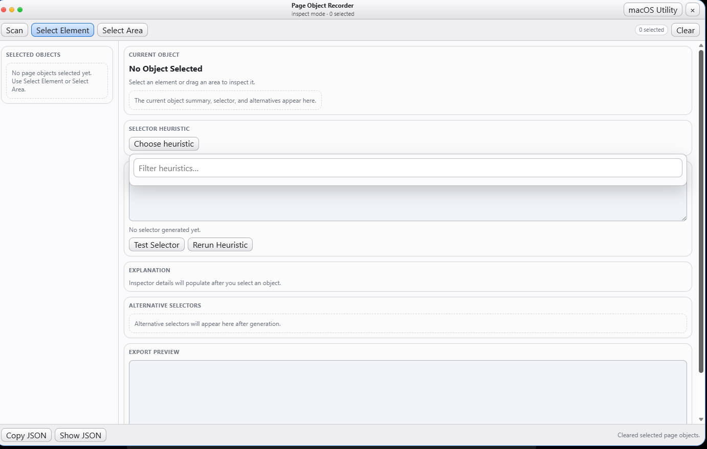
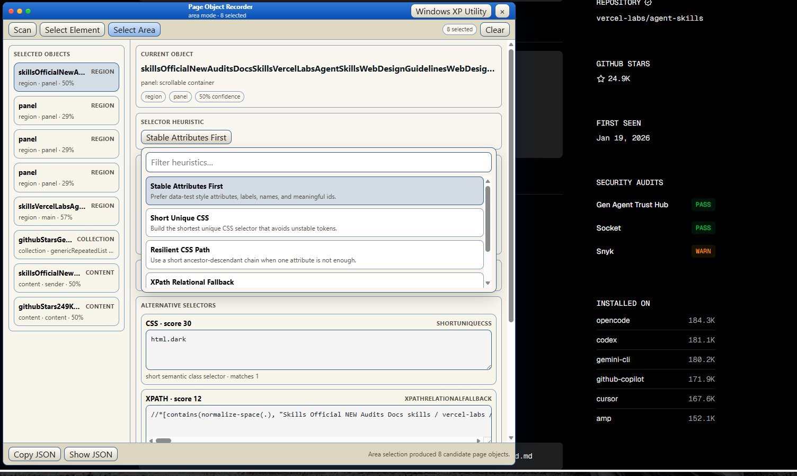
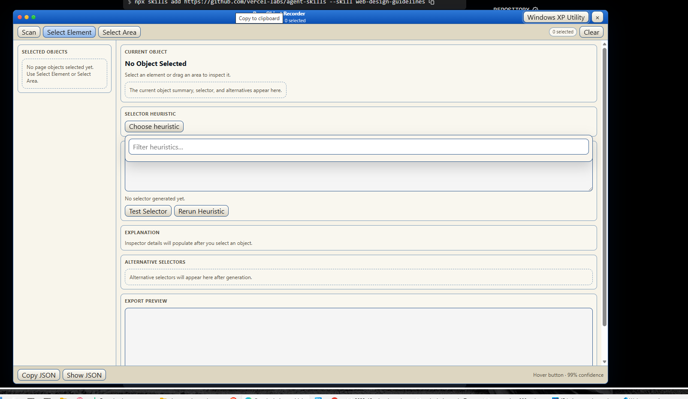
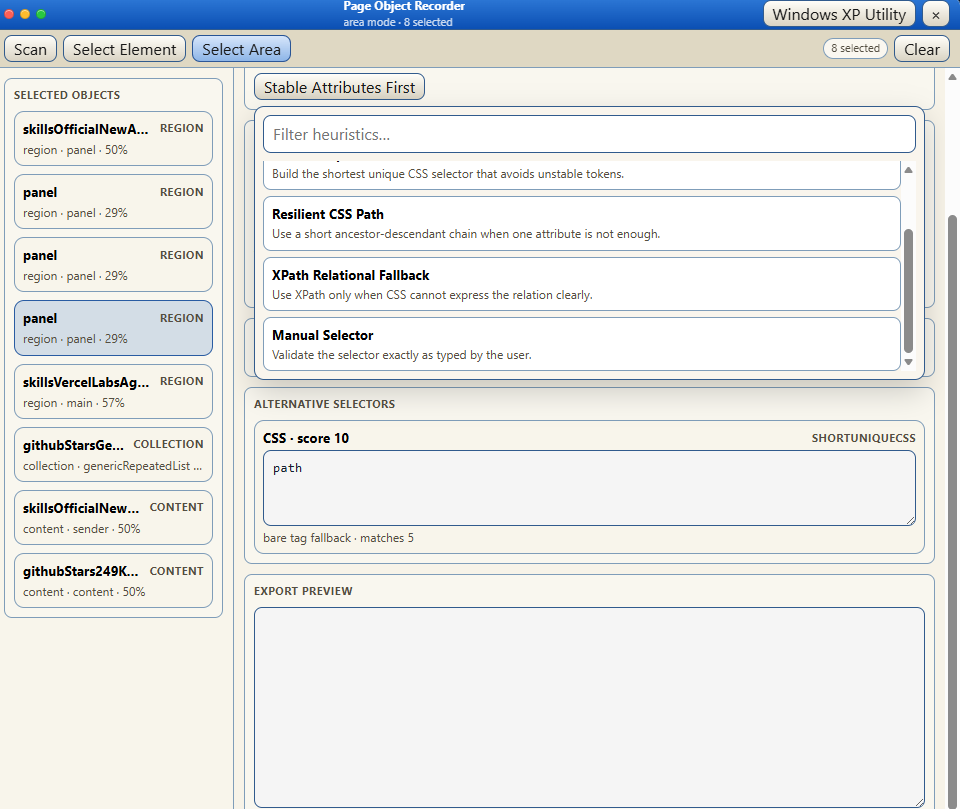

2026-04-12

A00 Change request: selected objects pane and selection UI regressions

B00 Selected objects pane needs redesign

The selected objects pane is currently disorienting. It shows many similar cards with truncated names, repeated type labels, and low-value metadata. The user cannot quickly understand what was selected, which item is active, or whether the selected objects form a useful page-object set.

Redesign this pane as a compact navigator, not as a list of large cards.

Each row should have a stable compact structure: object name, object kind, inferred type, and confidence. Use one-line rows by default. Truncate long names with ellipsis, but show the full name in the details pane or tooltip. The selected row must have a clear active state.

Group objects by meaning where possible: Regions, Controls, Collections, Content. If an object has a parent region, show that relationship with light indentation or a small parent label, but do not create deeply nested visual blocks.

Add lightweight controls for removing one selected object and clearing all selected objects. Avoid making every item visually heavy.

The pane should also show a better empty state. When nothing is selected, say what to do next: "Use Select Element or Select Area to add page objects."

C00 Regression: area selection rectangle is not visible

There is a regression in Select Area mode. The user can drag an area and the tool selects objects, but the selection rectangle is not visually shown during dragging.

Fix this as a high-priority bug.

Expected behavior: after pressing Select Area, mouse down starts a visible rectangle. As the user drags, the rectangle updates immediately. On mouse up, the rectangle disappears or converts briefly into a selection result highlight. Candidate elements inside or overlapping the rectangle should receive temporary visual feedback.

The rectangle must render above the page content but below the tool window. It must be visible on both light and dark pages. It should use a clear border and a translucent fill.

D00 Bug: heuristic filter overlay blocks selector controls

The heuristic filter/dropdown area is visually covering content below it. In the screenshot, the heuristic filter area overlaps the selector/test area, making selector testing inaccessible or confusing.

Fix the dropdown layout.

The heuristic picker should behave as a controlled dropdown or popover. When open, it should either occupy reserved space inside the heuristic section or float above content with correct z-index and clear bounds. It must not accidentally cover unrelated controls such as Test Selector, Rerun Heuristic, explanation text, or selector fields.

If it floats, clicking outside or pressing Escape should close it. If it is inline, the section must expand intentionally and push content down without overlap.

The dropdown must have its own internal scroll area. Its scrollbar should belong to the dropdown only and must not obscure underlying form controls.

E00 Acceptance criteria

Selected objects are easier to scan, with compact rows and a clear active item.

Long selected object names no longer dominate or confuse the pane.

Select Area mode shows a visible drag rectangle during selection.

Area selection provides immediate visual feedback for candidates inside the rectangle.

The heuristic filter no longer covers Test Selector or any other selector controls.

The user can reliably choose a heuristic, edit a selector, test it, and rerun the heuristic without hidden or inaccessible controls.

The title bar looks stretched and under-designed. The title is centered across a huge width, while the controls feel disconnected from the rest of the window.

The macOS-style traffic-light dots appear, but the rest of the layout does not follow a coherent macOS utility-window structure.

The theme button and close button in the top-right compete visually with the title bar instead of feeling integrated into it.

The toolbar row below the title bar is too flat and sparse. The buttons are placed on the left, while selected count and clear are on the right, but the row does not feel like a structured toolbar.

The selected objects sidebar is too narrow compared with the content pane. Object names are truncated so aggressively that most rows are hard to distinguish.

The selected object count is too high for the available sidebar design. The list becomes visually repetitive and difficult to scan.

The vertical divider between the sidebar and main pane is visually awkward. It looks like a scrollbar or accidental gutter rather than a deliberate split-pane divider.

The main content pane has too many nested rounded rectangles. Current object, selector heuristic, dropdown, and alternative selectors all use similar boxes, so hierarchy is unclear.

Long object names are not handled well. They run as a single long clipped line and dominate the current object area.

The heuristic dropdown is expanded directly into the page layout instead of behaving like a controlled popover. It consumes too much vertical space and pushes other content down.

The heuristic dropdown option rows are too tall and too wide. They look like stacked cards instead of a compact selector menu.

The heuristic search input is too large relative to the surrounding control. It feels like a form field inserted into the layout rather than part of a dropdown.

Scrollbars appear in multiple places at once. The selected list, the dropdown, the main content, and selector fields all create competing scroll areas.

The right-side main scrollbar is too visually prominent and close to the content edge.

Horizontal scrolling appears inside selector fields, which is acceptable, but the selector containers are too large and visually heavy.

The alternative selector cards are oversized. A single selector candidate consumes too much vertical space.

Selector heuristic ids such as `SHORTUNIQUECSS` and `XPATHRELATIONALFALLBACK` are visually noisy and should be secondary metadata, not prominent labels.

The bottom footer is too detached from the main layout. It looks like a separate strip added after the fact.

The Copy JSON and Show JSON buttons are too close to the window edge and do not feel aligned with the rest of the layout.

The bottom-right status text is small and low-contrast, but it is still taking footer space. It should be more intentionally placed.

The Windows XP theme screenshot has stronger color but poorer balance. The blue title bar dominates while the body uses a beige tone that makes the layout look dated without becoming clearer.

The macOS theme screenshot is cleaner but too generic. It looks like a light web admin panel rather than a compact utility window.

Both themes have weak spatial rhythm. Margins, section padding, row heights, and control spacing do not follow a clear compact system.

Both themes lack a strong inspector layout. The UI currently reads as a wide form with cards, not as a desktop-style inspector with a navigator pane, detail pane, toolbar, and footer.

The current layout does not make the active task obvious. It is not immediately clear whether the user is selecting, reviewing, editing a selector, or exporting.

The panel needs stronger constraints. Long names, many selected items, dropdown expansion, and selector text must stay contained within their own regions instead of reshaping the entire window.
