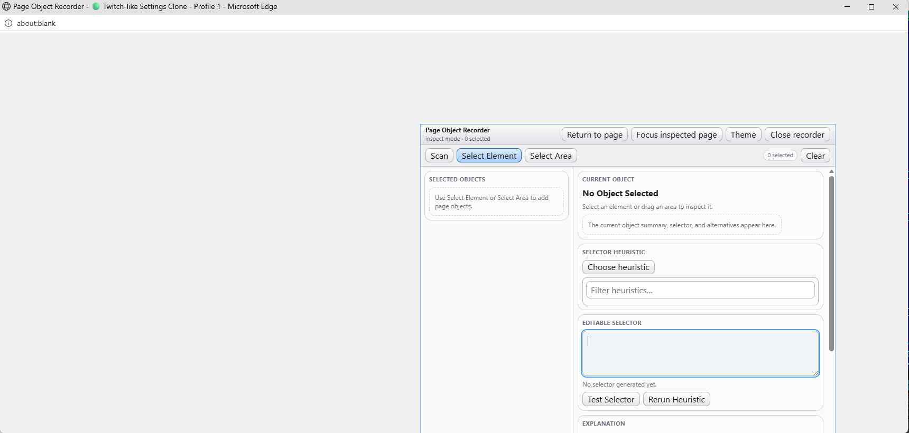
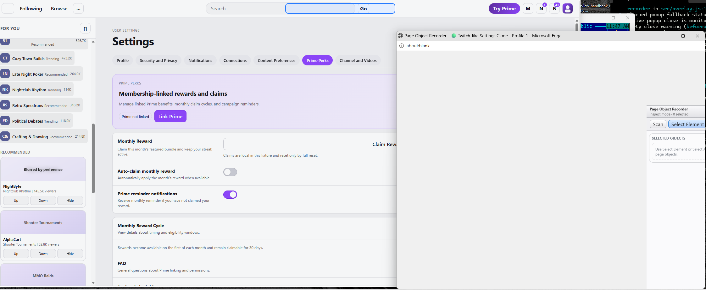

Date: 2026-04-12

Analyze images below:

A00 Core diagnosis

The main problem in this screenshot is that popup mode is still rendering the recorder as if it were an embedded floating window. The popup itself is already the window, but the recorder UI is still being laid out like a smaller panel inside another surface. That is why there is a very large empty gray area on the left and top, and the recorder appears as a boxed panel sitting in the lower-right portion of the popup instead of becoming the popup's actual application layout.

This is the core design error. Popup mode must not reuse the embedded window layout model. It needs its own dedicated full-viewport layout mode.

B00 Issue inventory

Issue 1. The recorder is not using the popup viewport.

In the screenshot, the recorder only occupies a fraction of the popup window. The rest of the window is blank. This strongly suggests that popup mode is still inheriting inline window positioning and sizing logic such as saved `left`, `top`, `width`, and `height`, or it is still mounting into a container that behaves like a floating panel rather than a full-page application shell.

This must be fixed by making the popup root fill the entire popup viewport. In popup mode, the outer application container should be `position: fixed` or `position: absolute` with `inset: 0`, and its width and height should be tied to the popup viewport, not to any remembered inline frame dimensions. The popup must not render at some remembered lower-right coordinate.

Issue 2. Inline window behavior is leaking into popup mode.

The popup already has native browser window chrome. The recorder should not continue to behave like a second fake floating window inside it. Even though the current screenshot already removes the old fake titlebar chrome, the overall layout still behaves like an inline window host. This means the architectural separation is incomplete. The popup host is still effectively rendering the inline frame, only with some pieces removed.

This must be fixed by creating a popup-specific host layout, not an adapted inline layout. Popup mode should have its own root shell, its own header, its own main content grid, and its own footer behavior. The inline frame component should not be reused as the popup's outer container.

Issue 3. The popup has a large unused canvas and poor spatial efficiency.

The entire purpose of popup mode is to free the inspected page from obstruction and then give the recorder a better dedicated workspace. Right now the popup wastes most of its own space. That defeats the feature. The user gains visibility on the inspected page but loses visibility inside the recorder because the recorder is artificially constrained to a small region.

This must be fixed by letting the recorder expand naturally to the available popup width and height. The selected-objects pane, inspector pane, selector editor, and footer controls should all use the popup window as their actual workspace.

Issue 4. The popup appears vertically cramped and likely pushes useful controls below the fold.

In the screenshot, the inspector content already reaches the bottom edge with internal scrolling, and it is likely that some lower controls, such as export-related actions or deeper panels, are now less accessible than they should be. This is usually a symptom of reusing the inline window's fixed-height panel layout instead of designing a full-height application layout.

This must be fixed by using a proper popup page structure with a stable header, stable toolbar, a flexible central content area, and a stable footer. The main content area should have `min-height: 0` and its panes should scroll internally where appropriate. The popup should not behave like a clipped card floating inside a blank document.

Issue 5. The popup document itself is visually unfinished.

The blank gray background and the isolated recorder panel make the popup look like an empty page with a widget pasted onto it, not like a real detached tool window. That makes the feature feel incomplete and unstable even if the underlying state transfer works.

This must be fixed by styling the popup document itself. The popup's `html` and `body` should be explicitly styled, margins removed, height set to 100 percent, and the popup app shell should define the full visual background. The user should never see the browser's default blank-page background around the recorder.

Issue 6. Popup layout is not clearly distinguished from embedded layout.

The current implementation does not yet express the rule that inline mode and popup mode are different presentation modes with different layout behavior. The embedded recorder should remain a draggable, resizable floating utility window because that is correct when it lives inside the inspected page. But popup mode should not preserve those layout assumptions. It should become a normal full-window tool.

This is not only a CSS problem. It is a product-behavior problem and should be fixed as such.

Issue 7. The top controls are still arranged like a compact inline utility bar, not a detached workspace header.

The current popup header row is usable, but it still reads like controls pasted into a reused compact shell rather than a deliberate popup toolbar. "Return to page", "Focus inspected page", "Theme", and "Close recorder" belong in popup mode, but their container should be treated as the popup's real application header, not as a retained fragment from the embedded window.

This should be fixed by giving popup mode a more deliberate header structure: application title and context on the left, primary popup actions on the right, and then a secondary toolbar row below for scanning and mode switching.

Issue 8. The popup likely reuses embedded frame persistence incorrectly.

The screenshot strongly suggests that popup mode is reusing saved embedded geometry or embedded host assumptions. If so, this is a state-model bug. Inline frame persistence and popup window presentation are different concerns and must not share the same frame state.

This must be fixed by separating layout state into two distinct buckets: one for embedded inline frame position and size, and one for popup window bounds or popup layout preferences. The popup host should never consume inline frame coordinates.

C00 What should be removed in popup mode

The following things should be removed or disabled when the recorder is open inside a real browser popup window.

The embedded floating-window positioning model should be removed. No popup layout should depend on inline `left`, `top`, `width`, or `height` values.

The embedded custom outer frame behavior should be removed. That means no draggable outer shell, no resize handles, no viewport clamping for a floating panel, and no logic that tries to keep a fake title bar visible inside the popup.

The embedded outer card presentation should be removed as the top-level layout metaphor. The popup should not look like a smaller window inside a larger window.

Any blank host surface around the recorder should be removed. The recorder should become the popup page, not a child card on a blank page.

D00 What should be kept in popup mode

The following things should stay because they are part of the recorder itself rather than part of the inline host mechanics.

The core session state should stay exactly as it is. Selected objects, current selection, heuristic choices, manual selector edits, test results, export preview state, and theme state must all continue unchanged.

The functional action set should stay. Scan, Select Element, Select Area, Clear, heuristic controls, selector editing, testing, rerunning, export preview, and object navigator behavior all still belong in popup mode.

The popup-specific actions should stay. "Return to page", "Focus inspected page", "Theme", and "Close recorder" are appropriate for the popup host.

The two-pane conceptual layout should stay. It still makes sense to have selected objects on one side and the detailed inspector on the other.

E00 What needs to be added

Popup mode needs a dedicated full-window shell.

The shell should have a real popup header area that spans the width of the window. It should include the recorder title and, ideally, a short context label such as the inspected page title or host so the user always knows what page the popup belongs to.

Below that, popup mode should have a full-width action toolbar for scan and selection modes.

Below that, the main workspace should consume the rest of the viewport with a responsive split layout.

At the bottom, popup mode should have a visible footer or persistent bottom action area for export actions and status.

Popup mode also needs responsive behavior. If the popup is narrow, the two columns should stack vertically. If it is wide, the selected-objects pane should remain narrower and the inspector pane should expand.

Popup mode needs popup-specific document styling. The popup should not rely on default browser body layout.

Popup mode also needs distinct persistence behavior. When reopened, it may restore popup size if desired, but it must not reopen using the old inline panel coordinates.

F00 How the popup should behave when it is open

When the popup opens, the recorder should occupy the popup window immediately and cleanly. The user should not see an empty page with a panel in one corner. The recorder should look like the popup's application, not like a detached widget.

The popup should use the full width of the popup and almost all of its height, with only normal application padding. The top header should remain visible. The toolbar should remain visible. The main workspace should stretch. The selected objects list and inspector panels should scroll internally where needed. The bottom actions and status should remain reachable without awkward clipping.

If the user resizes the popup window, the recorder should reflow naturally. On a wide popup, it should use a side-by-side layout. On a narrow popup, it should collapse into a stacked layout. The popup must always look intentional and complete.

If the user returns the recorder back to the page, the embedded floating-window layout should come back exactly as before. This is important. The embedded layout should remain a floating utility window. The popup layout should be different. The fix is not to replace the embedded layout globally. The fix is to give popup mode its own host behavior.

G00 Concrete layout fix for Codex

Codex should implement popup layout as a separate top-level rendering path.

For the popup document, `html` and `body` should have zero margin, full width, full height, and hidden outer overflow. The popup root should fill the viewport.

The popup app shell should use something like a grid with rows for header, toolbar, main content, and footer. The main content row should be `minmax(0, 1fr)` so it can actually shrink and scroll correctly.

The main content should use a responsive grid. On larger widths it should be `minmax(260px, 320px) minmax(0, 1fr)`. On smaller widths it should collapse to one column.

The selected objects panel and the inspector panel should both have `min-height: 0` so their internal scroll containers can work correctly.

The current outer bordered panel should not be a positioned floating element in popup mode. It should instead be the full app shell itself or one of its major sections.

The popup should have its own subtle page background and internal panel styling so the whole window looks like one cohesive tool.

H00 State and persistence fix for Codex

Codex should split layout persistence into embedded and popup branches.

Embedded mode should keep the existing draggable frame state and continue using inline position and size persistence.

Popup mode should not read that frame state at render time. At most, popup mode may remember popup browser-window bounds if the implementation chooses to reopen popups at a preferred size, but that must be separate from embedded frame positioning.

The existence of the screenshot strongly suggests this separation is not complete yet. Fixing it should be treated as mandatory.

I00 One-by-one fix order for Codex

First, stop popup mode from rendering through the embedded positioned frame container.

Second, introduce a popup-only root shell that fills the viewport.

Third, style the popup document itself so there is no blank browser-default background around the app.

Fourth, restructure popup layout into header, toolbar, main workspace, and footer.

Fifth, make the main workspace responsive and full-height.

Sixth, separate embedded frame persistence from popup presentation state.

Seventh, verify that all existing recorder controls remain usable inside the new popup layout and that nothing important is pushed below the fold.

Eighth, verify that returning inline restores the embedded floating layout rather than the popup layout.

J00 Final expected result

After the fix, the popup should open as a real detached recorder workspace. It should fill the popup window, use the available space efficiently, have no blank unused canvas around it, and no longer look like a smaller embedded window pasted inside a popup page. The embedded mode should remain a draggable floating recorder inside the inspected page. Popup mode should become a dedicated full-window application layout. That separation is the main correction that needs to happen.

---

A00 Context and required review

You are working on the Page Object Recorder popup-window implementation. Before making changes, carefully revisit the file "suggestions013.md" and treat it as required review material. Re-read it in full, compare it against the current implementation, and use it together with the current code and the current popup screenshot behavior to drive your fixes. Do not assume the current implementation is structurally correct just because it partially works. The current popup behavior still has major layout and host-separation issues, and all of them must be fixed.

B00 Goal

The goal is to fully fix the detached popup-window mode while preserving the correct behavior of the inline embedded mode. If the existing layout handling, host rendering, or state-transfer structure is not sufficient, redesign or rewrite it. Do not patch around the symptoms if the real problem is that popup mode is still reusing embedded inline layout behavior. We need a correct solution for both modes: the inline embedded recorder inside the inspected page, and the detached recorder in a real browser popup window.

C00 What is currently wrong

The current popup implementation still behaves like an embedded floating panel rendered inside a blank popup page instead of behaving like a real detached recorder workspace. The popup does not properly occupy the popup viewport. It appears as a smaller boxed panel with a large empty gray area around it. This means popup mode is still inheriting or leaking embedded layout logic, such as positioned frame behavior, remembered inline sizing or placement, or an inline-shell rendering model. That is the core bug and it must be fixed at the architectural level, not just cosmetically.

D00 Required product behavior

When the recorder is embedded inline inside the inspected page, it should remain a floating utility window with the expected embedded behavior. That means the embedded mode keeps its own frame logic, embedded host styling, and placement behavior appropriate for an in-page tool window.

When the recorder is opened in a real browser popup window, it must stop behaving like an embedded floating window. Popup mode should use the popup window itself as the outer window. The recorder should fill the popup viewport and present itself as the popup's application layout. It must not render another fake floating window inside the popup. It must not leave large unused blank space around the tool. It must not depend on embedded inline frame coordinates, embedded frame sizing, embedded drag behavior, or embedded resize handles.

E00 Mandatory review and diagnosis work

Start by comparing the current implementation with the expected popup behavior described in "suggestions013.md". Then inspect which parts of the current rendering pipeline, layout state, and host composition are still shared incorrectly between embedded mode and popup mode. Explicitly determine whether popup mode is still reading embedded frame state, still rendering through an embedded frame container, or still mounting into a layout path that was originally designed only for the inline host. Document your findings in the implementation summary.

F00 Mandatory fix scope

All popup issues must be fixed. Do not leave partial layout defects behind. If a redesign or rewrite of layout handling is needed, do it. If host rendering must be split more cleanly into embedded and popup hosts, do it. If state persistence must be separated into embedded layout state and popup layout state, do it. If some current component structure is causing mode leakage, refactor it. The final result must be a correct two-mode system rather than one mode awkwardly stretched to cover both cases.

G00 Concrete issues that must be fixed

First, the popup must occupy the full popup viewport. There must be no large blank area around the recorder. The popup root should fill the popup window.

Second, popup mode must no longer render through an embedded floating-frame layout. The popup is already a real browser window, so the recorder in popup mode must become the popup's application layout rather than a panel placed inside that window.

Third, popup mode must no longer use embedded frame positioning, sizing, drag logic, resize handles, or viewport clamping rules. Those are embedded-mode concerns only.

Fourth, the popup document itself must be styled as a complete application surface. There must be no default blank browser page around the recorder. The popup window should look finished and intentional.

Fifth, the popup layout must be restructured into a proper full-window app layout with a real popup header, toolbar, main workspace, and bottom action or status area as appropriate.

Sixth, the main workspace in popup mode must use the available width and height correctly. The selected-objects pane and inspector pane must behave like application panes, not like content inside a clipped card. Internal scrolling must work properly.

Seventh, popup mode must be responsive. If the popup is wide, it should use a side-by-side layout. If it is narrow, it should stack or adapt gracefully.

Eighth, the popup should continue to expose popup-specific actions such as returning to the page, focusing the inspected page, theme, and close recorder, but those actions should live in a deliberate popup header or toolbar rather than in a reused embedded shell.

Ninth, embedded mode must continue to work correctly after the refactor. The fixes must not break the inline floating recorder. Inline and popup are separate presentation modes and both must remain correct.

H00 Layout and rendering rules

Treat embedded mode and popup mode as distinct host environments with distinct top-level layout behavior.

Embedded mode should keep the current mental model of a floating utility window inside the inspected page. Preserve the in-page framed presentation there.

Popup mode should use a dedicated popup host shell that fills the popup document. The popup shell should own the full viewport. The browser's native popup window frame should be the only outer window chrome. Do not render an inner fake window frame in popup mode. The popup should feel like a detached recorder workspace, not like an embedded recorder rendered on a blank page.

I00 State and persistence rules

Keep the recorder session state continuous across both modes. Selected objects, current selection, selector edits, heuristic choices, export visibility, status, theme, and other session state must remain preserved when switching between embedded and popup modes.

At the same time, separate layout persistence between the two modes. Embedded frame position and size belong only to embedded mode. Popup layout or popup window behavior belongs only to popup mode. Popup mode must not reopen using embedded coordinates or embedded frame dimensions.

J00 Implementation to-do list

Task 1: Revisit "suggestions013.md" carefully and compare it line by line against the current popup implementation and the current screenshot behavior.

Task 2: Identify exactly where popup mode still reuses embedded host layout logic, embedded frame state, embedded positioning, or embedded shell rendering.

Task 3: Refactor the host rendering structure so embedded mode and popup mode have clearly separated top-level layout behavior.

Task 4: Implement a dedicated popup root shell that fills the popup viewport and removes the blank surrounding canvas.

Task 5: Style the popup document itself so the recorder becomes the popup's application surface rather than a widget inside an empty page.

Task 6: Redesign the popup layout into a proper full-window tool layout with a popup-specific header or toolbar, a flexible main workspace, and correct internal scrolling behavior.

Task 7: Remove any embedded-only behaviors from popup mode, including fake frame assumptions, drag model, resize handles, viewport clamping, and dependence on embedded saved frame state.

Task 8: Preserve and validate the embedded inline mode so it still behaves as an in-page floating recorder after the refactor.

Task 9: Verify that switching between embedded and popup mode preserves session state and does not corrupt layout state.

Task 10: Verify that popup mode uses space efficiently, looks intentional, and continues to provide all recorder functionality.

K00 Acceptance criteria

The work is complete only when popup mode opens as a real detached recorder workspace that fills the popup window and no longer appears as a smaller embedded panel inside a blank popup page. There must be no large unused gray or blank area around the recorder.

The work is also complete only when embedded mode still behaves correctly as an in-page floating recorder. The same codebase must support both presentation modes correctly.

The work is not complete if the result still mixes popup mode and embedded mode at the top-level layout layer, still reuses embedded geometry in popup mode, still looks like a widget pasted onto a blank page, or still requires further manual intervention to become usable.

L00 Implementation approach guidance

Use your best judgment. If this can be solved with a focused host-layout refactor, do that. If it requires a broader redesign or rewrite of layout handling, do that. Prefer a clean structural fix over incremental hacks. The target is a correct two-mode architecture, not a cosmetic patch.

When you finish, provide a concise implementation summary explaining what was wrong, what was changed, how popup and embedded host behavior are now separated, and how the issues identified from "suggestions013.md" were addressed one by one.

---

M00 Implementation diagnosis and fix summary (completed)

Diagnosis findings against previous implementation:

1. Popup mode still reused embedded frame styles.
- Root cause: inline `left/top/width/height` styles on the recorder window remained on the shared window node when host mode switched to popup.
- Effect: popup CSS could not fully take over due inline style precedence, so the recorder appeared as a small panel with large blank canvas.

2. Popup and embedded top-level layout behavior were not fully separated.
- Root cause: host mode switched datasets, but embedded geometry styles were not explicitly cleared and popup document surface was only partially normalized.
- Effect: popup still looked like embedded shell behavior pasted into a blank popup document.

3. Popup document surface styling was incomplete.
- Root cause: popup `html/body` did not fully enforce full-size + overflow constraints as an app surface.
- Effect: blank default-page feel around the recorder.

Implemented structural fixes:

1. Separated host-mode geometry application in `src/overlay.js`.
- Added `clearWindowFrameStyles()`.
- `applyHostModeUi()` now branches:
  - popup mode: clears embedded frame styles (`left/top/width/height`).
  - inline mode: reapplies clamped embedded frame geometry.
- Popup mode no longer consumes embedded frame coordinates for rendering.

2. Strengthened popup document as full application surface in `src/overlay.js`.
- `preparePopupDocument()` now sets popup `html/body` margin, width/height, and overflow to full-window app behavior.
- Added deliberate popup background treatment so the popup reads as an intentional tool surface.

3. Strengthened popup top-level layout in `src/ui/styles.js`.
- Popup host mode now forces full-viewport app layout (`position: fixed; inset: 0; width/height: 100vw/100vh; border: 0; no shadow`).
- Popup rows are explicit app rows (header, toolbar, flexible main, footer).
- Popup main workspace gets full-height responsive pane behavior and proper internal pane surfaces.
- Inline-only fake chrome and resize handles remain removed in popup mode.

4. Preserved embedded mode behavior.
- Inline mode still uses clamped draggable/resizable frame behavior.
- Returning from popup restores inline geometry correctly and preserves recorder session state.

Validation and regression protection:

1. Updated popup integration coverage (`test/dom/overlay-popup.test.js`):
- Assert popup mode clears frame inline styles.
- Assert popup document is full-surface styled (`overflow: hidden` on `html/body`).
- Assert return-inline preserves selected-session state and restores inline frame styles.

2. Full suite validation:
- `bun test` -> pass (95/95)
- `bun run build` -> pass

Outcome:
- Popup mode now behaves as a detached recorder workspace host rather than an embedded floating panel model.
- Embedded and popup modes now have separated top-level layout behavior while sharing one continuous recorder session state.
