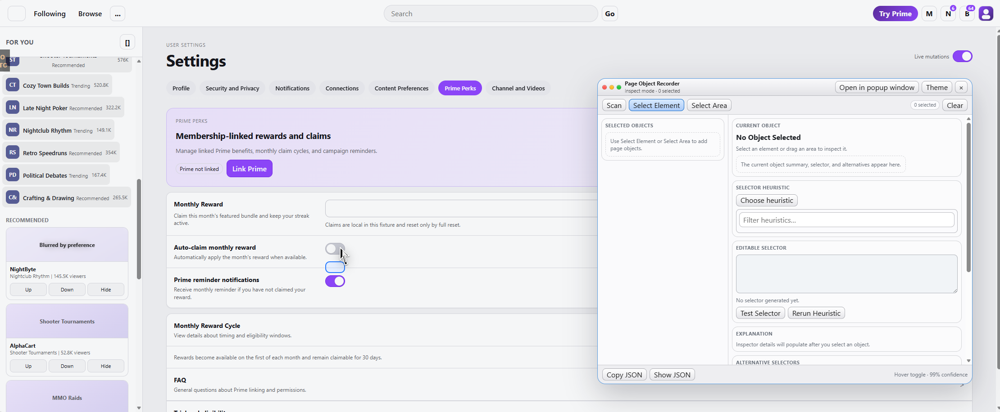
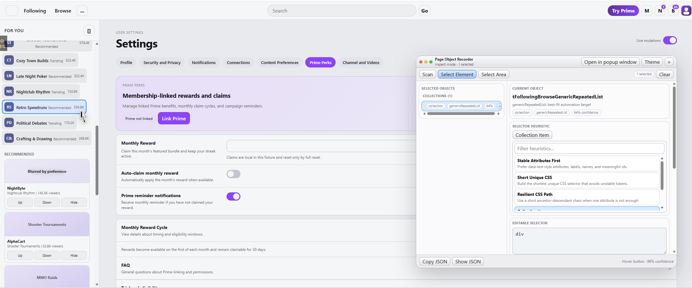
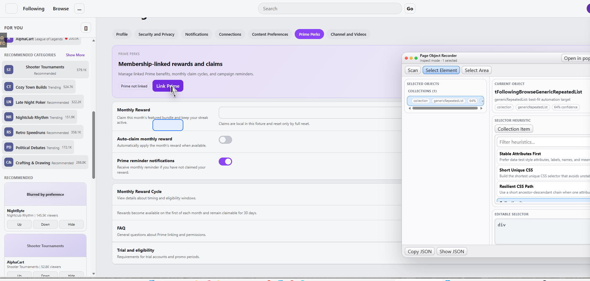
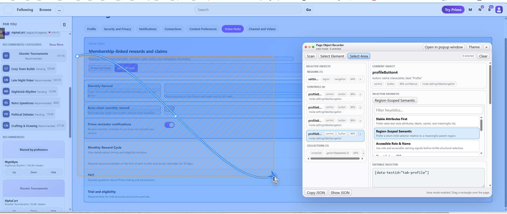

Date: 2026-04-12

# suggestions014.md

## A00 Purpose

This change request addresses a new set of issues that became visible after the popup-window work was fixed. The popup and embedded host separation is now in a much better place, but two important interaction problems remain.

The first problem is highlight accuracy. The blue highlight that is supposed to represent the current target element is often offset by several pixels or even by a much larger distance. It can appear below the real target, detached from the hovered element, or stale after layout changes and scroll. This makes inspection unreliable and visually confusing.

The second problem is area selection quality. When the user draws a selection rectangle, the recorder often includes elements that the user clearly did not intend to select. In the screenshots this appears as the selection or resulting highlight expanding to very large containers, page-level ancestors, or unrelated elements outside the user's intended local scope. The current behavior feels broad and unstable, while the user expectation is narrow and surgical.

Codex should treat this as a behavior-correctness issue, not as a minor visual polish task. If fixing it requires refactoring, redesigning, or re-architecting the selection and overlay logic, that is allowed and expected.

## B00 Observed issues from the screenshots

The screenshots show that the blue highlight is not reliably anchored to the actual element under the cursor or the actual selected element. In one case a small control is hovered but the blue outline appears lower than the real control. In another case a different control appears to be highlighted than the one the cursor position suggests. In other cases the highlight seems to lag behind the page layout or use stale geometry.

The screenshots also show that area mode can over-select. A user can drag over a local block of content, yet the recorder may end up selecting a much larger ancestor or a broad page region. In the final screenshot, the orange selection rectangle covers a bounded content area, but the resulting blue overlay extends across a very large page-level surface. That is a strong sign that area selection is currently driven by overlap or ancestor promotion rules that are too permissive.

There is also an implied state-coherence issue. The UI shows one current object in the inspector, the status line may refer to another hovered element, and the visible highlight may correspond to neither in a reliable way. Even if some of that is technically expected because hover state and selected state are different, the current presentation is not clear enough and does not feel trustworthy.

## C00 Problem 1: highlight positioning is not live and exact

The blue highlight must be treated as a live geometry overlay, not as a cached artifact from an earlier scan. The user expectation is strict: the highlight should always sit directly on top of the real element that it represents. If the page scrolls, the highlight must move with the element. If the layout shifts, the highlight must move with the element. If live mutations change the layout, the highlight must still remain correct. The highlight may never stay behind in an old position.

The current behavior strongly suggests that the implementation is either caching `boundingRect` values for too long, or using scan-time geometry to render runtime overlays, or failing to re-read geometry after scroll and layout changes. That entire approach must be corrected.

## D00 Required highlighter behavior

When the user hovers a target in inspect mode, the hover highlight must be drawn from the target element's current live geometry at the time of paint. It must not reuse stale scan-record geometry if the page has moved or changed since the scan.

When the user selects an object, the selected-object highlight must also be based on the element's current live geometry. The selected-object highlight should remain correct while the user scrolls, while content expands or collapses, and while live mutations occur.

If the page uses nested scroll containers, the highlight must still remain correct. This means the overlay system cannot assume that only the top-level document scroll matters. It must respond to the real element position in the viewport.

If the page uses transformed elements, sticky elements, or responsive layout changes, the overlay must still use the actual current `getBoundingClientRect()` result and render from that.

The highlight layer should be visibly above the target element and should not allow accidental pass-through clicks while inspection workflows are active. If the user is in inspect mode or area mode, clicks that land on the visual highlight region should not activate the underlying page control. The overlay should function as a protective interaction shield during selection workflows. Outside active inspection workflows, normal page interaction can resume according to product needs.

## E00 Required architectural fix for highlight rendering

Codex should stop treating geometry as persistent data for overlay rendering. Persistent state may still store feature summaries, but the actual overlay rectangles must be derived from live DOM references whenever the overlay is shown or updated.

The recommended model is to separate semantic state from visual geometry. Semantic state can continue to store selected object ids, feature metadata, and inference results. Visual geometry should be recomputed on demand from the real element reference.

A dedicated overlay coordinator should own all runtime overlays. It should maintain clear roles for hover highlight, selected-object highlight, area rectangle, candidate previews, and any page dimming layer. Each overlay should have explicit z-order and explicit update rules.

The overlay coordinator should update live geometry on at least these triggers: pointer move during inspect mode, scroll, resize, mode changes, selection changes, and layout changes caused by DOM mutation or element resize. Codex should use best judgment about the exact implementation, but a combination of `requestAnimationFrame`, `ResizeObserver`, nearest-scroll-container listeners, and explicit recomputation on state changes is likely more robust than relying on old scan results.

If the current architecture makes it hard to keep stable element references alive through selection, Codex should refactor the selected-object model so that the runtime keeps a safe element handle or a re-resolve strategy for active visual targets.

## F00 Problem 2: area selection is too broad and selects the wrong things

Area mode should behave like a surgical capture tool. The user is drawing a rectangle to communicate intent. The recorder should interpret that intent narrowly and carefully. It should not jump to page-level ancestors unless the rectangle clearly expresses that intent. It should not include arbitrary large containers just because they partially overlap. It should not treat "any overlap at all" as enough for inclusion.

The current behavior appears to be over-rewarding intersection and ancestor strength. That makes sense for some inference tasks, but it is too aggressive for user-driven area selection. Area selection must be a different mode with a different contract. In this mode, user geometry should dominate. Heuristic promotion should happen only after the selection is first narrowed to plausible candidates inside the chosen area.

## G00 User expectation by example

### G01 Scenario 1: selecting a single small button

I want to capture one button. I drag a tight rectangle around that button. I expect the recorder to select that button and perhaps its directly associated text if that text is visually part of the same control. I do not expect the surrounding card, the full row, or the entire page section to be selected just because they overlap slightly.

### G02 Scenario 2: selecting a button with a nearby label

I drag across a button and the text label that sits immediately next to or below it. I expect both to be treated as part of one local selection. I do not expect the full-width container that happens to wrap that label to be selected unless the container itself is clearly what I enclosed.

### G03 Scenario 3: selecting one row in a repeated sidebar list

I drag across one repeated list row in a sidebar. I expect the recorder to capture that row or identify it as an item of a repeated collection. I do not expect the whole sidebar, the whole navigation region, or the entire page layout to be selected just because the row lives inside those ancestors.

### G04 Scenario 4: selecting multiple sibling controls in one settings block

I drag across two or three sibling controls in a settings section. I expect the recorder to keep those local controls and maybe infer a shared parent region if the parent tightly wraps them. I do not expect an unrelated upper tab bar, sidebar, or page root to be included.

### G05 Scenario 5: selecting content inside a wide block element

I drag around the visible text content of a wide full-width label or summary block. Even if the actual DOM element spans the full available width, I still expect the recorder to understand that my intent was local to the visible content, not the full page width. The selection logic must not blindly trust the outer block box in cases where the visible content footprint is much smaller than the DOM box.

### G06 Scenario 6: selecting a card inside a grid or feed

I drag around one card in a repeated set of cards. I expect the recorder to either select that card or recognize it as a repeated item instance. I do not expect the entire grid container to be selected unless I clearly drag over most of the grid.

### G07 Scenario 7: selecting an entire panel on purpose

I drag a large rectangle that closely matches a full settings panel or content block. In this case I do expect the recorder to recognize the panel as a region. The key difference is that the rectangle clearly covers the panel bounds rather than only clipping a few children inside it.

### G08 Scenario 8: selecting while the page has been scrolled

I scroll the page and then draw a selection rectangle. I expect the area selection to work exactly as if I had never scrolled. The selection rectangle, candidate detection, and resulting highlights must all align to the visible viewport correctly.

### G09 Scenario 9: selecting in a page with live layout changes

A page may update dynamically while I am inspecting it. Even then, if I drag a rectangle over a local area, I expect the recorder to capture what is visually inside that area at that moment. I do not expect stale layout data to cause the wrong elements to be selected.

### G10 Scenario 10: selecting around a mixed block of text, labels, and controls

I drag over a small cluster that contains a heading, a label, and a button. I expect the recorder to select the meaningful local items inside the cluster and possibly infer a coherent local region if the cluster is tight. I do not expect it to jump to a giant ancestor that contains many other unrelated children outside my rectangle.

## H00 Selection principles

Area selection must be governed by user intent first, inference second.

The first phase should determine which elements are actually plausible members of the selected area. This phase should be strict. It should reject obviously oversized ancestors and obviously unrelated overlaps.

The second phase may infer higher-level meaning from the filtered set. This is where region or collection promotion can happen. That promotion should only happen from a clean candidate set, not from every element that intersected the rectangle.

The third phase should validate the final set and suppress objects that still look too broad, too weakly related, or too inconsistent with the local scope.

## I00 Proposed area-selection algorithm

Codex should feel free to redesign the current area-selection algorithm. A recommended model is a staged pipeline.

Stage one should collect candidate elements using live geometry from the real DOM at drag end, not stale scan-time rectangles.

Stage two should compute multiple measures for each candidate, not just raw overlap. At minimum the algorithm should consider full containment, center-point inclusion, overlap ratio relative to the element, overlap ratio relative to the selection, and area ratio between the candidate and the selection.

Stage three should apply hard exclusions. Extremely large ancestors, including `body`, page root, or very large layout wrappers, should be excluded by default unless the selection rectangle itself is very large and intentionally matches them. A small or medium local selection should almost never produce a page-level ancestor.

Stage four should prefer tightly matched descendants over loosely overlapping ancestors. If an ancestor intersects the rectangle but several of its descendants are much better contained, keep the descendants and suppress the ancestor.

Stage five should apply special handling for full-width block elements and oversized text containers. In those cases the algorithm should consider a content rect or visible content footprint rather than relying only on the outer CSS box. Codex may use text-range geometry, child-content union, or another robust approximation. The exact implementation can vary, but the goal is to avoid selecting a huge block element merely because its text happens to fall under the user's rectangle.

Stage six should allow promotion to region or collection only when the local evidence is strong. For example, if several included siblings belong to the same tightly wrapping parent, that parent may be promoted to a region candidate. If several included siblings have repeated structure, the set may produce a collection candidate. Promotion must not ignore the original scope of the user's drag.

Stage seven should validate the final result and suppress outliers. If one candidate is far larger than the rest, only weakly overlaps, or introduces obvious scope expansion, it should be dropped.

## J00 Concrete heuristics for inclusion and exclusion

Codex should treat the following heuristics as the starting policy for area mode.

An element that is fully inside the selection rectangle is a strong candidate.

An element whose center point is inside the selection rectangle is a medium candidate, but only if the element is not dramatically larger than the rectangle.

An element that merely clips the rectangle at one edge should usually be excluded unless it is a small control and the overlap is still substantial.

An ancestor that is much larger than the selection should be strongly penalized or excluded, especially if there are better-contained descendants.

`html`, `body`, top-level page wrappers, and giant content shells should never be automatically selected from ordinary local area drags unless the user almost completely enclosed them.

Repeated items should be preferred over the list container when the user's rectangle clearly targeted one item or a few items.

A parent region should only be promoted when the rectangle closely matches the parent bounds or when the selected descendants together strongly imply that parent as the intended region.

Wide text blocks, labels, and wrappers should be evaluated using a visible-content rect heuristic when their outer box is much larger than their visible local content.

Interactive controls deserve slightly more lenient inclusion than generic containers. If a control is mostly within the drag or if its center is within the drag, it is often reasonable to keep it.

Generic containers deserve stricter inclusion than controls. They should not be selected just because they intersect somewhere.

## K00 Visual behavior during area selection

The orange selection rectangle should represent what the user is actively drawing.

While the user is dragging, preview highlights should show only plausible candidates, not every intersecting element. The preview should already apply most of the filtering logic, so the user sees a trustworthy approximation of what will be captured.

When the drag ends, the final selected highlights should remain only on the chosen elements. If a giant ancestor would have been selected under the old logic, it should now be absent unless the user's drag clearly justified it.

If hover state, selected state, and area-preview state are all present at once, their visuals must be clearly differentiated. The user should always be able to tell which object is hovered, which objects are already selected, and which candidates are merely being previewed for the current drag.

## L00 Required changes to tests

The test suite has already been extended in this area, and it should be expanded further to lock down the new behavior.

Add data-driven cases for highlight alignment under ordinary hover, after page scroll, inside nested scroll containers, after layout mutation, and after selection state changes.

Add data-driven area-selection cases for a single small control, a button plus label pair, a repeated list row, a card in a grid, a local group of sibling controls, a wide full-width text wrapper, a large panel intentionally selected, and a local drag that must not select the page root or a giant ancestor.

Add negative tests proving that partial overlap alone is not enough for inclusion.

Add tests proving that oversized ancestors are suppressed when better descendants exist.

Add tests proving that content-footprint heuristics allow visually local selection inside wide block elements.

If the current architecture makes those tests hard to write, that is a sign that the implementation needs refactoring.

## M00 Refactor and redesign permission

Codex should not hesitate to refactor, rewrite, or re-architect any part of the selection or overlay pipeline that is currently preventing correct behavior.

If the recorder currently mixes scan-time feature extraction with runtime overlay geometry in a way that causes stale highlights, separate those concerns.

If the area-selection logic is currently too entangled with general inference rules, split it into a dedicated user-intent selection pipeline.

If selected-object data structures are too geometry-centric and cannot preserve live element linkage, redesign them.

If overlay rendering is currently spread across too many ad hoc functions, centralize it behind a dedicated runtime overlay controller.

A deeper structural fix is preferred over local patches that still leave the behavior fragile.

## N00 Acceptance criteria

The work is complete only when the blue highlight is always visually aligned with the actual target element, even after scroll, resize, mutation, or dynamic layout changes.

The work is complete only when the overlay no longer uses stale geometry and no longer drifts away from the real element.

The work is complete only when clicks do not accidentally pass through active inspection overlays and trigger underlying controls during inspect or area-selection workflows.

The work is complete only when area mode feels narrow and intentional. A local drag should produce local results. Giant ancestors and page-level wrappers must no longer be selected from ordinary local selections.

The work is complete only when full-width labels or oversized text containers are handled intelligently rather than causing massive accidental selection.

The work is complete only when tests exist that protect the new highlighter and area-selection rules from regression.

## O00 Final instruction to Codex

Review the screenshots carefully and treat them as evidence of two real failures: stale or incorrect geometry for highlights, and over-broad selection semantics in area mode. Fix both classes of issues completely. Use best judgment. Refactor where needed. Do not preserve the old behavior just because it was simpler. The target is a recorder that feels exact, stable, and trustworthy when the user hovers, selects, scrolls, and drags across real pages.

---

P00 Implementation status (completed)

Implemented outcomes:

1. Live highlighter geometry (no stale scan-rect rendering)
- Hover highlight now paints from live `getBoundingClientRect()` instead of cached scan geometry.
- Selected-object highlights were added as a separate live layer and refresh from current DOM geometry.
- Overlay geometry is refreshed on pointer updates, scroll (including nested scroll events), resize, and DOM/layout mutation triggers.

2. Overlay role separation and visual clarity
- Distinct overlay roles now exist for hover highlight, selected highlights, area drag rectangle, and area preview candidates.
- Area preview visuals are now differentiated from hover/selected visuals.

3. Area-mode intent pipeline refactor
- `analyzeAreaSelection` was redesigned into a staged intent-first filter/rank pipeline.
- Candidate selection now uses live geometry and multi-signal scoring (containment, center inclusion, overlap ratios, area ratio).
- Hard exclusions suppress page-level and oversized broad ancestors for local drags.
- Descendant preference suppresses broad ancestors when better local descendants exist.
- Content-footprint handling was added for wide text wrappers.
- Collection promotion is now derived from filtered local candidates and weighted by local sample evidence.

4. Interaction shielding during active workflows
- Inspect-mode pointer/click flow prevents accidental pass-through activation of underlying controls.
- Area-mode drag entry keeps preventing pass-through pointerdown behavior.

5. Tests added and expanded
- Added `test/dom/overlay.live.test.js` for live hover/selected alignment, nested scroll updates, and click shielding.
- Added `test/dom/regions.intent.matrix.test.js` for surgical area-intent behavior and oversized suppression cases.
- Extended fixture support in `test/dom/fixtures/matrix-fixtures.js` for nav-row targeting and wide-wrapper scenarios.
- Existing overlay and regions matrix tests remain passing.

Validation:
- `bun test` -> pass (105/105)
- `bun run build` -> pass

Notes:
- Embedded and popup host behavior from prior fixes remains intact.
- This pass focused specifically on geometry correctness and area-intent semantics requested by suggestions014.
