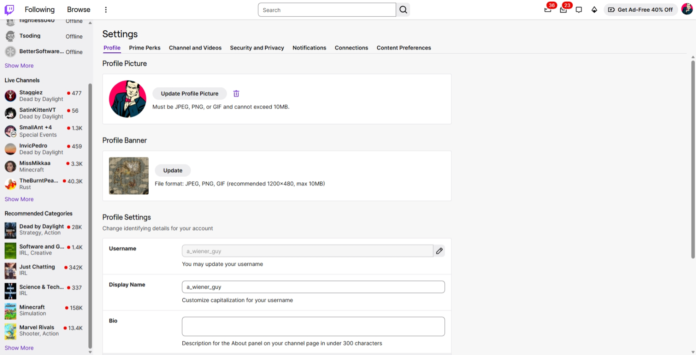
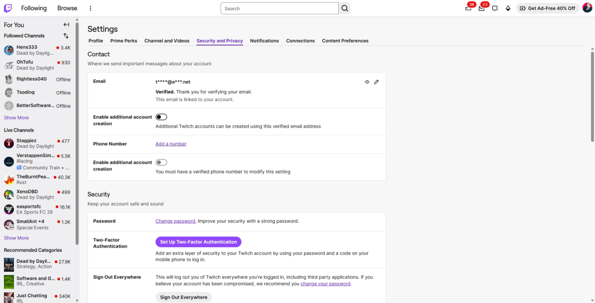
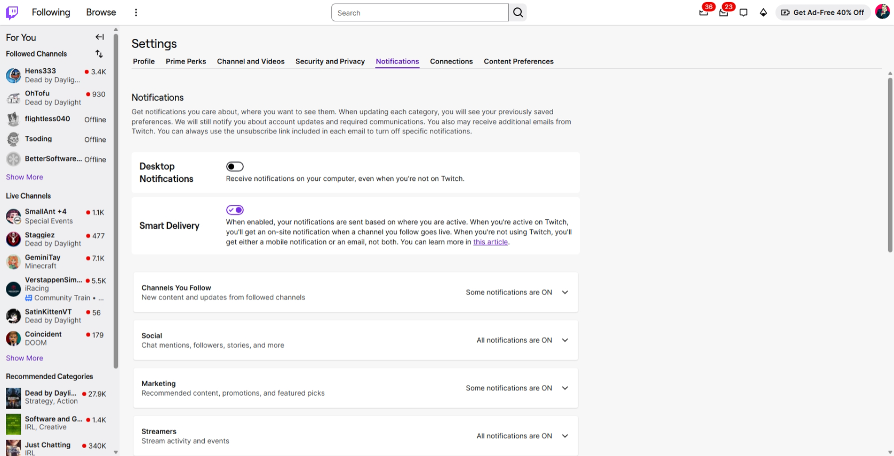
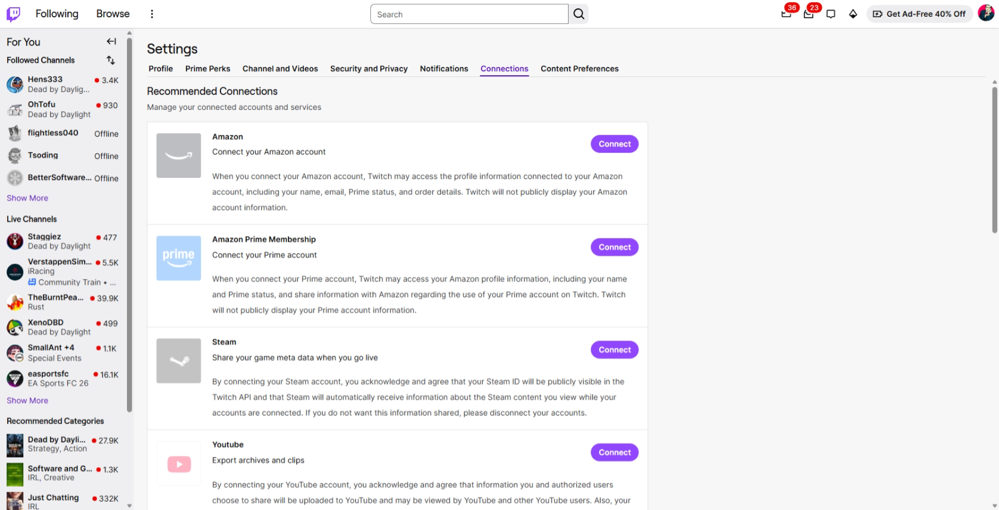
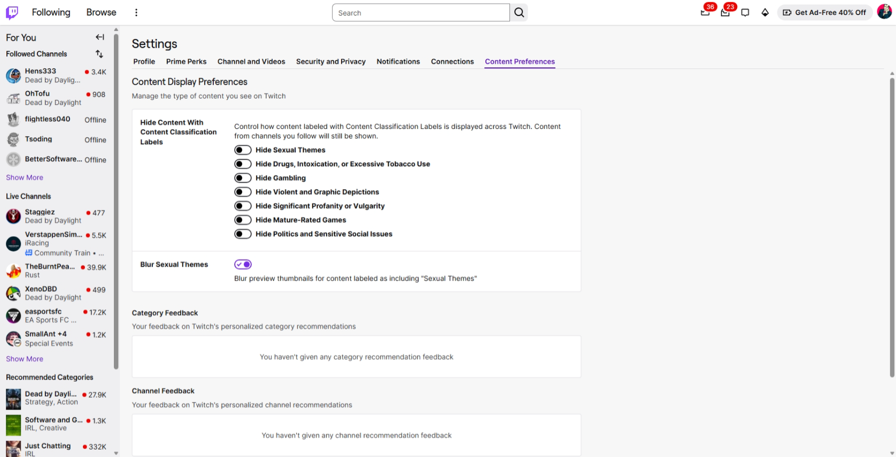

A00 Objective

Build a high-fidelity local clone of the Twitch Settings experience as a single-page application intended for browser automation, UI agent evaluation, selector testing, screenshot comparison, and general interaction stress testing. The target is not a feature demo and not a backend product. The target is a dense, realistic, production-like web surface that reproduces the complexity, layering, navigation, visual rhythm, and interaction patterns visible in the provided screenshots.

The clone must feel like a real settings area from a large consumer web product. It must include a global top bar, a persistent left navigation rail with multiple content groups, a horizontally tabbed settings sub-navigation, a large scrollable content area, multiple control types, nested cards, disabled states, expandable groups, toggles, text inputs, pseudo-upload actions, pseudo-security actions, recommendation and feedback surfaces, and data that appears alive. The experience must preserve local state while navigating between tabs and while reloading the page.

The implementation must use only modern HTML, modern CSS, and modern vanilla JavaScript. No framework, no build step, no runtime dependency, no CDN dependency, and no server are required. The page must run directly from a local folder. The visual and interaction result should be close enough that a human can reasonably describe it as a Twitch-like settings clone, while the codebase remains self-contained and optimized for testing rather than authenticity.

B00 Product intent and why this page exists

This page exists as a reusable testing playground. The most important requirement is not any single individual control. The important requirement is the total complexity of the page. The settings area must provide a challenging environment for software that inspects, navigates, clicks, types, scrolls, expands, filters, and observes UI state changes.

The clone must therefore emphasize real-world friction. It should include long scrolling containers, sticky regions, repeated but not identical card layouts, multiple navigation systems on one screen, elements whose labels are visually similar, controls that become enabled or disabled based on other choices, items with small click targets, focus transitions, content that changes at runtime, and state persistence that survives navigation. This is the core value of the implementation.

The application must be usable as a stable fixture for repeated testing, but it must also include optional variability. In one mode it should be deterministic and fully reproducible. In another mode it should generate fresh but believable data on each load. This dual behavior is important because one class of tests benefits from absolute stability, while another class benefits from realistic variation.

C00 Fidelity model

Fidelity must be highest for the areas visible in the screenshots. These include the global shell, the left rail, the settings tab bar, the Profile page, the Security and Privacy page, the Notifications page, the Connections page, and the Content Preferences page.

For areas not shown in the screenshots but visible in the tab bar, such as Prime Perks and Channel and Videos, the application must still implement complete pages so that the settings system feels whole. Those pages may be plausible Twitch-like approximations rather than screenshot-accurate reproductions. The spec should distinguish between screenshot-backed fidelity and inferred fidelity. Screenshot-backed pages must match layout and behavior closely. Inferred pages must match the same design language, density, spacing system, component vocabulary, and interaction quality so they do not feel like placeholders.

The clone must not degrade into a wireframe. It should look finished, with consistent typography, borders, hover states, active states, disabled styling, shadows where appropriate, and meaningful spacing. The aim is not pixel-perfect legal replication. The aim is production-grade mimicry of the user experience.

D00 General interaction philosophy

The application must behave like a mature single-page settings surface. Navigation between tabs should not perform full page reloads. It should update the URL using either the History API or a stable hash-based route system. Back and forward navigation must work. The active tab state must always be reflected in the URL so test software can deep-link directly to specific pages.

All setting changes must update the in-memory state immediately and persist to localStorage with debounced writes. On refresh, the UI should restore the prior state. The persistence model should cover active tab, scroll positions per page, toggle values, text input values, expand and collapse states, pseudo-uploaded asset choices, dismissal state for optional notices, and any generated random seed used for the current session.

The page must support natural browser behavior. Text should be selectable. Inputs should allow caret movement and keyboard editing. Pressing Tab should move focus through controls in a believable order. Enter and Space should activate relevant elements. Scrollbars must be native rather than artificially hidden.

E00 Information architecture

The application shell has three persistent layers. The first layer is the top global navigation bar. The second layer is the left sidebar. The third layer is the main content region.

The top bar contains the Twitch-like logo area on the far left, major destination links such as Following and Browse, a compact overflow icon, a centered search field, a search trigger button, and a cluster of right-side action icons and status badges, ending with an avatar. The top bar must remain fixed or sticky at the top as the page scrolls.

The left sidebar contains grouped navigation content rather than settings tabs. It functions as an ambient Twitch browsing rail that reinforces the sense that settings exist within a larger product. This distinction is important. The left rail is not merely decorative. It should be scrollable independently if needed, with groups such as For You, Followed Channels, Live Channels, and Recommended Categories. Each group should contain items with names, status markers, secondary text, and counts. Items should show subtle hover states and allow selection, even if selection only affects highlighting or a mock preview state.

The main content region contains the Settings title, a horizontal settings tab strip, and the page-specific content. The tab strip must stay visible at the top of the content region while scrolling, or at minimum remain visually anchored as a stable navigation device. The content below must be vertically scrollable and dense.

F00 Visual system and layout language

The page should use a light theme matching the screenshots: a soft gray page background, white cards, muted gray borders, black and dark gray text, and purple as the primary accent. Purple is used sparingly but consistently for selected tabs, primary actions, enabled toggles, and some links. The result should feel neutral, with brand color used to signal action and selection rather than saturating the whole page.

Typography should resemble a modern sans-serif system font stack. Use different visual weights for page title, section title, row label, secondary description, and small utility text. Most body text is compact. Headings are larger but not oversized. Line height should feel tight enough for dense settings content without looking cramped.

Spacing is crucial. The screenshot rhythm relies on large outer gutters, clear separation between sections, and contained cards with generous padding. Cards are typically rectangular with subtle border radius and faint border definition. Rows inside cards are divided by thin separators. The layout should feel grid-aligned. Labels usually sit in a left column and controls or explanatory copy sit in a right column.

The left rail and main content must feel proportioned like the screenshots. The left rail is narrow but information-dense. The content area is wide and remains centered relative to available space. The top bar stretches full width. The whole page should still feel plausible at narrower widths, but desktop layout is the primary target.

G00 Global shell requirements

The global top bar must include a branded icon block at far left, primary navigation text buttons, an overflow icon, a search box centered with a rounded rectangular form, and a right cluster of small icons with notification badges and a promotional pill. The badge counts should be synthetic and may vary at runtime. The promotional pill should resemble the screenshot in prominence and shape. The avatar should open a small mock account menu when clicked.

The left rail must contain at least three distinct group types. One group should present followed channels and show a mixture of online and offline states. Another should present live channels with viewer counts. Another should present recommended categories with viewer counts and sublabels. Each item should have an avatar or thumbnail, a primary label, a secondary label, and an optional red live indicator or numeric badge. Some items should truncate with ellipsis. At least one group should include a Show More action.

The left rail should optionally support a compact mode toggled by a small icon near the top, but expanded mode is the default because it provides more testable content. The rail should have its own scroll position independent from the main content when the viewport height is small.

H00 Routing and page model

Routes should map directly to settings tabs. At minimum, implement profile, security, notifications, connections, content-preferences, prime-perks, and channel-and-videos. The initial route may default to profile.

Each route should restore its prior scroll position when revisited during the same session. On hard reload, restoring the last active tab is required and restoring each page’s last scroll position is preferred. Route changes must not destroy stateful controls.

The page should tolerate direct deep links. If a user loads the notifications route first, the app should initialize correctly without first visiting profile. Unknown routes should redirect to profile without breaking the shell.

I00 State architecture and persistence

Use a single plain JavaScript store object divided into shell state, route state, and settings state. Shell state includes left-rail expansion, selected ambient item, right-menu open state, and seed configuration. Route state includes active route and scroll positions. Settings state includes every field value on every tab.

Persist this store to localStorage under a namespaced key. Use versioned persistence so future schema changes do not corrupt existing state. On schema mismatch, reset gracefully while preserving the ability to generate a fresh consistent state.

Support two startup modes. Stable mode loads from a fixed seed. Dynamic mode generates a new seed unless one already exists in storage. Both modes should be controllable via query parameters. A useful design is `?mode=stable&seed=12345` for deterministic runs and `?mode=dynamic` for fresh runs. This makes the page more useful for automation.

J00 Runtime data generation

Synthetic data must look believable. The clone should generate channel names, display names, category names, viewer counts, status text, recommendation counts, connection states, feedback states, and selected settings defaults. Values should not all be random noise. They should follow product-like constraints.

Viewer counts should include low, medium, and very high values. Some channel names should be truncated. Some channels should be offline. Some categories should have unusual but readable names. Notification summary labels such as "Some notifications are ON" and "All notifications are ON" should be derived from actual nested sub-settings rather than hard-coded.

Small time-based variation is recommended. For example, live counts may increment slightly every 20 to 40 seconds, some channels may switch online state during a long session, and notification badge counts may update occasionally. These changes must be subtle and bounded so the page remains believable. Provide a switch to disable live mutations for deterministic testing.

K00 Component requirements

The component vocabulary must include tabs, segmented row cards, toggle switches, primary buttons, secondary buttons, text inputs, icon buttons, upload preview tiles, link-style actions, disclosure rows, accordion sections, empty-state boxes, and contextual help text.

Toggle switches must support enabled, disabled, focus, hover, and pressed states. At least one toggle should be visually disabled because its parent condition is not satisfied. This matters because it creates realistic affordances for automation tools.

Accordion and disclosure components must animate open and closed using lightweight CSS transitions. The motion should be subtle and quick, not theatrical. Expanded content should affect page height so scrolling behavior is realistic.

Cards with repeated row patterns should not all be identical in DOM structure. Some rows should place the label above the control, while others should use a two-column layout. This variation is useful for testing selector robustness.

L00 Profile page specification

The Profile page must match the screenshot closely. It begins with the page title Settings and a tab strip with Profile as the active tab. Below, the first major section is Profile Picture. Inside a bordered white card, place a circular avatar preview at left, an Update Profile Picture button, a small trash or delete icon button, and helper text stating supported formats and maximum size. The upload action does not need real file storage. It should open a local file picker or a simulated asset selector. Selecting a new image should update the preview and persist it in localStorage as a data URL or as a chosen built-in asset reference.

The second section is Profile Banner. It uses a similar card layout with a rectangular image preview, an Update button, and helper text about file formats, recommended dimensions, and size limits. Again, persistence is local only.

The third section is Profile Settings. This is a vertically segmented card with multiple rows. The visible screenshot shows Username, Display Name, and Bio. Username uses an input with an edit icon on the right and an explanatory line below it. Display Name uses a standard text input with helper text below. Bio uses a multiline or tall single-line input area with a character guidance line below. Extend the page below the screenshot with additional plausible Twitch-like profile fields so the scroll depth remains substantial. Candidate rows include profile accent color, pronouns, featured badge style, profile link visibility, and account creation metadata. These inferred rows should be marked only by their design language, not by explicit notes in the UI.

Editing the Username field should not silently accept every value. Introduce local-only validation rules such as length limits, allowed characters, reserved names, and duplicate-name simulation. Validation should happen on blur and optionally during typing. Error states should be visually clear. This is a valuable testing feature.

The screenshot implies account identity editing within a restrained layout. Preserve that tone. Most fields should look editable, but a few may be read-only or edit-on-click to create more interaction variety.

M00 Security and Privacy page specification

The Security and Privacy page must include two major sections visible in the screenshot: Contact and Security.

The Contact section is a segmented card. The first row is Email. It contains a masked email address, a verified status message, and small icon buttons for reveal and edit. Clicking reveal should temporarily unmask the address or open a confirmation popover. Clicking edit should open a modal flow that simulates changing the email address. No server behavior is needed, but the modal should include validation, cancel, and confirm actions.

The second row is an Enable additional account creation toggle associated with the verified email. The helper text explains that additional accounts can be created using this verified email address. The third row is Phone Number with an Add a number action. Clicking it should open a modal for entering a phone number, choosing a country code, and verifying with a mock code. The fourth row is another Enable additional account creation toggle, but it should be disabled until a phone number exists, matching the screenshot’s dependency pattern.

The Security section contains a Password row with a Change password link-style action and supporting text, a Two-Factor Authentication row with a prominent purple primary button, and a Sign Out Everywhere row with explanatory copy and a neutral button. Twitch’s official help center emphasizes account security features such as password management and 2FA, and its help materials explicitly provide a 2FA setup flow for Twitch accounts. The clone should mirror that conceptual structure even though it remains fully local. ([Twitch Help](https://help.twitch.tv/s/article/two-factor-authentication?language=en_US&utm_source=chatgpt.com))

The 2FA button should launch a multi-step mock wizard. Step one collects a phone number or authenticator preference. Step two shows a fake one-time code entry. Step three confirms success and updates the row to show Enabled with a secondary action to disable or manage it. This flow is especially useful for agent testing because it introduces modals, step transitions, validation, and state dependencies.

The Sign Out Everywhere action should not actually log the user out. It should display a confirmation modal and, on confirm, clear ephemeral shell state while preserving durable settings unless the tester chooses a full reset option. This creates a realistic destructive action without breaking the local fixture.

N00 Notifications page specification

The Notifications page must begin with a paragraph explaining that the user can manage what they are notified about and where they see those notifications. The screenshot shows two top-level toggles, Desktop Notifications and Smart Delivery, followed by grouped notification categories presented as disclosure rows.

Desktop Notifications is a standalone toggle row. Smart Delivery is another standalone toggle row with a longer description. Twitch’s official help describes Smart Notifications as routing notifications based on where the user is active, delivering on-site notifications when the user is on Twitch and otherwise sending either a mobile or an email notification rather than both. Personalized channel notification settings and streamer notification preferences also exist in Twitch help content, so the clone should treat notification controls as layered rather than a single master toggle. ([Twitch Help](https://help.twitch.tv/s/article/smart-notification-setting?language=no&utm_source=chatgpt.com))

Below the global toggles, create expandable category cards for Channels You Follow, Social, Marketing, Streamers, and at least two additional inferred categories such as Account and Drops. Each card header shows the category title, a short description, a computed summary such as "Some notifications are ON" or "All notifications are ON," and a chevron. Expanding a category reveals several nested toggles and delivery options. For example, Channels You Follow might include live go-live alerts, updates, raids, drops availability, and recommendation events. Social might include mentions, follows, stories, and friend activity. Marketing might include product announcements, promotions, and editorials.

Nested settings must be interdependent. If Smart Delivery is enabled, some lower-level delivery fields should become read-only or visually adjusted. If Desktop Notifications is off, desktop-only options should disable. These dependencies are important for realistic behavior.

The summary text on each category header must be generated from the current underlying sub-settings. This is not decorative text. It must update when nested toggles change. This makes the UI useful for testing agents that need to infer aggregated state from expanded content.

O00 Connections page specification

The Connections page must replicate the card list pattern visible in the screenshot. It begins with a section title such as Recommended Connections and helper text about managing connected accounts and services. Below that is a vertically stacked list of large connection rows.

Each connection row includes a square service icon tile at left, a service name, a short service-specific subheading, explanatory body copy, and a Connect button aligned to the right. Visible screenshot examples include Amazon, Amazon Prime Membership, Steam, and YouTube. Add at least three more inferred items such as Discord, Riot Games, and EA Account so the page becomes longer and more varied. The inferred services should match the same visual system even if not strictly screenshot-backed.

The Connect button should open a mock OAuth dialog. The dialog must include recognizable steps such as permissions review, mock account selection, consent, and success. On success, the service row should update from Connect to Connected, show a green or neutral connected indicator, expose additional secondary actions such as Disconnect or Manage, and optionally reveal service-specific detail text. For YouTube, add mock options for export archives and clips. For Steam, include a note about sharing game metadata. For Amazon and Prime, include a note about linked profile or membership details. These concepts align with the screenshot and with Twitch’s visible connections surface.

Some connections should start pre-connected in dynamic mode and disconnected in stable mode, or vice versa depending on seed. This creates additional variability. A few services should occasionally present a warning state such as "Reconnect required" to introduce another realistic interaction path.

P00 Content Preferences page specification

The Content Preferences page must mirror the screenshot closely. It begins with a section titled Content Display Preferences and explanatory text. The main card contains a left-column label such as Hide Content With Content Classification Labels and a right-column cluster of toggles for specific label categories. Visible categories include Sexual Themes, Drugs, Intoxication, or Excessive Tobacco Use, Gambling, Violent and Graphic Depictions, Significant Profanity or Vulgarity, Mature-Rated Games, and Politics and Sensitive Social Issues.

Below that card is a separate row for Blur Sexual Themes with its own toggle and explanation. Underneath are Category Feedback and Channel Feedback sections, each with an empty-state box when no feedback has been given.

Twitch’s official safety and help materials state that viewers can control how content labeled with Content Classification Labels is displayed across Twitch, can hide content for specific categories, and can blur previews for sexual themes. Twitch also documents content customization and recommendation feedback concepts. The clone should therefore implement these controls as meaningful viewer filters rather than decorative switches. ([Twitch Safety Center](https://safety.twitch.tv/s/article/Viewer-Controls?utm_source=chatgpt.com))

These controls should affect other parts of the mock application. If the user hides Gambling, for example, the left rail and any recommendation surfaces should stop showing gambling-labeled categories or channels. If Blur Sexual Themes is enabled, matching recommendation thumbnails should render with a blur overlay and an explanatory tag. This cross-surface coupling is important because it makes the page feel systemic and gives automation software more meaningful outcomes to observe.

Category Feedback and Channel Feedback should not remain static empty boxes forever. Provide a way for runtime-generated recommendation cards elsewhere in the shell to accept simple thumbs-up, thumbs-down, or hide actions. Once feedback exists, these sections should render compact summaries of it and allow clearing feedback. This produces a richer state machine for testing.

Q00 Prime Perks and Channel and Videos inferred pages

Prime Perks and Channel and Videos are visible in the tab strip but not covered by the screenshots. They must still be implemented as full pages, but the implementation should clearly follow the same shell, card, spacing, and row conventions so they read as part of one coherent settings system.

Prime Perks should simulate membership-linked benefits, cosmetic perks, claimable monthly rewards, linking status with external services, and explanatory cards. It should include a mixture of static summary rows, expandable FAQ-like disclosures, and at least one promotional banner-style card. The exact content may be synthetic, but the layout should preserve density and product-like polish.

Channel and Videos should simulate creator-facing display settings such as featured content layout, archive defaults, clips behavior, visibility options, category pinning, and moderation-adjacent video preferences. Include multiple row types, nested disclosure groups, and a few disabled options dependent on notional account status.

Because these two pages are inferred rather than screenshot-backed, the goal is not factual accuracy. The goal is maintaining complexity continuity across the full tab set so the settings experience is complete rather than partially implemented.

R00 Cross-page behavior and shared patterns

All pages must share the same section-title style, card border treatment, row padding, helper text treatment, and control spacing. Reused components should still permit small structural differences so the DOM does not become unrealistically uniform.

Destructive or high-impact actions should use modal confirmation. Benign toggles should update inline. Longer workflows should use drawers or modals. Upload-like actions should support both selecting built-in demo assets and opening a real file input, with the real file remaining local only.

To increase realism, add small transient toast messages for actions like "Profile banner updated," "2FA enabled," or "Preferences saved locally." Toasts should appear in a consistent corner, stack cleanly, auto-dismiss, and be dismissible. Since Twitch settings are part of a large consumer product, subtle feedback is important.

S00 Accessibility and automation friendliness

The page must be keyboard accessible. All interactive elements require visible focus states. Inputs must have labels associated programmatically. Toggle switches must expose correct ARIA roles and checked states. Disclosure rows must expose expanded and collapsed state. Modals must trap focus and return focus to the invoking element when closed.

Because the page is intended for testing software, it should include both human-like semantics and stable automation hooks. Every meaningful interactive element should have deterministic `data-testid` and `data-setting-key` attributes. These hooks must remain stable across runtime data generation. Randomized content must affect visible labels and values, not selector stability.

At the same time, avoid making automation too easy by giving every element only a single simple identifier. Preserve realistic DOM depth, wrappers, and repeated label patterns. The testing surface is stronger when selectors can be written semantically or structurally rather than only by unique IDs.

T00 Performance and implementation constraints

The entire application should be implemented in a small set of static files, such as `index.html`, `styles.css`, `app.js`, and optional modular JS files if desired. No transpilation is needed. Load time should be fast. The page should remain responsive on typical laptop hardware.

Use CSS custom properties for color, spacing, radius, and typography scales. This allows quick theme adjustment and supports future dark-mode experiments if needed. Use event delegation where practical. Debounce storage writes and resize handling. Avoid unnecessary layout thrashing during live data mutation.

Animations should be limited to opacity, transform, and height transitions where acceptable. There should be no heavy canvas or WebGL use. This is a DOM-focused testing surface.

U00 Acceptance criteria

The implementation is acceptable only if a tester can load it locally and immediately experience a realistic multi-region Twitch-like settings interface without missing-page dead ends. The left rail must feel alive. The top bar must feel product-like. The settings tabs must all work. The screenshot-backed pages must visually resemble the references at a high level in layout, spacing, and interaction. Changes must persist locally. The page must support back and forward navigation. The UI must expose enough variation and nested structure to challenge automation software.

A strong result is one where a human reviewer says that it feels like a complete production settings area rather than a mockup, and a test harness can use it repeatedly in both deterministic and dynamic modes. The implementation fails if it looks like a partial scaffold, if settings reset unexpectedly, if pages are shallow, if controls are inert, or if the shell lacks the layered complexity visible in the screenshots.