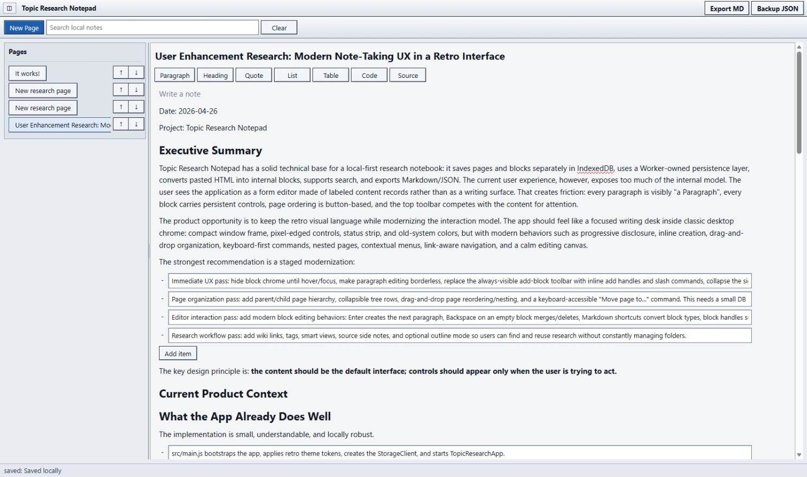
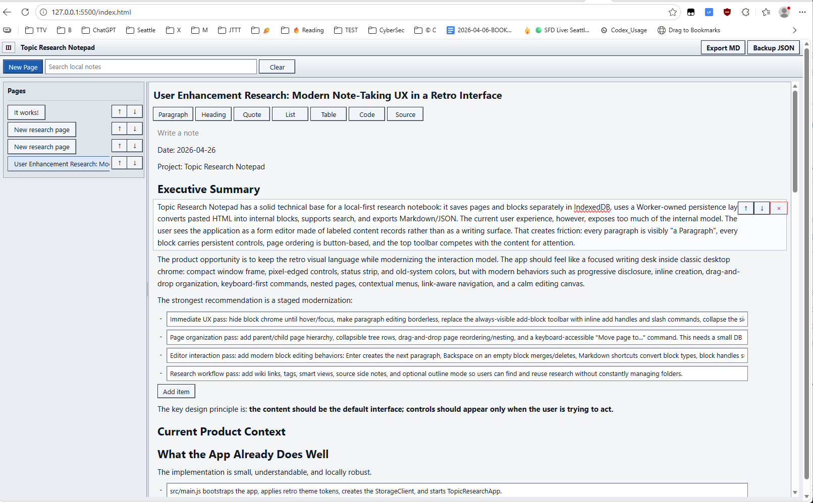
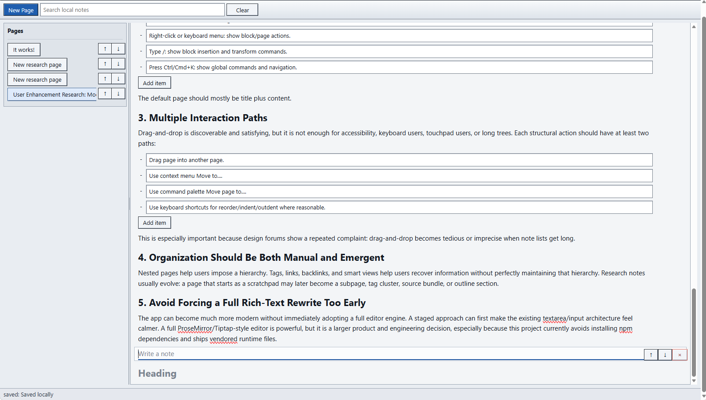

Date: 2026-04-26

Current screenshots, before the fix:








This is important direction for codex, so this change request requires, has like a code snippets, has code snippets with some specific classes. So treat those only as an example, also only as a general suggestion, even though even that they are like maybe close to the current code, and maybe even if they are like close to the current code, still this is, those code examples are like and identifiers are for the reference only, so this means you need to use your best judgment. This means that you don't you are not required to name these things like as they are presented in the document. So make your best judgment about the naming, about the structure. Those examples are only for the reference to illustrate like the point.


Codex, So, again, like if it is really needed, if you consider that to be needed, then you can also make a changes, required changes, if you feel like your best judgment tells you that this is needed to do, that we can do that. You can make a change into our local copy of the UI framework too. And also don't forget to document the change, what was done if you're doing the change. Of course, this is optional, so it doesn't mean that we need to do the change. This means that you need to think and consider if we want to, if we really need to make a change into our shared framework, then you, just to let you know that you can do that too.


A00 Change Request: Pessimistic UI Review and Layout Correction Plan for Topic Research Notepad

------

This change request is an implementation review and correction plan for the current Topic Research Notepad UI. It is based on the latest screenshots, the current behavior observed in the browser, the prior user enhancement research, and the recent implementation direction around a calmer editor canvas, split-pane layout, content-first editing, progressive controls, and framework-level reusable components.

This is not a fresh feature specification from zero. This is a correction document for an existing implementation that is now partially functional but still visually and behaviorally inconsistent. Codex should treat the screenshots as evidence that the application can load, render pages, save content, and display a more document-like canvas, but also as evidence that the layout still contains many avoidable UX and UI defects.

The current implementation is moving in the right direction: the page body is less card-like than before, some content now reads more like a document, and the editor is closer to the "content first, controls on intent" principle from the research notes. The research document explicitly identifies the prior problem: the app exposed too much of the internal model, showed paragraphs as labeled records, kept persistent controls visible, and made page ordering button-based instead of direct or contextual.

The current screenshots show that those problems are only partially resolved. Some old chrome remains. Some new controls are now misplaced. Some affordances are unclear. Some layout regions are fighting each other. The user can write, but the interface still does not yet feel like a stable retro research writing desk.

------

B00 Part One: Summary of Problems

------

B01. Search controls are visually ambiguous.

The `Search local notes` input sits too close to `New Page` and reads like it may be page-related instead of search-related. It should become a right-aligned search group with its `Clear` button.

B02. The top command bar lacks semantic grouping.

`New Page`, search, `Clear`, `Export MD`, and `Backup JSON` are all in one broad strip without enough grouping. New page creation, search/navigation, and export/backup are different tasks.

B03. The editor has double scrollbars.

The screenshots show both a browser/page scrollbar and an inner application/editor scrollbar. This creates confusion about which surface is being scrolled and should be eliminated.

B04. The page sidebar is too narrow and truncates titles.

The selected page title is cut off in the sidebar. This makes page navigation unreliable, especially once research pages have long names.

B05. Page row controls consume too much horizontal space.

The up/down buttons are always visible and take space that should belong to the page title. This worsens truncation and makes the page row look like a tiny control panel instead of navigation.

B06. Page movement is still button-based.

Up/down buttons are an old fallback, not a primary organization model. Future tree movement should use drag, context menu, and command movement, with buttons demoted or hidden.

B07. Search placement competes with navigation.

The search field is currently near page creation, but the mental model is different. Search is a navigation/filtering action and should be separated visually.

B08. Block action controls overlap or crowd the editing boundary.

The up/down/delete controls on active blocks sit too close to the content area. In some cases they visually overlap the border of the block or the editable surface.

B09. The red `x` delete button is visually too strong and semantically weak.

The red `x` looks like a window close button or error control. It does not clearly communicate block deletion, and it is visually loud inside the document.

B10. The delete button alignment bug remains conceptually unresolved.

Even if the exact pixel issue changes per screenshot, the action cluster still appears attached to the wrong layer. It should not float into the content boundary.

B11. Active block controls should become a tab-like attached header.

When a block is active, its controls should appear in a small attached top-right label/header, similar to a tab label or file-folder tab, not inside the editable content rectangle.

B12. Inactive blocks should not show action chrome.

A quiet document should not show movement/delete controls on every block. Controls should appear on hover, focus, or selection.

B13. Add-block behavior is not discoverable at the bottom of the document.

The current implicit path is to focus the last block and press Enter. That works for experienced users but is not visible enough.

B14. Converting a newly inserted paragraph requires scrolling to the top toolbar.

If the user is at the bottom of a long document and creates a paragraph, converting it to a heading/source/code/list requires using controls near the top of the page. This breaks the writing flow.

B15. The global block-type toolbar is in the wrong place for block conversion.

The row containing `Paragraph`, `Heading`, `Quote`, `List`, `Table`, `Code`, and `Source` is too global. These actions are local to the active block or insertion point.

B16. The slash command path is promising but not enough alone.

Slash commands can help, but they should not be the only way to insert or transform blocks. Local menus or active block controls must also exist.

B17. The current document body still has too much editor chrome.

The page is more document-like than before, but active blocks still show strong borders and control clusters that pull the eye away from text.

B18. List items are visually awkward.

The screenshot shows list items rendered as bordered rows with a dash outside. This looks like a form/list hybrid rather than document text.

B19. `Add item` buttons inside lists look like generic form controls.

The list-specific `Add item` button is functional, but it is visually heavy and breaks document flow. It should be less prominent or appear only when the list is active.

B20. Active block border is too heavy.

The focused paragraph border is useful for debugging, but it makes the document feel like editable boxes rather than prose.

B21. The editor width is too wide for comfortable reading.

On a large viewport, paragraph lines run very long. The content area should have a readable maximum width or an inner document column.

B22. Sidebar and editor splitter exists visually but needs behavior validation.

The screenshots show a divider between sidebar and editor. Codex must verify whether this is the new split pane component, a CSS border, or an incomplete splitter.

B23. The splitter area and scrollbars compete visually.

The vertical boundary between sidebar and editor sits close to scrollable regions and may become visually confused with the scrollbar.

B24. Status text is better but still inconsistent in tone.

The status strip says `saved: Saved locally`. This is directionally good, but the duplicated phrasing feels unpolished.

B25. Undo is missing for structural actions.

Browser-native undo may handle text editing inside contenteditable, but deleting or moving blocks needs app-level undo. Structural edits should be reversible.

B26. Deletion is too dangerous without undo or soft recovery.

A visible delete control on every active block is risky. If clicked accidentally, the user needs a way to recover.

B27. Page/block history is not yet sufficient.

The app should store recent page versions or snapshots so destructive operations can be recovered, especially during this proof-of-concept phase.

B28. Control naming and labeling are inconsistent.

`x`, arrows, `Add item`, and block type buttons are a mix of symbols, action words, and object names. They should follow a consistent grammar.

B29. Current controls are not optimized for keyboard and pointer parity.

Some actions are discoverable by pointer, some by implicit keyboard behavior, and some only by global toolbar. They need a coherent model.

B30. Codex needs to inspect the actual DOM/CSS rather than guessing.

Several visual problems could come from absolute positioning, padding, box sizing, overflow, z-index, or stale CSS. The fix must be evidence-based.

------

C00 Part Two: Detailed Review and Required Changes

------

C01. Search Control Placement and Grouping

The top toolbar currently presents `New Page`, `Search local notes`, and `Clear` in a single row. The problem is not that the controls are misaligned. The problem is that they are semantically ambiguous. `New Page` creates content. `Search local notes` navigates or filters existing content. `Clear` belongs only to search. When these controls sit next to each other without grouping, the search input can be misread as a title field or page-related input.

The fix is to keep `New Page` on the left, then move the search input and `Clear` into a grouped search region aligned to the right or at least separated from page creation. This group should visually communicate: these two controls are one search operation.

Required direction:

```html
<div class="trn-commandbar">
  <div class="trn-commandbar-primary">
    <button>New Page</button>
  </div>

  <div class="trn-commandbar-search" role="search" aria-label="Search local notes">
    <input placeholder="Search local notes">
    <button>Clear</button>
  </div>

  <div class="trn-commandbar-secondary">
    <button>Export MD</button>
    <button>Backup JSON</button>
  </div>
</div>
```

The exact DOM should use the retro UI framework components where possible. The framework already includes components and tags for toolbar, field, command palette, context bar, status strip, titlebar, input, button, panel, and related primitives, so Codex should use or extend those instead of creating another app-only toolbar grammar.

Acceptance requirement: the user should not confuse search with page title editing, and `Clear` should visually belong to the search input.

------

C02. Top Command Bar Semantic Structure

The toolbar needs three conceptual groups: page creation, search/navigation, and export/backup. Right now the strip is mostly a line of controls. That is acceptable for an early proof of concept but not for the next UI pass.

New page belongs left because it creates a new item in the sidebar. Search belongs in its own group. Export and backup belong right because they are document/workspace actions. The UI can remain compact and retro, but the mental model must be clearer.

Codex should consider implementing a generic toolbar grouping pattern if the UI framework does not already support it cleanly. This is exactly the kind of repeated structure that belongs in the shared framework: local app CSS should describe app-specific domain needs, while the shared library should describe common application structure.

Acceptance requirement: command grouping should be visually obvious even without reading every label.

------

C03. Double Scrollbar Defect

The screenshots show a double-scrollbar problem: the browser window or outer app has a vertical scrollbar, and the internal editor/content area also has a vertical scrollbar. This is a layout defect, not a small visual preference. It creates two scroll containers competing for the same gesture. The user cannot reliably know whether mouse wheel, PageDown, Home/End, or scrollbar dragging will move the document, the app shell, or the browser page.

This defect usually comes from a height chain problem: some ancestor has `height: auto` while a child has `height: 100%`, or both body and app content are scrollable. Another common cause is a fixed header/status layout where the editor area is assigned `overflow: auto`, but the root page also overflows because the app shell height is not clamped to the viewport.

Codex must inspect the actual CSS chain from `html`, `body`, app root, shell, toolbar, split pane, sidebar, editor shell, and editor scroller.

Required direction:

```css
html,
body {
  width: 100%;
  height: 100%;
  margin: 0;
  overflow: hidden;
}

#app,
.trn-root {
  width: 100%;
  height: 100%;
  min-height: 0;
  overflow: hidden;
}

.trn-shell {
  display: grid;
  grid-template-rows: auto 1fr auto;
  height: 100%;
  min-height: 0;
  overflow: hidden;
}

.trn-main {
  min-height: 0;
  overflow: hidden;
}

.trn-editor-scroll {
  min-height: 0;
  overflow: auto;
}
```

There should be one primary document scroll container. The browser page itself should not scroll when the app is intended to fill the viewport.

Acceptance requirement: at normal full-page usage, the user should see only one vertical scroll path for the editor content, plus any scrollbars specifically inside sidebar lists if needed.

------

C04. Sidebar Width and Title Truncation

The sidebar currently truncates real page titles. This problem becomes worse as pages become hierarchical, because tree indentation, disclosure controls, drag handles, page icons, and context menu affordances will all consume space.

The split-pane component is the correct long-term fix. The user should be able to widen the sidebar when organizing pages and shrink it while writing. The research notes already say that the page-level rules should include a resizable and collapsible sidebar.

Until the page tree exists, the sidebar should still behave better. Page title text should have a full-title tooltip. The tooltip should not say only `Open page`; it should say either the full title or `Open page: <title>`.

Acceptance requirement: a truncated page title must be recoverable without opening the page, and the sidebar should be resizable through the split-pane component if that component is already in scope.

------

C05. Page Row Controls and Navigation Semantics

The current page rows have visible up/down controls. These controls make the sidebar look like a management form. They also steal width from titles. In the future hierarchy model, up/down is not sufficient because pages need reorder, nest, unnest, move to parent, move to root, and possibly move to a distant topic.

The current buttons can remain temporarily as a fallback, but they should be visually demoted and eventually moved behind hover/focus or a context menu. The primary page row should be navigation: click the title to open the page. Secondary actions should not dominate the row.

The research notes already point out that drag-and-drop alone is not sufficient and that each structural action should have multiple paths: drag, context menu, command palette, or keyboard shortcuts.

Acceptance requirement: page rows should primarily read as pages, not as button strips.

------

C06. Active Block Controls Overlap Editing Boundaries

The screenshots show active block controls rendered at the top-right of the active content region. The cluster contains up, down, and delete. It sits close to or inside the editable block boundary. This creates a visual collision: the control cluster appears to belong both to the block container and to the editor text area, but it does not align cleanly with either.

The fix should not only move the controls a few pixels. The control cluster needs a new visual model.

Required direction: when a block is active, render block actions in an attached top-right tab-like header. This header should sit above the editable content boundary, visually connected to the block but not intruding into the text area. It should feel like a tab label, file-folder tab, or old desktop property handle.

Suggested structure:

```html
<div class="trn-block trn-block--active">
  <div class="trn-block-action-tab" aria-label="Block actions">
    <button title="Move block up">Up</button>
    <button title="Move block down">Down</button>
    <button title="Delete block">DEL</button>
  </div>

  <div class="trn-block-surface">
    <div contenteditable="true">...</div>
  </div>
</div>
```

Suggested CSS direction:

```css
.trn-block {
  position: relative;
  padding-block-start: 0;
}

.trn-block-action-tab {
  position: absolute;
  top: -24px;
  right: var(--awwbookmarklet-space-2, 8px);
  display: none;
  align-items: center;
  gap: 0;
  z-index: 2;
  background: var(--awwbookmarklet-window-bg, #eef1f5);
  border: 1px solid var(--awwbookmarklet-border-subtle, #a8b0ba);
  border-bottom: 0;
  box-shadow: inset 1px 1px 0 #fff;
}

.trn-block:hover .trn-block-action-tab,
.trn-block:focus-within .trn-block-action-tab,
.trn-block[data-active="true"] .trn-block-action-tab {
  display: flex;
}
```

This is not final CSS. Codex must adapt it to the actual DOM. The design requirement is that controls no longer overlap the editable content rectangle.

Acceptance requirement: block controls should be visually attached to the active block but outside the text editing boundary.

------

C07. Replace `x` With `DEL` for Block Deletion

The red `x` is not the right label for block deletion. It visually implies window close, dismiss, or error. It also becomes too visually dominant inside the document. A block delete button should use a clearer action label.

Use `DEL` or `Del` instead of `x`. The user specifically prefers narrow text like `DEL`. The button should remain compact, but it should be semantically clear.

Recommended button label:

```html
<button class="trn-block-action trn-block-action--delete" title="Delete block">DEL</button>
```

The button can use a danger tone only on hover or focus, or use a subtle danger border rather than a permanently loud red treatment. Permanent red inside the writing surface is too aggressive.

Acceptance requirement: the delete action reads as deletion, not close.

------

C08. Structural Undo and Recovery

Text editing undo inside contenteditable may be handled by the browser during the current editing session. That is not enough. Moving a block, deleting a block, transforming a block, reordering a page, or deleting a page are application-level structural operations. They need app-level undo or recovery.

Immediate requirement: implement undo for destructive or structural block actions, at least delete and move. Pressing Ctrl+Z after deleting a block should restore it if the app focus is inside the editor or if the app can safely intercept the command. Moving a block up/down should also be undoable.

Implementation option 1: in-memory command stack.

```js
const undoStack = [];

function pushUndo(entry) {
  undoStack.push(entry);
  if (undoStack.length > 100) undoStack.shift();
}
```

A delete operation can store enough data to restore the block:

```js
pushUndo({
  type: "deleteBlock",
  pageId,
  block,
  previousIndex,
  previousSortOrder
});
```

Implementation option 2: soft-delete.

A deleted block is marked `deletedAt` and hidden, then permanently pruned only later. This is safer with IndexedDB and consistent with existing future-friendly fields in the model.

Implementation option 3: page snapshots.

The user requested saving at least 15 copies of the page. This should become a version/snapshot requirement, but Codex should not implement it carelessly. A page snapshot should represent the page content and block order at a meaningful point, not every keystroke. It should not explode storage during typing.

Recommended immediate approach: implement an in-memory undo stack for structural actions, and add a durable `pageSnapshots` or `revisions` design for 15 recent page snapshots if the schema change is in scope.

Possible snapshot store:

```js
pageSnapshots: "id, pageId, createdAt"
```

Possible snapshot record:

```js
{
  id: "snapshot_uuid",
  pageId: "page_uuid",
  createdAt: "2026-04-26T...",
  reason: "deleteBlock",
  page: { ...pageRecord },
  blocks: [ ...orderedBlockRecords ]
}
```

Snapshot policy:

Keep the latest 15 snapshots per page.

Create a snapshot before destructive structural operations.

Do not snapshot every character typed.

Flush pending edits before snapshotting.

Log snapshot creation and pruning.

Acceptance requirement: after accidental delete or move, the user has a recovery path. If full durable snapshots are deferred, Codex must document the deferral and implement at least in-memory undo for structural block operations.

------

C09. Bottom-of-Document Insertion

At the bottom of a long page, the user currently has to infer that pressing Enter in the last paragraph creates a new paragraph. This behavior is useful, but invisible. It should remain, but it should not be the only affordance.

The bottom of the document should include a quiet insertion affordance. It must not look like a heavy form button. It can appear as a ghost row, a small plus affordance, or a subtle "Click or type to continue" region.

Possible design:

```html
<div class="trn-document-end-insert" role="button" tabindex="0">
  + Add paragraph
</div>
```

This can be hidden until the user hovers near the bottom or until the last block is focused. Another option is to always show a very faint insertion line after the final block.

Acceptance requirement: the user should not need to know an implicit Enter behavior to add content at the bottom.

------

C10. Local Block Conversion Instead of Top Toolbar Dependence

The global block-type toolbar is not usable in long documents. If the user creates a new paragraph near the bottom and wants it to become a heading, source, quote, or code block, scrolling to the top is a broken workflow.

Block insertion and conversion must be local. When a block is focused, the user should be able to open a nearby insert/transform menu. This could be through the active block action tab, a small plus control, a slash command, or context menu.

The existing global toolbar can remain temporarily as a fallback, but it should be demoted. The real interaction model should be local to the current editing position.

The research document already gives the direction: slash commands should insert or transform blocks from the writing location, and the menu should be short, dismissible, and not annoying.

Acceptance requirement: a user at the bottom of a long document can create and convert a block without scrolling to the top toolbar.

------

C11. Slash Commands Are Helpful But Not Sufficient

Slash commands should be implemented as a local insertion/transform path, but they cannot be the only path. Some users will not discover them. Some contexts make slash awkward. Slash can also be typed as normal text.

The slash menu should open only when the current block is empty or contains a command-like prefix. It should close on Escape and close when the text stops looking like a command.

Minimum commands:

```text
/paragraph
/heading
/quote
/list
/table
/code
/source
```

Codex should also provide a non-slash path from the active block action tab or context menu. The user should be able to choose "Turn into" without typing.

Acceptance requirement: slash commands improve flow but do not trap the product into keyboard-only hidden behavior.

------

C12. List Rendering Problems

The current list rendering shown in the screenshot is visually awkward. Each list item appears as a bordered input row, preceded by a dash outside the row. This looks neither like a normal document list nor like a clean retro control. It also consumes excessive vertical space and makes the list look like a form.

A list block should read as document content. When inactive, it should look like a list. When active, it can reveal item-level editing affordances.

Possible resting appearance:

```text
- Immediate UX pass: hide block chrome...
- Page organization pass: add parent/child hierarchy...
- Editor interaction pass: add modern block editing behaviors...
```

Possible active appearance: the currently focused item gets a subtle outline or editing marker, not a full-width heavy input box unless required.

Acceptance requirement: lists should read as document lists, not as independent form fields.

------

C13. `Add item` Button Inside Lists

The `Add item` button is currently too generic and too visually strong. It is not clear whether it adds a list item, a block, or something else. It should say `Add list item` if it remains visible, or it should be replaced by Enter behavior and a subtle item insertion affordance.

Recommended behavior:

Enter at the end of a list item creates a new list item.

Backspace on an empty list item removes it or exits the list.

A quiet `+ item` affordance appears when the list is focused.

Acceptance requirement: adding a list item should feel like editing a list, not operating a form builder.

------

C14. Editor Text Width and Reading Comfort

The editor content currently spans too much horizontal space in a wide viewport. This creates long lines, which are harder to read and make the document less immersive. The retro shell can be full width, but the document content should have a comfortable measure.

Codex should add an inner document column with maximum width. Tables and code blocks can be allowed to overflow horizontally inside their own block if needed.

Suggested CSS direction:

```css
.trn-document {
  max-width: 980px;
  margin-inline: 0 auto;
  padding-inline: var(--awwbookmarklet-space-3, 12px);
}
```

The alignment should probably be slightly left-biased rather than perfectly centered because this app is still a productivity tool with a sidebar, not a pure writing app.

Acceptance requirement: normal paragraph reading should not require scanning across the entire browser width.

------

C15. Active Block Border Strength

The focused paragraph currently has a strong rectangle. A focus indication is necessary, but this one makes the editor feel like a form. The active block should show a subtle surface state, not a heavy input box, unless the block type genuinely requires a contained editing surface such as code or table.

For paragraphs, focus can be indicated with a left gutter mark, a very light outline, or the active action tab. The text itself should remain visually primary.

Acceptance requirement: focus is visible but does not turn prose into form rows.

------

C16. Status Strip Copy

The current status reads `saved: Saved locally`. This repeats the same idea in two ways. The status strip should use consistent user-facing copy.

Recommended states:

```text
saved locally
saving locally
unsaved changes
save failed
storage unavailable
```

If a timestamp is available:

```text
saved locally 14:32
```

Acceptance requirement: status copy should be concise, user-facing, and not duplicated.

------

C17. Framework-Level Responsibility

Some fixes belong in the app. Others belong in the retro UI framework. Codex must not solve everything through local app CSS if the pattern is reusable.

Framework candidates:

Split pane.

Toolbar grouping.

Context/action tab or attached mini toolbar pattern.

Icon/text button sizing consistency.

Status strip wording and layout primitives.

List row action visibility.

Menu/context menu behavior.

The framework is already intended to become an application UI kit rather than a loose primitive set. Its quality bar is that a future tool author should be able to build a small desktop-like utility without creating private shell CSS, toolbar CSS, status helpers, list actions, and repeated feedback surfaces.

Acceptance requirement: reusable layout and control fixes should be implemented in or documented for the framework, not buried as one-off notepad hacks.

------

C18. Naming and Visual Grammar

Current naming and labels are inconsistent. Some controls use symbols: up arrow, down arrow, `x`. Some use nouns: `Paragraph`, `Heading`, `Source`. Some use verbs: `Clear`, `Export`, `Backup`. Some use vague text: `Add item`.

Codex should normalize the grammar:

Page and block type names are nouns.

Actions are verbs.

Dangerous actions use clear text such as `DEL` or `Delete`.

Tooltips explain the action and object.

Examples:

```text
Move block up
Move block down
Delete block
Turn into heading
Add list item
Open page: <title>
Search local notes
Clear search
```

Acceptance requirement: labels and tooltips should reduce ambiguity, not merely decorate controls.

------

D00 Required Implementation Plan

------

D01. Inspect current DOM and CSS before changing layout.

Codex should identify the actual selectors and components responsible for command bar layout, sidebar rows, editor scroll containers, block controls, list item rendering, and active block styling.

D02. Fix the double scrollbar first.

This is a foundational layout defect. It affects every screenshot and makes further UI evaluation noisy.

D03. Rework the top command bar grouping.

Keep `New Page` left. Group `Search local notes` and `Clear` together. Move the search group right or otherwise separate it from page creation. Keep export/backup grouped on the far right.

D04. Verify split pane implementation.

Confirm whether the vertical divider is the new `awwbookmarklet-split-pane`. If it is not, integrate the framework split pane. If it is, verify width persistence, keyboard resize, clamping, and scroll behavior.

D05. Improve sidebar row behavior.

Add full-title tooltip. Reduce always-visible control pressure. Prepare row DOM for future tree controls. Do not let action buttons consume title width permanently.

D06. Replace active block control placement.

Move up/down/delete controls into an attached top-right action tab for the active block. Do not render them inside or overlapping the editable surface.

D07. Replace `x` delete label with `DEL`.

Use a compact text label. Reduce permanent danger styling. Keep tooltip explicit.

D08. Add structural undo.

Implement undo for block delete and block move. Decide whether durable 15-snapshot page history is in this pass or a separate schema change. If deferred, document it.

D09. Add bottom insertion affordance.

Make it clear how to add a paragraph or block at the end of the document without requiring the user to infer Enter behavior.

D10. Add local block conversion affordance.

The user should not scroll to the top toolbar to convert a block. Provide local block transform through slash command and a local menu/action tab path.

D11. Rework list item visuals.

Make lists look like document lists in resting state. Demote `Add item` or rename it to `Add list item`.

D12. Reduce active block border weight.

Keep focus visible, but make paragraph editing feel like writing.

D13. Update status wording.

Replace duplicated status text with consistent short save confidence copy.

D14. Add tests and manual verification.

Test pure helpers where possible. Manually verify layout, scroll behavior, block controls, undo, and bottom insertion.

------

E00 Specific Acceptance Checklist

------

E01. Top Bar

-  `New Page` remains left.
-  Search input and `Clear` are grouped together.
-  Search group is visually separated from page creation.
-  Export and backup remain grouped as document/workspace actions.
-  Search no longer reads like a page title field.

E02. Scrolling

-  Browser page does not scroll when the app is intended to fill the viewport.
-  Editor has one clear primary vertical scroll container.
-  Sidebar may scroll independently only if its content overflows.
-  No double vertical scrollbar appears in the normal full-app layout.
-  Mouse wheel behavior is predictable.

E03. Sidebar

-  Long page titles have useful full-title tooltip.
-  Tooltip says full title or `Open page: <title>`, not only `Open page`.
-  Page title area is not unnecessarily consumed by always-visible action controls.
-  Row layout is compatible with future tree indentation.
-  Selected row remains clear.

E04. Split Pane

-  Sidebar/editor divider is a real split pane if this change is in scope.
-  Pointer resizing works.
-  Keyboard resizing works if framework split pane is used.
-  Width persists after reload.
-  Invalid persisted width falls back safely.
-  Split pane does not introduce double scrolling.

E05. Block Action Controls

-  Up/down/delete controls no longer overlap the editable content boundary.
-  Controls appear in a top-right attached action tab or equivalent safe location.
-  Controls are visible on hover/focus/active state, not permanently dominant.
-  `x` is replaced with `DEL` or a clearer delete label.
-  Delete tooltip says `Delete block`.
-  Move controls say or tooltip `Move block up` and `Move block down`.

E06. Block Editing and Insertion

-  Pressing Enter in the last paragraph still creates a new paragraph.
-  There is also a visible or discoverable bottom insertion affordance.
-  User can add content at bottom without scrolling to the top.
-  User can transform the current block near the current block.
-  Slash command path works for supported transforms.
-  Non-slash transform path exists or is explicitly documented as next step.

E07. Structural Undo and Recovery

-  Ctrl+Z or app-level undo restores a deleted block where practical.
-  Ctrl+Z or app-level undo restores a moved block where practical.
-  Structural undo does not corrupt autosave state.
-  If durable snapshots are implemented, only the last 15 page snapshots are kept.
-  If durable snapshots are deferred, the deferral is documented and in-memory undo exists for structural actions.

E08. Lists

-  List items look like document list items in resting state.
-  List item editing remains possible.
-  `Add item` is renamed, demoted, or replaced by Enter behavior.
-  List controls do not dominate the document.

E09. Visual Style

-  Paragraph focus state is visible but not form-heavy.
-  Document content has a comfortable reading width.
-  Retro chrome remains on the shell, panels, buttons, and status strip.
-  The writing area remains calm and content-first.
-  No unrelated modern SaaS visual system is introduced.

E10. Status

-  Status says `saved locally`, not `saved: Saved locally`.
-  Saving, unsaved, failed, and unavailable states have clear wording.
-  Status remains subtle.

E11. Testing and Documentation

-  Relevant Bun tests pass.
-  Manual layout verification is documented.
-  Structural undo behavior is tested or manually verified.
-  Scroll behavior is manually verified.
-  Framework changes are documented if any component is modified.
-  Known limitations are documented.

------

F00 Pessimistic Risk Notes for Codex

------

F01. A small visual overlap may hide a larger layout architecture problem.

Do not fix the delete button by adding `right: 4px` and moving on. The root problem is that controls are being drawn in the wrong conceptual layer. They belong to the active block chrome, not the editable content rectangle.

F02. Double scrollbars often return after a later layout change.

Codex should not only fix the visible state. It should make the height and overflow model deliberate. The app shell, split pane, editor shell, and editor scroller need a consistent min-height and overflow strategy.

F03. Hiding controls can make the UI less discoverable.

If controls are hidden until hover/focus, there must be another path: keyboard, context menu, slash command, or visible bottom insertion affordance.

F04. Ctrl+Z is easy to claim and hard to implement correctly.

Browser undo and app undo are different. Text editing undo may work naturally, but block deletion and movement need an explicit command stack or snapshot model.

F05. Durable page snapshots can become a storage problem.

Do not snapshot every keystroke. Snapshot before structural/destructive actions, or on meaningful checkpoints. Keep only 15 per page if this feature is implemented.

F06. Page snapshots must flush pending edits first.

If a block has pending debounced edits and the user deletes another block, the snapshot may capture stale content unless pending writes are flushed or current in-memory state is authoritative.

F07. Slash commands can become annoying.

Do not open slash commands for every slash in normal text. Only open in command-like contexts.

F08. List blocks can become a second editor inside the editor.

If list items remain bordered input rows, the document will still feel like a form. Lists need the same calm-treatment as paragraphs.

F09. The top toolbar should not become a dumping ground.

Moving search right helps, but long-term the global toolbar should not keep accumulating block and document actions.

F10. Framework and app responsibilities must remain clear.

If a fix is reusable, add it to the framework or document it as a framework candidate. If it is not reusable, keep it in the app.

------

G00 Final Direction to Codex

------

Codex should treat this change as a layout correction and interaction refinement pass, not as a broad new feature expansion. The application is closer to the desired document-like experience, but it still contains visible form-editor leftovers and layout defects.

The immediate goal is to make the current screen feel stable, intentional, and less confusing. Fix the double scrollbar. Group search correctly. Stop page rows from looking like cramped control panels. Move active block actions out of the content boundary. Replace `x` with `DEL`. Provide structural undo for destructive operations. Make bottom insertion and local block conversion discoverable. Keep the retro shell, but make the document calmer.

The implementation should remain aligned with the prior research principle: the content is the default interface, and controls appear when the user is trying to act.


Appendix A:

A00 Product Requirement Document: User-Identified UI Corrections for Topic Research Notepad

------

This document captures only the issues and improvement requests identified by the user during review of the current Topic Research Notepad screen. It intentionally excludes additional speculative review items. The purpose is to turn the user's observations into a precise, context-rich change request that Codex can implement without relying on screenshots.

The current application is now closer to the intended document-like editor, but several visible problems remain. These problems are not only cosmetic. They affect how the user understands the application, how confidently the user can edit long documents, and how safe the editor feels when moving or deleting content.

The requested changes focus on toolbar grouping, block action controls, delete behavior, undo/recovery, bottom-of-document insertion, and local block conversion.

------

B00 Top Toolbar Search Grouping

------

The current top toolbar contains `New Page`, `Search local notes`, `Clear`, `Export MD`, and `Backup JSON`. The user identified a UX problem with the search controls.

At the moment, the search input appears too close to the `New Page` button. Because it sits immediately after the page creation button, it can be visually misread as a page-title field or page-related input rather than as a search field. The placeholder text `Search local notes` helps, but placement still creates ambiguity.

The required change is to keep `New Page` where it is, but move the search input and `Clear` button into a clearly grouped search area. The search input and `Clear` button should be visually connected to each other, because `Clear` only makes sense as an action for the search field. This grouped search area should be moved toward the right side of the toolbar so it does not visually compete with page creation.

The result should communicate three separate meanings: page creation on the left, search as its own grouped function, and export/backup as document or workspace-level actions. The search field must not look like a title input or page creation companion.

Suggested structure:

```html
<div class="trn-commandbar">
  <div class="trn-commandbar-left">
    <button type="button">New Page</button>
  </div>

  <div class="trn-commandbar-search" role="search" aria-label="Search local notes">
    <input type="search" placeholder="Search local notes">
    <button type="button">Clear</button>
  </div>

  <div class="trn-commandbar-right">
    <button type="button">Export MD</button>
    <button type="button">Backup JSON</button>
  </div>
</div>
```

The exact markup can differ, especially if framework components are used, but the semantic grouping must be preserved.

Acceptance criteria:

- `New Page` remains visually separated from search.
- `Search local notes` and `Clear` are visually grouped.
- The search group is placed to the right or otherwise separated enough that it cannot be mistaken for a page title input.
- `Clear` clearly belongs to search.
- Export and backup remain available and visually separate from search.

------

C00 Block Action Control Overlap

------

The current active block action controls appear at the upper-right area of the editable block. They include move up, move down, and delete. In the screenshots, these controls sit too close to the content boundary. In some cases they visually overlap the editable border or appear to violate the block's right padding.

This is especially visible with the delete button. The delete control appears shifted or visually detached from the other buttons, and it looks like it is crossing into a boundary where it does not belong. The issue is repeated, not random flicker.

The required change is not only to move the controls a few pixels. The control placement model should change. Block action controls should not live inside the editable text surface. They should be visually attached to the active block, but outside the content boundary.

The user described the desired visual model as similar to a tab label, old tab control, or paper folder tab. When the block is active, a small label-like control strip should appear on the top-right edge of the block. It should look connected to the block, but it should sit above the editable surface rather than overlapping the text area. It should be large enough to contain all action controls comfortably.

This action strip should appear only when the block is active, focused, hovered, or otherwise intentionally targeted. Inactive blocks should not show this chrome by default.

Conceptual structure:

```html
<section class="trn-block trn-block--active" data-block-id="...">
  <div class="trn-block-action-tab" aria-label="Block actions">
    <button type="button" title="Move block up">Up</button>
    <button type="button" title="Move block down">Down</button>
    <button type="button" title="Delete block">DEL</button>
  </div>

  <div class="trn-block-surface">
    <div class="trn-editable" contenteditable="true">
      ...
    </div>
  </div>
</section>
```

The `trn-block-action-tab` name is only an example. Codex may choose a better project-consistent name. The important behavior is that this control strip is rendered as an attached top-right tab/header, not as a floating cluster inside the text surface.

Acceptance criteria:

- Move/delete controls do not overlap the editable content border.
- Controls do not cover text.
- Controls do not protrude beyond the block container.
- The active block action strip appears visually connected to the active block.
- Inactive blocks do not show heavy action chrome.
- The placement works for paragraph, heading, list, source, quote, code, and table blocks where applicable.

------

D00 Replace Delete `X` With `DEL`

------

The current delete button uses an `x`. The user identified this as visually and semantically wrong.

An `x` can mean close, dismiss, cancel, remove from view, or window close. In this editor, the action deletes a block. The label should say that more clearly. The user requested a compact text label such as `DEL`, preferably in a narrow enough presentation that it fits the small control strip.

The button should not look like a window close button. It should look like a block delete action.

Required change:

```html
<button type="button" class="trn-block-action-delete" title="Delete block">DEL</button>
```

The exact class name may differ. The visible label should be `DEL` or another explicitly approved compact deletion label. `x` should not be used for block deletion.

Acceptance criteria:

- The block delete button no longer displays `x`.
- The visible label is `DEL` or another explicit delete label.
- Tooltip or accessible label says `Delete block`.
- The delete button visually aligns with the other block action buttons.
- The delete button no longer looks like a window close control.

------

E00 Structural Undo for Block Delete and Move

------

The user observed that browser-native `Ctrl+Z` already helps with ordinary text editing in contenteditable fields. That is acceptable for text input while the editing session is active.

However, browser-native undo is not enough for structural operations. If the user deletes a block, moves a block, or changes block order, that is an application-level operation. The app should provide a way to revert that action.

The required behavior is that structural actions such as delete and move should be undoable. The most immediate concern is delete. If the user accidentally deletes a block, there must be a recovery path.

Codex should implement app-level undo for structural actions or document a staged approach if durable history is too large for the immediate pass. At minimum, the current implementation should support undo for block delete and block move in the current session.

Recommended model:

```js
const undoStack = [];

function pushUndo(entry) {
  undoStack.push(entry);
  if (undoStack.length > 100) {
    undoStack.shift();
  }
}
```

For block deletion:

```js
pushUndo({
  type: "deleteBlock",
  pageId,
  block,
  previousIndex,
  previousSortOrder
});
```

For block movement:

```js
pushUndo({
  type: "moveBlock",
  pageId,
  blockId,
  beforeOrder,
  afterOrder,
  beforeIndex,
  afterIndex
});
```

When the user presses `Ctrl+Z`, the app should detect whether an application-level structural undo is available. If the current focus is inside an active text editor and the browser can handle text undo, the implementation must avoid breaking normal text editing undo. If the focus is not in the middle of text editing, or if the most recent operation was structural, the app should restore the deleted or moved block.

The exact keyboard event handling must be careful. Codex should not blindly intercept every `Ctrl+Z` in a way that breaks native text undo.

Acceptance criteria:

- Deleting a block creates an undo entry.
- Moving a block creates an undo entry.
- `Ctrl+Z` or an equivalent app-level undo restores a deleted block where practical.
- `Ctrl+Z` or an equivalent app-level undo restores a moved block where practical.
- Native text editing undo is not broken.
- Undo does not corrupt autosave state.
- Undo behavior is documented.

------

F00 Durable Page Snapshot Requirement

------

The user requested a stronger recovery model: save recent copies of the page in IndexedDB so that the user can revert to previous states. The requested number is at least 15 copies of the page.

This should be treated as a product requirement, but it needs careful implementation. The app should not save a full page snapshot on every keystroke. That would be inefficient and could create excessive IndexedDB writes. Snapshots should be created at meaningful moments, especially before destructive structural operations such as block delete, block move, block transform, or possibly before large paste operations.

A page snapshot should include enough data to reconstruct the page at that point: page metadata, ordered blocks, and relevant content. It should not include transient UI state such as hover state, open slash menu, or pastebin content.

Suggested store:

```js
pageSnapshots: "id, pageId, createdAt"
```

Suggested record:

```js
{
  id: "snapshot_uuid",
  pageId: "page_uuid",
  createdAt: "2026-04-26T12:00:00.000Z",
  reason: "deleteBlock",
  page: {
    id: "page_uuid",
    title: "Page title",
    updatedAt: "..."
  },
  blocks: [
    {
      id: "block_uuid",
      pageId: "page_uuid",
      type: "paragraph",
      sortOrder: 1000,
      content: {}
    }
  ]
}
```

Snapshot policy:

- Keep at least the latest 15 snapshots per page.
- Create a snapshot before destructive structural actions.
- Consider creating a snapshot before block transform.
- Consider creating a snapshot before large paste operations.
- Do not create snapshots for every normal character input.
- Prune older snapshots after a new snapshot is written.
- Flush or read from authoritative in-memory state before snapshotting so that snapshots do not miss pending debounced edits.

This feature can be implemented in the same pass if feasible. If Codex judges that it requires a separate IndexedDB migration pass, Codex may document the deferral, but the structural undo requirement remains immediate.

Acceptance criteria:

- A design exists for storing 15 recent page snapshots per page.
- If implemented, snapshots are written before destructive structural actions.
- If implemented, older snapshots are pruned safely.
- If implemented, snapshots can be used to restore or inspect prior page state.
- If deferred, the deferral is documented and in-memory structural undo is still implemented.

------

G00 Bottom-of-Document Insertion

------

The user found that adding a new paragraph at the bottom of the document is currently possible by focusing the last block and pressing Enter. This is useful, but it is too implicit. A user who does not know the keyboard behavior may not understand how to add content at the bottom.

The app should keep Enter-to-create-paragraph behavior, but it should also provide a visible or discoverable bottom insertion affordance.

The bottom insertion affordance should not be heavy or visually distracting. It should support the calm writing surface. It can be a subtle line, a ghost button, or a small `+ Add paragraph` control near the end of the document.

Suggested structure:

```html
<div class="trn-document-end-insert" role="button" tabindex="0">
  + Add paragraph
</div>
```

Possible behavior:

- Visible when the user hovers near the end of the document.
- Visible when the final block is focused.
- Always visible but visually quiet.
- Keyboard-focusable.
- Creates a new paragraph at the end of the current page.
- Focuses the new paragraph immediately after creation.

Acceptance criteria:

- User can add a new paragraph at the bottom without knowing the Enter shortcut.
- Enter in the final paragraph still creates a new paragraph.
- The bottom insertion affordance is not visually heavy.
- New paragraph receives focus after insertion.
- Autosave still works after insertion.

------

H00 Local Block Conversion Near Active Block

------

The user identified a major workflow problem in long documents. If the user is near the bottom of the page and creates a new paragraph, converting that paragraph into a heading, source, code block, quote, list, or table requires scrolling back to the top toolbar. This is inconvenient and breaks the writing flow.

The top block-type toolbar currently contains `Paragraph`, `Heading`, `Quote`, `List`, `Table`, `Code`, and `Source`. Those controls are useful, but their global placement is wrong for long document editing. Block type selection and conversion are local actions. They should be available near the active block or insertion point.

The required change is to provide local block conversion controls. Codex should choose the least intrusive pattern that fits the current architecture. Possible options include an active block action tab, a small context menu, a local `Turn into` menu, a local insert menu, or a slash command menu.

The user is concerned about accidental conversion. The conversion UI must be safe. It should not present giant always-visible buttons that the user can accidentally click. It should require clear intent, such as opening a menu or typing a command.

Suggested local menu:

```text
Turn into
Paragraph
Heading
Quote
List
Code
Source
```

Suggested behavior:

- The menu appears only for the active block or focused insertion point.
- It shows only valid transformations.
- It does not appear permanently over the text.
- It is keyboard-accessible.
- It does not require scrolling to the top of the page.
- Selecting an option transforms the active block or inserts a new block at the current position.

Acceptance criteria:

- User at the bottom of a long page can convert the current paragraph without scrolling to the top.
- User can convert a new paragraph into heading, quote, list, code, table, or source where supported.
- Conversion UI is local to the active block or insertion point.
- Conversion UI is not permanently intrusive.
- Invalid conversions are not shown.
- Accidental conversion risk is minimized.

------

I00 Relationship Between Slash Commands and Local Controls

------

The user recognizes that slash commands can help. If the user types `/heading` or `/source` in a new paragraph, the app can transform or insert the corresponding block. However, slash commands should not be the only path.

The app should support slash commands as one mechanism, but also provide a visible or discoverable local UI for conversion. Some users will not know slash commands. Some users will prefer mouse interaction. Some users may type `/` as normal text. Therefore, slash commands must be optional and context-aware.

Required slash command constraints:

- Slash menu opens only in command-like contexts.
- Slash menu should not open for every `/` in normal prose.
- Escape dismisses the menu.
- Arrow keys navigate the menu.
- Enter selects the highlighted command.
- Commands are limited to known block types.
- Slash commands should not replace local action menus.

Initial command set:

```text
/paragraph
/heading
/quote
/list
/table
/code
/source
```

Acceptance criteria:

- Slash commands exist as a helpful shortcut.
- Slash commands do not interfere with normal typing.
- A non-slash local conversion path exists or is explicitly implemented in the same interaction surface.
- The user can safely transform blocks without scrolling.

------

J00 Active Block Action Tab Visual Direction

------

The user gave a specific visual direction for active block controls. The control should feel inspired by an old tab control or the label tab on a paper folder. The action tab should appear at the top-right of the active block. It should be visually attached to the active block, but outside the editable text region.

This pattern solves three problems at once. It prevents overlap with text. It gives controls a clear place. It keeps inactive blocks visually quiet.

The action tab should only appear when relevant. The user does not want every block to show persistent controls. The editor should remain calm while reading or writing.

The action tab may include:

```text
Move up
Move down
DEL
Turn into
Add below
```

The first implementation may include only existing move/delete controls and later add `Turn into` or insert controls. The important change is the placement and visual relationship.

Acceptance criteria:

- Active controls appear as a top-right attached tab/header.
- The tab has enough width for its controls.
- The tab does not overlap text.
- The tab does not protrude beyond the editor layout.
- Inactive blocks do not show the tab.
- The tab is visually connected to the active block.

------

K00 Control Safety and Accidental Actions

------

The user is concerned about accidental actions, especially accidental block conversion and deletion.

The UI should be designed so that destructive or structural changes require clear intent. Delete should be labeled clearly. Conversion should be opened through a menu or deliberate command. Undo should exist for delete and move. The app should not place dangerous controls where they can be accidentally clicked during normal text selection or cursor placement.

Required safety rules:

- Delete action must be clearly labeled.
- Delete must be undoable.
- Move actions must be undoable.
- Conversion controls should not be permanently exposed as large buttons near the writing caret.
- Local conversion should require menu selection or slash command confirmation.
- The UI should not surprise-convert text while the user is typing normally.

Acceptance criteria:

- Accidental block deletion can be recovered.
- Accidental block movement can be recovered.
- Accidental block conversion is unlikely.
- Dangerous actions are labeled more clearly than `x`.

------

L00 Change Scope

------

This change request covers the user's identified issues only.

In scope:

- Top toolbar search grouping.
- Moving search and clear into a grouped right-side search area.
- Fixing block action control overlap.
- Replacing delete `x` with `DEL`.
- Moving active block controls into a top-right tab-like action strip.
- Adding undo/recovery for structural block delete and move.
- Designing or implementing 15 recent page snapshots in IndexedDB.
- Making bottom-of-document insertion discoverable.
- Making block conversion local to the active block or insertion point.
- Supporting limited slash commands as a shortcut, not the only path.
- Reducing accidental structural changes.

Out of scope for this specific correction document:

- Full page tree implementation.
- Full drag-and-drop page hierarchy.
- Smart folders.
- Tags.
- Backlinks.
- Full command palette.
- Full rich text editor dependency.
- Broad redesign of the entire app shell.
- New unrelated visual system.

------

M00 Implementation Notes for Codex

------

Codex should begin by inspecting the current DOM and CSS for toolbar layout, block action control placement, active block styling, Enter-to-add behavior, block transform controls, and current undo behavior.

Codex should not apply only pixel-level patches. The block action overlap problem is a placement model problem. The controls should move to an attached active-block action tab.

Codex should be careful with `Ctrl+Z`. Native text editing undo must remain intact. App-level undo should handle structural operations.

Codex should treat durable page snapshots as a data model change. If implemented, it should be tested and documented. If deferred, it must be explicitly documented, and in-memory undo should still be added.

Codex should not make slash commands the only solution for local block conversion. The user wants local conversion, not a hidden-only interaction model.

Codex should preserve the calm editor direction. Every new control must justify its presence. The content should remain primary.

------

N00 Final Acceptance Checklist

------

-  Search input and `Clear` are visually grouped.
-  Search group is separated from `New Page`.
-  Search group is moved to the right or otherwise clearly separated.
-  Block action controls no longer overlap editable content.
-  Active block controls render in a top-right attached tab-like action strip.
-  Inactive blocks do not show persistent heavy action controls.
-  Delete button uses `DEL` or another explicit delete label, not `x`.
-  Delete tooltip or accessible label says `Delete block`.
-  Move/delete controls align and fit inside their action tab.
-  Block delete is undoable.
-  Block move is undoable.
-  Native text editing undo remains usable.
-  A design or implementation exists for 15 recent page snapshots in IndexedDB.
-  If snapshots are deferred, the deferral is documented.
-  Bottom-of-document insertion is discoverable without relying only on Enter.
-  Pressing Enter at the last paragraph still creates a new paragraph.
-  User can convert an active block locally without scrolling to the top toolbar.
-  Slash commands are available as a limited shortcut.
-  Slash commands do not trigger during normal prose typing.
-  Local conversion UI minimizes accidental conversion.
-  Existing autosave continues to work.
-  Existing search continues to work.
-  Existing export and backup continue to work.
-  Relevant tests are added or updated.
-  Manual browser verification is documented.
