2026-04-27

A00. Change request: editor layout, block navigation, sidebar controls, and page creation flow

This change request covers UI and interaction fixes for the Topic Research Notepad application. The current implementation is usable, but several behaviors make the editor feel unfinished or inefficient. The implementer should treat these as concrete product requirements, not optional polish.

The screenshots are referenced by the visible clock overlay. The clock time is used as the marker for the relevant UI state.

B00. Problem summary

The application has four main issues.

First, the main content/editor area does not make good use of available horizontal space. In the 23:13:09 screenshot, there is a large unused area to the right of the note content. The editor content column stays too narrow even though the browser window has enough room. This wastes space and makes long text wrap earlier than necessary.

Second, the active editing block has insufficient internal padding. In the 23:16:04 screenshot, the text "What this thing is about?" is too close to the active block border. The block technically works, but it looks cramped and visually uncomfortable. In the 23:17:20 screenshot, the manually added spacing demonstrates the intended direction: the active text block needs more breathing room.

Third, keyboard navigation between blocks is incomplete. Inside a multiline text block, arrow-key movement works correctly within the text itself. The issue appears at block boundaries. When the caret reaches the beginning or end of a block, pressing Up or Down should move focus to the adjacent block in a predictable editor-like way. The current behavior does not provide a smooth block-to-block writing flow.

Fourth, the sidebar page list has visual clutter and title clipping problems. The reorder controls are shown too aggressively, including on the active page. Long page titles are clipped awkwardly, especially when the sidebar width changes. The sidebar should preserve the retro UI style, but it needs clearer behavior and better text handling.

Fifth, the New Page action unnecessarily opens a browser prompt. Since the page title is already editable inline, the app should create a page immediately using a default title instead of asking for a title first.

C00. Requirement 1: make the editor content width responsive

In the 23:13:09 screenshot, the note content column occupies only part of the available workspace. There is a large empty region to the right. The editor should expand horizontally when the window is wide enough.

The intended behavior is not full-bleed content. The editor should still preserve readability and should still leave some right-side breathing room. However, the content area should be wider than it is now on large screens.

The implementer should update the layout so the editor body uses a responsive width rule. The content column should grow with the available space up to a reasonable maximum width. The right-side margin should be proportional or constrained, not a large fixed leftover area caused by an overly narrow editor column.

A reasonable target behavior is: on wide screens, the editor content should expand substantially beyond its current width; on medium screens, it should still fit comfortably; on narrow screens, it should shrink like it already does in the 23:15:03 screenshot.

The 23:15:03 screenshot shows acceptable responsive shrinking. When the window is narrow, the text wraps and the editor remains usable. That behavior should be preserved. The fix should primarily affect wide and medium-wide layouts.

Implementation guidance: avoid hard-coding a narrow fixed width for the editor content. Prefer a layout similar to `width: min(100%, <max-width>)` combined with a parent that allows growth. The editor should not be constrained to the current narrow column when the viewport has available horizontal space.

Acceptance criteria: at the 23:13:09 style window width, the text content area is visibly wider than before and the empty area on the right is reduced. At the 23:15:03 style narrow width, the editor still shrinks cleanly and does not overflow horizontally. The layout still leaves a readable margin and does not stretch text across the entire browser window without limit.

D00. Requirement 2: increase padding inside active editing blocks

In the 23:16:04 screenshot, the active editable block has text too close to the left border. This makes the active cell look cramped. The active editing state needs additional inner padding.

The target is shown by the 23:17:20 screenshot, where additional spacing makes the text more readable. The implementer should add padding to active editable blocks, especially on the left side. Vertical padding should also be checked so the active state does not feel compressed.

The requested adjustment is approximately one to one and a half character spaces more than the current padding. In CSS terms, this likely means increasing the active editable block padding by a small but visible amount, for example from a near-zero or minimal value to something around 6px to 10px depending on the existing scale.

This should apply to all editable block types that use the same active editing treatment, not only the specific paragraph shown in the screenshot. The goal is consistent editing comfort across paragraph blocks, headings, and other inline text blocks.

Acceptance criteria: when a block is active, the text no longer appears glued to the border. The active block still fits the retro visual style. The added padding does not cause layout jumps large enough to feel disruptive.

E00. Requirement 3: preserve normal arrow-key navigation inside multiline text

The 23:19:07 screenshot shows a multiline text block. Arrow-key behavior inside that block is currently correct and should not be broken.

When the caret is inside a multiline block and not at a boundary, ArrowUp should move the caret to the previous visual line, ArrowDown should move it to the next visual line, ArrowLeft should move one character left, and ArrowRight should move one character right. This is standard text editing behavior and must remain unchanged.

The block navigation changes described below should only activate at meaningful boundaries. Do not intercept ArrowUp and ArrowDown globally in a way that prevents normal multiline caret movement.

Acceptance criteria: in a multiline paragraph, pressing ArrowUp and ArrowDown still moves within the paragraph as a normal text area/contenteditable editor would, until the caret is at the first or last reachable visual line.

F00. Requirement 4: add keyboard navigation between adjacent blocks

When the caret is at the end boundary of a block and the user presses ArrowDown, focus should move to the next block below. When the caret is at the beginning boundary of a block and the user presses ArrowUp, focus should move to the previous block above.

The 23:20:05, 23:20:49, and 23:24:24 screenshots illustrate the intended scenario. The user is editing a block, moves to the end of the text, and wants to continue navigating downward without using the mouse. If the next item is an editable block, focus should move into that block. If the next item is the "+ Add paragraph" affordance, pressing ArrowDown should activate it and create a new paragraph block.

The boundary logic should be precise. ArrowDown should move to the next block only when the caret is already at the last visual line and there is no lower text line to move into. ArrowUp should move to the previous block only when the caret is already at the first visual line and there is no upper text line to move into.

When moving downward into an existing block, place the caret at a sensible position. For a simple implementation, place the caret at the beginning of the next block. A more refined implementation may preserve approximate horizontal caret position, but that is not required for this change unless already easy to implement.

When moving upward into an existing block, place the caret at a sensible position. For a simple implementation, place the caret at the end of the previous block. Again, preserving horizontal caret position is optional.

When the current block is the first block and the user presses ArrowUp at the beginning, nothing should happen. Focus should remain stable. The app should not scroll unexpectedly or lose focus.

Acceptance criteria: keyboard-only navigation can move from one note block to the next without the mouse. Normal movement inside multiline text is preserved. Boundary behavior is predictable and does not create accidental focus loss.

G00. Requirement 5: prevent repeated empty paragraph creation from held or repeated ArrowDown

The application always has a bottom "+ Add paragraph" affordance. When the user navigates down from the last real block, it is acceptable to activate "+ Add paragraph" and create one new paragraph. However, the app must not create unlimited empty paragraphs if the user keeps pressing ArrowDown or holds the key down.

This is an important guardrail. After ArrowDown creates a new empty paragraph, additional ArrowDown presses should not keep creating more empty paragraphs while the newly created paragraph remains empty.

The app should enter a temporary stop state after creating an empty paragraph through keyboard navigation. In that state, ArrowDown should do nothing as long as the current paragraph is still empty. Once the user types or pastes content into that paragraph, the stop state can be cleared. After content exists, pressing ArrowDown at the end of that paragraph may again navigate to "+ Add paragraph" and create another paragraph.

This behavior prevents runaway paragraph creation from key repeat, stuck keys, or accidental repeated presses.

Acceptance criteria: holding ArrowDown at the end of the last populated block creates at most one empty paragraph. It does not create dozens or thousands of blank paragraphs. After the user enters content into the new paragraph, ArrowDown can again move to the add-paragraph affordance and create a following paragraph.

H00. Requirement 6: clean up sidebar reorder controls

The sidebar currently shows page reorder controls in a way that creates clutter. In the 23:29:17 screenshot, the active page shows Up and Down controls even when the user is not hovering with intent to reorder. This is unnecessary visual noise.

The active page should only need an active-page highlight. Do not show the Up and Down reorder buttons permanently on the active page.

The hover behavior shown around 23:29:58 is closer to the desired behavior. When the user hovers over a page row, it is acceptable to reveal row-specific controls for that row. This keeps the sidebar clean while still making reorder controls discoverable.

The implementer should change the sidebar behavior so reorder controls are hidden by default and appear only on hover or keyboard focus of the relevant page row. The active page highlight should remain visible independently of these controls.

Acceptance criteria: the active page is visually identifiable without showing reorder controls all the time. Reorder controls appear when hovering over a page row. The controls are still accessible with keyboard focus, not hover-only.

I00. Requirement 7: improve long page title clipping in the sidebar

In the 23:30:39 screenshot, a long page title is clipped awkwardly. The clipping appears to reserve space for controls or empty layout, causing the title to end abruptly in a visually broken way.

Long titles should be handled intentionally. The preferred behavior is single-line truncation with an ellipsis. The page row should use a layout where the title area flexes and the controls occupy a predictable reserved area only when visible.

Recommended behavior: page title text remains on one line, uses `overflow: hidden`, `text-overflow: ellipsis`, and `white-space: nowrap`. When controls are hidden, the title can use the available row width. When controls are visible on hover or focus, the title can shrink and ellipsize to make room for the controls.

The retro style should be preserved. Do not introduce modern-looking chips, floating toolbars, or large redesigned controls. This should feel like the same app, just with more disciplined layout.

The browser tooltip or `title` attribute may be used to expose the full page title on hover. This is optional but recommended because it helps users recover clipped information without changing the visual style.

Acceptance criteria: long page titles are truncated with an ellipsis instead of being cut off awkwardly. The row does not contain unexplained empty gaps. Hovering or focusing the row still provides access to reorder controls. The full title is available through a tooltip or equivalent non-invasive mechanism.

J00. Requirement 8: remove the New Page browser prompt

In the 23:32:14 screenshot, clicking New Page opens a standard browser prompt asking for a page title. This dialog should be removed.

The app already has an editable page title field, shown in the 23:33:14 screenshot. Because the title is editable after creation, the app does not need to ask for the title upfront.

When the user clicks New Page, the app should immediately create a new page with a default title. The default title can be "New research page". If a page with that title already exists, the app should avoid exact duplicates by appending a number, for example "New research page 2", "New research page 3", and so on.

After creating the page, the app should select the new page and focus the title field so the user can immediately rename it. If focusing the title field is difficult in the current implementation, selecting the page is required and focusing the title is strongly preferred.

Acceptance criteria: clicking New Page does not show a browser prompt. A new page is created immediately. The new page has a sensible default title. The new page becomes active. The user can rename it directly through the existing editable title field.

K00. Requirement 9: maintain current local-save behavior

The screenshots show "saved locally" in the status area. These UI changes must not break the existing local persistence behavior.

Page creation, title editing, block editing, block navigation, and sidebar reordering should continue to save locally according to the current save model.

Acceptance criteria: after applying these changes, creating a page, editing its title, adding text, navigating between blocks, and refreshing the browser should preserve the expected local data.

L00. Implementation notes for the coding agent

Do not treat this as a visual redesign. This is a behavior and layout correction pass. Preserve the existing retro/plain UI language.

The main layout fix should focus on removing unnecessary width constraints around the editor content. Check parent containers as well as the block elements themselves. The narrow content problem may be caused by a fixed width, max-width, grid column, flex child sizing, or a wrapper that does not expand.

For editable block padding, inspect the active editing class or contenteditable styling. Apply padding consistently to active editable blocks. Verify that inactive display mode still aligns acceptably with active mode.

For keyboard navigation, implement the logic at the block editor level, not globally at the document level unless necessary. The code should first allow native editing behavior. Only intercept ArrowUp or ArrowDown when the caret is at the relevant boundary.

For repeated empty paragraph prevention, track whether the current empty paragraph was created by keyboard navigation from the add-paragraph affordance. While that paragraph remains empty, repeated ArrowDown should be ignored. Clear this state when the user enters text, pastes content, or otherwise makes the block non-empty.

For sidebar controls, use CSS hover and focus states where possible. Avoid rendering reorder controls permanently for the active page. Ensure keyboard users can still access controls.

For title truncation, use a flex row where the title span has `min-width: 0`. Without `min-width: 0`, ellipsis often fails inside flex containers. This is a common cause of awkward clipping.

M00. Suggested validation checklist

At a wide browser width matching 23:13:09, confirm the editor content column expands and uses more horizontal space.

At a narrow browser width matching 23:15:03, confirm the editor still shrinks without horizontal overflow.

Activate the "What this thing is about?" block and confirm the text has more padding from the active border.

In a multiline paragraph, press ArrowUp and ArrowDown within the paragraph and confirm native caret movement still works.

Move the caret to the end of the last populated paragraph and press ArrowDown. Confirm focus moves to the next block or creates one paragraph from "+ Add paragraph".

Hold ArrowDown after one empty paragraph is created. Confirm the app does not create repeated empty paragraphs.

Type text into the new paragraph, then press ArrowDown at its end. Confirm the app can create the next paragraph normally.

Select an active page in the sidebar. Confirm reorder buttons are not permanently visible just because the page is active.

Hover another page row. Confirm reorder buttons appear for that hovered row.

Resize the sidebar with a long page title. Confirm the title truncates with an ellipsis and does not leave awkward empty gaps.

Click New Page. Confirm no browser prompt appears, a new page is created immediately, and the editable title is available for renaming.

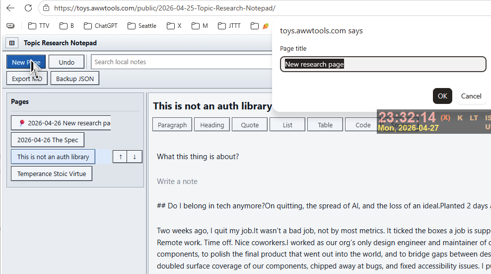

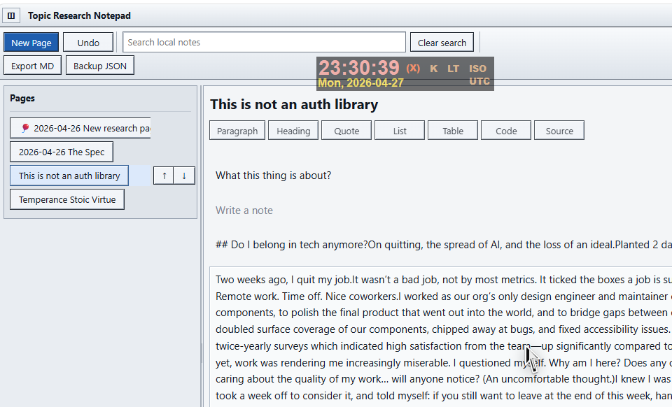

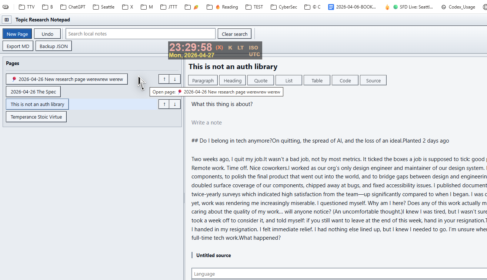

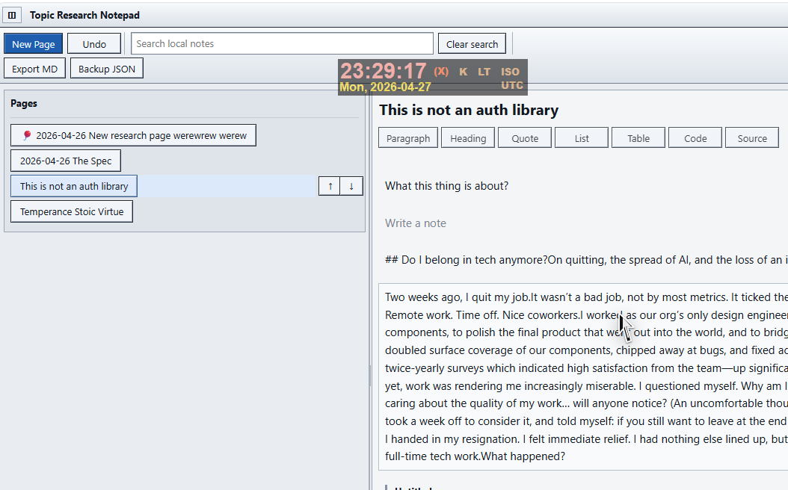

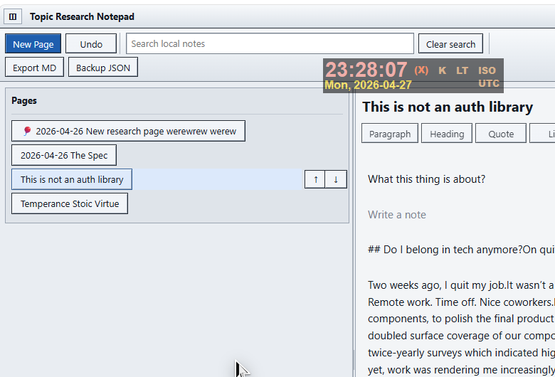

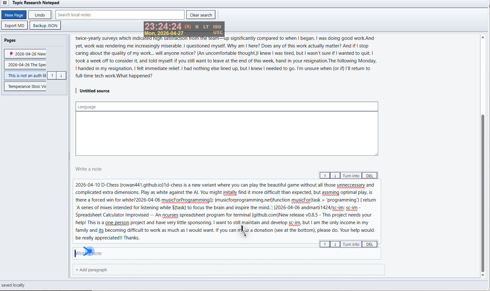

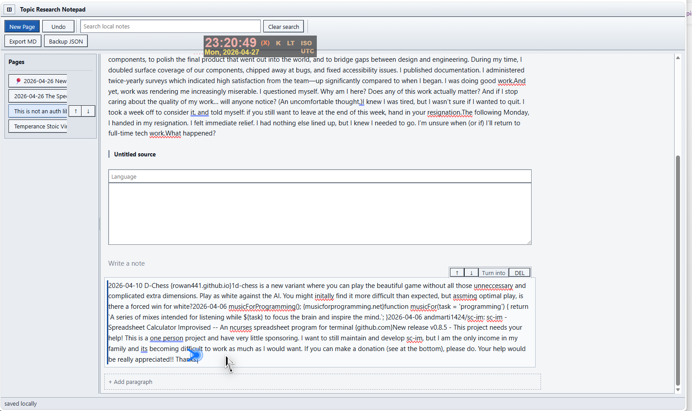

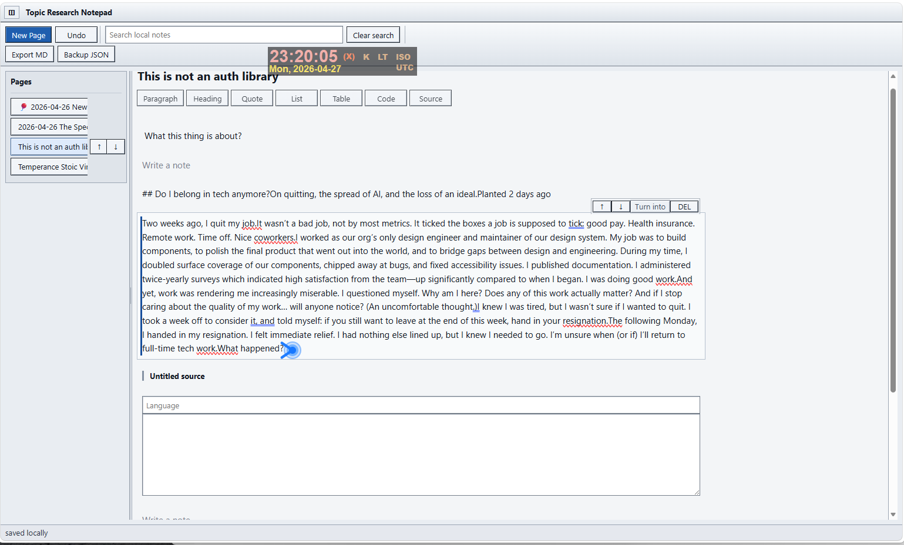

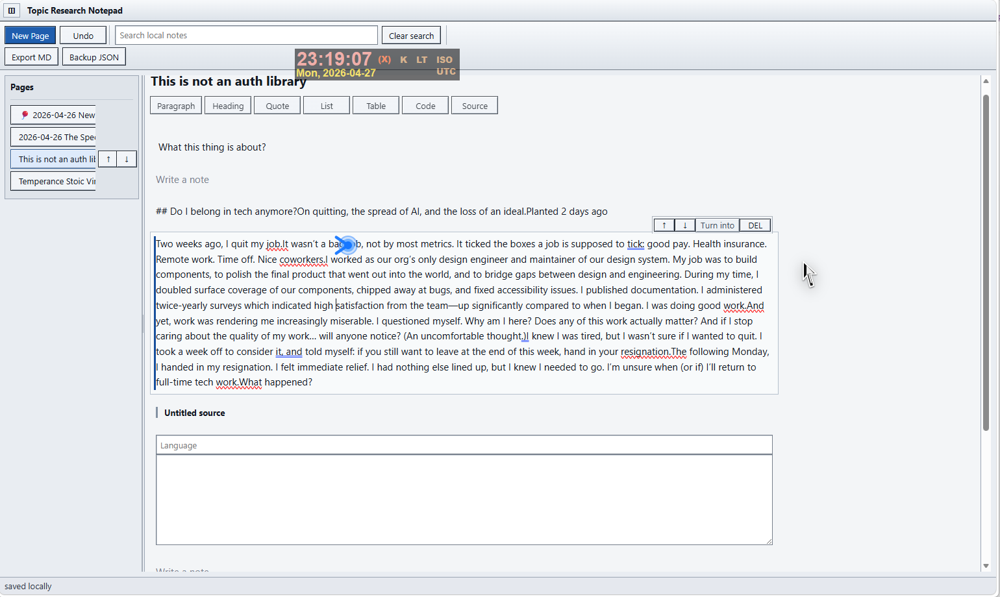

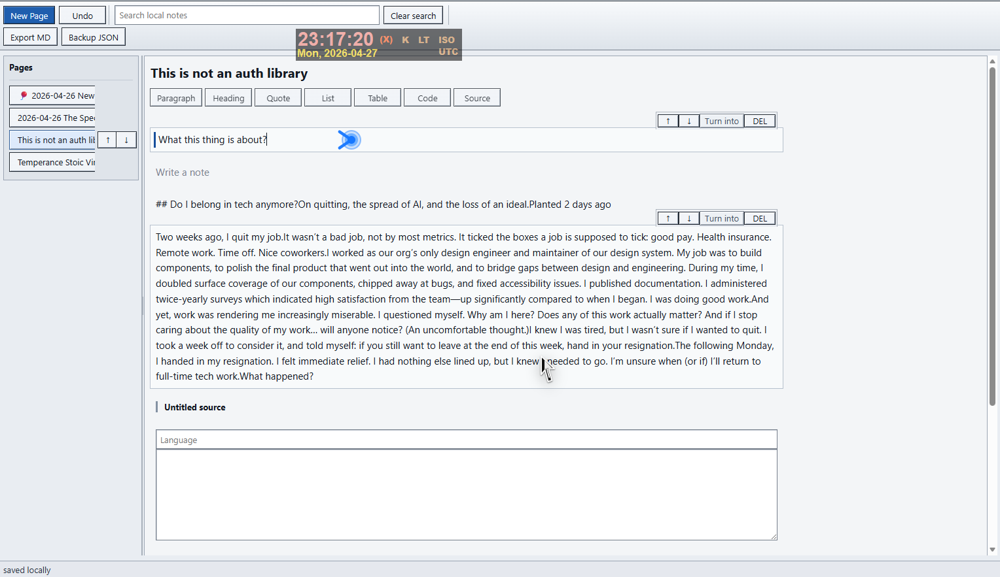

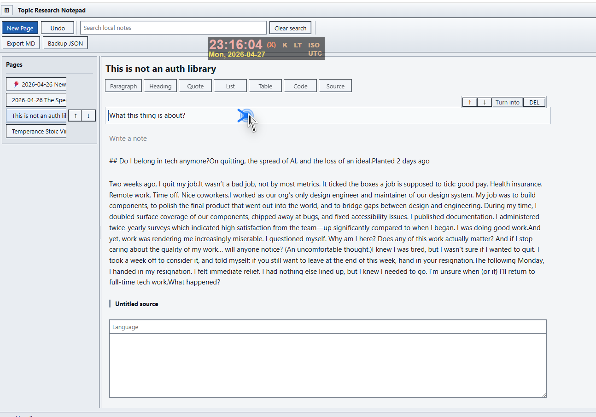

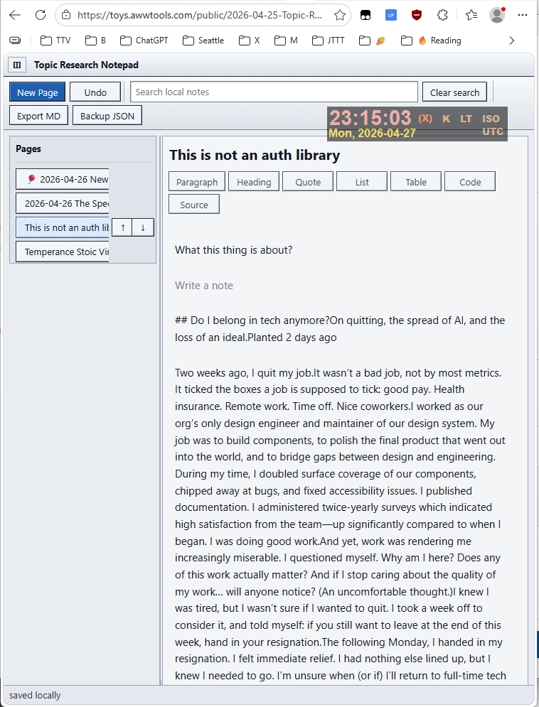

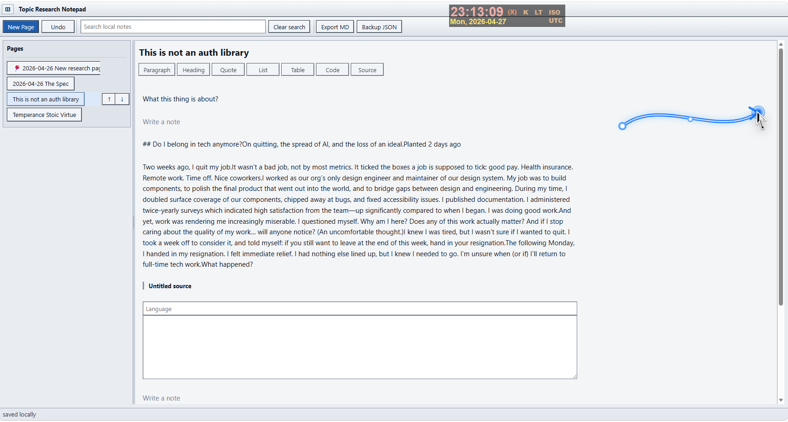

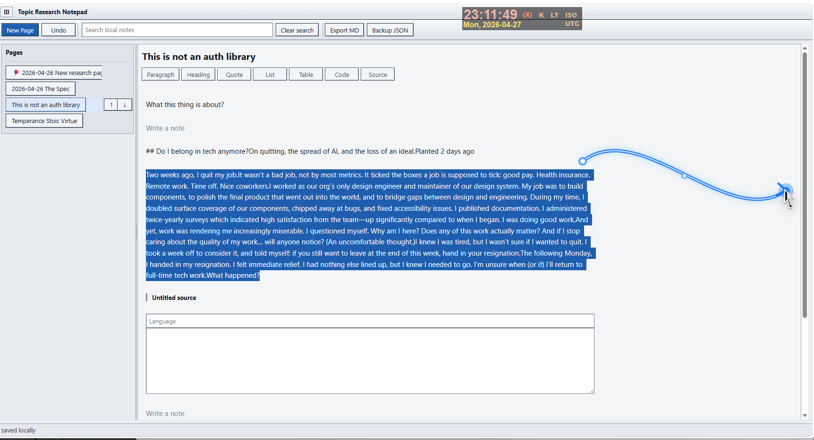
