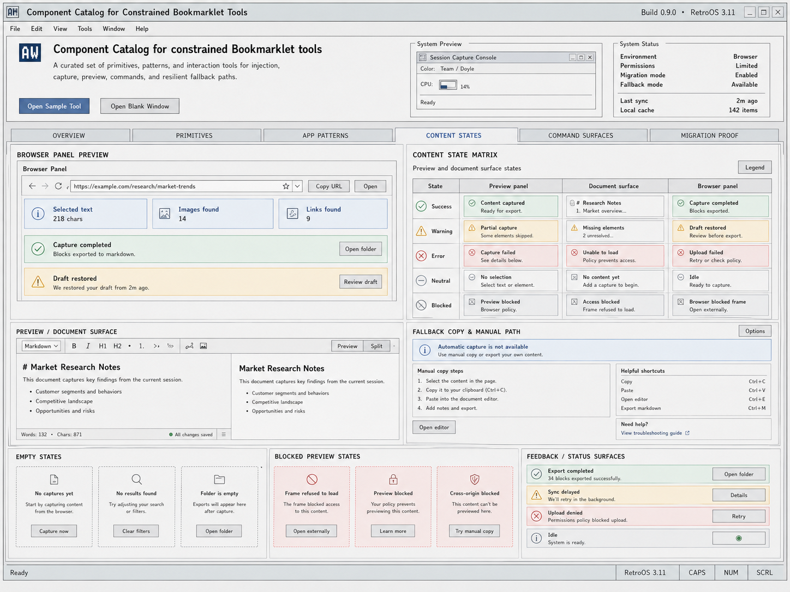

# Redesign
Date: 2026-04-25





I wanted to make sure that, first of all, you will not be confused by the nonexistent file names mentioned in the specification, but will instead look at the existing files attached to this document. I also want you to understand that you can install tools for further validation, and I want you to drive this project to completion to make sure everything has been implemented.

I would strongly prefer that you review those icons and recreate them as high-quality, modern SVGs. What I do not want to see in the SVGs is a lazy path that simply tries to trace and recreate the image. Even if the SVG looks a little different, use calculated layouts and modern SVG techniques, including proper SVG styling. The output does not have to be pixel-perfect. Instead, the icons you create should be SVGs that are smaller and smarter, using existing shapes, reusable styles, and everything modern browser technology can provide. Please make sure to follow that.


A00 Change Request: Aggressive UI Rewrite for Retro-Modern Bookmarklet Component Catalog

This change request defines a full visual and structural rewrite of the current component catalog user interface. This is not a light refactor, not a small styling pass, and not a conservative cleanup. Treat this as an aggressive redesign and aggressive rewrite of the UI layer, layout system, visual language, component styling, state presentation, and icon asset system.

The current project is a sandbox/development project in a new folder. There is no significant production risk if the implementation breaks temporarily during the rewrite. The acceptable risk is developer time. Because of that, do not over-preserve fragile existing CSS, one-off component structure, or visual compromises. Keep the general code organization and web component architecture where useful, but rewrite the interface aggressively enough to match the new proposed design direction.

The final product should implement a coherent retro-modern operating-system-inspired interface for a constrained bookmarklet/browser tooling component catalog. The target is not Windows 95, not Windows 98, not a generic SaaS dashboard, and not a novelty retro skin. The target is an alternate-timeline workstation UI inspired more by Windows 3.11-era structure, dense system panels, rectangular controls, catalog surfaces, inspector panels, command palettes, and browser/bookmarklet constraints, while still using modern CSS, accessibility practices, semantic tokens, responsive layout, and maintainable web components.

B00 Product Context and Design Intent

This UI represents a component catalog for constrained bookmarklet tools. The product context matters. The UI is not a marketing landing page. It is a reference tool, test bench, migration map, component catalog, command surface showcase, and state-behavior inventory for injected browser/bookmarklet workflows.

The interface should make the user feel that the system is precise, inspectable, durable, resilient, and intentionally constrained. The user should immediately understand that this product works with browser surfaces, capture workflows, preview/document states, command palettes, fallback paths, policy restrictions, blocked frames, manual copy flows, and migration/reference components.

The visual thesis is:

A constrained browser-workbench UI that uses retro OS chrome, strict rectangular geometry, dense inspector surfaces, and modern accessibility.

Everything in the rewrite should reinforce this thesis. Avoid generic modern UI habits unless they are explicitly useful. Avoid generic glassmorphism, soft rounded SaaS cards, inflated whitespace, decorative blobs, random gradient hero treatments, vague dashboard cards, fake premium polish, and generic blue/purple template styling. The UI should be distinctive because it has a strict operating-system language, not because individual pieces are decorated.

C00 Required Visual References

Use the provided generated design images as the primary target reference for the rewrite. The generated images show the intended final direction: a high-density retro-modern catalog inside a full application shell, with stronger OS-like chrome, subdued gray surfaces, disciplined borders, tabbed navigation, command surfaces, content-state matrices, browser state previews, compact shell previews, feedback/status strips, and SVG-like pictogram icons.

Use the original screenshot as the source of product content, component categories, and domain-specific examples. The original screenshot contains the actual conceptual inventory: shell primitives, workflow surfaces, content states, command surfaces, migration proof, fallback copy, browser previews, URL picker, command palette, grouped layouts, field matrix, metrics, and reference coverage.

Use the icon reference sheet as the source for the icon asset system. Recreate icons as SVG assets. Do not embed raster icons. Do not trace the raster sheet into a single giant path. The SVGs should be deliberately authored as modern SVG files using simple shapes, lines, strokes, groups, reusable styling, accessible labels where appropriate, and consistent viewBox sizing.

The implementation should assume that the following image references will be available to Codex in the working context:

```
retro_ui_icon_reference_sheet.png
component_catalog_dashboard_interface_design.png
component_catalog_for_bookmarklet_tools.png
component_catalog_ui_for_tools.png
retro_ui_component_catalog_interface.png
```

The exact filenames may differ in the working directory. If files are not immediately present, search the project folder and attached assets. Use the available images as visual reference and do not treat them as exact pixel-perfect screenshots to copy blindly. They are design targets and component examples.

D00 Current Design Problems to Fix

The current original interface has a good foundation. It already avoids many common AI/template UI mistakes. It has hard-edged panels, dense form controls, blue selection bars, browser previews, status cards, and domain-specific fallback states. The main issue is that the system is not strict enough. It currently feels like a collection of retro-inspired components rather than one coherent operating environment.

The global page background and document-style flow feel more like a modern documentation page, while the components themselves feel like a retro workstation. The rewrite should make the whole page feel like a real application shell, not a long documentation page with retro cards placed inside it.

The current hero/header area feels too much like a modern landing-page section. It should be redesigned as application chrome and system overview. The generated design shows the right direction: a top OS-style bar, menu row, application identity, system preview, system status panel, and primary actions.

The current top navigation tabs are too quiet. They should become a strong orientation mechanism. The selected tab must be unmistakable. Each tab should feel like part of the same OS shell. The active tab can use a raised, inset, or open-panel treatment, but should not look like a modern pill tab.

The current section separators are too generic. They look like documentation dividers. Replace them with structural panel boundaries, group headers, inset frames, and OS-style catalog shelves.

The current typography is readable but not codified enough. Establish a compact system type scale for application chrome, major titles, panel titles, labels, metadata, helper text, status text, and command text. Avoid random type sizes and weights.

The current UI uses too many similar but inconsistent border colors, fills, badge treatments, and nested cards. A retro-modern interface can have many borders, but the border hierarchy must be deliberate. Define strict border roles and apply them consistently.

The current blue accent is overused. It appears as primary action, selected row, progress fill, info card, focus-like state, and active navigation. Split these roles into clear semantic treatments. Blue can remain the identity color, but selection blue, primary action blue, info blue, and focus blue should not all look identical.

The current red, yellow, and green states need stronger semantic discipline. Red should indicate error, destructive, denied, blocked, or failed. Yellow or amber should indicate warning, partial, draft restored, manual intervention, or policy caution. Green should indicate success, completed, restored, or valid. Gray should indicate neutral, idle, disabled, or unavailable. Blue should indicate information, selected navigation, or active command.

The current cards use many small top-right badges such as layout, fields, feedback, workflow, data, metrics, context, browser, fallback, commands, and coverage. These are useful as catalog metadata, but too many of them become visual noise. Keep metadata only where it improves scanning or supports filtering. Make badge styling quieter and more systematic.

The current shell, workflow, and preview panels have too many nested boxes with similar visual weight. Keep nesting where it communicates containment, but define levels clearly: application shell, section panel, component panel, group frame, control, state block.

The current command palette and URL picker are central surfaces, but they do not feel important enough. They should become stronger system-native surfaces with clear selected rows, keyboard shortcut chips, action footers, focus states, and compact command anatomy.

The current metrics panels look too much like modern dashboard KPI cards. Replace or restyle them as compact status registers, inspector counters, or system monitor readouts.

The current fallback copy areas often look like warnings. Fallback is core to the product, not just an error condition. Give fallback/manual path flows their own stable treatment. They may use amber accents when caution is involved, but the base pattern should communicate resilience and manual recovery, not panic.

The current focus states are not clear enough. Since this product includes forms, command palettes, URL pickers, tabs, shell controls, and browser actions, keyboard focus must be first-class. Implement visible `:focus-visible` states for every interactive element.

The current UI relies heavily on color to communicate state. Every color-coded status must also include text, icon, border, title, or structural cue. Do not use color alone.

E00 Target Design Language

The target interface should look like a compact retro-modern operating environment. It should use square or near-square geometry, hard panel boundaries, subtle inset/raised surfaces, compact controls, status bars, tab strips, grouped panels, and command-oriented UI surfaces.

Do not use a straight Windows 95 or Windows 98 titlebar. Avoid saturated default royal blue titlebars across the interface. The revised direction should be closer to the generated gray/silver system chrome with restrained blue accents, inspired by Windows 3.11 and early workstation software but not a clone. Titlebars should be subtle, mostly neutral, and integrated into panels. Window controls should be small, square, and system-specific. They may use glyphs or minimal outlines rather than literal Windows 95 controls.

Use modern CSS to make this maintainable, not to make it trendy. Use custom properties, cascade layers, logical properties, grid, container queries, semantic tokens, `:focus-visible`, `prefers-reduced-motion`, and accessible state handling. Avoid trendy effects. No glass panels. No decorative gradients except extremely subtle panel treatments if they support the chrome. No large rounded cards. No heavy drop shadows. No decorative blob backgrounds.

The interface should be dense but not cramped. Retro density is acceptable, but text must remain readable, hit targets must remain usable, and grouping must reduce cognitive load. The result should feel like a high-quality professional tool, not a toy.

F00 Application Shell Requirements

Rewrite the outer page into a full application-shell composition. The top area should resemble a system/application frame with the product name, compact app logo, build/version metadata, menu row, system preview, and system status. It should be visually closer to the generated examples than the original documentation-style layout.

The shell should include a top application title row. The row should show the app mark, product name, build metadata, and small window control icons. The controls should not use a Windows 95/98 blue-titlebar look. Use neutral chrome and small square controls inspired by Windows 3.11 or similar early workstation UI.

The menu row should include simple textual commands such as File, Edit, View, Tools, Window, Help. These do not need full behavior unless the current project already has menu interactions. They should visually establish the system environment.

The hero/product summary area should be redesigned as a system overview panel, not a marketing hero. It should include the logo, title, description, primary actions, a system preview mini-window, and a system status table. Keep content concise and functional.

The primary actions should remain visible: Open Sample Tool and Open Blank Window, or equivalent names from the existing implementation. The primary action should have the strongest action treatment. Secondary actions should be neutral.

The system preview panel should use the same mini-window chrome as the rest of the system. It should show a tiny console/session preview, CPU/progress indicator, target URL or mode metadata, and a Ready status.

The system status panel should look like a compact status register. It should include fields such as Environment, Permissions, Migration mode, Fallback mode, Last sync, and Local cache where appropriate. Align labels and values in a precise grid.

G00 Navigation and Tabs

Rewrite the top category navigation as a real OS-style tab strip. The tab categories should include Overview, Primitives, App Patterns, Content States, Command Surfaces, and Migration Proof, matching the existing conceptual sections.

The selected tab must be clearly active. The generated images use a neutral tab strip with a stronger selected surface and blue text/accent. Implement a similar direction. Do not use rounded SaaS tabs. Do not use pill tabs.

The selected tab should visually connect to the content panel below. Inactive tabs should be clearly clickable but quieter. The active tab should not rely only on color. Use border position, raised/open surface, or structural connection.

Implement different tab states in the component catalog. The project should be able to show at least the following selected-tab layouts or examples: Overview, App Patterns, Content States, and Command Surfaces. If the app is static, these can be implemented as visible sections or switchable panels depending on existing architecture. If tabs currently work, preserve the interaction and rewrite each tab surface.

H00 Overview / Shell and Primitives Screen

The Overview or Shell and Primitives screen should include a set of foundational components similar to the original and generated examples. It should show Desktop Shell, Control Primitives, Field Matrix, Feedback Matrix, Command Palette Preview, Application Shell Example, and Browser State Preview.

The Desktop Shell panel should show window runtime behavior, focus, drag, resize, and status behavior. It should include a compact preview frame, action buttons, and a status strip. Use a neutral titlebar and compact system controls.

The Control Primitives panel should show buttons, inputs, selects, checks, sliders, progress bars, radio buttons, disabled states, danger action, ghost/secondary action, and increment/decrement buttons. These controls must share one strict control-height scale.

The Field Matrix should be rewritten into a strict grid. Labels, controls, help text, validation messages, disabled states, and required markers must align. Required, invalid, disabled, optional, and helper states should be visually consistent.

The Feedback Matrix should use canonical state-card anatomy. Each state should include an icon, title, short message, and optional action. States should include information, warning/draft restored, success/export completed, error/upload denied, and blocked/browser blocked frame.

The Command Palette Preview should show search input, selected command, command descriptions, keyboard shortcuts, and footer hints for navigation, execute, and close. The selected command should be unmistakable and keyboard-oriented.

The Application Shell Example should show a session capture console with toolbar, warning/draft state, target/settings panels, quick actions, activity log, status strip, and progress/register indicators.

The Browser State Preview should show a browser panel with URL field, Copy URL and Open actions, selected text/images/links metrics, capture-completed state, warning or blocked state, and bottom status strip.

I00 App Patterns Screen

Implement an App Patterns screen matching the generated App Patterns reference. This screen should showcase composed patterns that solve common workflows in constrained environments.

Include an Application Shell / Session Console pattern. It should include target information, quick actions, activity log, draft-restored warning, memory/progress indicator, DOM nodes count, events count, idle status, and compact toolbar.

Include a Rows & Cards pattern. It should show a results surface with search field, filter control, sort control, list/grid toggle, several result cards, selected checkboxes or selection markers, metadata, captured status, pagination, and a count footer.

Include a Command Palette Preview pattern. It should show command search, selected command, actions such as Capture visible content, Open session console, Toggle preview pane, Copy selected text, Export as markdown, and footer key hints.

Include a Preview Pane pattern. It should show tabs for Preview, HTML, Text, and Markdown. It should show a document preview with title, text, image placeholder, viewport metadata, zoom, theme, and split/preview controls.

Include a compact Metrics & Status pattern. This should be a register-style panel, not generic dashboard cards. Show captures, preview opens, commands run, errors, and uptime.

Include an inline Feedback Matrix pattern with compact state tiles for private note saved, export completed, browser blocked frame, and upload denied.

J00 Content States Screen

Implement a Content States screen matching the generated Content States reference. This screen should focus on preview, document, browser, fallback, empty, blocked, and status surfaces.

Include a Browser Panel Preview. It should have browser-like navigation controls, URL field, Copy URL, Open, selected text metric, images found, links found, capture completed state, draft restored state, and appropriate actions.

Include a Content State Matrix. It should compare states across Preview Panel, Document Surface, and Browser Panel. Rows should include Success, Warning, Error, Neutral, and Blocked. Each cell should use consistent state-card anatomy.

Include a Preview / Document Surface. It should show a split editor/preview layout with markdown toolbar, document title, bullet content, preview pane, word/character count, saved status, and a small view control.

Include a Fallback Copy & Manual Path section. It should show an informational fallback banner, manual copy steps, helpful shortcuts, and an Open editor action. This should communicate resilience rather than failure.

Include Empty States. Show No captures yet, No results found, Folder is empty, or equivalent examples. Use simple icons, short text, and action buttons.

Include Blocked Preview States. Show Frame refused to load, Preview blocked, Cross-origin blocked, or equivalent examples. Use red or blocked-state visuals, but keep them structured and not overly alarming.

Include Feedback / Status Surfaces. Show Export completed, Sync delayed, Upload denied, and Idle. Each should use consistent icon, title, message, and action treatment.

K00 Command Surfaces Screen

Implement a Command Surfaces screen matching the generated Command Surfaces reference. This screen should showcase keyboard-first and browser-action surfaces.

Include a large Command Palette Preview with icons, command titles, descriptions, selected row, and keycaps. Commands should include Capture visible content, Open capture console, Toggle preview pane, Copy selected text, Export as markdown, Search in page, and Open settings.

Include a URL Picker / Suggestions panel. It should include a URL input/select, selected current page, recent pages, archive/history entries, and a search history option. Use selection styling that matches the rest of the system.

Include a Keyboard Shortcuts panel. Render keycaps using a consistent keycap component. Include shortcuts such as Ctrl+K, Ctrl+Shift+C, Ctrl+Alt+O, Ctrl+Shift+P, Ctrl+C, Ctrl+E, Ctrl+F, Ctrl+Comma, Esc, and Enter. Use actual current product shortcuts where they exist.

Include a Browser Action Surface. It should show browser navigation icons, URL/address field, star/bookmark, fullscreen/capture icon, more menu, and large action buttons for Capture, Preview, Console, Export, and More.

Include a Compact Shell Preview. It should show a mini capture shell with document loaded, injection active, mode bookmarklet, statusbar on, items count, last sync, and actions for Capture, Preview, Export, and Settings.

Include a Feedback & Action Strip. It should show compact success, info, warning, and error messages alongside actions such as Open dialog, Toast, Warn, Export, and More.

L00 Migration Proof Screen

Implement a Migration Proof screen that takes the best ideas from the original screenshot. This screen should explain and visually prove how the new design maps old scattered components into coherent reference components.

Include a Mini Browser Composition with toolbar, URL input, page actions, loaded sample content, captured blocks, page action menu, selected region, and status metadata.

Include Migration Cards for reference components. Examples: Rich Text to Markdown, Page Screenshot, Form Context Select, Session Snapshot, Notifications, Mini/Multi Browser, Bookmarklet, Browser Panel, Command Palette, Fallback Copy, and Metrics. Keep tag usage controlled. Titles should dominate over tags.

Each migration card should have a short description, small metadata chips only where useful, and consistent card anatomy. Avoid dense tag noise.

M00 Icon System Requirements

Create a proper SVG icon system from the icon reference sheet. This is mandatory.

Do not use the raster icon reference directly in the UI. Do not embed PNGs for UI icons. Do not create a single monolithic SVG sprite by auto-tracing the raster image into giant paths. Do not paste opaque path data without structure unless a specific shape genuinely requires a path.

Each icon should be authored as a clean SVG asset using simple primitives where possible: `line`, `polyline`, `polygon`, `rect`, `circle`, `path`, and `g`. Use consistent `viewBox`, stroke widths, joins, caps, and layout. Prefer stroke-based icons with `currentColor` so color can be controlled by CSS state.

Recommended baseline icon system:

Use a 24x24 viewBox for normal icons.

Use a consistent 2px stroke width baseline.

Use square geometry and 90-degree corners where possible.

Use `stroke-linecap="square"` or `"butt"` for retro mechanical icons unless a specific icon needs round caps.

Use `stroke-linejoin="miter"` or a controlled join style.

Use no unnecessary fills unless the icon specifically needs a filled mark.

Use `aria-hidden="true"` for decorative icons and accessible labels only where the icon itself is the only visible label.

Create named icons for at least the following categories from the reference sheet:

App / Logo

Window

Minimize

Maximize / Restore

Close

Menu / Launcher

Panel / Group

Back

Forward

Refresh

Search / Magnifier

Lock / Secure

URL / Address

Link

External / Open

Copy URL

Star / Bookmark

Fullscreen

More / Ellipsis

Capture

Open Console

Preview / Eye

Export / Upload

Open Dialog

Settings / Gear

Options / Sliders

Copy

Paste

Cut

Edit / Pencil

Delete / Remove

Export as Markdown

Search in Page

Open in Folder

Open Folder

Show Toast

Keyboard Shortcuts

Enter / Execute

Confirm / Check

Close / Dismiss

Document / Page

Article / Text

Text Block

Image

Links

List / Bulleted

Folder

Summary / Section

Table / Data

Metrics / Chart

Code / Data

Note / Sticky

Info Panel

Panel / Card

Console Output

Log / List

Info

Success

Warning

Error

Neutral / Idle

Selected

Unselected

Radio Selected

Radio Unselected

Progress Bar

Progress Indeterminate

Sync / Delay

Clock / History

Draft / Pending

Partial / Skipped

Complete

Upload Denied

Policy Blocked

Blocked / Prohibited

Frame Blocked

Cross-Origin Blocked

Access Blocked

Browser Blocked

No Results Found

No Captures Yet

Folder Empty

No Selection

No Content Yet

No Items

Preview Blocked

Frame Refused

Unable To Load

Retry

Permissions Blocked

List View

Grid View

Filter

Sort

Columns

View Pane

The icon set should be placed in a clear location such as `src/icons`, `src/assets/icons`, or a project-appropriate equivalent. The implementation may use individual SVG files, inline SVG web component templates, or an SVG symbol sprite. Prefer the approach that best fits the existing project. The final result must allow icons to be styled by CSS without duplicating color values inside every SVG.

N00 Icon Validation and Tooling

Use Linux tooling freely. Codex has permission to install or create helper tools in the sandbox if needed. Use ImageMagick, librsvg, resvg, Inkscape CLI, SVGO, Node scripts, Python scripts, or other tools as appropriate.

Recommended validation workflow:

Render each SVG icon to PNG at multiple sizes such as 16, 24, 32, and 48 pixels.

Create a generated contact sheet of the rendered SVG icons.

Compare the generated contact sheet against the provided raster icon reference sheet visually.

Use ImageMagick for basic validation such as dimensions, bounding boxes, trimming, alpha, and contact sheet creation.

Use SVGO or equivalent to optimize SVGs after they are authored, but do not optimize them into unreadable single-path blobs if maintainability is harmed.

Use snapshot images or a local visual test page to verify icons inside actual components.

The icons must remain crisp at small sizes. They should align to the grid. Avoid fuzzy half-pixel placement unless deliberately needed for stroke alignment.

O00 CSS Architecture Requirements

Rewrite the CSS around design tokens. This should be a token-driven design, not a collection of one-off CSS values.

Create semantic custom properties for:

Color surfaces

Text colors

Muted text

Border colors

Inset borders

Raised borders

Primary action color

Selection color

Focus ring color

Info color

Success color

Warning color

Error color

Blocked color

Neutral state color

Disabled state color

Control heights

Spacing scale

Panel padding

Group padding

Tab height

Titlebar height

Statusbar height

Border widths

Font sizes

Line heights

Z-index layers if needed

Do not scatter hard-coded colors across components. Define semantic tokens and use them consistently.

Recommended CSS layering:

```
@layer reset
@layer tokens
@layer base
@layer layout
@layer components
@layer states
@layer utilities
```

Use the existing build setup if it already has conventions. Do not introduce a large framework. This should remain CSS-based and web-component-based.

Use CSS Grid for the major catalog layouts. Use flexbox for small toolbars and control rows. Use container queries where a component needs to adapt to available width. Use logical properties where practical.

Use `box-sizing: border-box` globally.

Use `:focus-visible` for focus states.

Use `@media (prefers-reduced-motion: reduce)` for any transitions or animations.

Use modern CSS carefully. Avoid effects that weaken the retro-modern identity.

P00 Component Styling Requirements

Every reusable component should have a clear anatomy. Do not create many visually similar but structurally different card types.

Define and implement these base component patterns:

Application shell

Menu bar

System titlebar

Status bar

Tab strip

Panel

Panel header

Group box

Field row

Button

Icon button

Input

Select

Textarea

Checkbox

Radio

Slider

Progress meter

State card

Command palette

Command row

URL picker

Keycap

Metric register

Browser panel

Preview/document surface

Fallback/manual path panel

Migration card

Empty state

Blocked state

Feedback strip

For each pattern, implement default, hover, active, focus-visible, disabled, selected, and invalid states where applicable.

Do not rely on browser default controls if they clash with the design. Restyle them enough to match the system, while preserving accessibility and native behavior where possible.

Buttons should have a strict hierarchy:

Primary button

Secondary button

Ghost/quiet button

Danger button

Disabled button

Icon button

Action strip button

Inputs and selects should share consistent recessed styling. Invalid fields should have clear border and message styling. Disabled fields should be visibly disabled but still readable.

State cards should use consistent anatomy. Do not invent a new layout for every state. The semantic color changes, but the structure remains stable.

Q00 Layout Requirements

The interface should feel like a single application canvas. Avoid the original long-document feeling where every section is separated like a documentation article.

Use a maximum content width or full-width application frame based on the generated references. The generated images use a wide desktop-canvas layout. The implementation should support large desktop layouts well.

The page should include a bottom status bar. It can show Ready, RetroOS 3.11, CAPS, NUM, SCRL, or project-appropriate status fields. These labels can be decorative/status-like if they fit the visual direction, but they should not mislead users about actual state if the app has real runtime status.

Use strict alignment. Hard-edged UI reveals small misalignments. Ensure panel edges, tab edges, form controls, and status strips align to a shared grid.

Use an 8px grid as the conceptual layout grid, with smaller 2px or 4px values only for borders, icon strokes, tight control internals, and retro chrome details.

Avoid excessive vertical whitespace. The design should be compact, but not unreadably cramped.

R00 Accessibility Requirements

The rewrite must improve accessibility. Retro density is not an excuse for inaccessible UI.

Ensure text contrast is sufficient for body text, labels, metadata, disabled text, state messages, and controls. Muted text must still be readable.

All interactive elements must have visible focus states. The focus state should be strong and system-native, not a faint browser default outline hidden by custom CSS.

All icon-only buttons must have accessible names.

All color-coded states must include non-color cues: icon, label, title, border style, or explanatory text.

Hit targets should be usable. The visible control can remain compact, but the clickable area should be large enough where practical.

Keyboard navigation should work for tabs, command palette rows, URL picker items, buttons, inputs, and menu-like controls where implemented.

Use semantic HTML where possible. Buttons should be buttons. Inputs should be inputs. Lists should be lists when they behave as lists. Tables may be used for matrix-style state comparisons if semantically appropriate.

Respect reduced-motion preferences. Do not add unnecessary animation. Any motion should be short, mechanical, and functional.

S00 Behavior and Interaction Requirements

Preserve existing behavior where it exists, but rewrite the visual layer around it. If current components are placeholders, implement representative static behavior sufficient for the catalog. Do not remove meaningful existing interactions unless they are replaced by better equivalents.

Tabs should switch between the major screens if the current app architecture supports it. If not, implement them as static showcases with one selected state at a time, but structure the code so real switching can be added easily.

Command palette rows should show selected/focused states. Keyboard shortcuts should be rendered as keycaps. The footer should show navigation and execution hints.

URL picker suggestions should show selected, recent, current, and search-history states.

Browser panels should show URL actions, copy/open actions, blocked states, and metrics.

Fallback/manual path panels should show step-by-step recovery and shortcuts.

Forms should show required, disabled, invalid, helper, and normal states.

T00 Maintainability Requirements

The final CSS should be easier to extend than the current design. Do not implement the redesign as a pile of special-case classes.

Use clear naming. Prefer semantic component names over visual names. For example, use `state-card--warning` rather than `yellow-box`, and `catalog-panel` rather than `gray-card-big`.

Avoid excessive specificity. Avoid deeply nested selectors. Avoid styling based on fragile DOM structure unless the component owns that structure.

Avoid magic numbers. If a spacing, color, size, or border repeats, make it a token.

Avoid duplicated rules. Extract base components.

Document the design tokens briefly in comments or a small design README if appropriate.

Do not introduce dependencies unless they clearly reduce complexity. This is a web-component/CSS-based UI. The rewrite should not become dependent on a UI framework.

U00 Implementation Freedom

Codex is allowed to use available Linux tooling. Codex may install useful tools if the environment allows it. Codex may write helper scripts, generate icon contact sheets, generate local preview pages, render SVGs to PNGs, and use image comparison workflows. Codex may create temporary files and scripts during implementation.

Use judgment and move decisively. This is a sandbox rewrite. Do not stop after minor cleanup. Do not preserve broken visual patterns because they already exist. The expected output is a complete redesigned interface matching the proposed visual direction.

If the current code structure blocks the target design, restructure the relevant UI layer. Keep the general project organization only where it helps. The goal is the final product, not minimal diff size.

V00 Acceptance Criteria

The rewrite is complete only when the app visibly matches the new retro-modern operating-system direction from the generated references.

The UI must have a coherent application shell, strong tab navigation, neutral retro titlebars, compact system panels, consistent card anatomy, clear status surfaces, and a disciplined color system.

The UI must include the major showcase screens or equivalent sections: Overview/Primitives, App Patterns, Content States, Command Surfaces, and Migration Proof.

The UI must use authored SVG icons, not raster icons.

The SVG icons must be organized, reusable, styled through CSS where appropriate, and validated by rendering or contact-sheet review.

The top titlebar must not look like a direct Windows 95/98 blue titlebar. Use the revised neutral chrome direction.

The design must not regress into generic SaaS dashboard styling.

The implementation must be accessible enough for keyboard navigation, focus visibility, contrast, and non-color state cues.

The CSS must be token-driven and maintainable.

W00 Suggested Implementation Plan

Start by auditing the existing file structure and identifying the current web components, stylesheets, icon usage, and layout entry points. Determine which components can be retained structurally and which should be rewritten.

Create the design token layer first. Define color, spacing, typography, border, control-height, focus, and semantic state tokens before styling individual components.

Create the base shell layout. Implement the outer application frame, top title row, menu bar, system overview area, tab strip, content panel, and bottom status bar.

Create the base component primitives. Implement buttons, icon buttons, inputs, selects, textareas, checkboxes, radios, sliders, progress bars, tabs, panels, group boxes, state cards, keycaps, and status registers.

Create the SVG icon system. Author the required icons, wire them into the UI, create an icon preview/contact sheet, and validate rendering.

Rewrite the Overview/Primitives screen.

Rewrite the App Patterns screen.

Rewrite the Content States screen.

Rewrite the Command Surfaces screen.

Rewrite the Migration Proof screen.

Review every screen against the generated references and the original screenshot. Adjust spacing, borders, state colors, typography, and icon alignment until the system feels coherent.

Run build, lint, typecheck, tests, or project-equivalent validation commands.

Create screenshots or local rendered previews for visual review.

X00 Final To-Do List for Codex

1. Inspect the project structure, existing web components, CSS files, assets, and build scripts.
2. Locate the provided reference images and keep them available during implementation.
3. Create or rewrite the design token CSS layer.
4. Create or rewrite the global application shell.
5. Replace the document-like hero with system overview chrome.
6. Implement neutral retro-modern titlebars and remove any straight Windows 95/98 blue-titlebar styling.
7. Implement the menu bar.
8. Implement the bottom status bar.
9. Rewrite the tab strip and selected-tab states.
10. Implement Overview/Primitives content using the new component system.
11. Implement App Patterns content using the generated App Patterns reference.
12. Implement Content States content using the generated Content States reference.
13. Implement Command Surfaces content using the generated Command Surfaces reference.
14. Implement Migration Proof content using the original and generated migration/reference concepts.
15. Create the SVG icon asset system.
16. Recreate all required pictogram icons as clean SVGs using structured SVG elements.
17. Ensure SVG icons use consistent viewBox, stroke width, geometry, and CSS-compatible coloring.
18. Replace all raster/icon placeholders with the new SVG icons.
19. Use ImageMagick or equivalent tooling to render SVG icons into PNG previews.
20. Generate an icon contact sheet for validation.
21. Compare the generated contact sheet against the icon reference sheet.
22. Fix icon alignment, stroke weight, and proportions after validation.
23. Implement accessible names for icon-only buttons.
24. Implement visible focus states for all interactive controls.
25. Implement non-color cues for all state surfaces.
26. Normalize button variants.
27. Normalize input, select, textarea, checkbox, radio, slider, and progress styles.
28. Normalize state-card anatomy.
29. Normalize command row and keyboard shortcut keycap styling.
30. Normalize browser panel and URL picker styling.
31. Normalize fallback/manual path styling.
32. Normalize metric/status register styling.
33. Remove unnecessary decorative tags, wrappers, and duplicated border treatments.
34. Remove generic SaaS-like KPI card styling.
35. Remove generic circular loading indicators or replace them with system-native loading indicators.
36. Remove one-off colors and replace them with semantic tokens.
37. Remove excessive selector specificity and duplicated CSS.
38. Verify responsive behavior for narrower screens.
39. Verify reduced-motion behavior.
40. Verify color contrast manually or with available tooling.
41. Run project build and validation commands.
42. Fix build errors, lint errors, type errors, and obvious visual regressions.
43. Produce final screenshots or local preview output for the implemented screens.
44. Confirm that the final interface reads as one coherent retro-modern operating environment, not a collection of unrelated retro cards.
45. Confirm that the rewrite is complete enough to be considered a full redesigned product surface, not a partial styling pass.


Appendix A

Preview code review result

 A00 Part One: Design Diagnosis

The product appears to be a component catalog for a constrained bookmarklet/browser-extension/tooling environment. The interface is not a marketing page. It is closer to an internal operating console, test harness, migration reference, and UI pattern inventory. The design should make the user feel that this system is precise, inspectable, durable, and intentionally constrained. It should feel like a retro workstation interface, but not like a novelty skin.

The current direction is promising. The rectangular panels, dense form controls, blue selection bars, old-browser window motifs, and hard-edged cards all support the "retro operating system in an alternate timeline" thesis. It already avoids many common AI/template problems: it does not look like a generic SaaS dashboard, it does not rely on soft gradients, it does not overuse large rounded cards, and it has a distinctive visual language.

The main problem is not lack of style. The main problem is that the system is not yet strict enough. A retro-modern operating-system UI depends on rules. When the rules are inconsistent, the interface stops feeling like a designed operating environment and starts feeling like a collection of approximated retro components.

Right now the design has several competing dialects: Windows 3.x inspired controls, modern documentation-page spacing, SaaS dashboard cards, browser-extension popup mockups, and utility-admin forms. These are not incompatible, but the hierarchy and tokens need to become much more disciplined.

B00 Part Two: Detailed Inconsistencies and Issues

1. The page background feels modern-docs, while the components feel retro-OS. The pale gray-blue canvas is reasonable, but the large full-width documentation layout makes the page feel like a product landing/spec page. The inner components are much more workstation-like. This creates a mismatch between the global page and the component catalog content. Consider making the whole page feel more like an application shell: fixed-width work area, stronger outer frame, clearer page chrome, and less loose document-page flow.
2. The hero area is visually separated from the rest of the system. It has a clean modern header composition with a large title, subtitle, two buttons, and a browser mockup on the right. The rest of the page is dense, boxed, and functional. The hero looks like a landing-page fragment, while the lower sections look like an application test bench. If this is a catalog, the hero should feel like the top panel of the same OS rather than a promotional banner.
3. The hero illustration on the right is too soft relative to the rest of the interface. It uses a browser-like card with simplified skeleton bars. It is neat, but it feels more like a generic SaaS illustration than a real component of the system. A stronger alternative would be a tiny retro window preview with exact same border tokens, titlebar style, status strip, and control proportions as the catalog components.
4. The top navigation tabs are too quiet for their importance. The row with "38 custom elements", "Primitives", "App patterns", "Content states", "Command surfaces", and "Migration proof" should anchor the user's location. Instead it reads like a low-contrast table header. For a catalog, this is the primary map. It needs a stronger selected state, clearer tab boundaries, and a more obvious "you are here" cue.
5. The selected top tab does not feel selected enough. "38 custom elements" appears slightly stronger, but not decisively active. In a retro OS system, active tabs can use a raised border, white fill, dark top/left edge, or a blue title strip. The current state is too subtle for the intended environment.
6. Section headers are inconsistent in density and role. Some section labels, such as "Foundation", "Application patterns", "Content states", "Command surfaces", and "Migration proof", appear as small uppercase labels above a larger title. This is good. However, the amount of vertical spacing around these headers varies, and the section divider lines sometimes feel like document separators rather than application panel boundaries.
7. The horizontal separators between major sections are too generic. They look like standard documentation rules. For this design language, separators should probably be structural: inset grooves, window-frame dividers, or catalog shelf dividers. Current rules are functional but not distinctive.
8. The typography lacks a clear distinction between OS chrome, body copy, metadata, and component content. Some labels feel like browser UI, some like documentation labels, and some like modern form labels. A stricter type system would help: one compact face or size for chrome, one for body copy, one for tiny status metadata, one for title labels. The current typography is readable but not fully codified.
9. Some text is too small to comfortably scan. The tiny descriptive copy inside cards, especially in lower sections and browser-state panels, risks becoming decorative texture rather than useful content. Retro density is acceptable, but modern usability still requires legible minimum sizes and line heights.
10. Several controls have inconsistent vertical rhythm. Buttons, inputs, selects, badges, and tabs sometimes share similar heights, but not consistently enough. For example, the small buttons in the desktop shell, the command palette rows, the migration cards, and the preview/browser state buttons do not appear to use one shared control-height scale.
11. Button styles are not fully unified. Some buttons are blue filled, some are gray filled, some are outlined, some are flat, some look like old desktop controls, and some look like modern admin UI buttons. These variants can exist, but their meanings need to be stricter. At the moment, color sometimes means primary action, sometimes status, sometimes selected state, and sometimes just visual emphasis.
12. The blue primary action color is overused in different semantic roles. It appears as a primary button, selected list item, progress bar, selected tab, focus-like state, and informational border/fill. This weakens hierarchy. If blue is the system accent, it needs role-specific treatments: command blue, selection blue, information blue, and progress blue should not all compete at the same intensity.
13. The red, yellow, and green state colors are not balanced. Error/warning/success cards are useful, but their saturation and background treatments vary. Some warning blocks look visually heavier than actual critical errors. In a component catalog, status severity must be immediately clear. Red should be reserved for destructive or failed states; yellow for blocked/pending/manual intervention; green for success/restored; blue for selected/informational.
14. The "Feedback matrix" card is conceptually strong but visually uneven. It contains multiple stacked state cards, each with different background and border colors. This is useful for a catalog, but the hierarchy inside each state card differs. Some have stronger titles, some have more visible labels, some have buttons, and the icon placement is inconsistent. This should become the canonical state-card pattern.
15. The "Desktop shell" card has a good retro feel, but the titlebar and body do not feel fully integrated. The tiny "runtime" badge in the top-right is modern-tag-like, while the rest of the card is more OS-window-like. Either badges need to become system-native, or they should be visually separated as documentation metadata.
16. The "Open Sample Tool" and "Open Blank Window" buttons appear too close in importance. If one is the main action and one is secondary, the primary/secondary difference should be more explicit. If both are equivalent, they should share the same treatment.
17. The desktop shell status row uses pill-like labels that feel too modern. The small tokens such as "document", "loaded", and "statusbar" read like modern tag chips. In a retro OS direction, these could instead look like status-bar fields, segmented cells, or command labels.
18. The "Control primitives" card mixes too many component types without enough internal grouping. Tabs, buttons, input, textarea, select, slider, progress, radio/checkbox, and status controls all appear in a compact space. This is useful as a showcase, but it is not easy to scan. It needs a stronger grid or labeled rows so the user can understand which primitives are being demonstrated.
19. The mini tabs inside "Control primitives" do not look like the top navigation tabs. That may be intentional, but the design does not make the distinction clear. If top tabs are catalog navigation and inner tabs are component tabs, they should share a family resemblance while still having different scale and role.
20. The disabled button treatment is ambiguous. The "Disabled" control has a muted appearance, but it still looks clickable because its border and label remain fairly present. Disabled states should be more obviously unavailable while still meeting contrast requirements.
21. The danger button is visually too similar to a badge. The red outline/fill treatment should look like an actionable control, not just a label. This matters because the interface includes destructive states such as "Clear", "Fail", and "Upload denied".
22. The small plus and minus controls in the primitives card are visually underdeveloped. They look like isolated tiny buttons rather than part of a system. These could become square OS buttons with exact dimensions and stronger press states.
23. The sliders feel modern compared with the surrounding controls. The blue and green filled tracks are clean but not very retro. If modern CSS is desired, the slider can stay smooth, but the thumb, track borders, and disabled/filled states should be more system-specific.
24. The progress bar style differs from other status indicators. The green bar uses a flat modern style, while other status blocks use bordered colored panels. Consider a shared status-meter pattern: bordered groove, filled segment, label, and optional numeric value.
25. The grouped layout card is too plain compared with the rest of the system. It includes tabs, a list, and an action panel, but the panel does not have enough visual specificity. It reads as a simple admin card rather than a retro-modern OS surface.
26. The selected list item in "Grouped layout" is very strong, but surrounding states are weak. "Mode A" is clearly selected, but "Mode B" and "Mode C" are plain text rows with little row structure. A list control should have clear row boundaries, hover/focus treatment, and selected/inactive states.
27. The "Panel with actions" area is visually compressed. The Apply and Reset buttons sit on the right, but the text content below is small and low contrast. It is not immediately clear whether this panel is a preview, a settings area, or a form footer.
28. The "Field matrix" card has strong utility but inconsistent alignment. Labels, controls, help text, validation text, and secondary metadata do not align to a strict grid. This makes it feel hand-composed. A matrix should be one of the most disciplined parts of the system.
29. Required-field indicators are subtle and inconsistent. Some labels use a red marker, but the visual language is not strong enough to be reliable. Required, optional, disabled, invalid, and helper states should have consistent placement and token usage.
30. The due-date invalid state is useful, but the red message spacing feels cramped. Error messages need enough breathing room to be read, especially when they are part of a catalog demonstrating state behavior.
31. The input/select components do not share the same perceived depth. Some inputs feel flat, some feel inset, and some are almost borderless. In a retro OS system, input fields usually benefit from a consistent recessed treatment.
32. The checkbox and radio treatments are very small. They may be accurate to retro inspiration, but for modern usability they need larger hit targets. The visible control can remain compact while the clickable area is expanded through padding.
33. The "Reminder offset" slider or numeric input appears visually disconnected from its label and validation text. The error message seems to belong to the field, but spacing and alignment weaken the association.
34. The "Capture mode" select and "Preview patch" input have inconsistent widths and label relationships. Some fields are fixed-width, others stretch, and the form does not make it clear whether this is intentional.
35. The "Workflow surfaces without crowding" section has a good thesis, but the section is crowded anyway. The shell, rows/cards, and metrics together create a strong demonstration, but the interior density and borders make it feel more complex than necessary.
36. The "Application shell" frame is one of the strongest pieces, but it contains too many nested frames. The outer application shell, inner console, alert, settings row, and controls are all bordered. This is appropriate for retro UI, but the border weights and fills need hierarchy. Right now many frames compete equally.
37. The "Session Capture Console" header does not clearly distinguish application title from component title. It should read like a window title or group header, not just another text heading inside a card.
38. The "Collect", "Refresh", and "Clear" buttons in the application shell have inconsistent semantic strength. "Collect" is blue, "Refresh" is neutral, and "Clear" is red outline. That makes sense, but the visual weights are close enough that the button cluster feels slightly noisy.
39. The yellow "Draft available" state card is visually dominant. It may be important, but it overpowers the application shell. If this is a temporary warning/info state, it should be loud enough to notice but not louder than the actual primary capture settings.
40. The "Export path" and "Reminder delay" fields in the application shell are too far apart relative to their shared purpose. The layout creates a broad horizontal gap that makes the form feel sparse inside a dense shell. This is one of the paradoxical issues: generous spacing locally creates weaker grouping globally.
41. The "Show toast" and "Open dialog" buttons are tucked into the right side of the capture settings area and may be missed. If they are demonstration actions, they should be visually grouped as "Test actions" or separated from actual settings.
42. The "Rows and cards" panel has good state examples but inconsistent card styling. The current research page, blocked iframe page, unfitted captured tab, and preview card each use slightly different borders, backgrounds, and internal spacing. These may represent different states, but the distinction is not explicit enough.
43. The selected card in "Rows and cards" uses a blue background and strong border, but it is visually similar to informational panels elsewhere. Selection and information should not share the same treatment without additional cues.
44. The small square icon controls in the selected row are difficult to parse. They look like tiny status symbols, window controls, or action buttons. Their role should be clarified through consistent position, shape, and hover/focus behavior.
45. The "Blocked iframe page" state uses yellow but appears less structured than the selected blue card. A blocked state should be clearer: title, reason, action, and severity.
46. The "Unfitted captured tab" error state has a very long title. It wraps or compresses the layout and creates visual tension. The card pattern needs to support long localized text without breaking rhythm.
47. The "Preview card" at the bottom is too plain. If it is intentionally a neutral baseline state, it should still share the same skeleton as the other cards. It currently feels unfinished.
48. The metrics panel uses modern dashboard cards. The number tiles "Open tabs", "Captured blocks", and "Fallbacks" are useful, but this is one area where the design drifts toward generic SaaS. To preserve the OS identity, metrics could look like status registers, counters, inspector readouts, or system monitor panels rather than modern KPI cards.
49. The metric numbers are prominent but not strongly integrated with the rest of the system. Large numerals can work, but their typography and spacing should feel like an operating-system readout rather than a dashboard widget.
50. In "Preview, browser, and fallback states", the preview surface is one of the most distinctive areas. The faux document preview and research capture card feel appropriate. However, the browser panel on the right is visually much narrower and denser, making it feel secondary even though browser state is central to the product.
51. The "Quarterly research note" preview uses a realistic document-like table. This is useful, but its style conflicts slightly with the rest of the OS chrome. The preview can contain document content, but the containing chrome should make it clear where the system ends and content begins.
52. The "Inspect" button on the preview surface appears far away from the content it affects. It is in the top-right of the panel, while the document is left-aligned. This weakens action mapping.
53. The "Research Capture" card inside the preview surface looks like a modern modal/card embedded in a retro panel. It is readable, but its buttons and internal table need to adopt more of the system's hard-edged language.
54. The browser panel's "Copy URL" and "Open" controls are very small. These are important actions, and their hit areas should be larger. In a catalog screenshot, small is acceptable; in a product UI, this risks usability problems.
55. The browser status blocks "Selected text" and "Images found" are useful but look like metric cards from another system. They should be closer to the metric register pattern used elsewhere, assuming metrics are retained.
56. The browser-state loading, blocked, and retry cards are inconsistent. "Browser panel loading" has a spinner, "Frame refused to load" has a warning icon and buttons, and "Open externally" appears as a separate action. The structure should be normalized: status title, reason, current state, primary action, secondary action.
57. The "Empty and blocked states" row has four tiles with different icon treatments and visual weights. They are meant to show different states, but their structure should be more consistent. The first tile is too empty, the spinner tile is too visually centered, the error tile is too quiet for an error, and the warning tile has too much content relative to the others.
58. The fallback copy area is a strong product-specific element. It supports the constrained bookmarklet context well. However, the yellow border/fill makes it look like a warning rather than a manual fallback affordance. If fallback is a normal expected path, it should have its own semantic color or pattern, not only warning yellow.
59. The large fallback text area has a different feel from the smaller form textareas. It is more like a modern plain text box. It should share the same recessed/input styling as the rest of the system.
60. The "Navigation, commands, shortcuts, and feedback" section has an identity problem. It contains a URL picker and a command palette. These are central interaction surfaces, but they are presented as simple side-by-side examples. They could be more strongly framed as "command surfaces" with a consistent shell, keyboard focus language, and shortcut vocabulary.
61. The URL picker card has a good retro listbox feel, especially the highlighted selected row. However, the left/right arrows, URL field, and preview card do not align as a single toolbar system. It feels like pieces placed near each other rather than one composed control.
62. The selected row in the URL picker uses a blue left strip and highlighted background. Elsewhere selection uses full blue fill. The system needs one selection model or a documented reason for multiple selection models.
63. The URL picker uses link-like blue text inside a selected area. This creates contrast and hierarchy ambiguity. In selected rows, text colors should be carefully controlled so links, labels, and descriptions do not fight.
64. The "Bookmark CSS reference" row looks like a normal list item, while the "Search for..." row looks like a selected or featured result. If this is showing search results, there should be clear selected, hover, and default states.
65. The "Add Slot" button in the URL picker uses strong blue and sits below the list. It may be correct, but its relationship to the selected row is unclear. Is it adding the selected result, adding a new slot, or adding the typed URL?
66. The "Command palette and shortcuts" card is useful but visually underpowered. A command palette is usually a high-priority interaction surface. Here it reads like a small table. Consider giving the command palette a stronger modal or overlay treatment, even within the catalog.
67. Shortcut labels are inconsistent in style. Some are displayed as small boxed keys, others as plain text-like labels. Keyboard shortcut components should have a strict keycap token: border, fill, font size, padding, and spacing.
68. The command rows have weak focus affordance. The selected command should be unmistakable. Since keyboard interaction is implied, there should be a visible focus ring or selected row treatment that is not only subtle shading.
69. The command buttons "Open dialog", "Shortcut", "Toast", "Warn", and "Fail" mix actions and state demonstrations. "Warn" and "Fail" are not equivalent to "Open dialog" or "Toast." This makes the control group conceptually inconsistent.
70. The "Reference-tool coverage map" section is strong as a product-specific proof area. It explains the migration/reference intent. However, the left mini-browser composition and right migration cards do not feel equally important. The left side is a rich application mockup; the right side is a card grid. The visual systems are not fully reconciled.
71. The "Mini Browser composition" mockup is one of the most coherent retro-modern examples in the page. It has URL bar, page actions, selected article, sidebar card, and page action menu. This should probably be used as a reference for the rest of the system.
72. The mini-browser URL bar is too modern-flat compared with the old-window body. It should have more explicit inset styling or a stronger toolbar boundary.
73. The selected region in the mini-browser uses a pale blue background and border, while other selected states use saturated blue. This may be a valid distinction between selected content and selected UI item, but it should be codified.
74. The page action menu looks good conceptually, but its rows and buttons are small and close together. This may not meet comfortable pointer interaction standards.
75. The "Captured blocks" list in the mini-browser is clean, but the headings and statuses are not aligned strongly enough. It should look more like a precise file/resource table.
76. The migration cards on the right have too many small tag chips. Tags such as "app shell", "toolbar", "rich preview", "manual copy" are informative, but the chip style is repeated so much that the card grid becomes speckled. This is a case where locally useful metadata creates global visual noise.
77. The migration cards have inconsistent content volume. "Rich Text to Markdown" has many tags, "Page Screenshot" has several, "Form Context Select" has fewer, and "Mini/Multi Browser" has many. The grid height and density vary. Either embrace this as masonry/reference cards or normalize the card structure.
78. The migration-card titles are not visually distinct enough from tags and descriptions. Titles should be the strongest text in each card. The tags currently draw too much attention.
79. Some badges use lowercase descriptive text, others use short technical nouns. Badge copy needs a naming standard. For example, "browser api", "coverage", "layout", "feedback", "commands", and "fallback" should follow the same grammar.
80. The outer cards use subtle shadows or depth inconsistently. Some panels appear flat with only borders; others have slight depth due to fills and nested borders. Retro interfaces usually rely more on bevel and border logic than soft shadow. Choose one depth model.
81. Border color values appear too numerous. There are pale gray borders, darker gray borders, blue borders, red borders, yellow borders, green borders, and sometimes inner rules. This is expected in a state-rich UI, but the neutral border scale should be much stricter.
82. Border radii appear nearly square but not always identical. Some corners look very slightly rounded, while others feel fully square. Since the stated direction is retro square geometry, all core chrome should use one intentional radius, probably 0 or 2px. Any radius above that should be rare and justified.
83. The page has inconsistent horizontal insets. Major section content is usually aligned, but inner panels sometimes shift by a few pixels visually because of nested borders and padding differences. In a hard-edged UI, these small misalignments are more noticeable.
84. The vertical spacing between cards varies in a way that does not always reflect hierarchy. Some related examples are far apart; some unrelated controls are cramped. This weakens the feeling of a systematic catalog.
85. The design relies heavily on bordered boxes within bordered boxes. This supports the retro direction, but it risks visual fatigue. The fix is not to remove all borders, but to assign levels: page frame, section frame, card frame, group frame, control frame. Each level needs a distinct weight/fill rule.
86. The page has too many competing headings at similar visual weights. Section titles, card titles, component titles, and state titles often occupy similar size and weight ranges. This makes scanning harder. The user should be able to distinguish page section, component family, component instance, and state label instantly.
87. The small category badges in card headers sometimes distract from titles. Tags such as "layout", "fields", "feedback", "workflow", "data", "metrics", "context", "browser", "fallback", "commands", and "coverage" are useful for cataloging, but their repeated placement creates visual clutter. Consider using a quieter catalog code or a consistent right-aligned label style.
88. The labels in the top-right of cards are not all visually equivalent. Some look like badges, some like button labels, some like window status indicators. Decide whether these are metadata, component names, status tags, or actions.
89. Some labels are too close to borders. Several tiny badges and card headings feel cramped against the top edge. Retro UIs can be dense, but cramped label positioning makes the interface look accidental.
90. The visual language of alerts is stronger than the visual language of normal actions. Yellow, red, green, and blue states are memorable, while normal neutral controls are less differentiated. This can cause the interface to feel like a catalog of errors rather than a productive tool.
91. The system does not yet have a clear focus-ring language. Since command palettes, forms, URL pickers, tabs, and listboxes imply keyboard use, focus states are essential. The screenshot shows selected states, but not a dedicated focus treatment. A retro-modern focus ring could be one of the most distinctive parts of the identity.
92. The system does not clearly distinguish hover, focus, active, selected, disabled, and current-page states. These states often collapse visually into blue fill, gray button, or muted text. For a component catalog, those states should be explicit and demonstrable.
93. The interface communicates meaning through color heavily. State cards use color as the main cue. This is not enough for accessibility. Each state should also have icon, label, border pattern, or text cue. The screenshot has some labels, but the repeated color-coded blocks still rely too much on hue.
94. Some text contrast appears marginal, especially muted descriptions, small help text, disabled labels, and pale badge text. The retro aesthetic should not justify low contrast. Use fewer text colors and enforce contrast tokens.
95. The small icons are inconsistent in meaning and style. Some look like window controls, some like status glyphs, some like generic UI icons. A retro-modern system should probably use simple pixel-like glyphs, ASCII-like marks, or minimal line icons with strict sizing.
96. The spinners feel generic. The loading indicators are small circular spinners, which are a modern default. If the design is alternate-timeline retro-modern, loading could be represented by a segmented status indicator, marching ants, progress cells, or a small system glyph.
97. The design has no obvious motion language. That may be fine for a static catalog, but if this becomes interactive, transitions should be constrained. Avoid soft SaaS easing. Use short, mechanical transitions: instant state changes, stepped progress, or very short linear movement.
98. The layout may not degrade well on smaller screens. Many examples rely on two-column layouts, nested panels, small text, and wide control rows. Without responsive rules, mobile will either become unreadable or collapse into a long sequence of cramped cards.
99. Localization will stress the system. Many cards have long English strings already. German, French, Finnish, or Japanese UI text could break button rows, tags, metric labels, and narrow browser panels. The design needs truncation, wrapping, and min/max-width rules.
100. The current page is visually impressive as a screenshot, but the density may be hard in daily use. Component catalogs can be dense, but users need a stronger way to scan: stable section index, sticky navigation, collapsible groups, or strong section landmarks.

C00 Part Three: Suggested Fixes and Direction

Define the visual thesis in one sentence and enforce it everywhere: "A constrained browser-workbench UI that uses retro OS chrome, strict rectangular geometry, dense inspector surfaces, and modern accessibility." This gives you permission to be distinctive without drifting into costume design.

Create a strict token system before adding more components. The important tokens are not just colors. You need spacing levels, border levels, control heights, type sizes, semantic fills, state borders, focus rings, titlebar heights, inset panel styles, and tag styles. For this design, the token system is the design.

Use a smaller number of border roles. For example: outer application border, section border, card border, inset field border, active/focus border, and semantic state border. Right now many borders look similar but not identical, which makes the system feel slightly unstable.

Standardize control height. Define small, medium, and large controls, then apply them everywhere. Buttons, selects, inputs, tabs, keycaps, and toolbar buttons should align to these heights. This will immediately make the page feel more like an operating system.

Separate selected, focused, active, and informational blue. This is one of the highest-priority fixes. A selected row, a primary command button, an info card, a progress fill, and a focus outline should not all rely on the same blue fill. Keep blue as the identity color, but give it multiple disciplined roles.

Make the catalog navigation stronger. The top tab row should be a real orientation device. Give the active tab a stronger raised or inset treatment, add clearer tab separation, and consider making it sticky if this is a long page. The user should always know which section they are in.

Turn the hero into product chrome rather than landing-page chrome. Reduce its marketing feel. Use a system titlebar, status summary, version/build metadata, and a live-looking preview. The current copy can stay, but the composition should feel less like a SaaS landing header.

Create one canonical card anatomy. Every card should have predictable parts: header, optional metadata label, body, optional state area, optional action row. The current cards often improvise these parts. A canonical anatomy would make even dense sections easier to scan.

Create one canonical state-card anatomy. For states like private note, draft restored, browser blocked, upload denied, fallback copy, frame refused, and no results, use the same structure: state label, short explanation, optional details, primary action, secondary action. Change color and icon by severity, not structure.

Rework the metrics panel away from generic KPI cards. Make it look like an inspector/status register: compact rows, fixed-width numbers, labels, maybe a small status-bar frame. This would better fit the retro-modern product context.

Make command surfaces more distinctive. The command palette and URL picker are likely central to the product. They should not look like ordinary cards. Treat them as operating-system surfaces: modal frame, command input, selected row, shortcut keycaps, status footer, and predictable keyboard focus styling.

Reduce tag noise. Tags are currently useful but visually too frequent. Make tags quieter, smaller, or more structural. Alternatively, replace many tags with catalog codes or a small metadata row. Tags should support scanning, not become texture.

Give fallback states their own identity. Fallback is probably not an exceptional error in this product; it is a core resilience feature. If so, do not use only warning-yellow styling. Give fallback a stable system pattern, maybe amber border plus neutral body, a "manual path" label, and a distinctive copy/export affordance.

Strengthen accessibility without making the UI generic. Increase small text contrast, expand invisible hit targets, make focus rings unmistakable, avoid color-only state communication, and ensure keyboard order follows visual grouping. These changes will make the design feel more professional, not less retro.

Use modern CSS for structure, not for trendy effects. Container queries, cascade layers, design tokens, logical properties, :focus-visible, :has where appropriate, grid/subgrid, and reduced-motion media queries all fit the idea. Avoid generic modern effects such as glass panels, soft blob gradients, heavy shadows, and inflated rounded cards.

D00 Part Four: Deletion Candidates, Missed Opportunities, and Future Risk

Delete or redesign the generic hero illustration. It is not bad, but it is the closest thing to a template artifact. Replace it with a real system-native preview.

Delete excessive tag chips where they do not help scanning. The migration cards especially have too many. Keep only tags that communicate meaningful migration coverage.

Delete duplicate border wrappers where the nesting does not add structure. Some areas have outer card, inner panel, inner group, inner field, and inner state card all competing. Keep the hierarchy, but remove any wrapper that does not provide a distinct semantic level.

Delete or replace generic circular spinners. They do not reinforce the identity. Use a system-specific loading pattern.

Delete weak metadata badges in card headers unless they have a clear function. A tag like "layout" or "fields" is useful only if users can filter, scan, or compare by it. Otherwise it is visual noise.

Delete any color variant that is only decorative. Every blue, green, yellow, red, and gray treatment should map to a role. If two colors mean the same thing, merge them.

Delete the SaaS-like KPI card treatment from the metrics panel. Preserve the data, change the surface.

The biggest missed opportunity is to make this feel like a real operating environment rather than a page showing retro components. Add more system-level consistency: titlebars, status bars, menu bars, command footers, selected rows, focus rings, inspectors, and modal surfaces. The design becomes more unique when it behaves like a coherent OS, not when individual components look retro.

Another missed opportunity is to lean into constraints as a visual idea. Because this is about bookmarklets, injected tools, fallback states, blocked previews, browser policies, and manual copy paths, the design can celebrate constraint. Use visual language like locked frames, degraded previews, unavailable surfaces, manual routes, and status registers. That would make the product identity much stronger than generic "component catalog" styling.

The main future risk is growth. As more components, states, and examples are added, the current page may become a dense wall of bordered boxes. Without stricter hierarchy, new content will amplify the inconsistencies. The solution is not more whitespace alone; it is stronger structure, stronger navigation, stricter component anatomy, and fewer visual roles.

The second future risk is theming. A dark mode or alternate theme will be difficult if colors are currently one-off values. State colors, fills, borders, text, disabled styles, and focus rings need semantic tokens now.

The third future risk is accessibility. The design depends on small type, dense controls, color-coded states, and compact hit targets. These can work, but only with deliberate minimum sizes, contrast rules, keyboard states, and non-color cues.

The fourth future risk is that the retro concept could become decorative rather than operational. The current work is close to being distinctive and useful. The next step is to make every visual decision feel like it comes from the same fictional operating system: same geometry, same state logic, same control anatomy, same language, same density rules, and same interaction model.
