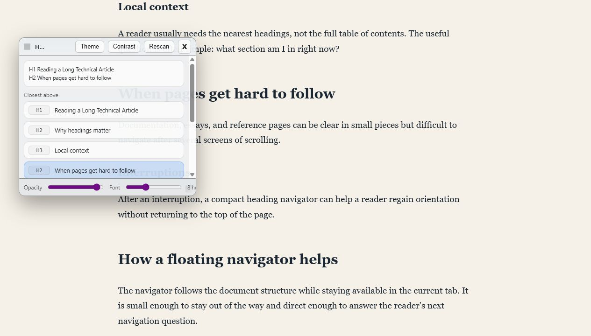

# Show Headers Bookmarklet

A bookmarklet that opens a floating heading navigator on long article pages.

## What it does

Show Headers reads the `h1` through `h6` headings on the current page, tracks your reading position, and shows nearby headings in a compact floating panel.

It is useful for long articles, documentation pages, essays, and reference pages where the heading structure helps you stay oriented.

## Install

Open the project page with `index.html`.

Drag the **Drag Show Headers to your bookmarks bar** link to your browser's bookmarks bar.

Open an article, then click **Show Headers** from your bookmarks bar.

## Use

Click **Show Headers** while reading a long page. The floating navigator appears in the current tab and updates as you scroll.

## Notes

After installation, Show Headers does not require a framework, browser extension, account, server, or build step.

The install link is generated from `showDocumentHeadersBookmarklet.toString()`, so the source lives in one place: `bookmarklet.js`.

The project page is built from `index.html`, `styles.css`, `app.js`, and `bookmarklet.js`. A small local demo page is included as `demo-article.html`.
