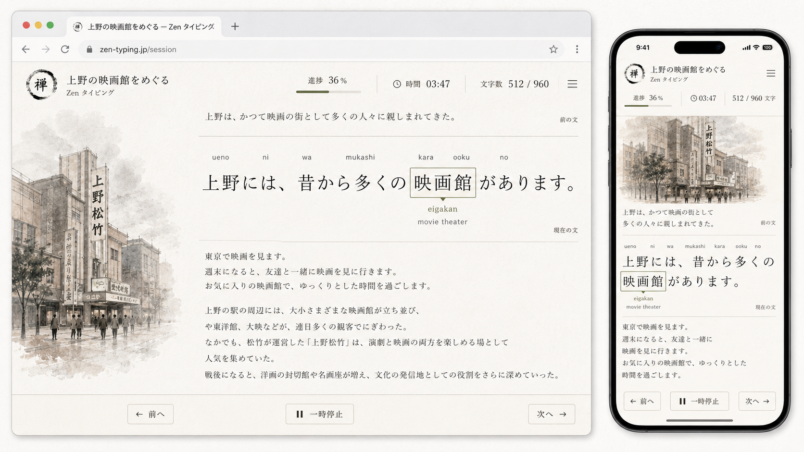

---

A03 Project Purpose

---

This project is a Japanese typing and writing guidance app for focused copying practice. The learner loads one prepared Japanese article, reads it in a calm Zen interface, and retypes it using romaji input.

The app should act as a writing guide on the screen. It presents the text, highlights the current writing target, shows romaji and meaning hints, and helps the learner move through the article in a controlled way. The goal is not to become a general document editor, a course platform, or a typing game. The goal is to guide focused writing practice.

The current primary visual direction is based on the combined design: Design 8 provides the clean e-ink writing-tool foundation, and Design 4 contributes the embedded article illustration system and literary calm. Design 1 is not part of the primary direction for now.

The app should support a refined, paper-like, e-ink-inspired interface with large Japanese typography, subtle lines, minimal controls, and optional article illustrations aligned beside the text. The most important interaction is the active sentence focus: one previous sentence appears above, the active sentence is magnified in the center, and the remaining article text appears below in normal size. 

---

B03 Primary UX Model

---

The app displays an article as a sequence of sentences and tokens. The learner types through the article one token at a time. The current token is highlighted inside the active sentence.

The reading view is divided into three text zones.

| Zone              | Purpose                                     | Visual treatment                       |
| ----------------- | ------------------------------------------- | -------------------------------------- |
| Previous sentence | Context from the sentence already completed | Normal size, above active sentence     |
| Active sentence   | Current writing target                      | Magnified, centered, visually dominant |
| Remaining text    | Upcoming article content                    | Normal size, below active sentence     |

Only one previous sentence should be shown in the dedicated previous-sentence zone. This keeps enough context without making the screen busy.

The active sentence should be much larger than the normal article text. It should feel like the sentence has been lifted out for focused writing. This active sentence is the center of the experience.

The remaining text below should still be readable, but it should not compete with the active sentence. It provides context and lets the learner understand where the article is going.

---

C03 Sentence Flow Rules

---

At the beginning of an article, there is no previous sentence. The previous-sentence zone should either be hidden or kept as empty vertical space, depending on which layout feels calmer. The first sentence becomes the active magnified sentence.

After the learner completes the first sentence, that sentence moves into the previous-sentence zone. The second sentence becomes the active magnified sentence. The rest of the article remains below in normal size.

This pattern continues through the article. At any moment, the learner sees the previous sentence, the active sentence, and the remaining text.

At the final sentence, the previous-sentence zone still shows the sentence before the final sentence. The active sentence is the final sentence. The remaining-text zone may be empty. The app should not force empty placeholder text under the final sentence.

After the final sentence is completed, the app should enter the session report state. It should not keep advancing into an artificial blank sentence.

Manual caret movement must update the sentence zones immediately. If the learner moves backward, the previous sentence and remaining text should be recalculated from the selected active sentence.

---

D03 Token and Caret Behavior

---

The article is split into typed units called tokens. A token can be a word, particle, punctuation mark, date, name, or phrase.

The app should not split Japanese by character unless the lesson author explicitly chooses character-level practice. For normal writing practice, 日本 is one token, 映画館 is one token, and 二枚ください may be one token or a phrase token depending on the lesson.

The active token appears inside the magnified active sentence. It is marked with a thin rectangular caret frame. The frame should be visible but calm. It should not use bright colors unless the high-contrast theme is active.

Above the active token, the app shows romaji. Below the active token, the app shows a short English meaning. If the token has a kana reading and the UI setting enables readings, the reading can be shown near the meaning or above the token. The default view should show romaji and meaning, not every possible annotation.

Example active token display:

```txt
                  eigakan
上野には、昔から多くの 映画館 があります。
               movie theater
```

The romaji and meaning must stay visually attached to the active token. They should not drift to the bottom of the sentence card or become detached from the caret frame. In CSS terms, the active token should be an inline-block or inline-grid positioning context, and its romaji and meaning should be absolutely positioned relative to that active token, not relative to the whole active sentence container.

The caret should move with a short smooth animation, around 100 to 180 ms. It should not jump harshly. The animation should be subtle enough that it feels like a writing cursor moving through a sentence.

The caret should not move forward only because time passed. The app may mark the learner as behind, but the current token remains active until it is typed, skipped, or manually changed.

---

E03 Delay Model

---

The app should use delay, not difficulty. Difficulty is subjective and vague. Delay is a pacing value.

Delay describes how much expected time a token receives before the learner is considered behind the target pace. Delay does not force the caret to move.

The lesson format supports named delay values and exact millisecond overrides.

| Delay value | Intended use                                    |        Default |
| ----------- | ----------------------------------------------- | -------------: |
| short       | Particles, punctuation, very common short words |         700 ms |
| medium      | Normal words                                    |        1400 ms |
| long        | Dates, names, kanji compounds, phrases          |        2600 ms |
| delay-ms    | Exact override                                  | Author-defined |

A token can use `delay="medium"` or `delay-ms="5000"`. If both are present, `delay-ms` wins.

The learner can adjust the delay presets in settings. A beginner can make short, medium, and long slower without editing the lesson file. A faster learner can make them shorter.

The session report should record both the resolved expected delay and the actual elapsed typing time. This allows slow-token review to detect words that need more practice.

---

F03 Desktop Layout

---

The desktop layout uses a browser-based app shell with no sidebar. The sidebar from Design 8 is removed.

The top browser chrome is not part of the app logic, but the app itself should feel good when running inside a browser tab. The app header begins below the browser chrome.

The app header contains the article identity on the left and session status on the right.

| Header element             | Behavior                                                       |
| -------------------------- | -------------------------------------------------------------- |
| Article icon or small logo | Optional, decorative but restrained                            |
| Article title              | Shows current lesson title                                     |
| Subtitle                   | Usually "Zen タイピング" or lesson mode                             |
| Progress                   | Shows percent complete and a thin progress bar                 |
| Timer                      | Shows elapsed active time                                      |
| Character count            | Shows typed characters over total characters                   |
| Audio button               | Appears only when browser Japanese text-to-speech is available |
| Menu icon                  | Opens minimal session menu                                     |

There is no persistent navigation sidebar in Zen mode. The app should not show lesson lists, history, favorites, or settings as a left menu while practicing.

The main content area is divided into two columns on desktop.

| Column                    | Purpose                                            |
| ------------------------- | -------------------------------------------------- |
| Left article image column | Optional article artwork anchored to the text      |
| Right reading column      | Previous sentence, active sentence, remaining text |

The left image column is not a menu. It is part of the article content. It should be visually quiet, like an editorial illustration.

The right reading column holds the actual writing flow.

The bottom control bar contains only the essential controls: previous, pause, and next. It should stay visible but quiet.

---

G03 Mobile Layout

---

The mobile layout must preserve the same logic as desktop, but the layout becomes vertical and single-column.

The mobile order should be:

| Mobile order | Content                               |
| ------------ | ------------------------------------- |
| 1            | Compact app header                    |
| 2            | Progress, timer, and character count  |
| 3            | Current anchored image if one applies |
| 4            | Previous sentence                     |
| 5            | Magnified active sentence             |
| 6            | Remaining text                        |
| 7            | Bottom controls                       |

On mobile, the article image appears as a compact banner or card near the top of the relevant content. It should not dominate the mobile screen. The active sentence must remain the primary focus.

The mobile header should not include a sidebar. The hamburger menu may exist, but it should open an overlay menu only when tapped. It should not create permanent visual clutter.

The mobile bottom controls should be touch-friendly. They should contain previous, pause, and next. They may be fixed at the bottom if the screen height allows it, but they must not cover the active sentence. The content area should include enough bottom padding so the final lines of remaining text do not disappear behind the control bar.

CSS implementation guidance:

| Layout condition                      | Behavior                                                                   |
| ------------------------------------- | -------------------------------------------------------------------------- |
| Desktop width                         | Use two columns: image column and reading column                           |
| Tablet or narrow desktop              | Reduce image column width or collapse image above text                     |
| Mobile width under about 900 px       | Use one column and place the image before the sentence zones               |
| Small mobile width under about 520 px | Hide nonessential status details such as character count if space is tight |
| Bottom controls on mobile             | Use fixed or sticky bottom bar with safe-area padding                      |
| Active sentence on mobile             | Keep it large, but allow natural wrapping                                  |
| Romaji and meaning on mobile          | Attach to the active token, not to the sentence container                  |

Mobile tap targets should be at least 44 px high. Previous, pause, next, audio, and menu controls should satisfy this minimum.

The active sentence may wrap across multiple lines on mobile. The active token frame, romaji, and meaning must remain attached even when the sentence wraps. The token should behave as a self-contained inline unit.

---

H03 Article Image System

---

The app supports article images. These images are optional. A lesson may contain no images, one image, or multiple images.

Images are anchored inside the article text, but the actual image data is stored at the bottom of the lesson document. This avoids placing large base64 strings inside the readable article body.

The article body contains lightweight image anchors. Each anchor references an image asset by ID.

The image assets are defined later in the document, after the article content, inside an asset section.

This gives two benefits. The body remains manually editable, and the image data still travels inside a single lesson file.

---

I03 Image Anchor Behavior

---

An image anchor marks where an image should be visually aligned with the text.

On desktop, the image should appear in the left article image column aligned vertically with the sentence, paragraph, or section where the anchor appears.

On mobile, the image should appear inline near the anchor location, usually above the related paragraph or above the active sentence if the anchor belongs to the current sentence.

If the article contains one image near the beginning, the image appears near the top-left content area. As the article scrolls, that image should not stay pinned forever unless explicitly configured. After the content moves past the image anchor, the left image column can become empty.

If another image anchor appears later in the article, that later image appears aligned with that later text. The app should not stack unrelated images at the top. Images belong to anchor positions.

The image column can therefore contain empty space. Empty space is acceptable and intentional. It preserves the calm editorial layout.

The app should support these anchor scopes.

| Anchor scope | Meaning                                          |
| ------------ | ------------------------------------------------ |
| section      | Image belongs to a section                       |
| paragraph    | Image belongs to a paragraph                     |
| sentence     | Image belongs to a sentence                      |
| token        | Image belongs to a specific token, rarely needed |

For this project, paragraph and section anchors are the most useful.

---

J03 Lesson Document Image Format

---

The lesson document should use custom HTML-like elements.

The readable article content uses image references like this:

```html
<jp-image-ref id="img-ueno-shochiku-01" placement="side" scope="section"></jp-image-ref>
```

The actual image data appears at the bottom of the document:

```html
<jp-assets>
  <jp-image
    id="img-ueno-shochiku-01"
    mime="image/png"
    alt="Ink illustration of an old Ueno theater street"
    title="上野松竹のイメージ"
    data="data:image/png;base64,iVBORw0KGgoAAAANSUhEUgAA..."
  ></jp-image>
</jp-assets>
```

The `data` attribute can contain a data URL such as `data:image/png;base64,...`.

Because base64 image data is long, all `jp-image` elements should stay inside `jp-assets` at the bottom of the lesson. The article body should only contain short references.

The app should also support a nested form if long attributes become hard to edit:

```html
<jp-image id="img-ueno-shochiku-01" mime="image/png" alt="Ink illustration of an old Ueno theater street">
  <jp-image-data>
    data:image/png;base64,iVBORw0KGgoAAAANSUhEUgAA...
  </jp-image-data>
</jp-image>
```

The parser should normalize both forms into the same internal asset record.

---

K03 Image Rendering Rules

---

On desktop, the image column should have a fixed visual width relative to the page. It should be wide enough to show an illustration clearly, but not so wide that it weakens the active sentence.

A good starting ratio is 30 percent for the image column and 70 percent for the reading column. On narrower desktop widths, this can shift to 25 percent and 75 percent. On mobile, the image column collapses into an inline banner.

The image should use a quiet treatment: grayscale, sepia, ink, watercolor, washi, or low-saturation. The app should not force recoloring, but the default article image style should assume quiet editorial art.

The image should have soft edges or a natural paper boundary. It should not look like a loud thumbnail card.

If an image is missing, invalid, or not loaded, the image column should reserve space only if the layout needs it. Otherwise, it may collapse. The app should not show a broken image icon in Zen mode. A small diagnostics menu can report the missing asset outside the practice flow.

If multiple image anchors are visible near the same scroll position, the closest relevant anchor to the active sentence wins. The app should avoid showing two large images at once in the side column unless a future layout explicitly supports that.

---

L03 Practice Controls

---

The visible practice controls are previous, pause, and next.

| Control  | Desktop label | Mobile label | Behavior                                                                             |
| -------- | ------------- | ------------ | ------------------------------------------------------------------------------------ |
| Previous | `← 前へ`        | `← 前へ`       | Moves caret to previous token or previous sentence depending on current control mode |
| Pause    | `一時停止`        | `一時停止`       | Pauses timing and input tracking                                                     |
| Next     | `次へ →`        | `次へ →`       | Moves caret to next token or next sentence depending on current control mode         |

The UI screenshot shows previous and next as large bottom controls. For implementation, the app should support both token-level and sentence-level movement.

The default behavior should be token-level during typing. If the learner is focused inside a sentence, previous moves to the previous token and next moves to the next token.

When the learner holds Shift or uses a sentence-navigation mode, previous and next move by sentence.

Keyboard controls:

| Key                | Behavior                                                   |
| ------------------ | ---------------------------------------------------------- |
| ArrowLeft          | Move to previous token                                     |
| ArrowRight         | Move to next token                                         |
| Shift + ArrowLeft  | Move to previous sentence                                  |
| Shift + ArrowRight | Move to next sentence                                      |
| P                  | Pause or resume                                            |
| Escape             | Pause and open minimal session menu                        |
| Enter              | Confirm current token if needed                            |
| Backspace          | Edit current typed input                                   |
| Space              | Pause only in romaji mode if not needed for IME conversion |

Space can pause only in romaji validation mode. If a future Japanese-output mode is added, Space should remain available for IME conversion and should not be the primary pause key.

---

M03 Session Status Display

---

The interface should show session status without becoming a dashboard.

Required status values:

| Status           | Meaning                                        |
| ---------------- | ---------------------------------------------- |
| Progress percent | Completed portion of the article               |
| Progress bar     | Thin visual progress line                      |
| Timer            | Active session time, excluding pauses          |
| Character count  | Typed characters over total article characters |

Optional status values can appear in the report, not in Zen mode. WPM, accuracy, mistakes, and hard-word counts should not dominate the main practice screen unless the user enables a more technical theme.

The current UX direction shows progress, time, and character count. That is the correct default.

---

N03 Visual Style

---

The primary style is e-ink editorial Zen.

The background should be warm off-white or light gray with a subtle paper texture. The design should feel close to a clean writing document, not a dashboard.

The typography should be elegant and highly readable. Japanese text should be large, with generous line spacing.

The active sentence should be magnified but not exaggerated. It should feel like a reading loupe or focus strip.

The active token frame should be thin and calm. The accent color should be muted gray, olive, or soft ink. Avoid bright blue in the primary theme unless the user selects a tech theme.

The article illustration should be monochrome or low-saturation. The example direction is an old Ueno theater street rendered in ink or washi style.

The interface should avoid:

```txt
Persistent sidebars
Large dashboards
Bright gamification colors
Badges and streaks in the practice view
Heavy shadows
Dense menus
Multiple competing panels
```

The final product should look calm, quiet, and implementable.

---

O03 Article Text Rendering

---

The article renderer must support three simultaneous views of the same document.

The previous sentence is rendered from the sentence immediately before the active sentence.

The active sentence is rendered from the current sentence and enlarged. Token annotations appear only in or around the active sentence.

The remaining text is rendered from all text after the active sentence. It appears in normal article size.

The app should avoid duplicated text. The previous sentence should not also appear in the remaining text. The active sentence should not also appear in the remaining text.

When the active sentence changes, the renderer recalculates all three zones.

Punctuation belongs to the sentence. If the learner completes the final punctuation mark, the sentence is considered complete.

---

P03 Lesson Format

---

The lesson format should stay HTML-compatible with custom elements. It is not arbitrary XML. It should be parseable with browser DOM APIs.

Basic structure:

```html
<jp-lesson id="ueno-cinema" title="上野の映画館をめぐる" lang="ja" version="0.3">
  <jp-section id="s-001" title="上野の映画館">
    <jp-image-ref id="img-ueno-shochiku-01" placement="side" scope="section"></jp-image-ref>

    <jp-sentence id="s-001-001">
      <jp-token id="t-001" text="上野" reading="うえの" romaji="ueno" meaning="Ueno" type="place" delay="medium"></jp-token>
      <jp-token id="t-002" text="は" reading="は" romaji="wa" aliases="ha" meaning="topic marker" type="particle" delay="short"></jp-token>
      <jp-token id="t-003" text="、" type="punctuation" delay="short"></jp-token>
      <jp-token id="t-004" text="かつて" reading="かつて" romaji="katsute" meaning="once" type="word" delay="medium"></jp-token>
      <jp-token id="t-005" text="映画" reading="えいが" romaji="eiga" meaning="movie" type="word" delay="medium"></jp-token>
      <jp-token id="t-006" text="の" reading="の" romaji="no" meaning="of" type="particle" delay="short"></jp-token>
      <jp-token id="t-007" text="街" reading="まち" romaji="machi" meaning="town" type="word" delay="medium"></jp-token>
      <jp-token id="t-008" text="として" reading="として" romaji="toshite" meaning="as" type="phrase" delay="medium"></jp-token>
      <jp-token id="t-009" text="親しまれてきた" reading="したしまれてきた" romaji="shitashimarete kita" meaning="has been loved" type="phrase" delay="long"></jp-token>
      <jp-token id="t-010" text="。" type="punctuation" delay="short"></jp-token>
    </jp-sentence>
  </jp-section>

  <jp-assets>
    <jp-image
      id="img-ueno-shochiku-01"
      mime="image/png"
      alt="Ink illustration of an old Ueno theater street"
      title="上野松竹のイメージ">
      <jp-image-data>
        data:image/png;base64,...
      </jp-image-data>
    </jp-image>
  </jp-assets>
</jp-lesson>
```

The app should render sentence text from token order, not from raw text nodes. This keeps typing alignment reliable.

The lesson format should not include audio files. Audio is handled by browser text-to-speech, not by MP3 or embedded audio assets.

---

Q03 Token Model

---

Each token should become an internal token record after parsing.

| Field      | Required                                | Purpose                                         |
| ---------- | --------------------------------------- | ----------------------------------------------- |
| id         | Yes                                     | Stable token identifier                         |
| lessonId   | Yes                                     | Parent lesson                                   |
| sectionId  | Yes                                     | Parent section                                  |
| sentenceId | Yes                                     | Parent sentence                                 |
| index      | Yes                                     | Absolute token order                            |
| text       | Yes                                     | Visible Japanese                                |
| reading    | No                                      | Kana reading                                    |
| romaji     | No for punctuation, yes for typed words | Expected romaji                                 |
| aliases    | No                                      | Accepted alternate inputs                       |
| meaning    | No                                      | Short English gloss                             |
| type       | Yes                                     | word, particle, punctuation, phrase, name, date |
| delay      | No                                      | short, medium, long                             |
| delayMs    | No                                      | Exact delay override                            |
| tags       | No                                      | Search and review metadata                      |

Punctuation tokens can have no romaji. The app can either auto-advance punctuation, ask the learner to type punctuation, or use a setting. The default should ask for Japanese punctuation only if punctuation practice is enabled. Otherwise punctuation is included visually but not a typing burden.

The token model intentionally does not include `audioSrc`. Audio is generated from token or sentence text through browser text-to-speech.

---

R03 Input Validation

---

The MVP should use romaji validation. The learner types Latin letters, and the app compares input to the active token's `romaji` or `aliases`.

The app should support common romaji variants.

| Japanese | Accepted examples |
| -------- | ----------------- |
| し        | shi, si           |
| ち        | chi, ti           |
| つ        | tsu, tu           |
| ふ        | fu, hu            |
| じ        | ji, zi            |
| を        | wo, o             |
| ん        | n, nn, n'         |

The app should record the exact input typed, even when an alias is accepted. This is useful for later feedback.

A future Japanese-output mode can validate final Japanese text after IME conversion. The MVP should start with romaji validation because it is more predictable.

---

S03 Local Storage Recovery

---

The app supports one active article at a time.

The app should not use IndexedDB in this version. It should not manage a library of imported articles, accounts, cloud sync, or long-term multi-article history.

The app uses `localStorage` only to recover the latest active article and session state after accidental refresh, tab close, or browser restart.

The purpose of local storage is recovery, not full data management.

The app should save these values:

| localStorage key                | Purpose                                                            |
| ------------------------------- | ------------------------------------------------------------------ |
| `jpTyping.currentArticleSource` | Raw latest lesson document text                                    |
| `jpTyping.currentArticleHash`   | Hash or simple fingerprint of the article source                   |
| `jpTyping.currentState`         | Current sentence index, token index, pause state, and session mode |
| `jpTyping.currentStats`         | Current session statistics for the active article                  |
| `jpTyping.currentSettings`      | User settings such as delay presets, font size, theme, TTS option  |
| `jpTyping.currentTypedInput`    | Current partially typed input, if any                              |

When the page loads, the app checks local storage. If a valid saved article exists, the app restores the article, active sentence, active token, settings, and current statistics.

When a new article is imported, the app overwrites the stored article and reinitializes all article-specific state. That means position, typed input, progress, and current statistics are reset for the new article.

The app should not retain progress from multiple articles in this version. Replacing the article means replacing the stored session.

---

T03 Article Import, Drag-and-Drop, and Confirmation

---

The app should support drag-and-drop article import.

When the user drags a file over the app, the app should show a clear drop overlay. The overlay should visually indicate that the user can drop a lesson document.

The drop overlay should be calm and consistent with Zen mode. It should not look like a full dashboard. It can say something like:

```txt
Drop article to load
Current progress will be replaced after confirmation
```

When the user drops a file, the app should parse enough of the file to identify it as a likely lesson document. Then it should show a custom in-app confirmation dialog.

The app should not use the browser's native `confirm()` dialog. The confirmation should be a custom modal or sheet styled as part of the app.

The confirmation should clearly state the consequence:

```txt
Replace current article?
This will erase the current article progress and load the new article.
```

The confirmation actions should be explicit:

| Action          | Behavior                                                               |
| --------------- | ---------------------------------------------------------------------- |
| Cancel          | Close dialog and keep current article and progress                     |
| Replace article | Clear current article state, load new article, save it to localStorage |

If the new article fails validation, the app should not overwrite the current article. It should show a calm validation error and keep the old article active.

---

U03 Practice Modes

---

The app should support three practice modes.

| Mode            | Description                                                        |
| --------------- | ------------------------------------------------------------------ |
| Article mode    | Type the full article from beginning to end                        |
| Sentence mode   | Repeat one selected sentence until it feels easy                   |
| Hard words mode | Practice tokens that were slow, wrong, skipped, or manually marked |

Article mode is the default and should use the full three-zone layout.

Sentence mode can still show the previous and next sentence for context, but the repeated sentence remains the active magnified sentence.

Hard words mode can be implemented after the basic article flow works. Because this version stores only one active article in localStorage, hard words mode should use only the current article's saved session statistics.

---

V03 Session Report

---

After a session ends, the app shows a compact report. The report should not appear during Zen typing unless the learner opens it.

The report should include:

| Report item        | Purpose                            |
| ------------------ | ---------------------------------- |
| Active typing time | Time excluding pauses              |
| Completed tokens   | Scope of practice                  |
| Accuracy           | Overall correctness                |
| Slow tokens        | Words that exceeded expected delay |
| Missed tokens      | Tokens with mistakes               |
| Skipped tokens     | Tokens manually skipped            |
| Hard words         | Review candidates                  |

The hard-word system should use performance history, not subjective difficulty.

A token becomes a hard-word candidate when it is repeatedly slow, mistyped, skipped, or manually marked. In this version, this is limited to the current article because only one active article is saved.

---

W03 Browser Text-to-Speech

---

The app supports audio through browser built-in text-to-speech.

The app should use the Web Speech API through `window.speechSynthesis` and `SpeechSynthesisUtterance`.

The app should not support MP3 files, embedded audio files, base64 audio assets, or `audio-src` attributes in the lesson format.

The app should detect whether text-to-speech is available.

The audio button should appear only when both conditions are true:

| Condition              | Requirement                                                    |
| ---------------------- | -------------------------------------------------------------- |
| Browser support        | `window.speechSynthesis` exists                                |
| Japanese voice support | At least one available voice has a language starting with `ja` |

Voices may load asynchronously. The app should check available voices on startup and should also listen for the `voiceschanged` event.

The app should prefer a Japanese voice with a language such as `ja-JP`. If multiple Japanese voices exist, the app can pick the first by default and allow the learner to choose another Japanese voice in settings.

When speaking text, the app should create an utterance with Japanese language settings:

```js
const utterance = new SpeechSynthesisUtterance(text);
utterance.lang = "ja-JP";
utterance.voice = selectedJapaneseVoice;
speechSynthesis.speak(utterance);
```

The audio button should be near the header controls, close to settings or menu. It should not clutter the active sentence.

The default audio action should speak the active sentence. A secondary action in the menu can speak the current token.

If text-to-speech is unavailable or no Japanese voice is available, the app should hide the audio button entirely. It may show a note inside settings, but it should not show a dead or disabled audio button in the main Zen interface.

---

X03 Theme and Font Controls

---

The primary theme is the e-ink editorial Zen theme shown in the combined design.

The app should also support future themes, but the current design note defines the default.

Default visual settings:

| Setting                   | Default direction        |
| ------------------------- | ------------------------ |
| Background                | Warm off-white paper     |
| Main text color           | Near-black ink           |
| Secondary text            | Muted gray               |
| Accent                    | Muted olive or soft gray |
| Active token frame        | Thin outlined box        |
| Active sentence font size | Large, magnified         |
| Normal text font size     | Smaller reading size     |
| Line height               | Generous                 |
| Controls                  | Quiet outlined buttons   |

The learner should be able to increase and decrease font size. Font changes should affect active sentence, previous sentence, and remaining text proportionally.

Font size should be saved in `localStorage` as part of current settings.

---

Y03 Minimal Menu and Reset

---

The hamburger menu exists, but it should not be a sidebar.

When opened, it should appear as a small overlay or modal. It may contain:

```txt
Resume
Restart sentence
Reset current article progress
Import article
Font size
Theme
Text-to-speech voice
Session report
Settings
Exit practice
```

The menu should close automatically when the learner resumes typing.

The reset action must use a custom in-app confirmation dialog, not a browser native confirmation.

The reset confirmation should say clearly:

```txt
Reset current article progress?
This keeps the current article but clears the current position, typed input, and session statistics.
```

The reset actions should be:

| Action         | Behavior                                                                                   |
| -------------- | ------------------------------------------------------------------------------------------ |
| Cancel         | Keep current progress                                                                      |
| Reset progress | Keep article source, reset sentence index, token index, typed input, timer, and statistics |

Reset does not remove the current article from localStorage. It only reinitializes the active article's progress.

Import article is separate from reset. Importing a new article replaces the current article and its progress after confirmation.

The practice screen itself remains clean.

---

Z03 Implementation Priorities

---

The first milestone should implement the combined UX exactly enough to validate the experience.

MVP requirements:

| Feature                                             | Required          |
| --------------------------------------------------- | ----------------- |
| Load one lesson document                            | Yes               |
| Support one active article at a time                | Yes               |
| Parse custom elements                               | Yes               |
| Parse tokens and sentences                          | Yes               |
| Parse image anchors                                 | Yes               |
| Parse base64 image assets from bottom asset section | Yes               |
| Save latest article and state in localStorage       | Yes               |
| Restore latest article after refresh                | Yes               |
| Show custom drag-and-drop overlay                   | Yes               |
| Show custom replacement confirmation                | Yes               |
| Show custom reset confirmation                      | Yes               |
| Render desktop Zen layout without sidebar           | Yes               |
| Render mobile Zen layout without sidebar            | Yes               |
| Show previous sentence                              | Yes               |
| Show active sentence magnified                      | Yes               |
| Show remaining text                                 | Yes               |
| Highlight active token                              | Yes               |
| Keep romaji and meaning attached to active token    | Yes               |
| Previous, pause, next controls                      | Yes               |
| Keyboard navigation                                 | Yes               |
| Delay presets                                       | Yes               |
| Browser Japanese text-to-speech                     | Yes, if supported |
| Session report                                      | Basic version     |

Post-MVP:

| Feature                         | Priority                   |
| ------------------------------- | -------------------------- |
| Japanese-output validation      | High                       |
| Hard words mode                 | Medium                     |
| Lesson editor                   | Medium                     |
| Multiple advanced themes        | Low                        |
| Automatic Japanese tokenization | Low, human review required |
| Multi-article library storage   | Later, not this version    |

The core design decision remains this: the app is a focused Japanese copying environment. It uses the screen as a writing guide, keeps the active sentence magnified, keeps only one previous sentence for context, keeps remaining text visible below, anchors article images beside or near related text, saves only the latest active article in localStorage, and uses browser Japanese text-to-speech instead of audio files.


## Appendix A: Visual Design and layout 

This is the mandatory asset, and it should be reviewed by the coding agent as the design and layout guidance.



For guidance, you review (mandatory) mockup page at: `./010-main-specification.assets/muckup-sample.html`


## Appendix B - Export to Tango


The hamburger menu should include one export action for the current article.

The menu item label should be:

```txt
Export / Share with Tango
```

This action is part of the MVP. It is not a post-MVP feature.

The goal is to let the learner send the current article text to Tango by opening a specially formatted URL. Tango receives the text from the URL hash and imports it as Japanese text.

The app should export the plain Japanese article text, not the full annotated lesson document. The exported text should not include token metadata, romaji, meanings, image assets, settings, progress, or statistics.

The exported text should be created from the visible article content in sentence order. It should include Japanese punctuation and line breaks where useful. It should not include the previous/current/remaining UI split. That split is only a display model.

------

B01 Share URL Format

------

The Tango share URL must use this structure:

```txt
https://tango-japanese.app/mine#import-japanese-text=BASE64:...]]];
```

The URL has these parts:

| Part                              | Meaning                                    |
| --------------------------------- | ------------------------------------------ |
| `https://tango-japanese.app/mine` | Tango destination page                     |
| `#`                               | URL hash separator                         |
| `import-japanese-text`            | Import command key                         |
| `=`                               | Separates command key from payload         |
| `BASE64`                          | Payload format name                        |
| `:`                               | Separates format name from encoded content |
| `...`                             | Base64-encoded article text                |
| `]]];`                            | End marker for the import payload          |

The command key is fixed:

```txt
import-japanese-text
```

The format name is fixed for this version:

```txt
BASE64
```

The terminator is fixed:

```txt
]]];
```

The final generated URL must always end with the terminator.

------

B02 Encoding Rules

------

The app should encode the article text as UTF-8 before converting it to base64.

The text must be encoded as the article text itself, not as JSON.

Correct payload content:

```txt
上野には、昔から多くの映画館があります。
東京で映画を見ます。
```

Incorrect payload content:

```json
{
  "text": "上野には、昔から多くの映画館があります。"
}
```

The app should normalize line endings to `\n` before encoding.

The app should preserve Japanese punctuation, kanji, kana, spaces if intentionally present, and paragraph breaks.

The app should not export image data.

The app should not export base64 image assets from the lesson document.

The app should not export local progress or current caret position.

------

B03 URL Construction

------

The URL should be constructed as:

```txt
https://tango-japanese.app/mine#import-japanese-text=BASE64:{encodedText}]]];
```

Implementation sketch:

```js
function encodeBase64Utf8(text) {
  const bytes = new TextEncoder().encode(text);
  let binary = "";

  for (const byte of bytes) {
    binary += String.fromCharCode(byte);
  }

  return btoa(binary);
}

function buildTangoImportUrl(articleText) {
  const normalizedText = articleText.replace(/\r\n?/g, "\n");
  const encodedText = encodeBase64Utf8(normalizedText);

  return `https://tango-japanese.app/mine#import-japanese-text=BASE64:${encodedText}]]];`;
}
```

The app should use `TextEncoder` for UTF-8 correctness. It should not use `btoa(articleText)` directly because Japanese text is not Latin-1.

------

B04 Export Action Behavior

------

When the learner chooses `Export / Share with Tango`, the app should build the Tango URL from the current article text.

The app should then show a custom in-app share dialog.

The dialog should show:

| Element           | Purpose                                                      |
| ----------------- | ------------------------------------------------------------ |
| Title             | `Export / Share with Tango`                                  |
| Short description | Explains that the current article text will be sent to Tango |
| Open button       | Opens the generated Tango URL                                |
| Copy URL button   | Copies the generated URL                                     |
| Cancel button     | Closes the dialog                                            |

The dialog should not use the browser native `confirm()` dialog.

The dialog should not interrupt typing unless the user explicitly opens it from the hamburger menu.

The suggested dialog text:

```txt
Export current article to Tango?
This shares the plain Japanese article text. Progress, images, romaji, meanings, and settings are not included.
```

Suggested actions:

```txt
Cancel
Copy URL
Open Tango
```

------

B05 Open and Copy Behavior

------

`Open Tango` should open the generated URL in the current tab or a new tab depending on implementation preference.

For MVP, opening in a new tab is safer because it does not destroy the current practice session.

Recommended behavior:

```js
window.open(tangoUrl, "_blank", "noopener,noreferrer");
```

`Copy URL` should copy the generated URL to the clipboard.

Recommended behavior:

```js
await navigator.clipboard.writeText(tangoUrl);
```

If clipboard access is unavailable, the app should show the URL in a read-only text area so the learner can copy it manually.

------

B06 Validation and Failure Cases

------

If no article is loaded, the menu item should be hidden or disabled.

If the article has no exportable text, the app should show a calm error message:

```txt
There is no article text to export.
```

If base64 encoding fails, the app should show:

```txt
Export failed. The article text could not be encoded.
```

If clipboard copy fails, the app should keep the dialog open and expose the URL for manual copying.

If the generated URL becomes very long, the app should still generate it. However, the dialog should prefer `Open Tango` over asking the user to inspect the URL manually.

------

B07 MVP Requirement

------

This Tango export/share feature must be implemented in the MVP.

MVP requirements for this appendix:

| Feature                                                      | Required |
| ------------------------------------------------------------ | -------- |
| Hamburger menu item: `Export / Share with Tango`             | Yes      |
| Export plain article text only                               | Yes      |
| Encode text as UTF-8 base64                                  | Yes      |
| Generate `https://tango-japanese.app/mine#import-japanese-text=BASE64:...]]];` URL | Yes      |
| Add `]]];` terminator                                        | Yes      |
| Show custom share dialog                                     | Yes      |
| Copy URL action                                              | Yes      |
| Open Tango action                                            | Yes      |
| Exclude images, progress, romaji, meanings, and settings     | Yes      |

The export function is intentionally simple. It is a bridge from the writing guidance app to Tango, using a hash-based import command with a base64 text payload.

------

C01 Appendix C - Main Application Flow

------

This appendix describes how the app is used from the learner's point of view. It is written as flow-by-example, not as a strict technical state machine, but each scenario should still be implemented deliberately.

The app has a simple purpose: the learner opens the page, loads one Japanese article, and uses the screen as a writing guide. The learner practices by rewriting the article shown on the screen. The app guides the process sentence by sentence and token by token, so the learner can notice words, readings, sentence structure, and typing rhythm.

The app should feel quiet when nothing is happening, clear when the learner needs to act, and protective when an action may erase progress.

------

C02 First Open, No Article Loaded

------

When the learner opens the app for the first time and there is no saved article in local storage, the app starts in an empty Zen state.

The page should not look broken, blank, or technical. It should greet the learner and explain the purpose of the app in plain language. The learner should immediately understand that the next step is to upload or drop an article file.

Suggested empty-state text:

```txt
Japanese Writing Practice

Practice Japanese by rewriting an article from the screen.

Load a Japanese article, then follow the highlighted sentence and type each word with romaji. The app will guide you through the article, show small hints, and help you notice words as you write.

Drop an article file here, or upload one from your computer.
```

The primary action should be:

```txt
Upload Article
```

The empty state should also support drag-and-drop over the main app window. When the learner drags a file over the page, the app should visually become a drop target.

Suggested drop overlay text:

```txt
Drop article to begin
```

This screen appears only when there is no valid saved article. If local storage contains a valid saved article, the app should skip this empty state and restore the previous writing practice experience.

At this point, there is no active sentence, no timer, no progress, and no report. The header may still show the app identity, but session status should be hidden or inactive.

------

C03 Restoring a Saved Article

------

When the learner opens the app and local storage contains a valid saved article, the app should restore the previous practice state automatically.

The learner should return to the same article, active sentence, active token, current typed input, font settings, theme settings, delay settings, and available progress. This is the main reason local storage exists.

The app should not ask a restore question every time. If the saved state is valid, restoration should feel natural. A small non-blocking message can appear briefly:

```txt
Restored your last article.
```

Even after restoration, the learner must still be able to load a different article. This can happen in two ways. The learner can open the hamburger menu and choose Import Article, or the learner can drag a new article file over the practice screen. Both actions should use the same replacement flow described later.

If the saved article exists but is invalid or cannot be parsed, the app should not crash. It should show the empty state and offer to clear the broken saved state.

Suggested recovery message:

```txt
The saved article could not be restored.

Upload a new article to continue.
```

------

C04 Loading the First Article

------

When the learner chooses Upload Article or drops a file into the empty app, the app reads the file as text and validates it as a lesson document.

The app should confirm that the document has at least one lesson root, one sentence, and at least one typed token. If images are present, the app should parse image anchors and image assets. If images are missing or invalid, the article can still load, but the image area should stay empty or show no image.

After validation succeeds, the app loads the article immediately because there is no existing article to replace.

The first sentence becomes the active sentence. The previous-sentence zone is hidden or empty because nothing has been completed yet. The remaining-text zone shows the rest of the article below the active sentence.

The timer should not start just because the article loaded. The calmer default is to start timing on first input. The learner should be allowed to look at the article before typing without being penalized.

After the article loads, the app should provide a short first-use hint near the active sentence or input area:

```txt
Start typing the romaji for the highlighted word.
```

This hint should disappear after the learner begins typing.

------

C05 Replacing the Current Article

------

When an article is already loaded and the learner uploads, imports, or drops another article, the app must protect the current session.

The app should not immediately replace the current article. It should show a custom in-app confirmation dialog. This dialog must not use the browser's native `confirm()`.

The replacement flow can be reached from the hamburger menu through Import Article, from an upload button if one is shown in a menu or overlay, or from drag-and-drop while the practice screen is active.

The confirmation message should be direct:

```txt
Replace current article?

This will erase the current article progress and load the new article.
```

The actions should be:

```txt
Cancel
Replace Article
```

If the learner chooses Cancel, the app returns to the current practice session exactly as it was.

If the learner chooses Replace Article, the app clears the current article state, resets position, timer, typed input, and statistics, then saves the new article and new initial state to local storage.

If the new article fails validation, the app must keep the current article. It should not partially replace local storage with a broken document.

------

C06 Drag-and-Drop While Practicing

------

Drag-and-drop should work both in the empty state and inside the active practice experience.

When the learner drags a file over the practice screen, the app should show a calm full-window drop overlay. This overlay should not permanently change layout. It only appears while the drag is active.

Suggested overlay text when an article is already loaded:

```txt
Drop article to replace current article

You will be asked to confirm before progress is erased.
```

When the learner drops the file, the app should validate the file enough to know that it is a likely lesson document, then show the replacement confirmation.

The drag-and-drop path and the Import Article menu path should share the same replacement logic. There should not be two separate implementations with different behavior.

------

C07 Main Practice Session

------

In the main practice session, the learner sees a calm article view with a clear writing target.

The layout has three sentence zones. The previous sentence appears at normal size above the focus area. The active sentence appears magnified in the center. The remaining article appears below in normal reading size.

The active token is framed by the caret. Romaji appears close above the token. Meaning appears close below the token. These annotations belong to the token, not to the whole sentence. They must move with the token when the caret moves.

The learner types the expected romaji for the active token. When the token is accepted, the caret moves to the next token with a short smooth movement. The app records the attempt, elapsed time, mistakes, and whether an alias was used.

The app should not make a large visual event out of every correct token. The movement itself is enough feedback. Mistakes can be shown quietly through the input state or a subtle token warning.

The app should not automatically jump ahead just because the expected delay expired. Delay is for pacing and statistics, not forced movement.

------

C08 Completing a Sentence

------

When the learner completes the final token of the active sentence, the app advances to the next sentence.

The completed sentence moves into the previous-sentence zone. The next sentence becomes magnified. The remaining-text zone recalculates and removes both the previous sentence and active sentence from its content.

This transition should feel like the page is moving forward, not like a page reload.

The image system should also update at this point. If an image anchor belongs to the new active section or paragraph, the desktop side image or mobile image banner should update. If no image applies, the image area may become empty or collapse depending on layout.

------

C09 Manual Navigation

------

The learner can move manually because practice is not always linear.

ArrowLeft moves to the previous token. ArrowRight moves to the next token. Shift plus ArrowLeft moves to the previous sentence. Shift plus ArrowRight moves to the next sentence.

The bottom Previous and Next controls should follow the current navigation mode. In the default typing mode they move by token. In sentence-navigation mode they move by sentence.

When the learner moves manually, the app recalculates the three sentence zones. If the learner moves back into an earlier sentence, that sentence becomes the active magnified sentence again. The previous sentence and remaining text update around it.

Manual movement should reset the active token timing after a short settle period. The learner should not be penalized for navigating.

------

C10 Pause and Resume

------

The learner can pause the session from the bottom Pause button, from the keyboard shortcut, or from the hamburger menu.

When paused, the app stops active typing time. It should not count paused time as typing time. The current article, current sentence, current token, and typed input stay visible.

The pause state should be clear but quiet. The app can show a small overlay or label:

```txt
Paused
```

The learner resumes by pressing the same pause control again or by choosing Resume from the menu.

The app should save pause state to local storage. If the learner refreshes the page while paused, the restored session should still be paused.

------

C11 Restarting the Current Sentence

------

The hamburger menu includes Restart Sentence.

Restart Sentence is not destructive at the article level. It does not need a confirmation dialog.

When selected, the app keeps the current article and current active sentence, but resets the current sentence's token position to the first token of that sentence. It clears typed input for that sentence attempt and restarts timing for the sentence.

This action is useful when the learner wants to repeat the sentence immediately without resetting the whole article.

Restart Sentence should not clear progress from earlier completed sentences. It should only affect the active sentence attempt.

------

C12 Resetting Article Progress

------

The hamburger menu includes Reset Current Article Progress.

Reset is not the same as import. Reset keeps the current article but clears progress.

When the learner chooses Reset Current Article Progress, the app shows a custom confirmation dialog.

Suggested message:

```txt
Reset current article progress?

This keeps the current article but clears the current position, typed input, timer, and session statistics.
```

The actions should be:

```txt
Cancel
Reset Progress
```

If confirmed, the app returns to the first sentence, clears typed input, clears current session statistics, resets the timer, and writes the reset state to local storage.

The article source remains saved. The learner does not need to import it again.

------

C13 Refresh and Browser Recovery

------

The app should assume that the learner may accidentally refresh the page.

On every important state change, the app saves the current article source and current state to local storage. Important state changes include article import, token advancement, sentence advancement, pause, reset, settings changes, and typed input changes.

After refresh, the app restores the latest article and resumes from the saved state.

The restored session should not feel like a new import. It should feel like the same writing exercise continued.

The app should avoid saving too aggressively on every keystroke if that causes performance issues. A small debounce is acceptable. The important point is that normal refresh recovery works.

------

C14 Hamburger Menu Flow

------

The hamburger menu is a temporary overlay, not a sidebar.

The learner opens it when they need actions that are not part of the core writing flow. The practice screen stays clean by default.

The menu should include:

```txt
Resume
Restart Sentence
Reset Current Article Progress
Import Article
Export / Share with Tango
Font Size
Theme
Session Report
Settings
```

Resume closes the menu and returns to practice.

Restart Sentence restarts only the current sentence and does not require confirmation.

Reset Current Article Progress clears article progress and requires confirmation.

Import Article opens the article upload flow. If an article is already loaded, importing a new article uses the replacement confirmation.

Export / Share with Tango opens the Tango export dialog from Appendix B.

Font Size opens a small custom dialog or sheet for text size.

Theme opens a small custom dialog or sheet with Light and Dark theme choices.

Session Report opens the current report view.

Settings opens a minimal settings panel.

The menu should close when the learner resumes typing or selects an action.

Actions that can erase progress must use a custom confirmation dialog. Export, font size, theme, and session report do not need destructive confirmation.

------

C15 Font Size Flow

------

The Font Size menu item opens a custom in-app dialog or sheet.

The dialog should allow the learner to increase or decrease reading size without leaving the practice screen.

Suggested controls:

```txt
Smaller
Default
Larger
```

The setting should affect the previous sentence, active sentence, remaining text, romaji hints, and meaning hints proportionally.

The app should save the selected font size to local storage. After refresh, the same font size should be restored.

The dialog should be small and calm. It should not behave like a full settings page.

------

C16 Theme Flow

------

The Theme menu item opens a custom in-app dialog or sheet.

For this version, the app should support at least two themes:

```txt
Light
Dark
```

Light is the default e-ink editorial Zen theme.

Dark should preserve the same layout and typography but use a low-light palette. It should not become a neon or gamified interface. The same previous/current/remaining sentence structure must remain intact.

The selected theme should be saved to local storage. After refresh, the same theme should be restored.

The app may support more themes later, but the user flow should only assume Light and Dark for now.

------

C17 Settings Flow

------

Settings is a minimal panel for app-level preferences that do not need to stay visible during practice.

Settings may include delay presets, punctuation behavior, romaji alias behavior, text-to-speech availability, and local recovery status.

Settings should not duplicate every menu action. Font Size and Theme can be quick menu actions, while Settings can expose more technical options.

Settings should be quiet and compact. It should not become a dashboard or a second application.

If text-to-speech is available, Settings can show that speech is enabled. If it is unavailable, Settings can show a note explaining that the browser does not provide Japanese speech support.

The app should not include text-to-speech voice selection in this version. It should use the browser's default Japanese voice when available.

------

C18 Export / Share with Tango Flow

------

When the learner chooses Export / Share with Tango, the app exports the plain Japanese article text, not the lesson document.

The app builds the Tango import URL using the hash-based protocol from Appendix B. It base64-encodes the Japanese text as UTF-8 and appends the fixed terminator.

The app then shows a custom share dialog.

Suggested message:

```txt
Export current article to Tango?

This shares the plain Japanese article text. Progress, images, romaji, meanings, and settings are not included.
```

The actions should be:

```txt
Cancel
Copy URL
Open Tango
```

Open Tango should open a new tab so the current writing session remains safe. Copy URL should copy the generated URL. If clipboard access fails, the app should expose the URL in a read-only field for manual copying.

This feature is part of the MVP.

------

C19 Text-to-Speech Flow

------

If the browser supports text-to-speech and has a Japanese voice, the app shows an audio button near the header controls or inside the menu.

The app should use the browser's default Japanese voice. This version should not expose voice selection as a user-facing feature.

The default audio action is to speak the active sentence in Japanese. This helps the learner hear the sentence before or during writing practice.

If no Japanese voice is available, the app hides the audio button from the main interface. It may show a note in Settings, but the practice screen should not show a dead audio control.

The app should stop current speech when the learner starts another speech action, changes article, resets progress, or leaves the session.

------

C20 Mobile Usage Scenario

------

On mobile, the same practice flow becomes a single-column reading experience.

The learner opens the app. If a saved article exists, it is restored. If not, the app shows the empty state and asks for an article. The learner can choose Upload Article and use the mobile browser's file picker.

After the article loads, the current article image appears as a compact banner when an image anchor applies. Then the previous sentence appears, followed by the magnified active sentence, followed by the remaining text.

The bottom controls stay touch-friendly: Previous, Pause, Next. They may be fixed to the bottom, but the content must have enough bottom padding so text is not hidden behind them.

The active sentence may wrap across multiple lines. The active token frame, romaji, and meaning stay attached to the token. This is the most important mobile detail.

The hamburger menu opens as a modal sheet or overlay. It should not become a sidebar. Destructive actions still use custom confirmations.

------

C21 Session Report Flow

------

The learner can reach the session report in two ways. The app opens it automatically after the final sentence is completed, or the learner opens it manually from the hamburger menu.

During practice, Session Report should show the current session so far. At the end of the article, it should show the completed session.

The report should feel like a quiet summary, not a score screen.

The report should include:

```txt
Active typing time
Completed tokens
Accuracy
Slow tokens
Missed tokens
Skipped tokens
Hard-word candidates
```

From the report, the learner can return to practice, restart the article, export to Tango, or open hard words mode if available.

If hard words mode is not implemented yet, the report can still list slow and missed tokens. It should not show a disabled feature as if it were ready.

------

C22 Error and Edge Flow

------

If the learner drops an unsupported file, the app should show a calm error and keep the current state.

Suggested message:

```txt
This article could not be loaded.

Please choose a valid lesson document.
```

If the article has no tokens, the app should reject it. If the article has text but missing optional images, the app should still load it and leave the image area empty.

If a token has no romaji and is not punctuation, the app should report this as a lesson validation issue. The learner should not get stuck on an untypeable token without explanation.

If text-to-speech fails while speaking, the app should stop speech and show a small non-blocking message. It should not interrupt the typing flow.

If local storage is unavailable, the app should still allow the session to run, but it should show a small warning in Settings or the menu:

```txt
Recovery is unavailable in this browser. Refreshing the page may lose the current session.
```

------

C23 Finished Article Flow

------

When the learner completes the final sentence, the app moves to a session report.

The report should show active typing time, completed tokens, accuracy, slow tokens, missed tokens, skipped tokens, and hard-word candidates.

From the report, the learner can restart the article, return to the final reading position, export to Tango, or open hard words mode if available.

If hard words mode is not implemented yet, the report can still list slow and missed tokens. It should not show a disabled feature as if it were ready.

------

C24 MVP Flow Requirement

------

The MVP must support the complete basic article journey.

The learner opens the app with no article, receives clear loading instructions, uploads one article, practices through the article with previous/current/remaining sentence zones, pauses and resumes, navigates backward and forward, survives browser refresh through local storage recovery, resets progress when needed, exports the article to Tango, and completes the article into a basic report.

The learner must also be able to import a replacement article at any time through the hamburger menu or by drag-and-drop. Replacement must always use a custom confirmation when progress exists.

This flow is the product. Advanced article libraries, accounts, cloud sync, and complex dashboards should not be added before this basic journey feels stable.


------

D00 Appendix D - Hamburger Menu Features and Dialogs

------

This appendix describes the secondary app actions that live behind the hamburger menu. These actions are not part of the normal typing loop, but they are important for making the app usable.

The practice screen should stay quiet. The hamburger menu is the place for article import, export, font size, theme, report, and settings. It should open as a temporary overlay or popover, never as a permanent sidebar.

When the menu is open, typing input should be ignored. The active typing timer should pause while a menu, dialog, or sheet is open, then resume when the learner returns to practice, unless the session was already paused before the menu opened.

------

D01 Hamburger Menu Surface

------

The hamburger menu should look like part of the same e-ink editorial Zen design. It should use the same paper background, thin borders, muted ink color, and calm spacing.

The menu should be compact on desktop and a bottom sheet or centered sheet on mobile. It should not cover the whole app unless the screen is too small.

The menu should include these actions and controls:

| Menu item                      | UI type        | Behavior                                       |
| ------------------------------ | -------------- | ---------------------------------------------- |
| Resume                         | Button         | Closes menu and returns to practice            |
| Restart Sentence               | Button         | Restarts current sentence without confirmation |
| Reset Current Article Progress | Button         | Opens reset confirmation                       |
| Import Article                 | Button         | Opens upload sheet                             |
| Export / Share with Tango      | Button         | Opens Tango export dialog                      |
| Font Size                      | Inline control | Minus, dropdown, plus                          |
| Theme                          | Inline control | Theme dropdown                                 |
| Session Report                 | Button         | Opens report dialog                            |
| Settings                       | Button         | Opens settings dialog                          |

The menu should not include Exit Practice. The app is browser-based, so leaving the app is handled by the browser tab.

------

D02 Import Article - Entry Points

------

The app should support article import from multiple entry points, but all entry points should use one shared import pipeline.

Available import entry points:

| Entry point    | Where it appears               | Behavior                                    |
| -------------- | ------------------------------ | ------------------------------------------- |
| Upload Article | Empty state                    | Opens file picker or accepts drop           |
| Import Article | Hamburger menu                 | Opens upload sheet                          |
| Drag and drop  | Empty state or practice screen | Shows drop overlay and accepts dropped file |

The app should avoid having separate import logic for each entry point. Choosing a file from a button and dropping a file should both end in the same validation and replacement flow.

------

D03 Import Article - Upload Sheet

------

When the learner chooses Import Article from the hamburger menu, the app should open an upload sheet.

The upload sheet should feel like a calm temporary layer over the practice screen. It should not look like a file manager.

Suggested upload sheet text:

```txt
Import Article

Choose a lesson document or drop it here.

The app will validate the article before replacing your current practice session.
```

Suggested actions:

```txt
Cancel
Choose File
```

If there is no current article, the message can be simpler:

```txt
Import Article

Choose a lesson document or drop it here to begin.
```

If there is already a current article, the upload sheet should not erase progress by itself. It only collects the new file. Replacement happens only after validation and confirmation.

------

D04 Import Article - Drag and Drop

------

Drag and drop should work in both the empty state and the active practice screen.

When the browser detects a file being dragged over the app window, the app should show a full-window drop overlay. The overlay should be visible enough to guide the user, but calm enough to fit the Zen interface.

Empty state overlay text:

```txt
Drop article to begin
```

Practice screen overlay text:

```txt
Drop article to replace current article

You will be asked to confirm before progress is erased.
```

The overlay should disappear when the drag leaves the app or when the drop finishes.

Dropping a file should not immediately replace the active article. The app should read the file into a temporary import buffer, validate it, and then continue to the replacement confirmation if needed.

------

D05 Import Article - Validation and State Changes

------

When a file is selected or dropped, the app should read it as text and validate it as a lesson document.

Minimum valid article requirements:

| Requirement                               | Reason                                                |
| ----------------------------------------- | ----------------------------------------------------- |
| Has lesson root                           | Confirms this is a lesson document                    |
| Has at least one sentence                 | Gives the app a typing unit                           |
| Has at least one token                    | Gives the learner something to type                   |
| Typed tokens have romaji or valid aliases | Prevents untypeable tokens                            |
| Image anchors do not break parsing        | Allows optional images without blocking text practice |

If validation fails, the app should not change the current article or local storage.

Suggested validation error:

```txt
This article could not be loaded.

Please choose a valid lesson document.
```

If there is no active article and validation succeeds, the app immediately loads the new article, initializes practice state, saves the article and state to localStorage, and shows the first sentence.

If there is an active article and validation succeeds, the app shows the replacement confirmation.

------

D06 Replace Article Confirmation

------

Replacing an article is destructive for the current practice session. It clears progress for the current article. The app must use a custom in-app confirmation, not a browser native confirmation.

Suggested confirmation text:

```txt
Replace current article?

This will erase the current article progress and load the new article.
```

Actions:

| Action          | Behavior                                                     |
| --------------- | ------------------------------------------------------------ |
| Cancel          | Discards temporary imported file and returns to current article |
| Replace Article | Clears current article state, loads new article, saves new state |

When Replace Article is confirmed, the app should reset sentence index, token index, typed input, timer, session statistics, report state, and any hard-word candidates from the previous article.

The app should preserve global settings such as font size, theme, delay presets, punctuation behavior, and text-to-speech preference.

------

D07 Export / Share with Tango

------

Export / Share with Tango opens a custom export dialog. It should not export automatically when the menu item is clicked.

The export dialog is both a confirmation and an action surface. It tells the learner what will be shared, then gives Copy URL and Open Tango actions.

Suggested dialog text:

```txt
Export current article to Tango?

This shares the plain Japanese article text. Progress, images, romaji, meanings, and settings are not included.
```

Actions:

| Action     | Behavior                                |
| ---------- | --------------------------------------- |
| Cancel     | Closes dialog, no state change          |
| Copy URL   | Copies generated Tango URL to clipboard |
| Open Tango | Opens generated Tango URL in a new tab  |

Open Tango must open a new tab:

```js
window.open(tangoUrl, "_blank", "noopener,noreferrer");
```

Opening Tango must not replace the current practice tab. The writing practice state remains saved in localStorage and unchanged.

If clipboard copying fails, the app should keep the export dialog open and show a read-only text area containing the generated URL.

------

D08 Font Size Inline Control

------

Font Size should be controlled directly inside the hamburger menu. It should not open a separate dialog.

The row should contain a label, a short optional description, a minus button, a dropdown, and a plus button.

Suggested row layout:

```txt
Font Size        [-] [Normal v] [+]
```

Supported values:

| Value       | Meaning                  | Suggested scale |
| ----------- | ------------------------ | --------------- |
| Small       | Smaller reading text     | 0.90            |
| Normal      | Default app size         | 1.00            |
| Large       | Larger reading text      | 1.15            |
| Extra Large | Very large practice text | 1.30            |

The minus button moves to the previous smaller value. The plus button moves to the next larger value. If the current value is Small, the minus button should be disabled. If the current value is Extra Large, the plus button should be disabled.

Changing the dropdown should apply immediately. The learner should see the text size update behind the menu if the menu overlay allows it.

Font size should affect previous sentence, active sentence, remaining text, romaji hint, and meaning hint proportionally. It should not break the active token alignment.

The selected font size should be saved to localStorage as part of current settings.

------

D09 Theme Inline Control

------

Theme should be controlled directly inside the hamburger menu. It should not open a separate dialog.

Suggested row layout:

```txt
Theme            [Light v]
```

Supported MVP values:

| Value | Meaning                              |
| ----- | ------------------------------------ |
| Light | Default e-ink editorial Zen theme    |
| Dark  | Low-light version of the same layout |

Changing the theme should apply immediately and save to localStorage.

The Dark theme should preserve the same layout, sentence flow, typography hierarchy, and token behavior. It should not introduce neon colors, gamification, or a dashboard feeling.

The theme dropdown should be simple. More themes can be added later, but the MVP should only assume Light and Dark.

------

D10 Session Report Dialog

------

Session Report should open as a separate dialog, not as a permanent page.

On desktop, it should appear as a centered paper-like modal. On mobile, it can appear as a full-height sheet or large bottom sheet. It should keep the same calm visual language as the practice screen.

The report can be opened during practice or after the article is completed.

If opened during practice, it shows current progress so far. If opened after completion, it shows the finished session.

Suggested report title:

```txt
Session Report
```

Report sections:

| Section           | Contents                                                     |
| ----------------- | ------------------------------------------------------------ |
| Summary           | Active typing time, progress, completed tokens               |
| Accuracy          | Correct tokens, missed tokens, skipped tokens                |
| Timing            | Slow tokens compared with expected delay                     |
| Review candidates | Words that may need more practice                            |
| Actions           | Return to Practice, Restart Article, Export / Share with Tango |

The report should not feel like a game score. It should be a quiet review of what happened.

Suggested report layout:

```txt
Session Report

Active time       08:42
Progress          64%
Completed tokens  126 / 198
Accuracy          94%

Slow tokens
映画館       eigakan       3.4s
親しまれて   shitashimarete 5.1s

Missed tokens
を           wo / o
ください     kudasai
```

Report actions:

| Action                    | Behavior                                         |
| ------------------------- | ------------------------------------------------ |
| Return to Practice        | Closes report and resumes practice               |
| Restart Article           | Uses reset confirmation before clearing progress |
| Export / Share with Tango | Opens Tango export dialog                        |
| Close                     | Closes report                                    |

If hard words mode is not implemented yet, the report can still show review candidates, but it should not show a fake disabled hard words feature.

------

D11 Settings Dialog

------

Settings should open as a separate dialog or sheet. It should be simple, grouped, and readable, like a minimal browser settings page.

Settings should not duplicate every hamburger menu action. Font Size and Theme are quick controls in the menu. Settings can include them only if needed for consistency, but they should not become the main way to change them.

Settings should use grouped sections with short descriptions. Each setting should explain what it changes.

Suggested settings groups:

```txt
Practice
Input
Display
Speech
Recovery
```

The Settings dialog should use immediate-save behavior. When the learner changes a setting, it is saved to localStorage. A separate Save button is not required. A Close button is enough.

The dialog should include a Reset Settings to Defaults action. That action should use a custom confirmation.

------

D12 Settings - Practice Group

------

Practice settings control timing and pacing.

| Setting      | Control                  | Description                                             |
| ------------ | ------------------------ | ------------------------------------------------------- |
| Short delay  | Number input or dropdown | Expected time for particles and punctuation             |
| Medium delay | Number input or dropdown | Expected time for normal words                          |
| Long delay   | Number input or dropdown | Expected time for names, dates, phrases, and long words |
| Start timer  | Dropdown                 | Start on first input or start manually                  |

Suggested descriptions:

```txt
Short delay affects very small tokens such as particles and punctuation.
Medium delay affects normal words.
Long delay affects phrases, dates, names, and longer kanji compounds.
```

Delay values should update future timing calculations immediately. They should not rewrite the lesson document.

------

D13 Settings - Input Group

------

Input settings control how typing is accepted.

| Setting              | Control  | Description                                                  |
| -------------------- | -------- | ------------------------------------------------------------ |
| Romaji aliases       | Toggle   | Accept common alternate romaji forms such as si for shi      |
| Punctuation practice | Toggle   | Require punctuation typing instead of auto-advancing punctuation |
| Backspace behavior   | Dropdown | Allow editing current token or lock mistakes                 |
| Manual navigation    | Toggle   | Enable ArrowLeft and ArrowRight caret movement               |

For the MVP, romaji aliases should be enabled by default.

Punctuation practice should be disabled by default unless the learner explicitly wants punctuation typing.

Manual navigation should be enabled by default.

------

D14 Settings - Display Group

------

Display settings control reading visibility and layout details.

| Setting            | Control  | Description                                  |
| ------------------ | -------- | -------------------------------------------- |
| Show romaji        | Toggle   | Shows romaji above the active token          |
| Show meaning       | Toggle   | Shows English meaning below the active token |
| Show reading       | Toggle   | Shows kana reading when available            |
| Show article image | Toggle   | Shows anchored article image when available  |
| Caret animation    | Dropdown | Controls how quickly the caret moves         |

Default display settings:

| Setting            | Default |
| ------------------ | ------- |
| Show romaji        | On      |
| Show meaning       | On      |
| Show reading       | Off     |
| Show article image | On      |
| Caret animation    | Normal  |

Caret animation values:

| Value  | Meaning                        |
| ------ | ------------------------------ |
| Off    | No movement animation          |
| Short  | Very quick movement            |
| Normal | Default 100 to 180 ms movement |

The active token hints must remain attached to the token regardless of these settings.

------

D15 Settings - Speech Group

------

Speech settings describe browser text-to-speech status.

The app uses browser built-in text-to-speech. It does not use MP3 files, embedded audio assets, or lesson audio references.

The app should use the browser's default Japanese voice when available. The MVP should not expose voice selection.

Speech group contents:

| Item                  | Behavior                              |
| --------------------- | ------------------------------------- |
| Speech status         | Shows available or unavailable        |
| Japanese voice status | Shows whether a Japanese voice exists |
| Speak active sentence | Optional test button                  |
| Speech rate           | Optional dropdown, default normal     |

If speech is unavailable, the setting should explain it calmly:

```txt
Japanese speech is not available in this browser.
```

If speech is available, the audio button can appear in the practice header or menu.

------

D16 Settings - Recovery Group

------

Recovery settings show localStorage status.

This group should help the learner understand whether refresh recovery is working.

| Item                | Behavior                                             |
| ------------------- | ---------------------------------------------------- |
| Recovery status     | Shows whether localStorage is available              |
| Saved article       | Shows whether an article is currently saved          |
| Last saved          | Shows last save time if available                    |
| Clear saved article | Clears local article and progress after confirmation |

Clear Saved Article is different from Reset Current Article Progress.

Reset Current Article Progress keeps the article and clears progress. Clear Saved Article removes the article and returns to the empty state.

Clear Saved Article should use custom confirmation:

```txt
Clear saved article?

This removes the current article and its progress from this browser.
```

Actions:

```txt
Cancel
Clear Saved Article
```

This action should be in Settings, not in the main hamburger menu, because it is less common and more destructive.

------

D17 Dialog and Overlay Rules

------

All dialogs, sheets, and confirmations should use custom app UI. The app should not use browser native `confirm()`, `alert()`, or `prompt()` for normal user flows.

Dialog visual rules:

| Rule               | Requirement                                   |
| ------------------ | --------------------------------------------- |
| Background         | Soft overlay over the current practice screen |
| Surface            | Paper-like card or sheet                      |
| Text               | Clear, short, and direct                      |
| Buttons            | Explicit action names                         |
| Destructive action | Muted but visually distinct                   |
| Escape key         | Closes non-destructive dialogs                |
| Focus              | Moves into dialog while open                  |
| Timer              | Pauses while dialog is open                   |

On mobile, dialogs can become bottom sheets. Destructive confirmations should still show clear Cancel and destructive action buttons.

Dialogs should preserve the learner's context. Closing a dialog should return to the same sentence, token, typed input, and scroll position.

------

D18 MVP Requirement

------

These menu and dialog features are part of the MVP unless explicitly marked otherwise.

MVP menu requirements:

| Feature                        | Required |
| ------------------------------ | -------- |
| Import Article                 | Yes      |
| Drag-and-drop replacement flow | Yes      |
| Replace Article confirmation   | Yes      |
| Export / Share with Tango      | Yes      |
| Open Tango in new tab          | Yes      |
| Font Size inline control       | Yes      |
| Theme inline control           | Yes      |
| Light and Dark themes          | Yes      |
| Session Report dialog          | Yes      |
| Settings dialog                | Yes      |
| Custom confirmations           | Yes      |
| LocalStorage recovery status   | Yes      |
| Browser text-to-speech status  | Yes      |

The hamburger menu should stay small, but the flows behind it must be precise. The practice view remains Zen because these secondary actions are hidden until the learner asks for them.

