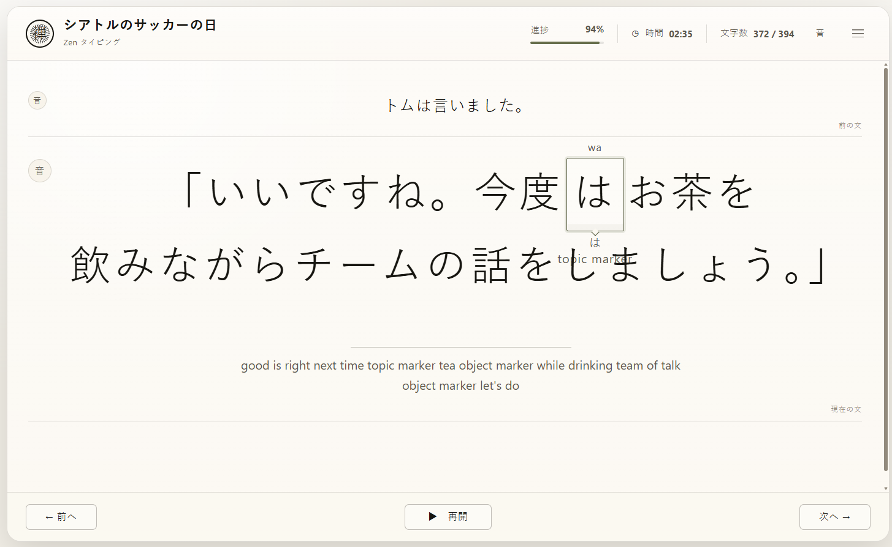

---

A00 Bug Fix Change Request - Active Token Hint Overlap

---

This change request describes one focused UI bug: the active token hints can overlap the magnified sentence text. In the screenshot, the active token is `お茶`, and the lower hint area shows `おちゃ` and `tea`. That lower hint overlaps the next line of the sentence, making both the hint and the Japanese text harder to read.

The current source confirms why this happens. `renderActiveSentence()` appends `focus-hint-top` and `focus-hint-bottom` inside the focused token span, so the hints are attached to the active token. That part is correct. The CSS then absolutely positions the bottom hint below the token with `top: calc(100% + 0.48em)`. Because the hint is absolutely positioned, it does not reserve vertical space in the sentence layout. When the magnified sentence wraps to another line, the bottom hint can float over the next Japanese line.  

The main specification already requires romaji and meaning to stay visually attached to the active token, positioned relative to the token rather than the whole sentence container. So the fix should not detach the hint from the token. It should preserve token attachment while making the overlay readable and less destructive. 

---

A01 Bug Report

---

| ID      | Area               | Severity | Summary                                                                                  |
| ------- | ------------------ | -------: | ---------------------------------------------------------------------------------------- |
| BUG-020 | Active token hints |   Medium | Reading and meaning hints can overlap wrapped Japanese sentence text                     |
| BUG-021 | Hint readability   |   Medium | The lower hint has no background protection, so overlapping text visually mixes together |
| BUG-022 | Theme support      |      Low | Hint overlay background should adapt to Light and Dark themes                            |

Observed behavior: when the active sentence wraps across multiple lines, the lower token hint can overlap the following Japanese line. This happens more often for large active sentence text, large font settings, long sentences, and tokens positioned near the end of a wrapped line.

Expected behavior: the active token hint should stay attached to the active token, but it should remain readable. If it overlaps sentence text, the hint should sit on a calm semi-transparent paper-like background. The background should make the hint readable while still allowing the underlying text to remain faintly visible.

The fix should not move the hint to a detached global area. The hint belongs to the caret.

The codding agent must read this image below and confirm there is visual bug first and that it is clearly visible. 




---

A02 Root Cause

---

The root cause is the combination of these rules:

```css
.focus-hint-bottom {
  position: absolute;
  left: 50%;
  transform: translateX(-50%);
  top: calc(100% + 0.48em);
}
```

The hint is positioned relative to `.focus-token`, but it is removed from normal line layout. The surrounding `.sentence-line` can wrap normally, but the bottom hint does not increase line height or push the next line down. The current `.sentence-line` uses large type and a line-height of `1.72`, which is usually enough but not guaranteed for every sentence, token, and font-size combination. 

So the bug is not that the hint is attached to the token. That is intended. The bug is that the attached hint is visually unprotected when it overlays nearby sentence text.

---

B00 Suggested Fix

---

The preferred fix has two layers.

First, add a theme-aware semi-transparent background to the active token hints. This directly solves readability when overlap occurs.

Second, slightly increase the protected visual area around the focused token so the overlap is less frequent.

---

B01 Add Theme Variables for Hint Backgrounds

---

Add these variables to the Light theme:

```css
:root,
[data-theme="light"] {
  --hint-surface: color-mix(in srgb, var(--paper) 82%, transparent);
  --hint-surface-strong: color-mix(in srgb, var(--paper) 90%, transparent);
  --hint-border: color-mix(in srgb, var(--line-strong) 60%, transparent);
}
```

Add equivalent Dark theme variables:

```css
[data-theme="dark"] {
  --hint-surface: color-mix(in srgb, var(--paper) 78%, transparent);
  --hint-surface-strong: color-mix(in srgb, var(--paper) 88%, transparent);
  --hint-border: color-mix(in srgb, var(--line-strong) 70%, transparent);
}
```

The important part is that the hint background should be mostly visible but still slightly transparent. The target is roughly 80 percent surface visibility and 20 percent transparency.

---

B02 Apply Background to Token Hints

---

Update both hint containers:

```css
.focus-hint-top,
.focus-hint-bottom {
  z-index: 3;
  padding: 0.18em 0.42em;
  border: 1px solid var(--hint-border);
  border-radius: 999px;
  background: var(--hint-surface);
  backdrop-filter: blur(2px);
  box-shadow: 0 1px 4px color-mix(in srgb, var(--ink) 8%, transparent);
}
```

For the lower hint, use a slightly stronger background because it is more likely to overlap the sentence:

```css
.focus-hint-bottom {
  background: var(--hint-surface-strong);
}
```

This keeps the hint readable without making it look like a loud badge.

---

B03 Improve Lower Hint Layout

---

The lower hint currently uses a grid with multiple child spans. Keep that structure, but make it a compact pill or small stacked capsule:

```css
.focus-hint-bottom {
  top: calc(100% + 0.38em);
  display: inline-grid;
  gap: 0.12em;
  justify-items: center;
  max-width: min(14em, 42vw);
  white-space: nowrap;
}
```

If reading and meaning are both enabled, the capsule can stack them. If only meaning is enabled, it remains one line.

For very long meanings, prevent the capsule from becoming too wide:

```css
.focus-hint-bottom span {
  max-width: 100%;
  overflow: hidden;
  text-overflow: ellipsis;
}
```

---

B04 Give the Focused Token More Visual Clearance

---

Add a little bottom margin to the focused token. This can increase the line box and reduce overlap:

```css
.token.focus-token {
  margin: 0 0.06em 0.34em;
}
```

If this affects line rhythm too much, use a smaller value:

```css
.token.focus-token {
  margin-bottom: 0.22em;
}
```

This does not replace the background fix. It only reduces how often the overlap happens.

---

B05 Mobile Adjustment

---

On mobile, the sentence wraps more often, so use a stronger compact style:

```css
@media (max-width: 900px) {
  .focus-hint-top,
  .focus-hint-bottom {
    padding: 0.16em 0.36em;
    max-width: min(12em, 56vw);
    backdrop-filter: blur(2px);
  }

  .focus-hint-bottom {
    top: calc(100% + 0.34em);
  }

  .token.focus-token {
    margin-bottom: 0.28em;
  }
}
```

This keeps hints readable on narrow screens without making the active sentence layout too tall.

---

B06 Optional Stronger Fix If Overlap Still Happens

---

If overlap remains common after the background fix, add a class to the active sentence when hints are visible:

```js
els.activeSentence.classList.toggle(
  "has-token-bottom-hint",
  runtime.settings.showMeaning || runtime.settings.showReading
);
```

Then increase active sentence line height only when needed:

```css
.active-sentence.has-token-bottom-hint .sentence-line {
  line-height: 1.9;
}
```

On mobile:

```css
@media (max-width: 900px) {
  .active-sentence.has-token-bottom-hint .sentence-line {
    line-height: 2.02;
  }
}
```

This is more layout-changing than the background fix, so it should be treated as the second step, not the first step.

---

C00 Acceptance Criteria

---

| ID     | Acceptance check                                                                         |
| ------ | ---------------------------------------------------------------------------------------- |
| AC-039 | The lower token hint remains attached to the active token                                |
| AC-040 | The lower token hint is readable when it overlaps Japanese sentence text                 |
| AC-041 | The upper romaji hint is readable when it overlaps nearby text                           |
| AC-042 | Hint backgrounds are theme-specific and work in Light and Dark themes                    |
| AC-043 | Hint backgrounds are semi-transparent, not fully opaque blocks                           |
| AC-044 | The active sentence remains visually calm and Zen-like                                   |
| AC-045 | Long meanings do not stretch the hint capsule across the whole sentence                  |
| AC-046 | Mobile wrapped sentences keep hints readable                                             |
| AC-047 | The fix does not move hints to a detached global area                                    |
| AC-048 | The focused token frame, arrow pointer, romaji, reading, and meaning still move together |

---

D00 Implementation Priority

---

| Priority | Fix                                                                            |
| -------- | ------------------------------------------------------------------------------ |
| 1        | Add theme variables for hint surfaces                                          |
| 2        | Add semi-transparent background, padding, border, and z-index to hint elements |
| 3        | Compact the lower hint layout and limit width                                  |
| 4        | Add small bottom margin to the focused token                                   |
| 5        | If needed, increase sentence line-height only when bottom hints are visible    |

The minimum acceptable fix is the themed semi-transparent hint background. The more complete fix is background plus small spacing plus responsive mobile tuning.

---

A00 Bug Fix Change Request - Active Token Hint Readability Without Visual Regression

---

This change request replaces the previous active-token hint fix. The previous fix introduced visual regressions by styling romaji, reading, and meaning hints as rounded pill-like badges, adding borders, and allowing text truncation through ellipsis. That is not acceptable for this app.

This is an educational writing practice app. Hints are learning content. They must remain readable, complete, quiet, and visually secondary. The only framed element should be the active Japanese token itself.

The correct fix is narrow: improve readability when hints overlap nearby Japanese text, without turning hints into UI badges and without hiding educational content.

---

A01 Bug Report

---

| ID      | Area                   | Severity | Summary                                                                     |
| ------- | ---------------------- | -------: | --------------------------------------------------------------------------- |
| BUG-020 | Active token hints     |     High | Reading and meaning hints can overlap wrapped Japanese sentence text        |
| BUG-021 | Visual regression      |     High | Previous fix styled hints as rounded pill bubbles                           |
| BUG-022 | Content loss           |     High | Previous fix allowed hint text to be clipped or replaced with ellipsis      |
| BUG-023 | Educational regression |     High | Truncated hints hide learning content the user needs to read                |
| BUG-024 | Visual hierarchy       |   Medium | Borders and pill backgrounds make hints compete with the active token frame |

Observed behavior: when the active sentence wraps, the lower hint area can overlap the next Japanese line. This makes the sentence harder to read.

Regression caused by the previous fix: the hint text was placed inside small rounded capsules. For short hints like `ne`, this becomes a small oval bubble. For longer hints, `overflow: hidden` and `text-overflow: ellipsis` can hide the content. That makes the app worse for learning.

Expected behavior: hints should remain plain annotation text. They may receive a subtle theme-aware background behind the text to preserve readability, but they must not become rounded badges, must not get borders, and must not be truncated.

---

A02 Correct Design Rule

---

Only the active Japanese token receives a visible frame.

Romaji, reading, and meaning are annotations. They should look like quiet text labels, not controls, badges, pills, or chips.

Correct visual model:

```txt
romaji annotation
[ active Japanese token frame ]
reading annotation
meaning annotation
```

The hint text may have a very subtle rectangular background behind it when needed for readability. The background should look like a soft paper scrim, not a UI component.

Do not add:

```txt
rounded pill background
large border radius
border around hint text
box shadow around hint text
ellipsis
overflow hidden
fixed max width that clips content
```

---

A03 Root Cause

---

The overlap happens because the hint elements are positioned close to the active token, and the active sentence can wrap across multiple lines. When the lower hint is positioned below the token, it may visually collide with the next line of Japanese text.

The root cause is layout pressure around the active token, not a need for badge styling.

The app needs to keep the hints attached to the active token while making them readable.

---

A04 Non-Negotiable Requirements

---

| Requirement          | Rule                                                   |
| -------------------- | ------------------------------------------------------ |
| Full hint visibility | Romaji, reading, and meaning must not be truncated     |
| No ellipsis          | Do not use `text-overflow: ellipsis` on learning hints |
| No clipping          | Do not use `overflow: hidden` on learning hints        |
| No pill styling      | Do not use `border-radius: 999px` or similar on hints  |
| No hint border       | Do not add borders around hint text                    |
| Token frame remains  | The active Japanese token keeps its existing frame     |
| Hints stay attached  | Hints remain visually tied to the active token         |
| Theme aware          | The background adapts to Light and Dark themes         |
| Educational priority | Readability of learning content wins over compactness  |

---

B00 Suggested Fix

---

The preferred fix is a minimal visual correction.

Use a subtle semi-transparent background behind hint text. Do not add border, border radius, shadow, clipping, or ellipsis.

The background should be flat and quiet. It should simply separate the hint from the text behind it.

---

B01 Remove the Bad Rules

---

Remove these rules from hint styling:

```css
border-radius: 999px;
border: 1px solid ...;
box-shadow: ...;
overflow: hidden;
text-overflow: ellipsis;
max-width: ...; /* when used to force clipping */
```

Also remove any rounded hint capsule classes that were added only for this fix.

The app should not visually treat hints as buttons or badges.

---

B02 Add Theme Variables for a Plain Hint Scrim

---

Add theme-specific variables.

Light theme:

```css
:root,
[data-theme="light"] {
  --hint-scrim: color-mix(in srgb, var(--paper) 82%, transparent);
  --hint-scrim-strong: color-mix(in srgb, var(--paper) 88%, transparent);
}
```

Dark theme:

```css
[data-theme="dark"] {
  --hint-scrim: color-mix(in srgb, var(--paper) 78%, transparent);
  --hint-scrim-strong: color-mix(in srgb, var(--paper) 86%, transparent);
}
```

If `color-mix()` is not acceptable for browser support, use explicit RGBA variables instead.

Example fallback:

```css
:root,
[data-theme="light"] {
  --hint-scrim: rgba(251, 248, 241, 0.82);
  --hint-scrim-strong: rgba(251, 248, 241, 0.88);
}

[data-theme="dark"] {
  --hint-scrim: rgba(32, 31, 28, 0.78);
  --hint-scrim-strong: rgba(32, 31, 28, 0.86);
}
```

---

B03 Apply Background Without Badge Styling

---

Use this direction for hint elements:

```css
.focus-hint-top,
.focus-hint-bottom,
.focus-reading,
.focus-meaning {
  border: 0;
  border-radius: 0;
  box-shadow: none;
  overflow: visible;
  text-overflow: clip;
  white-space: nowrap;
  background: transparent;
}
```

Then apply only a flat background to the text-bearing parts:

```css
.focus-hint-top,
.focus-reading,
.focus-meaning {
  background: var(--hint-scrim);
  padding: 0 0.12em;
  box-decoration-break: clone;
  -webkit-box-decoration-break: clone;
}
```

For the lower hint, where overlap is more likely, use the stronger scrim:

```css
.focus-reading,
.focus-meaning {
  background: var(--hint-scrim-strong);
}
```

This gives the hint text a readable backing without creating a rounded UI component.

---

B04 Keep Hints Plain and Complete

---

Use wrapping only for long English meaning text. Do not truncate.

```css
.focus-meaning {
  white-space: normal;
  overflow-wrap: anywhere;
  max-width: min(22em, 70vw);
  text-align: center;
}
```

Keep kana reading and romaji on one line:

```css
.focus-hint-top,
.focus-reading {
  white-space: nowrap;
}
```

Do not apply ellipsis to any of these elements.

---

B05 Preserve the Active Token Frame Only

---

The active Japanese token should remain the only framed element.

```css
.focus-token-text,
.token.focus-token {
  border: 1.5px solid var(--accent);
}
```

Do not add any border to:

```txt
romaji hint
kana reading
English meaning
```

If the current implementation frames `.token.focus-token` as the whole unit, keep that existing frame behavior only if it frames the Japanese token cleanly. If it starts framing the hint stack, move the frame to a child element such as `.focus-token-text`.

Preferred structure:

```html
<span class="token focus-token">
  <span class="focus-hint-top">ocha</span>
  <span class="focus-token-text">お茶</span>
  <span class="focus-hint-bottom">
    <span class="focus-reading">おちゃ</span>
    <span class="focus-meaning">tea</span>
  </span>
</span>
```

The frame belongs to `.focus-token-text`, not to `.focus-hint-top` or `.focus-hint-bottom`.

---

B06 Reduce Overlap With Spacing, Not Clipping

---

If the background alone is not enough, increase the line rhythm of the active sentence. This is safer than hiding text.

```css
.sentence-line {
  line-height: 2.05;
}
```

For mobile or very large font sizes:

```css
@media (max-width: 900px) {
  .sentence-line {
    line-height: 2.18;
  }
}
```

This gives hint text more room while preserving all content.

If the active sentence becomes too tall, tune line-height carefully, but do not solve it with ellipsis.

---

B07 Optional Layout Reservation Fix

---

If overlap still happens with long sentences, make the focused token a real inline-grid unit so the hint stack participates more predictably in layout.

```css
.token.focus-token {
  display: inline-grid;
  grid-template-rows: auto auto auto;
  justify-items: center;
  align-items: center;
  vertical-align: middle;
  margin: 0 0.08em;
  line-height: 1;
}

.focus-hint-top {
  grid-row: 1;
  margin-bottom: 0.10em;
}

.focus-token-text {
  grid-row: 2;
}

.focus-hint-bottom {
  grid-row: 3;
  margin-top: 0.10em;
  display: inline-grid;
  justify-items: center;
  gap: 0.06em;
}
```

This is acceptable only if the hint remains plain text. Do not add rounded containers.

---

C00 Corrected CSS Patch

---

This is the recommended patch direction.

```css
:root,
[data-theme="light"] {
  --hint-scrim: rgba(251, 248, 241, 0.82);
  --hint-scrim-strong: rgba(251, 248, 241, 0.88);
}

[data-theme="dark"] {
  --hint-scrim: rgba(32, 31, 28, 0.78);
  --hint-scrim-strong: rgba(32, 31, 28, 0.86);
}

.focus-hint-top,
.focus-hint-bottom,
.focus-reading,
.focus-meaning {
  border: 0;
  border-radius: 0;
  box-shadow: none;
  overflow: visible;
  text-overflow: clip;
  color: var(--ink-soft);
}

.focus-hint-top {
  background: var(--hint-scrim);
  padding: 0 0.12em;
  white-space: nowrap;
  box-decoration-break: clone;
  -webkit-box-decoration-break: clone;
}

.focus-hint-bottom {
  background: transparent;
  display: inline-grid;
  justify-items: center;
  gap: 0.06em;
}

.focus-reading,
.focus-meaning {
  background: var(--hint-scrim-strong);
  padding: 0 0.12em;
  box-decoration-break: clone;
  -webkit-box-decoration-break: clone;
}

.focus-reading {
  white-space: nowrap;
}

.focus-meaning {
  white-space: normal;
  overflow-wrap: anywhere;
  max-width: min(22em, 70vw);
  text-align: center;
}

.focus-token-text {
  border: 1.5px solid var(--accent);
  border-radius: 4px;
  background: color-mix(in srgb, var(--paper) 82%, transparent);
}
```

This patch intentionally uses no rounded hint pills, no borders on hints, no shadows on hints, and no ellipsis.

---

D00 Acceptance Criteria

---

| ID     | Acceptance check                                                     |
| ------ | -------------------------------------------------------------------- |
| AC-049 | Romaji, reading, and meaning never show ellipsis                     |
| AC-050 | Romaji, reading, and meaning are never clipped by `overflow: hidden` |
| AC-051 | Hint text remains fully readable in normal use                       |
| AC-052 | Hint text does not become a rounded pill, chip, bubble, or badge     |
| AC-053 | Hint text has no border                                              |
| AC-054 | Only the active Japanese token has a visible frame                   |
| AC-055 | The lower hint remains attached to the active token                  |
| AC-056 | The lower hint is readable when it overlaps nearby Japanese text     |
| AC-057 | Long English meanings wrap instead of truncating                     |
| AC-058 | Kana reading stays visible and is not shortened                      |
| AC-059 | The fix works in Light and Dark themes                               |
| AC-060 | The fix works on desktop and mobile                                  |
| AC-061 | The active sentence remains visually calm and educationally useful   |

---

E00 Implementation Priority

---

| Priority | Fix                                                                       |
| -------- | ------------------------------------------------------------------------- |
| 1        | Remove ellipsis and overflow clipping from all hint elements              |
| 2        | Remove rounded pill styling, borders, and shadows from hint elements      |
| 3        | Add only flat semi-transparent theme-aware background behind hint text    |
| 4        | Keep the active Japanese token frame separate from hint styling           |
| 5        | Increase sentence line-height only if overlap remains common              |
| 6        | Use inline-grid layout only if needed, without changing hints into badges |

The correct fix is not to make the hints look designed. The correct fix is to keep the hints readable, complete, quiet, and attached to the active token.
