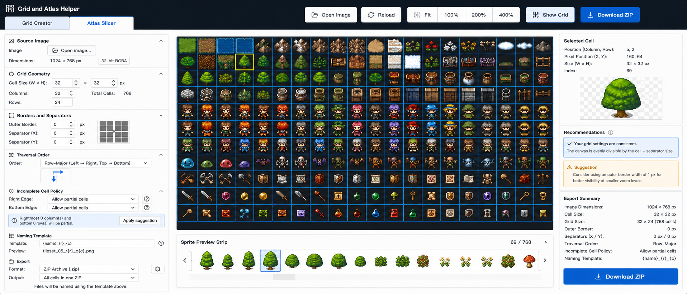

2026-08-01

/c/6a6da4a8-0058-83e8-819c-1befc4d8fed0

------

A00 Purpose of This UX and UI Specification

------

This document defines the visual structure, interaction model, layout behavior, and user experience of the Grid and Atlas Helper web application.

The design is based on the selected Atlas Slicer screenshot and the earlier functional specification. The screenshot is treated as the primary visual direction. The earlier specification remains the source of truth for geometry calculations, rendering semantics, preset behavior, URL state, export behavior, and atlas slicing rules.

The application must feel like compact professional desktop software while remaining technically realistic to implement as a static HTML, CSS, and JavaScript web application.

The design must not imitate a conventional marketing website. It must not use oversized headings, large empty cards, excessive padding, decorative hero areas, or simplified mobile-style controls on desktop.

The interface should instead resemble a technical graphics utility:

- dense but readable;
- predictable;
- stable while values change;
- optimized for repeated use;
- explicit about dimensions and calculated results;
- visually centered around the working image;
- compatible with mouse, keyboard, and touchpad input;
- implementable using native browser controls, CSS, Canvas, and JavaScript modules.

The interface must preserve three stable work areas:

1. The left tools panel.
2. The central workspace.
3. The right contextual information panel.

The left panel contains controls the user manipulates.

The central workspace contains the image, grid, viewport, selection, and sprite preview strip.

The right panel contains information derived from the current state, including selected-cell details, recommendations, warnings, and export information.

Recommendations must not be inserted between ordinary editing controls. The control layout must remain stable even when new recommendations appear.

------

B00 Overall Visual Composition

------

The application occupies the full available browser viewport.

The root application layout is divided vertically into three horizontal layers:

| Layer              | Purpose                                                      |
| ------------------ | ------------------------------------------------------------ |
| Application header | Product identity, mode tabs, and global workspace actions    |
| Main workspace     | Left tools panel, central image workspace, right information panel |
| Status bar         | Compact current-state and pointer information                |

The main workspace is divided horizontally into three columns:

| Region                  | Recommended width        |
| ----------------------- | ------------------------ |
| Left tools panel        | 360 to 440 CSS pixels    |
| Central workspace       | Remaining flexible width |
| Right information panel | 320 to 380 CSS pixels    |

The central workspace must receive the largest share of the viewport.

At a viewport width of approximately 1900 pixels, the approximate proportions should be:

```text
Left panel:     24%
Center area:    56%
Right panel:    20%
```

The widths do not need to be mathematically fixed. The design should use CSS Grid or Flexbox with minimum and maximum widths.

Recommended desktop grid:

```css
.app-main {
  display: grid;
  grid-template-columns:
    minmax(340px, 420px)
    minmax(600px, 1fr)
    minmax(300px, 360px);
  min-height: 0;
}
```

Every major region must have `min-width: 0` and `min-height: 0` where necessary so that child content can scroll instead of forcing the entire application beyond the viewport.

The main browser page should not normally scroll. Scrolling should occur within the left panel, the central viewport when necessary, the sprite strip, and the right panel.

The visual hierarchy should be based on borders, alignment, spacing, and typography rather than shadows.

Strong card shadows should be avoided. Panels should primarily be separated using:

- one-pixel borders;
- subtle background differences;
- section headers;
- whitespace of approximately 8 to 12 pixels;
- consistent alignment.

------

C00 Application Header

------

The application header is the dark horizontal region at the top of the selected design.

Its purpose is to identify the application, switch operating modes, and expose the most frequently used global actions.

The header should remain fixed while the user scrolls within the left or right panels.

Recommended header height:

```text
72 to 82 CSS pixels total
```

The header may be implemented as two logical rows within one visual region:

| Row       | Contents                             |
| --------- | ------------------------------------ |
| Upper row | Application title and global toolbar |
| Lower row | Mode tabs                            |

In the selected screenshot, the title and global toolbar share the upper region, while the mode tabs occupy the lower-left part of the header.

A web implementation may use one CSS grid containing both rows.

------

D00 Application Identity

------

The top-left corner contains a small application mark followed by the title:

```text
Grid and Atlas Helper
```

The icon should be a simple abstract grid symbol. It must not depend on an icon-only interpretation. The product name must always be visible.

The title should use a medium or semibold font weight.

Recommended title size:

```text
16 to 18 CSS pixels
```

The title must not behave like a page-level marketing heading. It is an application identity label.

The title region should remain compact:

```text
Left padding: 14 to 18 px
Icon-to-text gap: 8 px
```

------

E00 Mode Tabs

------

The application exposes two primary modes:

```text
Grid Creator
Atlas Slicer
```

The selected screenshot shows Atlas Slicer as the active mode.

The tabs should appear directly below or visually connected to the application title area.

Each tab must contain visible text. An optional icon may be placed before the text, but an icon must never replace the label.

The active tab must be distinguishable through at least three signals:

1. A different background.
2. Stronger text color.
3. A blue accent line, border, or equivalent selected-state treatment.

The inactive tab should remain clearly interactive without competing with the active tab.

Recommended dimensions:

```text
Tab height: 34 to 38 px
Horizontal padding: 24 to 34 px
Minimum width: 150 px
```

Tab switching must not destroy either mode's configuration.

When the user switches from Atlas Slicer to Grid Creator:

- the shared grid definition remains unchanged;
- Atlas Slicer retains the loaded image in memory;
- the selected cell remains remembered;
- the Atlas Slicer zoom and pan state remain remembered;
- Grid Creator restores its own zoom and pan state;
- the central workspace changes to the Grid Creator preview;
- the left tool sections change to Grid Creator controls;
- the right panel changes to Grid Creator recommendations and export summary.

When the user returns to Atlas Slicer, the previously loaded atlas and viewport must reappear unless the browser has discarded the underlying image resource.

The application must not reload the page when switching tabs.

The active mode should be reflected in URL state where URL synchronization is enabled.

Example:

```text
#mode=atlas-slicer&state=...
```

Keyboard behavior:

```text
Left Arrow: select previous tab
Right Arrow: select next tab
Home: select first tab
End: select last tab
Enter or Space: activate focused tab
```

Tabs should use appropriate ARIA roles.

------

F00 Global Toolbar

------

The global toolbar appears in the upper-right part of the header.

It contains the highest-frequency actions for the active workspace.

The selected Atlas Slicer toolbar contains:

```text
Open image
Reload
Fit
100%
200%
400%
Show Grid
Download ZIP
```

The web implementation must use web-appropriate terminology and behavior.

It must not display operating-system filesystem paths as though the browser can directly write to them.

The actions should be grouped visually.

Recommended grouping:

```text
[Open image] [Reload]
[Fit] [100%] [200%] [400%]
[Show Grid]
[Download ZIP]
```

Small gaps separate controls within a group. Larger gaps separate groups.

Toolbar button height should be consistent:

```text
34 to 38 px
```

Icons may appear before labels, but all important actions must include text.

------

G00 Open Image Action

------

The Open image button invokes a browser file picker using an invisible or visually integrated `<input type="file">`.

The control must accept image formats supported by the application.

Recommended initial `accept` value:

```html
accept="image/png,image/jpeg,image/webp,image/gif"
```

The application should not display a fake editable filesystem path input.

After a file is selected, the Source Image section displays:

- the original filename;
- decoded image width and height;
- detected MIME type;
- color or alpha information where available;
- file size.

The button may continue to say Open image after an image has been loaded. A secondary Replace image label is also acceptable, but Open image is simpler and consistent.

The image is processed locally.

The application must not upload the image.

If the selected file cannot be decoded, the current image must remain visible and an error must appear in the right contextual panel or a localized notification area.

------

H00 Reload Action

------

Reload means re-decode the currently selected browser file and restore its original pixel content.

Because browsers do not guarantee continued access to a local file after a full page reload, this action only applies while the current page session retains the selected `File` object.

Reload may be disabled when no image is loaded.

Reload must not reopen the file picker.

It should be useful when:

- image decoding has been interrupted;
- an internal preview resource was released;
- the application needs to rebuild its decoded bitmap;
- the user wants to reset transient image processing.

This action should not reset grid settings.

------

I00 Fit and Zoom Presets

------

The toolbar contains:

```text
Fit
100%
200%
400%
```

Fit calculates a viewport scale that displays the complete source image inside the central workspace while preserving aspect ratio.

The image must be centered after fitting.

Fit does not alter:

- source image dimensions;
- grid cell dimensions;
- export dimensions;
- slice dimensions;
- preset data.

The percentage buttons set an explicit viewport scale.

At 100%:

```text
1 source image pixel = 1 CSS pixel
```

At 200%:

```text
1 source image pixel = 2 CSS pixels
```

At 400%:

```text
1 source image pixel = 4 CSS pixels
```

The active zoom preset should have a selected visual state.

If wheel zoom produces a value that does not exactly match a preset, none of the fixed percentage buttons need to appear selected. The current zoom value should still appear in the status bar.

The toolbar should later support a dropdown or numeric zoom field for arbitrary values, but the fixed buttons remain visible because they are fast and predictable.

------

J00 Show Grid Control

------

Show Grid is a toggle button.

Its selected state means that the slicing overlay is visible.

Its unselected state means that the source image is shown without grid lines.

Toggling the grid affects only the preview.

It must not alter slicing coordinates or exported sprites.

The control should preserve its current value in session preferences.

The button must visibly indicate state through:

- background;
- border;
- icon treatment;
- `aria-pressed`.

------

K00 Download ZIP Action

------

Download ZIP is the primary Atlas Slicer export action.

It appears as the strongest button in the header and is repeated in the right Export Summary panel.

The repeated button is intentional.

The header button supports fast repeated use.

The right-panel button supports review-before-export behavior.

Both trigger the same export command.

The button must be disabled when:

- no source image is loaded;
- no valid complete or policy-approved cells exist;
- generated filenames contain unresolved duplicates;
- current geometry is invalid;
- another export is already being generated.

When activated, the button initiates browser-side image extraction and JSZip generation.

The browser then downloads the generated archive.

The application must not display an Output path field because the browser controls the download destination.

------

L00 Left Tools Panel

------

The left panel contains the primary editable configuration.

Its purpose is stable control, not contextual advice.

The left panel must not insert, remove, or reorder normal sections when warnings change.

It should use a vertically scrollable container.

Recommended behavior:

```css
.tools-panel {
  overflow-y: auto;
  overflow-x: hidden;
  min-height: 0;
}
```

The panel should retain its scroll position when:

- a value changes;
- the grid rerenders;
- a recommendation appears;
- a selected cell changes.

The scroll position may reset when switching modes, but retaining independent scroll positions per mode is preferable.

The visible Atlas Slicer sections are:

```text
Source Image
Grid Geometry
Borders and Separators
Traversal Order
Incomplete Cell Policy
Naming Template
Export
```

Each section is visually separated by a top border and a compact section header.

------

M00 Tool Section Design

------

Each tool section consists of:

1. A header row.
2. A content region.
3. An optional collapse control.

The header row contains:

- a small generic icon;
- a descriptive section title;
- a collapse chevron on the far right.

Recommended header height:

```text
34 to 38 px
```

Section titles should use:

```text
Font size: 13 to 14 px
Font weight: 600
```

Collapsed sections display only the header.

Expanded sections display their controls below.

Section expansion state should be preserved in session state.

The entire header row should be clickable, not only the chevron.

The section content should use a compact form grid.

Recommended general structure:

```css
.section-form {
  display: grid;
  grid-template-columns: max-content minmax(0, 1fr) max-content;
  column-gap: 8px;
  row-gap: 7px;
  align-items: center;
}
```

Labels are left aligned.

Numeric values are right aligned inside numeric fields.

Units such as `px` appear either:

- in a trailing unit column;
- inside a composed input control;
- as visually associated text immediately after the input.

The interface must not rely on placeholder text as a label.

------

N00 Source Image Section

------

The Source Image section is the first section because all Atlas Slicer calculations depend on the loaded image.

Before an image is loaded, it shows:

```text
Image
[Open image...]
```

After an image is loaded, it shows:

```text
Image
RPG_Tileset_32x32.png

Dimensions
1024 x 768 px

32-bit RGBA
```

The exact color-depth label should only be displayed when the application can reliably determine it. Browser APIs do not always expose original file channel depth directly.

When exact source depth is unknown, use safer labels such as:

```text
PNG with alpha
Decoded RGBA
JPEG
WebP
```

The filename must be truncated with an ellipsis when it is too long, while the complete filename remains available through a tooltip.

The section may include a Clear image action.

Clearing the image must:

- release the object URL;
- clear the selected cell;
- clear atlas-derived dimensions;
- preserve grid configuration;
- disable export;
- leave presets unchanged.

------

O00 Grid Geometry Section

------

The Grid Geometry section controls the usable cell rectangles.

It contains:

```text
Cell Size (W x H)
Columns
Rows
Total Cells
```

Cell width and height are editable integer inputs.

The multiplication symbol between the fields should be visual text, not part of either field.

Example:

```text
Cell Size (W x H): [32] x [32] px
```

Columns and rows may be calculated or user-controlled depending on the active layout mode.

The selected screenshot presents them as editable values.

The specification should preserve support for automatic and fixed-count calculation.

Recommended UI:

```text
Count mode: [Automatic fit | Fixed count]

Columns: [32]
Rows:    [24]
Total Cells: 768
```

When Automatic fit is selected:

- cell width and height remain editable;
- columns and rows are calculated;
- calculated fields appear read-only;
- total cells updates immediately.

When Fixed count is selected:

- columns and rows become editable;
- overflow and truncation are calculated;
- recommendations may suggest canvas, cell-size, or separator changes.

In Atlas Slicer mode, source-image dimensions are authoritative.

The application must never silently resize the loaded image to satisfy the requested count.

All changes update the central grid overlay immediately through animation-frame rendering.

------

P00 Borders and Separators Section

------

This section contains:

```text
Outer Border
Separator X
Separator Y
```

Each value is an integer pixel dimension.

The section includes a small diagram showing the relationship among:

- outer border;
- cells;
- horizontal separators;
- vertical separators.

This diagram is not decorative. It helps users understand which pixels are skipped during slicing.

The diagram should update when border or separator values change.

Recommended diagram behavior:

- dark squares represent cells;
- lighter internal bands represent separators;
- an outer frame represents the border;
- the current origin may be marked;
- hover text explains each region.

The section must preserve the original specification's pixel semantics:

```text
A 32 x 32 cell always contains 32 usable pixels by 32 usable pixels.
Separator pixels are excluded from cells.
Outer-border pixels are excluded from cells.
```

Changing these values must update:

- slice coordinates;
- complete cell count;
- incomplete-cell detection;
- selected-cell metadata;
- atlas overlay;
- sprite preview strip;
- recommendations;
- export summary.

------

Q00 Traversal Order Section

------

Traversal Order determines how cells receive sequential indices and filenames.

The visible control is a dropdown.

Default:

```text
Row-Major (Left -> Right, Top -> Bottom)
```

Supported initial options:

```text
Row-Major (Left -> Right, Top -> Bottom)
Column-Major (Top -> Bottom, Left -> Right)
```

The section includes a small visual direction diagram.

For row-major order, the diagram shows:

```text
right across a row
then down to the next row
```

For column-major order, the diagram shows:

```text
down a column
then right to the next column
```

Changing traversal order must not move cells.

It changes:

- sequential index;
- filename index token;
- sprite-strip order;
- Previous and Next navigation sequence;
- export archive ordering;
- manifest ordering.

The selected cell must remain the same physical row and column after traversal order changes, although its sequential index may change.

------

R00 Incomplete Cell Policy Section

------

This section defines how partial cells at the right and bottom edges are handled.

The selected screenshot shows separate controls:

```text
Right Edge
Bottom Edge
```

This distinction should be retained because an atlas may require different behavior on each axis.

Supported policies:

```text
Skip partial cells
Allow and crop partial cells
Pad with transparency
Pad with solid color
```

The simpler visible label `Allow partial cells` should map to a precisely defined policy. It must not remain ambiguous.

Recommended label:

```text
Crop and include partial cells
```

A contextual explanation may appear inside the section only when it is directly tied to the currently edited control.

However, general recommendations should remain in the right Recommendations panel.

The left section may contain a stable result line:

```text
Right partial columns: 0
Bottom partial rows: 0
```

This line should always occupy the same position, even when the values are zero, so the panel does not move when a partial cell appears.

An Apply suggestion button should not normally appear here. Suggestions belong to the right panel.

This is one adjustment from the selected screenshot.

------

S00 Naming Template Section

------

The Naming Template section controls generated sprite filenames.

It contains:

```text
Template
Preview
```

Recommended default template:

```text
{name}_{row:00}_{column:00}
```

The application should support descriptive tokens:

```text
{name}
{index}
{row}
{column}
{x}
{y}
{width}
{height}
```

Formatting syntax should be documented and remain simple.

Recommended zero-padding syntax:

```text
{index:000}
{row:00}
{column:00}
```

The Preview line must show the filename that would be produced for the selected cell.

Example:

```text
RPG_Tileset_32x32_02_05.png
```

When no cell is selected, preview the first valid cell.

Invalid templates must show an inline field error.

Duplicate output names must appear as an export-blocking issue in the right panel.

The template section should not include a filesystem path.

------

T00 Export Section in the Left Panel

------

The left Export section contains configuration, not the final action summary.

It should contain:

```text
Format
Incomplete-cell output behavior
Image scaling
Manifest inclusion
ZIP structure
```

For Atlas Slicer, initial format support is:

```text
PNG
```

The ZIP container is not the sprite image format. The UI should distinguish:

```text
Sprite format: PNG
Archive: ZIP
```

The screenshot uses `ZIP Archive (.zip)` as Format. This should be adjusted to avoid ambiguity.

Recommended fields:

```text
Sprite format: [PNG]
Archive format: ZIP
Include manifest.json: [checked]
Folder name: sprites
```

The primary Download ZIP action remains in the header and right panel.

The left section should not contain an editable Output path.

A static statement may appear:

```text
The browser will download one ZIP archive.
```

------

U00 Central Workspace

------

The central workspace is the most important region in the application.

It must visually dominate the page.

It contains:

1. The image viewport.
2. The grid overlay.
3. The selected-cell overlay.
4. Pointer and viewport interactions.
5. A compact atlas-state summary.
6. The sprite preview strip.

The central region should have minimal decorative framing.

The image should occupy as much useful area as possible.

The workspace background should be neutral and darker than the side panels when the source atlas is dark, because contrast helps define image bounds.

The source image must remain visually distinguishable from the surrounding viewport.

The central area should never be replaced by a large empty instructional card once an image is loaded.

------

V00 Image Viewport

------

The image viewport is a bounded container with overflow hidden.

The source image and overlays exist inside a shared transform layer.

Recommended structure:

```html
<div class="atlas-viewport">
  <div class="viewport-transform">
    <canvas class="source-layer"></canvas>
    <canvas class="grid-layer"></canvas>
    <canvas class="selection-layer"></canvas>
  </div>
</div>
```

The viewport supports:

```text
Wheel zoom
Middle-button drag pan
Space plus primary-button drag pan
Fit
100%
200%
400%
Reset view
```

The transformed image must remain crisp at integer zoom levels.

Image smoothing should be disabled for pixel-art previews.

The viewport should preserve the image coordinate beneath the mouse pointer when zooming with the wheel.

Panning must not modify slice coordinates.

The pointer cursor should communicate the current operation:

| Condition            | Cursor                                            |
| -------------------- | ------------------------------------------------- |
| Default over atlas   | Crosshair or default selection cursor             |
| Space held           | Grab                                              |
| Panning              | Grabbing                                          |
| Over selectable cell | Pointer or crosshair                              |
| Export in progress   | Default with progress indication outside viewport |

------

W00 Source Image Rendering

------

The source image is rendered as decoded browser image content.

The application should use `ImageBitmap` when available.

The image is drawn at its natural dimensions inside the transformed layer.

The viewport transform controls its displayed size.

No interpolation should be applied for pixel-art assets.

The image must not be resampled merely to fit the viewport.

When Fit is active, CSS or canvas display scaling may reduce the visible size, but source pixels remain unchanged.

The image bounds should be visible.

A one-pixel neutral border may be drawn around the complete source image.

------

X00 Grid Overlay

------

The grid overlay is visually represented by blue lines in the selected screenshot.

The default overlay color should have sufficient contrast over both dark and light image regions.

Recommended default:

```text
#1687d9 or a similar medium blue
```

The overlay must not be baked into the source image.

Its line thickness must remain visually usable across zoom levels.

Two rendering modes may be useful:

```text
Image-pixel mode
Screen-pixel mode
```

In image-pixel mode, a one-pixel grid line becomes larger when zooming in.

In screen-pixel mode, the line remains approximately one CSS pixel wide.

For a technical pixel-grid tool, the initial implementation should prefer image-pixel mode because it accurately communicates separator pixels.

At very low zoom, the renderer may use a minimum visible screen width so the grid does not disappear.

The selected cell uses a visually distinct highlight, such as yellow.

The highlight should include:

- a strong border;
- an optional translucent fill;
- no destructive modification to the atlas;
- a clear relationship to the Selected Cell panel.

------

Y00 Cell Selection

------

Clicking a complete or policy-recognized partial cell selects it.

Selection updates:

- selected row;
- selected column;
- sequential index;
- source x and y;
- source width and height;
- selected-cell preview;
- naming preview;
- sprite-strip selected item;
- status bar;
- available Save Cell PNG action.

The selected cell should remain centered or visible when navigation occurs through the sprite strip.

Clicking a separator should use a predictable policy.

Recommended behavior:

```text
A click on a separator selects no new cell.
```

An optional tooltip may identify the separator.

Clicking outside the grid but inside the image clears the cell selection only when the user explicitly clicks empty atlas area.

The application should not clear selection merely because the user pans or zooms.

Keyboard navigation after the viewport receives focus:

```text
Left Arrow: previous column
Right Arrow: next column
Up Arrow: previous row
Down Arrow: next row
Home: first cell in current row
End: last cell in current row
Ctrl+Home: first valid cell
Ctrl+End: last valid cell
Enter: download selected cell as PNG
```

Keyboard navigation must skip cells excluded by the current incomplete-cell policy.

------

Z00 Atlas State Summary Below the Viewport

------

A compact single-line summary should appear directly under the image viewport and above the sprite preview strip.

Recommended values:

```text
Image: 1024 x 768 px
Grid: 32 x 24
Cell: 32 x 32 px
Total Cells: 768
Zoom: 100%
Selected Cell: (5, 2)
Index: 69
```

This summary provides immediate verification without requiring the user to inspect the side panels.

The line should not wrap on ordinary desktop widths.

When horizontal space is insufficient, lower-priority values may collapse into a `More` disclosure or the region may become horizontally scrollable.

The summary should update synchronously with state.

------

AA00 Sprite Preview Strip

------

The Sprite Preview Strip is directly beneath the atlas viewport.

Its purpose is to provide linear navigation through extracted cell previews.

The strip consists of:

1. A header row.
2. Previous and next navigation buttons.
3. A horizontally scrollable thumbnail track.
4. A selected-item indicator.
5. A current position indicator.

The header displays:

```text
Sprite Preview Strip
69 / 768
```

The first value is the selected sprite position in traversal order.

The second value is the total number of navigable sprites under the active policy.

------

AB00 Sprite Thumbnail Rendering

------

Each item in the sprite strip contains a preview of one cell.

The thumbnail container should use a transparent checkerboard background when the sprite has alpha.

Recommended item dimensions:

```text
Thumbnail container: 56 to 72 px square
Visible sprite bounds: up to 48 to 60 px
Item gap: 6 to 10 px
```

Sprites should be scaled using nearest-neighbor rendering.

A sprite smaller than the thumbnail container should be centered both horizontally and vertically.

A sprite larger than the thumbnail container should be scaled down proportionally without cropping.

The selected item should use:

- a blue border;
- a subtle blue background;
- an optional focus ring when keyboard-focused.

Hover may show:

```text
Index 69
Row 2
Column 5
RPG_Tileset_32x32_02_05.png
```

The thumbnail track must virtualize or lazily render items for very large atlases.

Rendering thousands of DOM thumbnail elements simultaneously should be avoided.

Recommended strategy:

```text
Render the visible range plus an overscan range.
Reuse thumbnail elements while scrolling.
Generate preview bitmaps on demand.
Cache recent previews.
```

------

AC00 Sprite Strip Navigation

------

The strip supports multiple navigation methods.

Previous and Next buttons move by one item in traversal order.

Mouse wheel behavior over the strip should scroll horizontally when vertical scrolling would otherwise have no useful effect.

Shift plus mouse wheel may also scroll horizontally.

Dragging the horizontal scrollbar must be supported.

Clicking a thumbnail selects that cell.

Keyboard behavior:

```text
Left Arrow: previous sprite
Right Arrow: next sprite
Page Up: move backward by the number of visible thumbnails
Page Down: move forward by the number of visible thumbnails
Home: first sprite
End: last sprite
Enter: download selected sprite
```

When selection changes from any source, the strip must scroll enough to reveal the selected thumbnail.

The selected item should be centered when practical.

Centering algorithm:

```text
targetScrollLeft =
  itemCenter -
  viewportWidth / 2
```

The result must be clamped to the scrollable range.

Centering should use smooth scrolling for direct navigation actions, but immediate scrolling may be used during rapid keyboard repetition.

The strip must not jump unnecessarily when the selected item is already fully visible.

------

AD00 Right Contextual Panel

------

The right panel contains derived information and contextual actions.

It is visually separated from the central workspace.

It contains three stable sections:

```text
Selected Cell
Recommendations
Export Summary
```

These sections remain in the same order.

The right panel should scroll independently if the viewport is not tall enough.

Recommendations appearing or disappearing must not change the left tools panel.

The Selected Cell and Export Summary sections should remain available even when no recommendation exists.

------

AE00 Selected Cell Section

------

The Selected Cell section presents precise metadata about the currently selected slice.

It shows:

```text
Position (Column, Row)
Pixel Position (X, Y)
Size (W x H)
Index
```

Example:

```text
Position (Column, Row): 5, 2
Pixel Position (X, Y): 160, 64
Size (W x H): 32 x 32 px
Index: 69
```

Values should be right aligned.

The preview appears below the metadata.

It uses a checkerboard background.

The sprite is centered and scaled using nearest-neighbor rendering.

The preview container should maintain a stable size regardless of sprite dimensions.

Recommended preview area:

```text
180 x 130 CSS pixels
```

A Save Cell PNG or Download Cell PNG action may appear beneath the preview.

The web-oriented label should be:

```text
Download Cell PNG
```

rather than Save Cell.

When no cell is selected, display:

```text
No cell selected
Click a grid cell or choose a sprite from the preview strip.
```

The section height should remain approximately stable to reduce layout movement.

------

AF00 Recommendations Section

------

The Recommendations section contains contextual analysis.

Recommendations are separate from tools because they are derived and potentially temporary.

The section may contain:

```text
Information
Suggestion
Warning
Error
```

The selected design shows two cards:

```text
Your grid settings are consistent.
Suggestion: consider using an outer border.
```

Each recommendation card includes:

- severity icon;
- title;
- explanation;
- optional Apply action.

A successful or consistent state should not necessarily show an Apply button.

A suggestion should show Apply only when it represents a concrete state change.

Example:

```text
Suggestion

Increase the outer border to 1 px for clearer visibility at low zoom.

[Apply]
```

Applying a recommendation must:

- update state in one transaction;
- rerender the grid;
- update counts and summaries;
- remain undoable;
- preserve panel scroll position;
- move focus to a short confirmation status rather than unexpectedly moving focus elsewhere.

Only one recommendation should be visually emphasized as primary.

Other recommendations may appear in a collapsed list.

Recommendations should not use red unless an operation is blocked.

------

AG00 Export Summary Section

------

The Export Summary provides a final review before archive generation.

It should display:

```text
Image Dimensions
Cell Size
Grid Size
Outer Border
Separators
Traversal Order
Incomplete Cell Policy
Naming Template
Sprite Format
Archive Contents
```

Example:

```text
Image Dimensions: 1024 x 768 px
Cell Size: 32 x 32 px
Grid Size: 32 x 24 (768 cells)
Outer Border: 0 px
Separators: 0 x 0 px
Traversal Order: Row-Major
Incomplete Cell Policy: Skip partial cells
Naming Template: {name}_{row:00}_{column:00}
Sprite Format: PNG
Archive: ZIP with manifest.json
```

The summary must not show a fake OS output path.

The primary button is:

```text
Download ZIP
```

The button should occupy the available width of the panel.

The button label may include the export count:

```text
Download ZIP - 768 sprites
```

The summary should identify excluded partial cells.

Example:

```text
Complete sprites: 768
Partial sprites skipped: 0
```

Before export, the user should be able to understand exactly what will be downloaded.

------

AH00 Status Bar

------

The status bar runs along the bottom of the application.

It is compact and remains visible.

Recommended height:

```text
26 to 30 px
```

The left side shows application state:

```text
Ready
Rendering
Generating previews
Creating ZIP
Download ready
```

A small status indicator may use color, but text must always accompany it.

The remaining area displays compact information such as:

```text
Zoom: 200%
Selected Cell: (5, 2)
Index: 69
Total Cells: 768
Image: 1024 x 768 px
Format: PNG
```

Pointer coordinates may be shown while the pointer is inside the image:

```text
Pointer: 164, 71
```

Status values should update without producing notifications.

------

AI00 State Synchronization

------

The interface is state-driven.

Controls must not update one another through independent ad hoc event handlers.

All changes flow through one central application state.

The interaction sequence is:

```text
User edits a control
-> value is parsed
-> value is normalized
-> state transaction is committed
-> grid layout is recalculated
-> selected cell is revalidated
-> recommendations are recalculated
-> preview rendering is scheduled
-> sprite strip is updated
-> export summary is updated
-> URL/session persistence is scheduled
```

Derived values are not manually editable unless the active mode explicitly makes them authoritative.

For example, changing cell width affects:

```text
Column count
Slice x coordinates
Grid overlay
Selected-cell size
Selected-cell preview
Sprite preview strip
Recommendations
Export summary
Manifest data
```

The interface must not show intermediate inconsistent values.

Multiple updates created by one action must be visually applied together.

------

AJ00 Behavior When Geometry Invalidates Selection

------

A geometry change can cause the selected cell to become invalid.

Example:

```text
Selected cell: column 31, row 23
New grid: 16 columns, 12 rows
```

Recommended behavior:

1. Attempt to retain the same source pixel location.
2. Determine the nearest valid cell under the new grid.
3. Select that cell.
4. Show a subtle status message.

Example:

```text
Selection moved to the nearest valid cell: column 15, row 11.
```

If no complete cell exists, clear selection and explain why in the Selected Cell panel.

The application must not preserve an invalid rectangle.

------

AK00 Scrollbar Behavior

------

The left and right panels use vertical scrollbars when needed.

The sprite strip uses a horizontal scrollbar.

The central image viewport uses pan behavior and may also expose native scrollbars as an accessibility fallback.

Scrollbars should use browser-native behavior with modest CSS customization.

They must remain wide enough to target with a mouse.

Recommended minimum effective width:

```text
10 to 12 CSS pixels
```

The entire page must not develop a horizontal scrollbar at supported desktop widths.

When the viewport becomes narrow:

- side panels should reach minimum width;
- the central area should remain usable;
- the right panel may collapse into a drawer before the central viewport becomes unusably small;
- the left panel may also become a drawer at narrower tablet widths.

Desktop layout remains the primary design.

------

AL00 Responsive Layout

------

At wide desktop widths:

```text
Left panel | Central workspace | Right panel
```

At medium widths:

```text
Left panel | Central workspace
Right panel becomes a collapsible drawer
```

At narrow widths:

```text
Central workspace
Left tools drawer
Right contextual drawer
```

The Atlas Slicer must not attempt to render three narrow unusable columns on a small screen.

Toolbar controls may wrap into a second row, but the header must remain compact.

Less important actions may move into an overflow menu.

The primary actions that should remain visible longest are:

```text
Open Image
Fit
Current Zoom
Show Grid
Download ZIP
```

------

AM00 Visual Styling

------

The selected screenshot uses a dark navy header and light content panels.

This should be preserved.

Recommended palette roles:

| Role                 | Suggested character |
| -------------------- | ------------------- |
| Header background    | Very dark navy      |
| Primary accent       | Clear medium blue   |
| Panel background     | White or near-white |
| Workspace background | Neutral gray        |
| Border               | Light neutral gray  |
| Information card     | Very pale blue      |
| Suggestion card      | Very pale amber     |
| Error card           | Very pale red       |
| Grid overlay         | Medium blue         |
| Selection overlay    | Yellow or amber     |

The design should avoid gradients except for very subtle button treatments.

Border radii should remain restrained:

```text
4 to 6 px
```

Large pill-shaped controls should be avoided except for compact segmented zoom controls.

Recommended spacing scale:

```text
4 px
6 px
8 px
12 px
16 px
```

Most control rows should use 6 to 8 pixels of vertical spacing.

------

AN00 Typography

------

The application should use a system UI font stack.

Recommended CSS:

```css
font-family:
  Inter,
  ui-sans-serif,
  system-ui,
  -apple-system,
  BlinkMacSystemFont,
  "Segoe UI",
  sans-serif;
```

Recommended sizes:

| Element                    | Size        |
| -------------------------- | ----------- |
| Product title              | 16 to 18 px |
| Section title              | 13 to 14 px |
| Control label              | 12 to 13 px |
| Control value              | 12 to 13 px |
| Status bar                 | 11 to 12 px |
| Recommendation title       | 12 to 13 px |
| Recommendation explanation | 11 to 12 px |

Text should not be artificially condensed.

Dense layout must be achieved using alignment and spacing, not unreadably small fonts.

------

AO00 Focus and Keyboard Design

------

Every interactive control must have a visible focus indicator.

The focus indicator should use the same blue accent as selected tabs and buttons.

Tab order should follow visual reading order:

```text
Header tabs
Header toolbar
Left tools panel
Central workspace
Sprite strip
Right contextual panel
Status-related actions
```

The image viewport should be a focusable composite control.

The sprite strip should support roving tabindex so only one thumbnail participates in the primary tab sequence.

Recommendation Apply buttons must be keyboard-accessible.

No action should depend exclusively on hover.

------

AP00 Loading and Processing States

------

Image decoding, preview generation, and ZIP generation are asynchronous operations.

The application should avoid blocking the complete interface.

When loading an image:

- keep the previous image visible until the new image is decoded;
- show a progress or loading status;
- disable incompatible export actions;
- replace the image only after decoding succeeds.

When regenerating previews:

- retain existing thumbnails where still valid;
- show lightweight placeholders for missing thumbnails;
- avoid clearing the entire strip.

When creating a ZIP:

- disable duplicate export actions;
- show export progress in the right panel;
- update the primary button label.

Example:

```text
Preparing sprites...
Encoding 124 of 768...
Creating ZIP...
Download ready
```

The user should still be able to inspect the interface during export where browser performance permits.

------

AQ00 Empty State

------

Before an atlas is loaded, the central area should show a compact empty state.

It must not resemble a marketing hero section.

Recommended content:

```text
No atlas loaded

Open an image to define a slicing grid and preview extracted sprites.

[Open Image]
```

The left Grid Geometry controls may remain available so the user can prepare values before loading an image.

The right Selected Cell panel shows no selection.

The Recommendations panel may explain that an image is required before fit and slicing can be evaluated.

The Download ZIP action remains disabled.

------

AR00 Error Presentation

------

Errors should be localized to the affected area.

Examples:

| Error                     | Location                                        |
| ------------------------- | ----------------------------------------------- |
| Image cannot be decoded   | Source Image section and right contextual panel |
| Invalid cell size         | Inline below field                              |
| No complete cells         | Recommendations panel                           |
| Duplicate filenames       | Naming Template section and Export Summary      |
| Canvas extraction failure | Export Summary                                  |
| ZIP generation failure    | Export Summary                                  |
| Local-storage failure     | Preset/session notification area                |

The interface must not use modal dialogs for routine validation.

Modal dialogs are appropriate for:

```text
Deleting all presets
Discarding significant unsaved changes
Replacing state through JSON import
```

------

AS00 Adjustments to the Earlier Functional Specification

------

The earlier functional specification remains valid, with the following UX-oriented adjustments.

First, recommendations are moved into the dedicated right panel. They should not normally appear inside the left controls.

Second, Atlas Slicer should use web terminology:

```text
Open Image
Download Cell PNG
Download ZIP
```

Terms such as Save Cell or Output Folder should not imply unrestricted filesystem access.

Third, the Export section distinguishes sprite format from archive format.

Recommended terminology:

```text
Sprite format: PNG
Archive format: ZIP
```

Fourth, Atlas Slicer should include a persistent Selected Cell section and a navigable Sprite Preview Strip as first-class requirements.

Fifth, fixed zoom shortcuts should be explicitly required:

```text
Fit
100%
200%
400%
```

Sixth, the interface should maintain independent scroll areas rather than relying on browser-page scrolling.

Seventh, traversal order must also define sprite-strip navigation order.

Eighth, selected-cell preview generation and navigation should be lazily rendered for large atlases.

Ninth, the right panel should serve as the contextual assistant and export review area.

Tenth, the central workspace should receive visual priority over every other region.

------

AT00 Grid Creator Adaptation

------

The same visual shell should be reused for Grid Creator.

The header remains unchanged.

The left panel changes to:

```text
Canvas
Grid Geometry
Borders and Separators
Appearance
Background
Presets
Sharing
Export
```

The center shows:

- the generated canvas;
- transparent checkerboard or solid background;
- grid overlay;
- pan and zoom;
- unused area;
- optional diagnostic overlays.

The sprite preview strip is replaced with a compact grid-layout summary or may be hidden.

The right panel contains:

```text
Layout Summary
Recommendations
Export Summary
```

Selected Cell may be replaced by Hovered Cell or Layout Details.

This reuse keeps both modes visually consistent while allowing mode-specific functionality.

------

AU00 Implementation-Oriented DOM Structure

------

Recommended high-level DOM:

```html
<div id="app" class="app-shell">
  <header class="app-header">
    <div class="app-identity"></div>
    <nav class="mode-tabs"></nav>
    <div class="global-toolbar"></div>
  </header>

  <main class="app-main">
    <aside class="tools-panel"></aside>

    <section class="workspace-panel">
      <div class="atlas-viewport"></div>
      <div class="atlas-summary"></div>
      <section class="sprite-strip"></section>
    </section>

    <aside class="context-panel">
      <section class="selected-cell-panel"></section>
      <section class="recommendations-panel"></section>
      <section class="export-summary-panel"></section>
    </aside>
  </main>

  <footer class="status-bar"></footer>
</div>
```

This structure reflects the selected design directly.

It also isolates scrolling and supports responsive panel collapse.

------

AV00 Primary User Flow

------

The expected Atlas Slicer flow is:

```text
Open image
-> image dimensions appear
-> grid is calculated
-> overlay appears
-> recommendations update
-> user adjusts cell size, border, separators, or traversal
-> user selects a cell
-> selected-cell preview appears
-> sprite strip synchronizes
-> user reviews export summary
-> user downloads one cell or the complete ZIP
```

Every step should be visible and reversible.

The user should never need to calculate source coordinates manually.

The user should never need to infer whether separators are included in exported cells.

The user should never need to search through changing tool layouts to find the same control.

------

AW00 Final Design Direction

------

The selected screenshot defines the preferred Atlas Slicer design.

The most important characteristics to preserve are:

- a dark compact application header;
- explicit Grid Creator and Atlas Slicer tabs;
- web-friendly toolbar actions;
- a stable scrollable left tool panel;
- a large central atlas workspace;
- fixed zoom shortcuts;
- visible grid and selected-cell overlays;
- a horizontal sprite preview strip;
- a dedicated selected-cell preview;
- recommendations isolated in the right panel;
- a complete export summary;
- a prominent Download ZIP action;
- a compact persistent status bar.

The result should look like professional desktop software translated faithfully into browser technology.

It should remain visually dense without becoming crowded, technically explicit without becoming intimidating, and stable enough that repeated use develops muscle memory.

