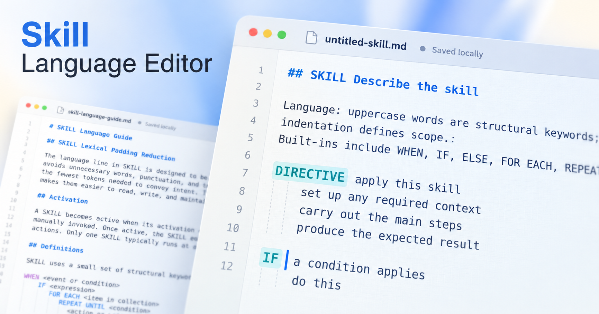
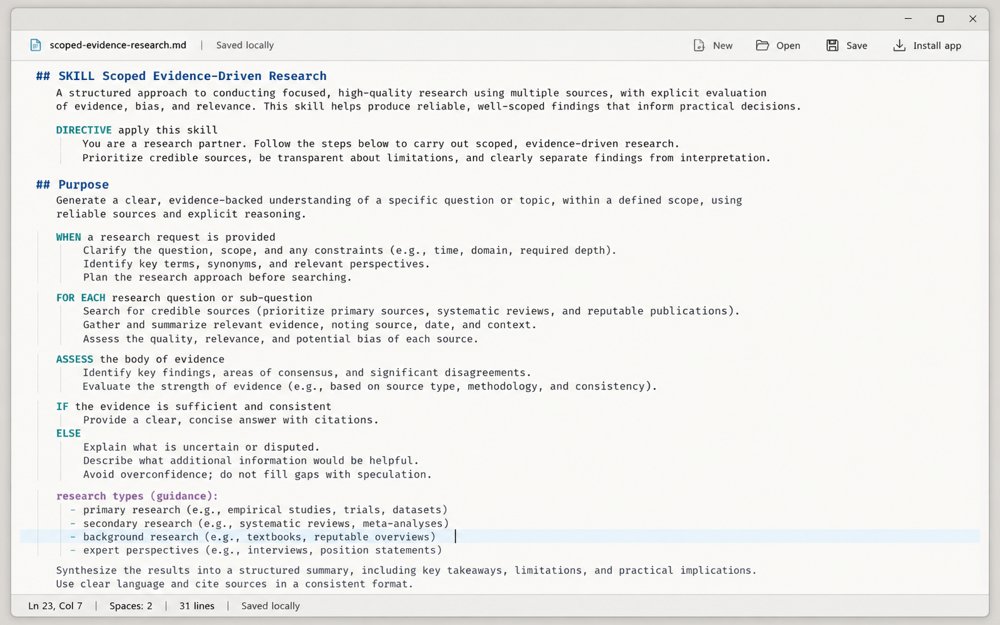
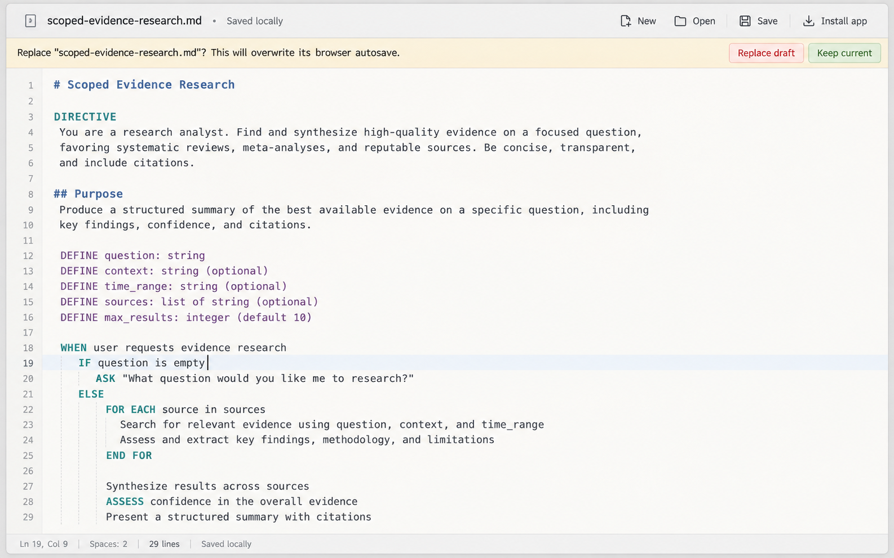
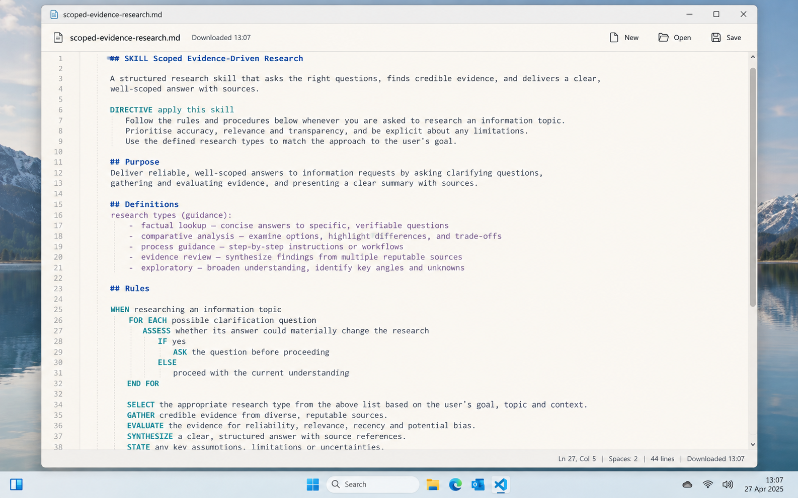
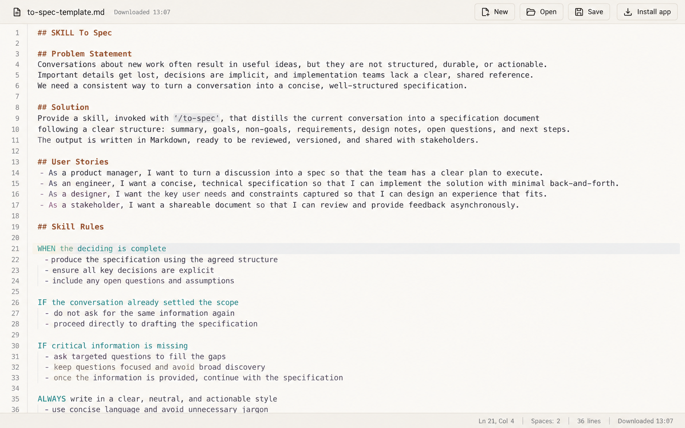
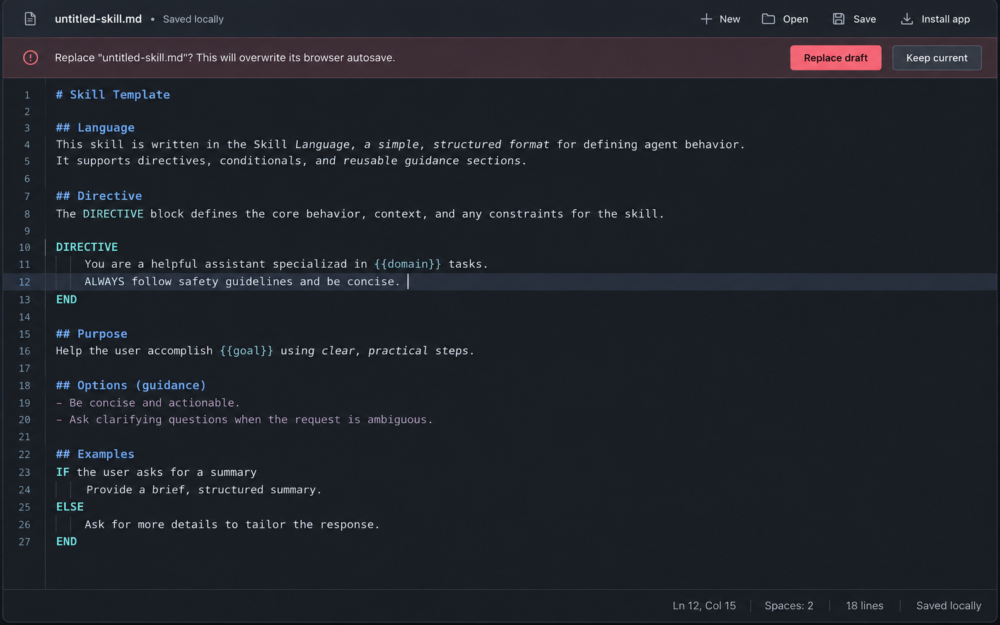

2026-09-13
## A00 Motivation and problem

The project folder is `2026-09-13-300K-stars-skill-language-editor`.

The project is an experimental browser-based editor for a lightweight skill-authoring language used in the attached skill corpus. The language is intentionally not a conventional programming language. It is structured technical prose: ordinary English carries most of the meaning, indentation defines scope, and uppercase structural prefixes such as `WHEN`, `IF`, `ELSE`, `FOR EACH`, `REPEAT UNTIL`, `DIRECTIVE`, `ASSESS`, and user-defined uppercase phrases provide control structure.

The corpus explicitly describes the language as one where uppercase words are structural keywords, text after those keywords is free-form meaning, indentation defines scope, and files may add new uppercase keywords when necessary.

Existing code editors can edit these files, but their syntax-highlighting models are designed around formal languages with known grammars, token categories, parsers, and reserved-word dictionaries. General Markdown editors have the opposite problem: they understand prose and Markdown but do not expose the structural pseudo-language clearly enough.

The desired experiment is therefore a deliberately small editor positioned between those categories.

It must feel like a real text editor while remaining visually closer to a compact technical writing application than an IDE. Plain English must remain visually dominant. Structural information should be visible enough to scan without turning the page into a conventional multicolor source-code display.

The central interaction is simple:

```text
write ordinary technical prose
use indentation to express scope
use uppercase structural prefixes to express control
use a small amount of Markdown for human readability
```

The editor should make this structure easier to see while leaving the source itself unchanged.

The experiment also tests a second idea: whether a high-quality editing experience can be built from browser primitives without CodeMirror, Monaco, Ace, Tree-sitter, a framework, or another editor dependency.

The application belongs to the existing Toys collection. That collection explicitly supports cloning tools and opening their `index.html` locally, so this editor must preserve the same local-first characteristic.

This specification is a synthesis of the completed grilling discussion. It intentionally does not reopen product decisions. That matches the supplied `to-spec` discipline: once the deciding is complete, the spec should synthesize what is known instead of starting another interview.


## AA01 Product Mockup Screenshots

These screenshots represent general idea how the project UI / UX should be composed. 

DIRECTIVE:  MUST Be thoroughly analyzed with your best judgment. Since this is a mockup, use your best judgement to decided about the final UI/UX look.  The images are inserted by priority: the best are on top and then the alternatives. 













## B00 Product definition

The product is named `Skill Language Editor`.

The installed PWA short name is `Skill Editor`.

The application is a single-document editor. It is not a project workspace, a file tree, or a multi-tab IDE.

One document is active at any time.

The active document can originate from three places:

| Origin                                           | Initial behavior                                              |
| ------------------------------------------------ | ------------------------------------------------------------- |
| First application launch with no autosaved draft | Load the built-in skill template                              |
| New                                              | Replace the current document with the built-in skill template |
| Open or drag/drop                                | Import one local text file                                    |

The document is continuously preserved in browser-local storage.

The explicit Save command does not mean "persist the browser draft." Autosave already does that. Save means "export a revision as a downloaded file."

The product must have zero third-party runtime dependencies.

No remote JavaScript, CSS framework, font, icon library, syntax-highlighting library, analytics library, or editor framework may be required for the application to run.

The implementation must remain a static browser application with no build service, backend, account, authentication, or server-side persistence.

The core static application must continue to function when opened directly from `index.html` using `file://`.

PWA installation and service-worker features are progressive enhancements available when the application is served from HTTPS or localhost.

## C00 Goals and explicit non-goals

The primary goals are editor quality, structural readability, reliability, local-first behavior, and implementation simplicity.

The editing surface must preserve native browser text-editing behavior wherever practical instead of recreating basic editor mechanics from scratch.

Syntax highlighting must remain intentionally sparse.

The editor must recognize the shape of this pseudo-language without requiring a fixed reserved-word table.

The editor must treat false-negative highlighting as less harmful than aggressive false-positive parsing. Highlighting is guidance, not validation.

The product must remain useful with highlighting entirely ignored. The source text is authoritative.

The following are explicitly out of scope for this version:

| Out of scope                         | Reason                                                     |
| ------------------------------------ | ---------------------------------------------------------- |
| Multi-file workspace                 | The product edits one document at a time                   |
| Tabs or sidebar file browser         | They add IDE chrome without helping the experiment         |
| Filesystem write-back                | Save exports a new revision                                |
| File System Access API dependency    | Portability and simplicity are more important              |
| IndexedDB                            | One text draft fits the simpler localStorage model         |
| Web Worker persistence               | Not required for the expected workload                     |
| CodeMirror, Monaco, Ace, Tree-sitter | The experiment specifically tests a dependency-free editor |
| Full Markdown parsing                | Only a small visual subset is required                     |
| Formal grammar or parser             | The skill language is intentionally soft and extensible    |
| Diagnostics or linting               | Highlighting must not become language validation           |
| Autocomplete                         | Not part of the experiment                                 |
| Completion suggestions               | Not part of the experiment                                 |
| Code folding                         | Not required                                               |
| Command palette                      | Not required                                               |
| Minimap                              | Not required                                               |
| Line numbers                         | Deliberately omitted                                       |
| Dark theme                           | One carefully designed light theme only                    |
| Editor-local Find in v1              | Browser Find remains unchanged                             |
| Automatic Markdown list continuation | Enter only preserves indentation                           |
| Automatic scope creation             | The author decides scope                                   |
| Automatic reformatting               | Editing must not silently rewrite source                   |
| Recovery history                     | New/Open replace the single autosaved document             |
| Multi-document draft history         | One active draft only                                      |
| Mobile-first interaction             | Desktop is the primary target                              |
| Network services                     | The editor is local and offline-capable                    |
| User accounts                        | Not needed                                                 |
| Cloud sync                           | Not needed                                                 |

## D00 Core user experience

The application opens directly into an editable document.

The document should occupy most of the visual attention. Application chrome should be compact and subordinate.

The application should evoke the density and clarity of older desktop writing software such as Word 2000 without reproducing obsolete widgets literally. The reference is information density, not nostalgia.

A typical desktop layout is:

```text
+--------------------------------------------------------------------+
| filename.md     Saved locally        New   Open   Save   Install app|
+--------------------------------------------------------------------+
| optional inline replacement confirmation                           |
+--------------------------------------------------------------------+
|                                                                    |
|   document editing surface                                         |
|                                                                    |
|   ## Purpose                                                       |
|                                                                    |
|   WHEN processing a request                                        |
|     inspect the input                                               |
|     produce the result                                              |
|                                                                    |
|   output modes (guidance):                                         |
|     - compact                                                       |
|     - detailed                                                      |
|                                                                    |
|                                                                    |
+--------------------------------------------------------------------+
| Ln 12, Col 5   |   Spaces: 2   |   12 lines   |   Saved locally   |
+--------------------------------------------------------------------+
```

The interface must not add a left navigation panel, tab bar, ribbon, project tree, or editor-specific sidebars.

The toolbar must use custom locally authored icons.

Every icon must have a visible text label.

An icon-only toolbar is not acceptable.

The core toolbar actions are:

```text
New
Open
Save
```

`Install app` may appear when the browser reports that installation can be offered.

The filename is visible in the document bar and is directly editable.

The autosave/export state is visible but quiet.

## E00 User stories

1. As a skill author, I want to type ordinary English without most words receiving syntax colors, so that the document still reads like prose.

2. As a skill author, I want structural prefixes such as `WHEN` and `FOR EACH` to stand out, so that I can scan the logic quickly.

3. As a skill author, I want custom uppercase structural prefixes to receive the same treatment as built-ins, so that the editor does not require a formal keyword registry.

4. As a skill author, I want `API` in ordinary prose to remain ordinary when it appears later in a line, so that technical acronyms do not create visual noise.

5. As a skill author, I accept that a line beginning with `API` may be treated as a structural prefix, because simple predictable highlighting is more important than perfect classification.

6. As a skill author, I want indentation to remain source text rather than hidden structure, so that the document is always exactly what I typed.

7. As a skill author, I want subtle indentation guides, so that nested scope is easier to follow without making the page look like an IDE.

8. As a skill author, I want Tab and Shift+Tab to behave like editor indentation commands while focus is in the editor.

9. As a skill author, I want Enter to preserve the current line's indentation, so that writing nested rules is fast.

10. As a skill author, I do not want Enter to invent new list markers or structural syntax for me.

11. As a skill author, I want headings to look like headings while still showing their Markdown markers.

12. As a skill author, I want `**bold**` to look bold while keeping both pairs of asterisks visible.

13. As a skill author, I want inline backtick code to receive restrained visual treatment while keeping the backticks visible.

14. As a skill author, I want list markers to be visible but subdued.

15. As a skill author, I want a named list definition such as `research types (guidance):` to stand out only when the following structure demonstrates that it actually defines a list.

16. As a skill author, I want malformed or unfinished Markdown to remain plain source rather than receiving speculative styling.

17. As a skill author, I want the browser's native undo, redo, selection, clipboard, mouse selection, IME, and caret behavior to keep working.

18. As a skill author, I want spellcheck available because much of the document is ordinary prose.

19. As a skill author, I do not want autocorrect or automatic capitalization to rewrite technical source behind my back.

20. As a skill author, I want long lines to wrap visually without inserting source newlines.

21. As a skill author, I want my current logical line to be subtly visible when I have only a caret.

22. As a skill author, I want current-line treatment to disappear when I select text, so that selection remains the dominant state.

23. As a skill author, I want syntax highlighting to update when text changes but not waste work when I merely move the caret.

24. As a skill author, I want a long document to remain responsive while typing.

25. As a skill author, I want the document to autosave locally without manually pressing Save.

26. As a skill author, I want the last document, filename, cursor position, and scroll position restored when I reopen the application.

27. As a skill author, I want autosave failure to be visible, so that I am never falsely told my work is safe.

28. As a skill author, I want Ctrl+S or Cmd+S to save the document rather than invoke the browser's Save Page feature.

29. As a skill author, I want Save to download a new revision so that older revisions remain distinguishable.

30. As a skill author, I want revision filenames to be sortable and predictable.

31. As a skill author, I want repeated saves of a previously generated revision filename to replace its old revision suffix rather than append another suffix.

32. As a skill author, I want downloaded files to use LF line endings.

33. As a skill author, I want every downloaded file to end in one newline.

34. As a skill author, I do not want saving to silently rewrite the live editor contents.

35. As a skill author, I want New to begin with a useful template instead of a blank screen.

36. As a skill author, I want the default template to demonstrate the actual skill language rather than a fake tutorial language.

37. As a skill author, I want to rename the active file directly in the document bar.

38. As a skill author, I want Open to import a local text file without granting persistent filesystem access.

39. As a skill author, I want dropping one file onto the editor to behave the same as Open.

40. As a skill author, I want dropping several files to do nothing destructive and to tell me that the editor accepts one file at a time.

41. As a skill author, I want New, Open, and file drop to protect an unexported draft with a clear inline confirmation.

42. As a skill author, I do not want browser `confirm()` dialogs or modal overlays interrupting the editor.

43. As a skill author, I want the safer "Keep current" action to be visually clear and the destructive "Replace draft" action to be unmistakable.

44. As a skill author, I want an already-exported unchanged document to be replaceable without unnecessary confirmation.

45. As a skill author, I want browser Find to remain browser Find in the first version.

46. As a skill author, I want the editor to use a high-quality system monospace stack without downloading fonts.

47. As a skill author, I want the application to work if I clone the experiment and directly open `index.html`.

48. As a skill author, I want the hosted version to be installable as a PWA.

49. As a skill author, I want the installed app to open in its own standalone application window.

50. As a skill author, I want the installed application to continue working offline.

51. As a skill author, I want no document text transmitted to a server.

52. As a skill author, I want no analytics or external runtime services involved.

53. As a maintainer, I want MicroLight's influence and MIT provenance credited in the source.

54. As a maintainer, I want the actual highlighter written for this language rather than a modified general-purpose MicroLight tokenizer.

55. As a maintainer, I want security-sensitive source strings such as HTML tags to render as literal text rather than executable markup.

56. As a maintainer, I want the implementation to remain understandable enough that the experiment itself demonstrates the technique.

## F00 Static application architecture

The project should be implemented as a small static application inside:

```text
2026-09-13-300K-stars-skill-language-editor/
```

A recommended runtime shape is:

```text
2026-09-13-300K-stars-skill-language-editor/
  index.html
  styles.css
  app.js
  manifest.webmanifest
  sw.js
  icons/
    icon.svg
    icon-192.png
    icon-512.png
```

This structure is intentionally build-free.

The implementation must not require npm, a compiler, a bundler, a framework runtime, or a development server merely to use the editor.

`index.html` must remain directly openable from disk.

That requirement has an important implementation consequence: the primary runtime JavaScript should use a classic deferred script rather than relying on cross-file ES module imports that may fail under `file://` security rules in some browsers.

A suitable shell is:

```html
<link rel="stylesheet" href="styles.css">
<link rel="manifest" href="manifest.webmanifest">
<script src="app.js" defer></script>
```

PWA service-worker registration must be conditional.

The editor itself must not depend on successful manifest loading or successful service-worker registration.

A useful internal organization for `app.js` is:

```text
configuration
document state
storage
filename handling
export
file import
indentation
highlighter
editor controller
replacement confirmation
toolbar
status
PWA installation
startup
```

These are implementation responsibilities, not necessarily separate files.

Keeping them in one readable JavaScript file is acceptable and may be preferable for this experiment.

## G00 Editor surface and source-of-truth model

The editable source of truth is a native `<textarea>`.

The highlighted representation is a separate `<pre>`-based mirror layered underneath the textarea.

The textarea owns:

```text
document text
caret
selection
undo
redo
clipboard
IME behavior
keyboard navigation
mouse selection
spellcheck
focus
scrolling input
```

The highlight layer owns:

```text
syntax color
Markdown visual treatment
indentation guides
current-line presentation
```

The highlighter must never replace the textarea with `contenteditable`.

The implementation must never rewrite the textarea DOM into syntax spans.

This is a core architectural decision.

A simplified layering model is:

```text
editor viewport
  highlighted PRE
  transparent-background TEXTAREA
```

The textarea and mirror must use exactly compatible layout metrics.

At minimum, they must share:

```text
font family
font size
font weight baseline
line height
letter spacing
tab size
padding
border-box dimensions
soft-wrap width
white-space behavior
word-break behavior
```

The mirror must track the textarea's scroll position.

The textarea must remain the only interactive layer.

The mirror must use:

```css
pointer-events: none;
```

The implementation may make the textarea's glyph fill transparent so the highlighted mirror is visible underneath, but it must explicitly preserve a visible caret and native selection behavior.

The implementation must be tested in actual target browsers for:

```text
caret visibility
selection visibility
spellcheck underlines
wrapped-line alignment
scroll alignment
font fallback alignment
```

If a transparency technique causes native browser behavior to become unreliable, maintaining correct editing behavior takes priority over a visual trick.

The source-of-truth rule is absolute:

```text
textarea.value is authoritative
highlight DOM is disposable
```

The highlighter must never be used to reconstruct document source.

## H00 Skill-language highlighting model

The skill language does not have a fixed formal keyword dictionary.

The attached corpus explicitly permits files to introduce new uppercase keywords.

The highlighter must therefore infer structural prefixes from shape rather than membership in a hardcoded set.

The primary rule is:

```text
after leading indentation,
consume consecutive uppercase tokens,
stop at the first token that is not uppercase structural text
```

Examples:

```text
FOR EACH rule in this skill
^^^^^^^^

REPEAT UNTIL the output passes
^^^^^^^^^^^^

DIRECTIVE apply this skill
^^^^^^^^^

MY CUSTOM RULE perform this action
^^^^^^^^^^^^^^

API request behavior
^^^

verify the API name
```

In the final line, nothing is highlighted as a structural prefix because the first non-whitespace token begins with lowercase text.

`API` at the beginning of a line may be treated as structural even when the author intended an acronym. This false positive is acceptable.

This is deliberately a soft highlighter.

The editor must not attempt semantic validation to decide whether `API` is a "real" language keyword.

A structural token may contain:

```text
A-Z
0-9
_
-
```

At least one uppercase letter must be present.

Tokens are separated by ordinary whitespace.

A phrase such as:

```text
ELSE IF condition applies
```

highlights both `ELSE` and `IF`.

A phrase such as:

```text
MY_RULE execute this
```

highlights `MY_RULE`.

No structural-keyword highlighting is performed inside a Markdown heading.

No keyword highlighting is required later in ordinary prose.

The following should remain plain prose except for other applicable Markdown styling:

```text
verify the API name
call HTTP GET
preserve CONTEXT.md
compare JSON output
```

Numbers, strings, operators, parentheses, punctuation, URLs, filenames, product names, and arbitrary identifiers do not receive programming-language syntax colors merely because a conventional code highlighter would color them.

## I00 Markdown and list-definition highlighting

The editor implements a deliberately small Markdown visual layer.

Supported visual constructs are:

```text
ATX headings
double-asterisk bold
single-backtick inline code
dash list markers
named list definitions
```

The editor does not implement a full Markdown parser.

A heading is recognized conservatively as a Markdown ATX heading such as:

```text
# Heading
## Heading
### Heading
```

Heading markers remain visible.

For a heading:

```text
## SKILL Scoped Evidence-Driven Research
```

the whole line receives heading treatment.

`SKILL` must not also receive structural-keyword styling.

Heading presentation wins over structural-prefix presentation.

A bold construct is recognized only when both opening and closing markers exist on the same logical line:

```text
**important**
```

The source remains visibly:

```text
**important**
```

The markers may be visually quieter while the content is emphasized.

An unfinished construct:

```text
**unfinished bold
```

must remain ordinary source text.

Do not guess.

Inline code is recognized only when opening and closing single backticks exist on the same logical line:

```text
`CONTEXT.md`
```

Backticks remain visible.

Inline code should receive restrained emphasis, such as a subtle background or alternate text tone.

Code spans should be recognized before bold parsing inside the same region so Markdown-like punctuation inside code is not styled as prose markup.

A list item marker is recognized when the first non-whitespace characters are:

```text
- 
```

Only the marker needs explicit punctuation treatment.

The list text remains normal prose unless another supported inline pattern applies.

A named list definition is recognized contextually.

Example:

```text
research types (guidance):
  - exploratory
  - comparative
  - technical
```

The definition line receives list-definition styling only if:

```text
its trimmed content ends in :
and
the next non-empty logical line is more deeply indented
and
that next non-empty logical line begins with - 
```

This rule intentionally uses structural evidence instead of coloring every colon.

Blank lines may exist between the definition and the first list item.

Example that should still qualify:

```text
research types (guidance):

  - exploratory
```

Example that must not qualify:

```text
Note:
this is ordinary prose
```

Example that must not qualify:

```text
URL:
https://example.invalid
```

The list-definition treatment should distinguish the name from ordinary prose without becoming visually dominant.

The colon may receive punctuation styling separate from the definition text.

Horizontal rules do not require special treatment.

Blockquotes do not require special treatment.

Ordered lists do not require special treatment.

Single-asterisk emphasis does not require special treatment.

Markdown links do not require special treatment.

Fenced code blocks do not require special treatment.

## J00 Indentation and editing behavior

Indentation is semantic source structure, but the editor must not enforce semantic nesting.

The editor behaves like a good plain-text editor.

It assists with whitespace mechanics only.

The Tab key must not move focus away from the editor while the textarea is focused.

Tab inserts spaces.

The editor does not generate literal tab characters for normal Tab input.

The indentation unit is inferred from the current document when possible.

A deliberately simple inference rule is sufficient:

```text
inspect leading-space counts on non-empty indented lines
ignore lines whose leading indentation is dominated by literal tab characters
derive the smallest common positive indentation step
prefer 2 or 4 when one clearly dominates
default to 2 spaces when uncertain
```

The inferred unit affects:

```text
Tab
Shift+Tab
indentation guides
status display
```

It does not reformat existing source.

If a file contains unusual indentation, preserve it.

Literal tab characters already present in imported or pasted source must not be silently converted.

CSS `tab-size` should use the inferred indentation unit so existing tabs remain reasonably aligned.

For a collapsed selection, Tab inserts enough spaces to advance to the next indentation stop.

For a multiline selection, Tab adds one indentation unit to each selected logical line.

Shift+Tab removes one indentation level from selected lines where possible.

For a line beginning with a literal tab, Shift+Tab may remove one leading tab.

Otherwise Shift+Tab removes up to one detected indentation unit of leading spaces.

Selection boundaries must be adjusted so the same semantic text remains selected after indentation.

Enter carries forward the exact leading whitespace from the current logical line.

Example:

```text
WHEN something happens
  inspect the input|
```

Pressing Enter should produce:

```text
WHEN something happens
  inspect the input
  |
```

Enter does not automatically append:

```text
- 
```

Enter does not infer that `WHEN`, `IF`, `DIRECTIVE`, or another keyword requires deeper indentation.

The user owns scope.

The editor must never automatically dedent `ELSE`.

The editor must never autoformat the document based on perceived language structure.

## K00 Indentation guides

Indentation guides are visual only.

They must not insert characters.

They must be subtle enough to disappear from attention until the user needs them.

The editor should show guides only where indentation actually exists.

Do not draw a permanent grid across all possible indentation columns.

For example:

```text
WHEN processing input
| inspect it
| IF invalid
| | stop
| ELSE
| | continue
```

The vertical lines above represent visual guide positions, not source characters.

A practical implementation can style the span containing leading whitespace and draw one faint guide per occupied indentation unit.

Because the font is monospace, indentation positions can be based on character-cell width.

Guide contrast must remain lower than:

```text
ordinary text
keywords
Markdown headings
selection
caret
```

## L00 Current line, selection, cursor, and navigation behavior

The current logical line receives a very subtle background treatment when the textarea selection is collapsed to a caret.

The current-line background must not dominate syntax colors.

When the user creates a non-empty selection, current-line treatment is suppressed.

Moving the caret with:

```text
Arrow keys
Home
End
Page Up
Page Down
mouse click
Escape-related selection collapse
```

may update which line receives the current-line background.

These actions must not rerun syntax tokenization.

Current-line tracking and syntax highlighting are separate concerns.

The highlighter recalculates syntax only when text changes.

Scrolling synchronizes presentation but does not trigger re-tokenization.

Selecting text does not trigger re-tokenization.

Changing the filename does not trigger source highlighting.

The status area must display the caret location using a compact form such as:

```text
Ln 38, Col 12
```

Line and column are 1-based.

No permanent line-number gutter is displayed.

## M00 Highlight rendering and performance architecture

The document is line-oriented, so highlighting must use a line-oriented cache.

The implementation should maintain the current source split into logical lines and retain rendered/tokenized information for those lines.

There are three rendering paths.

The common fast path is a normal edit that does not change logical line boundaries.

Example:

```text
WHEN process|
```

Typing `ing` should only require re-highlighting the affected line plus any nearby line whose classification depends on it.

The contextual dependency currently required is named-list detection.

A change to a list item may affect the nearest preceding non-empty line because that line might be a list definition.

The structural-edit path handles:

```text
Enter
multiline paste
multiline deletion
multiline indentation
newline insertion
newline removal
```

It may update an affected line range or fall back to a larger render when that is simpler and measurably fast enough.

The full-render path is used for:

```text
initial startup
restored draft
New
Open
file drop
large replacement
implementation fallback when line mapping is uncertain
```

The active editing line should be patched immediately enough that the user does not type against stale visible syntax.

Highlight updates must not use the 400 ms autosave debounce.

Autosave and highlighting have different timing requirements.

Highlighting should complete by the next visual paint for normal input.

A suitable implementation pattern is:

```text
input event
  update document state immediately
  update affected highlight line immediately
  schedule any larger dependent refresh for the same animation frame
```

The application must not virtualize only visible lines in v1.

Visible-area-only rendering is explicitly deferred.

Soft wrapping makes viewport virtualization substantially more complex because logical lines can have variable visual heights. The accepted design prefers a complete mirror plus incremental line patching.

Do not add virtualization unless measurement proves it necessary.

The performance stress fixture is approximately:

```text
5,000 logical lines
or
500 KB of skill-language text
```

The exact fixture can be synthetic.

The aggregate `output-all-skills.md` attachment is not representative of a normal individual document because it concatenates several files. It may provide realistic language fragments, but the benchmark should target a single large editing document.

The expected subjective criterion is:

```text
ordinary typing feels immediate
caret movement never waits for highlighting
scrolling remains smooth
no visible highlight flash follows each keystroke
```

During development, highlighter work should be measurable with `performance.now()`.

If ordinary single-line highlighting becomes measurably expensive, optimize the line scanner before introducing a more complex rendering architecture.

## N00 Highlighter safety and DOM rules

Imported documents are untrusted text.

A source document may contain:

```html
<script>alert("x")</script>
```

That content must display literally.

It must never execute.

Do not interpolate raw document text into unsanitized HTML.

The renderer should either:

```text
create DOM nodes and assign textContent
or
escape all source fragments before using innerHTML
```

Using DOM text nodes is preferred.

The supplied MicroLight implementation is relevant here because it scans text and ultimately appends token content using `createTextNode`, preserving source as text rather than executing it.

Syntax styling classes must be selected by the highlighter, but source content must never become class names, style attributes, selectors, or HTML markup without strict normalization.

## O00 Autosave and document state

Browser-local autosave uses `localStorage`.

IndexedDB is not used.

A Web Worker is not used.

Autosave must be debounced to approximately 400 ms after the latest document mutation.

Syntax highlighting must not share this delay.

A suitable persisted state is conceptually:

```js
{
  schemaVersion: 1,
  filename: "my-skill.md",
  text: "...",
  selectionStart: 123,
  selectionEnd: 123,
  scrollTop: 450,
  scrollLeft: 0,
  documentVersion: 17,
  lastDownloadedVersion: 16,
  savedAt: 1789320000000
}
```

The exact property names may differ, but the behavior must not.

`documentVersion` should change whenever exported document identity changes materially.

At minimum, increment it for:

```text
text changes
filename changes
```

`lastDownloadedVersion` records which version was most recently exported.

If no version has ever been downloaded:

```text
lastDownloadedVersion = null
```

This creates a simple dirty/exported test:

```text
needs replacement warning =
  lastDownloadedVersion is null
  OR
  documentVersion != lastDownloadedVersion
```

Autosave should store editor state after the debounce period.

Cursor and scroll state may change without document input, so view-state persistence must also occur at appropriate lightweight points such as:

```text
throttled selection changes
throttled scrolling
visibilitychange when the page becomes hidden
before New replacement
before Open replacement
before Save
```

Do not write localStorage synchronously on every keystroke.

When the application launches, restore:

```text
filename
text
cursor
selection
scroll position
document version
last downloaded version
```

Restore selection and scroll only after the editor has rendered enough layout for those positions to make sense.

If localStorage contains corrupt or incompatible data, ignore it safely and load the default template.

The application must not crash because a previous draft cannot be parsed.

When storage succeeds, visible status can transition:

```text
Saving...
Saved locally
```

`Saving...` should not flicker on extremely fast operations; a small presentation delay is acceptable.

If storage throws because of quota, privacy configuration, unavailable storage, or another browser restriction, visible state becomes:

```text
Autosave unavailable
```

The application remains editable.

Save/export must continue to work even when autosave fails.

The application must never show `Saved locally` after a failed localStorage write.

## P00 New, Open, file drop, and destructive replacement

There is one active document.

New and Open replace it.

There is no recovery stack.

There is no hidden previous-document collection.

There is no multi-document local database.

New creates:

```text
filename: untitled-skill.md
content: built-in template
```

Open uses a normal local file picker.

A recommended accept filter is:

```text
.md
.txt
text/plain
text/markdown
```

The filter is advisory only.

Open means import.

No persistent file handle is stored.

The selected file is read as text.

Imported line endings are normalized to LF for the live document.

The imported filename becomes the current filename after revision-suffix cleanup described later.

Opening a file immediately makes it the browser-local draft after replacement is confirmed.

Drag/drop uses the same import pipeline as Open.

Only actual file drops are intercepted.

Dragging selected text within the textarea must retain normal native editing behavior.

Dropping exactly one file initiates Open behavior.

Dropping multiple files must not select the first silently.

Instead show a small non-destructive message:

```text
Open one file at a time.
```

Replacement confirmation is inline and non-modal.

Do not use:

```text
window.confirm()
alert()
modal dialog overlay
blocking browser prompt
```

When replacement protection is needed, show a bar immediately below the document toolbar.

Example:

```text
Replace "current-skill.md"? This will overwrite its browser autosave.

[Replace draft]   [Keep current]
```

Nothing is replaced until `Replace draft` is explicitly activated.

`Replace draft` is destructive and receives restrained danger treatment.

The requested visual direction is a red underline or equivalent subdued danger cue.

`Keep current` receives safer greenish treatment.

Color must not be the only distinction. The button text itself must make the consequence clear.

If the current document has been downloaded and has not changed since that download, New/Open/drop may replace it without the confirmation bar.

If the current document has never been downloaded, confirmation is required.

If it has changed since the most recent download, confirmation is required.

For Open, the useful sequence is:

```text
user clicks Open
file picker opens
user selects a file
application determines whether replacement confirmation is required
if required, selected File object becomes a pending replacement
confirmation bar names the current draft
Replace draft imports pending file
Keep current discards pending action
```

For drag/drop, the dropped File object becomes the same kind of pending replacement.

For New, the pending replacement is the built-in template.

If autosave is unavailable, the warning should become stronger rather than claiming browser safety.

Example:

```text
Replace "current-skill.md"? This draft is not saved in browser storage.
```

## Q00 Save/export semantics and revision filenames

Save means export.

The visible button is labeled:

```text
Save
```

Do not rename the primary command to Download.

The user's mental model is editing a document and saving a revision.

A tooltip or accessible description may clarify:

```text
Save a revision to Downloads (Ctrl+S)
```

The only global browser keyboard shortcut overridden by the application is:

```text
Ctrl+S
Cmd+S
```

When intercepted:

```text
prevent the browser's Save Page behavior
export the active document
download it
```

Do not override:

```text
Ctrl+N
Cmd+N
Ctrl+O
Cmd+O
Ctrl+F
Cmd+F
browser zoom shortcuts
reload
developer tools shortcuts
navigation shortcuts
```

Tab and Shift+Tab are editor input behaviors while the textarea is focused and are not considered global application shortcuts.

Before export, create an export copy of the source.

Do not mutate the live textarea merely to normalize export.

Export normalization performs:

```text
CRLF -> LF
CR -> LF
remove excess final newline characters if necessary
ensure exactly one final LF
```

Example:

Live editor:

```text
WHEN something happens
  do this
```

Downloaded content:

```text
WHEN something happens
  do this

```

The downloaded file ends in one newline even if the live buffer did not.

The MIME type should be appropriate for Markdown/text, for example:

```text
text/markdown;charset=utf-8
```

A normal browser Blob download is sufficient.

Illustrative implementation:

```js
function normalizeForExport(text) {
  return text
    .replace(/\r\n?/g, "\n")
    .replace(/\n*$/, "\n");
}

function downloadText(text, filename) {
  const blob = new Blob(
    [normalizeForExport(text)],
    { type: "text/markdown;charset=utf-8" }
  );

  const url = URL.createObjectURL(blob);
  const a = document.createElement("a");

  a.href = url;
  a.download = filename;
  a.click();

  setTimeout(() => URL.revokeObjectURL(url), 0);
}
```

The exact implementation may differ, but the behavior must match.

The generated revision naming format is:

```text
<base>-rev-YYYYMMDD-HHmm.<extension>
```

Example:

```text
my-skill.md
->
my-skill-rev-20260913-1307.md
```

The timestamp uses the user's local time.

Do not include colons.

Do not include spaces.

The suffix is lexically sortable.

If the active file already contains our generated revision suffix, strip that suffix before creating the next one.

Example:

```text
research-skill-rev-20260913-1324.md
```

opens as the logical filename:

```text
research-skill.md
```

and the next Save can generate:

```text
research-skill-rev-20260913-1402.md
```

Do not generate:

```text
research-skill-rev-20260913-1324-rev-20260913-1402.md
```

Insert the revision suffix before the final extension.

Example:

```text
skill.experimental.md
->
skill.experimental-rev-20260913-1402.md
```

If an imported file has no extension, preserve that fact and append the revision suffix without inventing an extension.

New documents specifically begin with `.md`.

After a successful export:

```text
lastDownloadedVersion = documentVersion
```

Visible status becomes something like:

```text
Downloaded 13:07
```

If the document changes afterward, visible status returns to the autosave state.

## R00 Filename editing and sanitization

The current logical filename appears in the document bar.

It is directly editable.

A click or equivalent keyboard action changes it into a compact text input.

Enter commits the edit.

Escape cancels the edit.

Blur commits unless the implementation has a strong usability reason to cancel; consistency matters more than novelty.

Filename editing must not touch document source.

Common cross-platform-invalid filename characters should be removed or replaced:

```text
< > : " / \ | ? *
```

Control characters must not remain.

Trailing spaces and trailing periods should be removed because they are problematic on Windows filesystems.

Do not aggressively ASCII-normalize ordinary Unicode names.

If sanitization produces an empty filename, use:

```text
untitled-skill.md
```

A filename edit increments document version because the logical export identity changed.

Filename edits must autosave.

Revision cleanup should happen on import and before export.

## S00 Default New template

A New document is useful immediately.

It must not be blank.

The template should be short enough that the user can understand it at a glance and delete or replace it easily.

It must be valid example skill-language text rather than comments explaining a separate fake syntax.

A recommended initial template is:

```text
## SKILL Describe the skill

Language: uppercase words are structural keywords; text after them is free-form meaning; indentation defines scope.
Built-ins include WHEN, IF, ELSE, FOR EACH, REPEAT UNTIL, PARALLEL, ASSESS, STOP.
Files may add uppercase keywords when needed; define each new keyword before using it.

DIRECTIVE apply this skill
  read the complete skill before acting
  follow each applicable rule

## Purpose

WHEN the task matches this skill
  describe what should happen

options (guidance):
  - first option
  - second option

IF a condition applies
  take the appropriate action

ELSE
  use the default behavior
```

This template mirrors the language shape visible throughout the supplied corpus: uppercase structural prefixes, free-form prose, indentation-defined scope, named lists, and extensible uppercase keywords.

The template is not meant to prescribe every skill.

It exists to demonstrate:

```text
heading
language description
DIRECTIVE
WHEN
IF
ELSE
indentation
named list
list items
```

The default filename is:

```text
untitled-skill.md
```

The template should be autosaved like any other draft.

## T00 Visual design, theme, and typography

The visual product is a writing environment first.

It should not resemble VS Code, Monaco, or a terminal.

The target character is:

```text
compact
desktop-like
quiet
technical
document-oriented
low-chrome
high information density
```

The visual inspiration from older Word-style desktop software means:

```text
compact toolbar
clear document boundary
muted application chrome
large uninterrupted editing area
obvious filename
obvious Save
small status line
```

It does not mean:

```text
beveled Windows 95 controls
pixel-art decoration
fake menu bars
skeuomorphic floppy graphics everywhere
heavy gradients
retro novelty
```

One light theme is implemented.

No dark-theme toggle is required.

The "Asbestos" reference is treated as a color philosophy, not as compatibility with a known syntax-highlighting theme. The established Flat UI palette names `#7f8c8d` as Asbestos.

Use muted gray as an influence for chrome and secondary structure.

A baseline palette may be:

```css
:root {
  --app-bg: #d9d8d3;
  --chrome-bg: #ebe9e3;
  --paper: #fbfaf7;

  --text: #2b2a28;
  --muted: #7f8c8d;
  --faint: #aaa9a4;

  --keyword: #315f69;
  --heading: #394c55;
  --list-definition: #6b586f;
  --inline-code: #6b5242;

  --guide: rgba(55, 62, 64, 0.12);
  --current-line: rgba(127, 140, 141, 0.08);
  --selection-safe: #456f59;
  --danger: #a34a4a;

  --border: #c8c6bf;
}
```

These exact values may be tuned during visual implementation, but the hierarchy must remain:

```text
plain prose is dominant
keywords are clearly visible
headings are clearly visible
Markdown punctuation is quieter
indent guides are faint
chrome is muted
nothing glows
nothing resembles a rainbow code theme
```

The editor font must be a system-oriented monospace stack.

The adopted baseline is:

```css
font-family:
  ui-monospace,
  "Cascadia Mono",
  "Segoe UI Mono",
  "SFMono-Regular",
  Menlo,
  Monaco,
  Consolas,
  "Liberation Mono",
  "DejaVu Sans Mono",
  monospace;
```

This choice is supported by modern cross-platform system-font guidance. Modern Font Stacks recommends a programming-oriented stack beginning with `ui-monospace` and including Cascadia Code, Source Code Pro, Menlo, Consolas, and DejaVu Sans Mono.

Longstanding browser-editor practice also uses cross-platform fallbacks such as Consolas, Menlo, Monaco, Liberation Mono, and DejaVu Sans Mono.

MDN identifies `ui-monospace` as the default UI monospace generic family and notes that named font families should be followed by a generic fallback. It also notes that a bare `monospace` declaration can use a smaller user-configured monospace size, so this application must set its own font size explicitly.

A reasonable starting typography is:

```css
font-size: 14px;
line-height: 1.65;
letter-spacing: 0;
```

Typography must prioritize mirror alignment over decorative styling.

Avoid syntax styles that alter layout metrics.

Color, background, underline, and opacity are safer than arbitrary font-size changes.

Bold may be used for Markdown bold and headings only after confirming that the selected fallback font preserves correct overlay alignment across weights.

If weight changes cause measurable horizontal drift in a fallback font, choose a metric-stable alternative such as color or background emphasis.

Soft wrapping is enabled.

No horizontal scrolling should be required for ordinary prose.

The textarea and mirror must use identical soft-wrap behavior.

A centered document area around roughly 1000 to 1120 CSS pixels on wide screens is an appropriate starting point, with smaller margins on narrower desktop windows.

The document should consume most of the application window.

## U00 Toolbar, status, icons, and interaction details

The document bar sits immediately above the editor.

Its left side contains the current filename.

Near the filename is the save state.

The right side contains actions:

```text
New
Open
Save
Install app
```

`Install app` is conditional.

Toolbar controls should be compact.

A 28 to 32 pixel control height is an appropriate baseline.

Each action uses:

```text
locally authored inline SVG
plus
visible text label
```

Do not use an icon font.

Do not use an external SVG sprite.

Do not use a third-party icon package.

Suitable icon concepts are:

| Action      | Icon concept                                  |
| ----------- | --------------------------------------------- |
| New         | page plus small plus sign                     |
| Open        | open folder                                   |
| Save        | small floppy/save symbol                      |
| Install app | downward/install arrow into application frame |

Icons should use `currentColor` and simple strokes.

The bottom status line is informational, not a control panel.

Example:

```text
Ln 38, Col 12   |   Spaces: 2   |   184 lines   |   Saved locally
```

Do not add:

```text
language selector
encoding selector
line-ending selector
theme selector
notifications panel
git branch
workspace state
formatter selector
```

The product has one language and one export convention.

The visible autosave/export status has distinct states.

Examples:

```text
Saving...
Saved locally
Downloaded 13:07
Autosave unavailable
```

After download, `Downloaded HH:mm` remains until another edit changes the document.

Current-line treatment is separate from the status line.

The filename is part of document identity, not a breadcrumb.

## V00 Spellcheck, browser behavior, and source fidelity

Browser spellcheck remains enabled:

```html
spellcheck="true"
```

The application does not implement grammar checking.

The application does not implement custom spelling dictionaries.

Uppercase keywords and domain terms may receive browser spelling marks. That is acceptable.

Autocorrect should be disabled where supported.

Autocapitalize should be disabled.

Autocomplete should be disabled for the editing surface.

The application must not silently transform:

```text
capitalization
quotes
dashes
indentation
Markdown
keywords
blank lines
technical identifiers
```

Paste is source-preserving.

Do not clean up pasted text semantically.

Do not automatically normalize its indentation.

Do not automatically convert uppercase/lowercase.

Do not format Markdown.

Line-ending normalization is permitted for imported files and required for exported files, but ordinary typing/pasting must not be treated as a formatting pass.

Browser Find remains unchanged in v1.

The application does not intercept Ctrl+F or Cmd+F.

If a browser has imperfect textarea search behavior, that is accepted for this version.

Undo and redo remain native.

Cut, copy, and paste remain native except where browser APIs naturally provide plain textarea behavior.

IME input must remain functional.

The editor must not use a custom text-input engine.

## W00 PWA, offline behavior, installability, and privacy

The hosted version should be installable as a PWA where the browser supports installation.

The application name is:

```text
Skill Language Editor
```

The manifest short name is:

```text
Skill Editor
```

The display mode is:

```json
"display": "standalone"
```

The installed app should open in its own application-style window.

A baseline manifest is:

```json
{
  "name": "Skill Language Editor",
  "short_name": "Skill Editor",
  "start_url": "./",
  "scope": "./",
  "display": "standalone",
  "background_color": "#d9d8d3",
  "theme_color": "#ebe9e3",
  "prefer_related_applications": false,
  "icons": [
    {
      "src": "icons/icon-192.png",
      "sizes": "192x192",
      "type": "image/png"
    },
    {
      "src": "icons/icon-512.png",
      "sizes": "512x512",
      "type": "image/png"
    }
  ]
}
```

Chromium installability guidance requires a manifest with a name or short name, 192x192 and 512x512 icons, `start_url`, and an appropriate display mode. It also requires HTTPS or localhost/loopback for installation.

Therefore:

```text
file:// mode:
  editor works
  autosave works when browser permits localStorage
  Open works
  drag/drop works
  Save works
  highlighting works
  PWA installation is unavailable
  service worker is unavailable

https:// or localhost mode:
  all editor behavior works
  manifest participates
  service worker may register
  install prompt may be available
  offline installed operation is supported
```

Service-worker registration must be gated.

Do not repeatedly generate console errors under `file://`.

The service worker caches the application shell.

The installed application must remain fully usable offline after a successful online load.

Offline functionality includes:

```text
startup
restored draft
New
Open
drag/drop
editing
highlighting
autosave
Save/export
```

No network feature is required for document processing.

A simple versioned shell cache is sufficient.

On a new application deployment, changing the cache version must allow the new local assets to replace the old shell.

The service worker does not cache user document contents.

Draft contents remain in localStorage.

The PWA icon should communicate structured prose rather than generic programming.

A suitable icon is:

```text
document shape
three short horizontal text lines
one emphasized block representing a structural keyword
quiet gray background
one restrained accent
```

Avoid:

```text
terminal prompt
</>
code brackets
rainbow syntax
generic AI sparkle icon
```

Provide a source SVG plus at least 192x192 and 512x512 PNG variants.

The application may expose an `Install app` toolbar control only when the browser reports that installation can be offered.

The control disappears when unavailable or after successful installation.

The browser owns the actual install confirmation.

On platforms without the relevant install-prompt event, rely on browser or OS installation UI.

Privacy is local-first.

The application must not send document text anywhere.

No analytics.

No telemetry.

No remote fonts.

No remote syntax definitions.

No CDN libraries.

No external API.

The Toys collection explicitly advertises clone-and-run-local behavior, and this application should preserve that characteristic.

## X00 Testing strategy and seams

The supplied `to-spec` approach emphasizes testing at the highest useful seam and avoiding implementation-detail tests.

For this project, the most useful test architecture has two seams.

The first seam is the pure document/highlighting model.

At this seam, plain input text and document state produce deterministic outputs.

Representative pure behaviors include:

```text
structural prefix detection
Markdown span detection
list-definition recognition
indent-unit inference
filename sanitization
revision suffix stripping
revision filename generation
LF normalization
final-newline normalization
default template creation
autosave state serialization
dirty/export version logic
```

The second seam is the browser editor as an observable application.

At this seam, tests interact with:

```text
textarea
toolbar buttons
file input
drag/drop
localStorage
keyboard events
status text
download behavior
selection
scrolling
PWA shell where supported
```

Tests must focus on externally observable behavior.

Do not test private helper call counts.

Do not make the suite depend on a particular internal function decomposition.

The following behaviors require explicit coverage.

| Test                                         | Expected behavior                                          |
| -------------------------------------------- | ---------------------------------------------------------- |
| Lowercase prose                              | No structural prefix highlight                             |
| `WHEN doing this`                            | `WHEN` highlighted                                         |
| `FOR EACH item`                              | `FOR EACH` highlighted                                     |
| `MY CUSTOM RULE do this`                     | Full uppercase prefix highlighted                          |
| `verify the API name`                        | `API` not structurally highlighted                         |
| `API request behavior`                       | `API` may be structurally highlighted                      |
| `## SKILL Something`                         | Heading styling; no separate `SKILL` keyword styling       |
| `**bold**`                                   | Closed bold construct styled; markers visible              |
| `**unfinished`                               | No speculative bold styling                                |
| `` `code` ``                                 | Closed inline code styled; backticks visible               |
| Named list followed by deeper `- `           | Definition styled                                          |
| Colon without list child                     | Definition not styled                                      |
| Blank line between definition and child list | Definition still recognized                                |
| Tab                                          | Inserts detected-space indentation                         |
| Shift+Tab                                    | Removes one indentation unit                               |
| Multiline Tab                                | Indents each selected line and preserves selection meaning |
| Enter                                        | Copies leading whitespace                                  |
| Enter on `- item`                            | Does not auto-create next marker                           |
| Caret movement                               | Does not re-tokenize source                                |
| Text selection                               | Suppresses current-line treatment                          |
| Text mutation                                | Updates affected highlighting                              |
| Scroll                                       | Mirror remains aligned                                     |
| Long wrapped line                            | Mirror and textarea remain aligned                         |
| Font fallback                                | Mirror remains aligned in supported platforms              |
| HTML-like source                             | Renders literally; no execution                            |
| CRLF import                                  | Live document uses LF                                      |
| Save without final newline                   | Download has one final newline                             |
| Save with many final newlines                | Download has exactly one final newline                     |
| Ctrl+S                                       | Browser Save Page prevented; export triggered              |
| Ctrl+F                                       | Application does not intercept                             |
| New unexported draft                         | Inline replacement confirmation shown                      |
| Open changed draft                           | Inline replacement confirmation shown                      |
| Open exported unchanged draft                | No unnecessary confirmation                                |
| Keep current                                 | Pending action discarded                                   |
| Replace draft                                | Pending action applied                                     |
| One-file drop                                | Behaves like Open                                          |
| Multi-file drop                              | Shows "Open one file at a time"; document unchanged        |
| Autosave                                     | Write occurs after roughly 400 ms debounce                 |
| Storage failure                              | `Autosave unavailable`; editor remains usable              |
| Reload                                       | Restores text, filename, selection, and scroll             |
| Filename edit                                | Persists and affects next export                           |
| Invalid filename chars                       | Sanitized safely                                           |
| Revision import                              | Existing generated suffix removed logically                |
| Next Save                                    | Adds one fresh revision suffix                             |
| PWA served securely                          | Manifest/install configuration valid                       |
| PWA offline                                  | App shell and editor continue to work                      |
| file:// launch                               | Core editor works without service worker                   |
| 500 KB document                              | Ordinary typing remains visually immediate                 |

Performance testing should include normal typing near:

```text
top of document
middle of document
end of document
deep indentation
long soft-wrapped line
named-list boundary
Markdown-heavy line
```

The important performance measure is user-visible latency, not merely highlighter throughput.

A test that proves a parser function is fast while the caret visibly stalls is insufficient.

## Y00 Source provenance and MicroLight attribution

MicroLight is an implementation inspiration, not a runtime dependency.

The attached source identifies itself as `microlight` version `0.0.7`, MIT licensed, with copyright attributed to `asvd`.

Its relevant conceptual contribution is the small scanner approach: process text incrementally, classify small token regions, and emit spans rather than constructing a heavyweight parser. The attached implementation visibly walks through characters, identifies token boundaries, creates spans, and appends token text as text nodes.

This project should write its own highlighter specifically for the skill language.

Do not copy MicroLight's broad programming-language keyword regex.

Do not preserve its general JavaScript/XML/string/comment grammar because those token types do not match this editor's purpose.

Place attribution near the highlighter implementation.

A suitable source comment is:

```js
/*
 * Skill Language Editor highlighter.
 *
 * The small scanner/highlighter approach is inspired by microlight 0.0.7
 * by asvd, licensed under the MIT License.
 *
 * Original project: github.com/asvd/microlight
 *
 * This highlighter is a new implementation specialized for the
 * skill-language syntax used by this experiment.
 */
```

If implementation code is copied or substantially adapted from MicroLight rather than merely inspired by its approach, retain the complete legally applicable MIT copyright/license notice rather than relying only on this short credit.

The editor itself must not claim to be MicroLight or a MicroLight fork unless that becomes factually true.

## Z00 Verbatim decision appendix

The following appendix preserves the grilling decision record. Wording is retained as closely as possible; punctuation is normalized to ASCII where required by the project writing convention.

**Round 1: Q1-Q12**

**Q1 - Editing surface**

Question:

> Do we make the actual editor a native `<textarea>` with a synchronized highlighted `<pre>` underneath it, rather than making `contenteditable` spans themselves editable?

Recommendation:

> I recommend strongly yes. The raw textarea value should be the single source of truth. The highlight layer is only a projection. That gives us native caret movement, selection, clipboard behavior, IME input, undo/redo, mouse selection, accessibility semantics, and most ordinary text-editing behavior without rebuilding a text editor from DOM spans.

User answer:

> Question one. So you need to kind of... I see your recommendation, and I agree that something has to be like, you know, single source of truth. But, I mean, pick the one that will lead to more, like, a high-quality implementation, and if you can implement that underneath, like a pre, for instance, that would be nice. So, but just make sure to synchronize in a performant way. Make sure to be able to synchronize this correctly.

Decision: native textarea source of truth plus synchronized highlight mirror.

**Q2 - Keyword boundary**

Question:

> When you say "an uppercase word is a keyword", should that apply only to the structural prefix at the beginning of a logical line, after indentation, or literally to every uppercase word anywhere in the line?

Recommendation:

> I recommend the structural-prefix rule. `FOR EACH` is highlighted; `API` later in normal prose remains ordinary prose.

User answer:

> Keyword boundary: when you say uppercase word as keyword, should that apply only to the structural prefix at the beginning of a logical line after indentation? So it can be, like, literally everywhere. Uppercase word can be highlighted as a keyword to simplify the thing. So because, like, you know, this language doesn't have, like, a formal syntax definition. This is like a pseudo code... Okay, okay, so I changed my mind. I changed my mind, and I think that we should highlight only at the beginning, only, like a prefix at the beginning. Yeah. So let's highlight only capital. Yeah. So thank you for suggesting this example. Let's highlight only using the structure prefix rule. So, yeah. Yeah, so everything, like the keyword is at the beginning, and it is like a prefix. So I agree with your recommendation.

Decision: uppercase structural prefix only.

**Q3 - Highlighting philosophy**

Question:

> Should the editor deliberately refuse to color most things that ordinary programming highlighters color?

Recommendation:

> Yes. Plain English should dominate visually. Structural uppercase keywords get the strongest treatment. Section headings, list markers, indentation structure, and list-defining punctuation can receive much quieter treatment.

User answer:

> Highlighting philosophy: should the editor deliberately refuse to color most things that ordinary programming highlighters color? My recommendation: yes, plain English should dominate. So it is... Okay, so get the strongest treatment: section heading, such as purpose, list markers, identification structure, and punctuation such as list definition, can receive much quieter treatment. So I agree. I agree. So basically we want to highlight the keywords, and we want, again, like Markdown elements also can be highlighted... we should keep the asterisk... when someone makes in the Markdown something bold... we should keep that... We will not highlight all Markdown. We only highlight, like, important parts... It's mostly headers. It's mostly, like, list items, list element, list markers maybe... and also we want to highlight in a different color those... list definitions... some sentence... that ends with a colon, and after the colon we have, like, a list of items inside... Plain English should dominate, yes.

Decision: restrained pseudo-language plus limited Markdown highlighting.

**Q4 - File model**

Question:

> Is this a real multi-file local workspace, or primarily one document at a time?

Recommendation originally proposed a small multi-file workspace.

User answer:

> File model: this real multi-file local workspace or primarily one document at a time. So it's one document at a time. I don't know, like, you recommend a small multi-file workspace. Okay, so small multi-file workspace. No, no, we will not do that. We will do, like, for now, we will do, like, one document at a time.

Decision: one document at a time.

**Q5 - What does Save mean**

Question:

> Should Ctrl+S mean "persist the browser draft", or "save/export the actual file"?

Recommendation:

> Browser drafts autosave continuously. Ctrl+S should intercept the browser's Save Page action and perform a real document Save/export.

User answer:

> What does save mean? Should Ctrl+S means persist browser draft? Let's do, like, export. Let's do export. So it should have auto-save. It should have, like, auto-save. Whatever I type on input, it should have auto-save, and Ctrl+S should, like, you know, just download the file in the correct way. So create, like, a file, like, create download link, auto-click this link, and make sure it's downloaded.

Decision: autosave local draft; Save exports download.

**Q6 - Filesystem portability**

Question:

> How important is actual write-back to the same local file across Firefox/Safari as well as Chromium browsers?

Recommendation originally proposed progressive File System Access enhancement.

User answer:

> File system portability: how about this actual? writes back to same local file across. Now it's just, like, you know, editing. So we just create kind of save new file... we do not... I do not accept your recommendation. We kind of not thinking about, like, a file system portability right now.

Decision: no filesystem write-back.

**Q7 - Indentation intelligence**

Question:

> Should the editor understand the language enough to create scope automatically, or should it behave like a very good plain-text editor and leave scope decisions to the author?

Recommendation:

> Behave like a very good plain-text editor and leave scope decisions to the author.

User answer:

> Indentation intelligence: should the editor understand the language enough to create scope automatically? Yeah, this kind of thing, it's mostly, like, you know, spaces... don't force anything... should it behave like a very good plain text editor and leave scope decisions to the author. Yes, yes... somehow, if possible, we want to highlight the number of... white spaces, meaning... number of tabs... four spaces or two spaces... some editors do this... slightly visible dotted line or something like this.

Decision: whitespace assistance only; subtle indentation guides.

**Q8 - How much Notepad**

Question:

> Should the first version include the ordinary editing commands users will instinctively try, rather than merely typing plus Save?

Recommendation proposed Notepad-class editing behavior.

User answer:

> Question eight: How much Notepad do you mean? So I mean the... I think you can do a lot in the browser already. So already in browser, and especially in text edit, text editing, it's like Notepad. So I don't think we need to do much there.

Decision: preserve browser-native editor behavior; custom behavior only where needed.

**Q9 - Text fidelity**

Question:

> Does "exactly like a text editor" require us to preserve file-format details such as CRLF versus LF and whether the file ends in a newline?

Recommendation originally proposed preserving input convention.

User answer:

> Text fidelity does exactly like a text editor require to preserve file format, details. No, just whatever it is, save with LF on. So save in Linux format always. And the file may not end with a new line. Oh, actually it's fine. Yeah, if we kind of ensure that we have a new line. Yeah, let's end the file with a new line.

Decision: export LF and one final newline.

**Q10 - Performance target**

Question:

> Should the attached `output-all-skills.md` be one of the mandatory performance fixtures, rather than assuming every editing skill is tiny?

User answer:

> Performance type: Should the attached output all skills be one of the mandatory performance fixtures, rather than assuming every editing skill is tiny? We will kind of... not tiny, but, like, you know, this file output all skills has like a four or three included documents. So we will edit those nested documents rather. This output skills is just like an all package for you. So yes, recommendation is yes, but kind of it shouldn't be long, but it can be long.

Decision: support long files, but aggregate attachment is not the normal file model.

**Q11 - Visual shell**

Question:

> Do you want the page to feel primarily like a code editor, or primarily like a writing environment that happens to understand structured language?

Recommendation:

> Writing environment.

User answer:

> Visual shell: do you want me to page feel, predominantly like a code editor, predominantly like a writing environment? Let's keep that like a writing environment style. Compact. Compact all... It should be compact. It should be like a desktop application. It should be like old, like a Word... Word 2000 or something. But again... use, like, modern elements, but align them in a compact way, rather. So I want to see, like, more content, less editor. The content, all attention to the content, basically.

Decision: compact technical writing application.

**Q12 - MicroLight relationship**

Question:

> Is the intent "inspired by MicroLight's small-scanner approach" rather than "fork MicroLight and modify its tokenizer"?

Recommendation:

> Inspiration rather than a fork; retain appropriate attribution.

User answer:

> Question twelve: MicroLite relationship. Is the intent inspired by MicroLite small scanner approach rather than fork MicroLite, modify its tokens? Just include MicroLite into the code. And yes, your command inspiration rather than the fork. Inspired. Be inspired. Be inspired, like a modifier, whatever you need to, just leave the credit somewhere.

Decision: new implementation inspired by MicroLight with source attribution.

**Round 2: Q13-Q22**

**Q13 - Soft wrapping**

Question:

> Should long prose lines wrap visually to the editor width, or should the editor behave like a traditional code editor with horizontal scrolling?

Recommendation:

> Soft wrapping by default, without inserting hard newlines.

User answer:

> Question 13: soft wrapping by default? Yes.

Decision: soft wrap.

**Q14 - Markdown subset**

Question:

> For the deliberately small Markdown layer, should we include inline code using backticks in addition to headings, bold text, and list markers?

Recommendation:

> Yes.

User answer:

> Question 14: Markdown subset. For the deliberately small Markdown layer, should we include inline code using backticks, in addition to heading bold text? And yes, yes include, like, backticks.

Decision: headings, bold, inline code, list markers.

**Q15 - List-definition recognition**

Question:

> Should a line such as `research types (guidance):` receive list-definition style only when the following non-empty line is more deeply indented and begins with `- `?

Recommendation:

> Exactly that.

User answer:

> And 15: list definition recognition for constructs such as should research types guidance receive the list definition style only when the following: non-empty line, is more deeply indented, and begins with a dash. Yes, exactly that. Yes, exactly.

Decision: contextual look-ahead rule.

**Q16 - Indentation guides**

Question:

> Should indentation guides appear only for indentation levels that actually contain nested text, or should every possible indentation column be permanently visible?

Recommendation:

> Structural guides only.

User answer:

> Question 16: indentation guides should guidance guides appear only for indentation levels that actually contain nested text, or should every possible? So yes, structural guides only.

Decision: structural guides only.

**Q17 - Download filename**

Question:

> What exact filename policy should Save use?

Recommendation evolved into a `rev` timestamp suffix.

User answer:

> Question 17: download file name. So, yeah. So, like, I think, like, we can add, like, you know, we can add, like, a rev, rev as a revision, rev, and this can be our own thing, and we kind of put the date there without dashes. So date without dashes at the end, including, like, hour. So it's basically one continuous line: 2026-09-13 13:07, and that will be fine.

Decision later normalized to `-rev-20260913-1307`.

**Q18 - Restore behavior**

Question:

> When the page is reopened and an autosaved draft exists, should it immediately restore that document without asking?

Recommendation:

> Yes.

User answer:

> Question 18: restore behavior when page is reopened and auto-save draft exists, should, yes restore it.

Decision: restore automatically.

**Q19 - New/Open recovery**

Question:

> Because we only keep one active document, should choosing New or Open permanently replace the previous autosaved draft, or should we keep one hidden recovery snapshot?

Recommendation originally proposed one hidden recovery snapshot.

User answer:

> Question 19: new open recovery, because we only keep one active document. It should replace.

Decision: no recovery snapshot.

**Q20 - Keyboard interception**

Question:

> Which browser shortcut should become editor commands?

Recommendation originally proposed Save, Open, New, and Tab behavior.

User answer:

> Question 20: keyboard interception. Which browser shortcut should become editor command? So recommendation is valid: save, download. I don't know, open. We don't need open. I think we just Ctrl+S. I don't think we need, like, Ctrl+N. But what we want to do, but we have, like, a button, like a New.

Decision: only Ctrl/Cmd+S globally; Tab remains editor-local indentation behavior.

The same answer added the New-template requirement:

> And when we create, like, a New, so instead of being empty, that file should contain some generic example, example that explains what to type inside. Example that already has the language definition and this initial directive, and then some sort of, like, constructs... So it's kind of like a template... a generic initial template that explains, like, a little language syntax.

Decision: New uses a skill-language template.

**Q21 - Visual document metadata**

Question:

> Since there is no sidebar or tab system, where should the current filename and autosave state live?

Recommendation:

> A compact document bar immediately above the page.

User answer:

> Visual document metadata, since there's no sidebar. Yes, let's do document bar.

Decision: document bar.

**Q22 - Source text versus rendered semantics**

Question:

> Should highlighting ever hide Markdown punctuation, indentation spaces, or structural syntax to make the document look more like rendered prose?

Recommendation:

> No.

User answer:

> Source text versus rendered semantics. Should highlighting override Markdown punctuation, indentation spaces, or structural syntax? No, we don't, we don't, like, hide anything. Yeah, so you recommend no. I agree with you.

Decision: source characters always remain visible.

**Round 3: Q23-Q30**

The recommendations were:

```text
Q23 use my-skill-rev-20260913-1307.md and replace previous generated suffix
Q24 use localStorage
Q25 Open imports a UTF-8 text file with normal file input
Q26 New template is valid immediately editable skill-language text
Q27 browser spellcheck remains enabled
Q28 current line receives subtle background
Q29 no line numbers
Q30 leave Ctrl/Cmd+F to browser in v1
```

Verbatim user acceptance applying to the complete round:

> I have read all your recommendations and I agree, and I accept those recommendations.

All Q23-Q30 recommendations are therefore requirements.

**Round 4: Q31-Q40**

**Q31 - Typography**

Question:

> Should the editing text use a monospace font or a proportional prose font?

Recommendation:

> A high-quality monospace stack styled like a writing surface.

User answer:

> Some good questions. So typography: should the editor editing text use a monospaced font or proportional prose font? So I agree with you, like rather, like a high-quality monospaced type, in general, but make sure, like, to put, like, Windows... research this, search the web and find, like, a real recommendation from people, because, like, you know, we may need to run in different browsers. So find on the web what people recommend from default fonts for this case, with the evidence that, like, that was a recommendation. There should be, like, people recommendations somewhere, Stack Overflow or something.

Decision: system monospace stack grounded in cross-platform recommendations.

**Q32 - Exact structural-keyword recognition**

Question:

> How should the highlighter determine the end of an uppercase prefix?

Recommendation:

> Consume consecutive leading uppercase tokens after indentation.

User answer:

> Exact structure keyword recognition: how should the highlighter determine the end of the uppercase prefix? So we can keep that, like, soft. I mean, if we make a mistake, like, you know, here you have, like, a for each repeat until, my custom rule, it's correct. API may be not correct, but we are okay. We're okay with that. So if we just miss highlight something in rare occasions, this is fine. It should be soft.

Decision: simple soft prefix rule, no semantic parser.

**Q33 - Markdown heading versus structural prefixes**

Question:

> In `## SKILL ...`, should `SKILL` also receive structural-keyword coloring inside the heading?

Recommendation:

> No.

User answer:

> Markdown heading versus structural prefixes. So Markdown headers, they can be only in one single line. And in the Markdown headers, no, we do not highlight this capital. We do not highlight in the Markdown headers. Yeah, so you recommend no. I agree with you. Inside the Markdown headers, we do not highlight.

Decision: heading presentation wins.

**Q34 - New/Open destructive transition**

Question:

> Since New and Open replace the single autosaved document and there is deliberately no recovery history, should we ask before replacing substantial existing content?

Recommendation:

> Use a confirmation when current content differs from the last downloaded version or has never been downloaded.

User answer:

> New open disruptive transitions... we need to ask this message, but it shouldn't be, like, a message box. It should be some kind of inline yes/no... maybe at the bottom... explain that, this message. Like, that shouldn't be, like, a blocking message, but we should not be able to proceed without user, like, clearly clicking yes, Yes override, or no, keep it as is. So it should be, like, a very clear message. The message has to be very clear that... and maybe you can highlight with a color that, like, you know, Yes replace is gonna be highlighted with, like, some red underline, and No, it's more, like, greenish. It's kind of more safer.

Decision: inline explicit replacement bar, no modal.

**Q35 - Autosave timing**

Question:

> Should every keystroke synchronously write to localStorage, or should storage writes be slightly delayed?

Recommendation:

> Debounce persistence.

User answer:

> Save timing: should every keystroke synchronously write to local storage? Not, like, every keystroke, but we should, like, yeah, we need to kind of debounce. Yeah, debounce for, like, a 400-millisecond. Yeah, so we save after some intervals because it's gonna be performance hit. Nice find.

Decision: approximately 400 ms autosave debounce.

**Q36 - Highlight recomputation**

Question:

> Should highlighting update after every input event or be deferred?

Recommendation originally proposed at most one render per animation frame.

User answer:

> Highlight recomputation: should highlight update after every input, or be deferred? So let's try to update after every input. I wonder if we can highlight only visible area. That's an interesting question. So we need to kind of make sure the performance, editing performance, is still, like, good.

The same answer developed a line-oriented optimization:

> Since this language is, like, you know, it's, like, a line-based... we can optimize, like, a second procedure to highlight... the keywords in the currently editing line... when user editing current line, we can first apply more frequently highlighting for the current line...

Decision: immediate affected-line highlighting plus line cache; no v1 viewport virtualization.

**Q37 - Selection and current-line rendering**

Question:

> Should current-line highlighting remain visible while the user has an active text selection?

Recommendation:

> Suppress current-line treatment during non-empty selection.

User answer:

> Selection and current line rendering: should the current line highlights remain visible while the user has an active text selection? I recommend suppressing the current line treatment. Oh yeah, so we just do not recompute highlight. We recompute highlight only when we change something, but there is no need to recompute highlight when I press, like, escape, or when I press, like, arrow buttons. So there is no need to this should be, like, a rule to not to recalculate. So we only recompute highlight when we do the modifications.

Decision: no syntax recalculation on navigation; current-line display updates separately.

**Q38 - Color/theme scope**

Question:

> Should v1 have only one carefully designed light theme, or should we include dark mode?

Recommendation:

> One light theme only.

User answer:

> Color theme scope: should I have only one carefully designed light theme, or should it include dark theme? Only one light theme. Yes, and I agree with your recommendation.

Decision: one light theme.

**Q39 - Desktop versus mobile**

Question:

> Is this intentionally a desktop-first experiment?

Recommendation:

> Yes.

User answer:

> Desktop versus mobile: is it, like, intentionally desktop-first experiment? It is, yes. Yes.

The same answer added the PWA requirement:

> And also... I want to include those, like, a progressive web application... when you can install this... web page as... we need to kind of recommend to create, like, an icon for this, and we should be able to kind of install this application... from the desktop, and it should look like an editor... very similar to desktop.

Decision: desktop-first installable PWA.

**Q40 - Drag and drop**

Question:

> Should dropping a text file onto the editor act like Open?

Recommendation:

> Yes, if cleanly implemented.

User answer:

> Drag and drop: should dropping a text file into the editor act like open? This is correct. So, yeah, it should look like open, and it should ask the question, nice question, like, you know, that do you want to kind of discard the previous progress and open the file.

Decision: one-file drop behaves like Open and uses replacement protection.

**Round 5: Q41-Q46**

The recommendations were:

```text
Q41 installed PWA fully usable offline
Q42 show Install app only when install can be offered
Q43 manifest name Skill Language Editor, short name Skill Editor
Q44 app icon communicates structured prose, not generic code
Q45 benchmark before adding viewport virtualization
Q46 one reusable inline confirmation bar below the toolbar
```

Verbatim user acceptance applying to the complete round:

> I have read and I agree with all your recommendations accept them all

All Q41-Q46 recommendations are therefore requirements.

**Round 6: Q47-Q56**

The recommendations were:

```text
Q47 distinguish Saved locally from Downloaded
Q48 keep toolbar wording Save
Q49 New filename untitled-skill.md
Q50 filename editable in the document bar
Q51 imported generated revision names collapse back to logical base name
Q52 pasted text receives no semantic cleanup
Q53 infer 2/4-space indentation unit with simple heuristic, default 2
Q54 Enter preserves indentation but does not continue list markers
Q55 incomplete Markdown receives no speculative highlighting
Q56 status bar remains small and informational
```

Verbatim user acceptance applying to the complete round:

> I have read all your recommendations and I agree, and I accept those recommendations.

All Q47-Q56 recommendations are therefore requirements.

**Original project brief, preserved as decision context**

The initial brief established the product direction:

> 2026-09-13-300K-stars-skill-language-editor is our project folder.

It positioned the work inside the Toys experiment site:

> So I'm using, like, those experimental experiments website. Well, it's still, like, high-quality experiments to publish my experimentation results. And usually you can see, you can just explore that. Usually it's, like, a simple HTML, JavaScript, CSS, single-page applications, or that serve some purpose, that serve some experiment.

It described the MicroLight influence:

> MicroLight is, like, really good for highlighting the syntax in general. But I want to extend this approach, this highlighting approach, to basically highlight the kind of the language while I'm editing.

It established the target quality bar:

> think deeper... how can we make the web page to behave exactly the same as a text editor, exactly the same as, like, Notepad with highlight.

It explicitly called out browser-editor behavior:

> when I press Ctrl+S, Ctrl+S, you know, what is default browser behavior, and what we should do

It defined the core function:

> I want to create an editor... where I can upload files, to where I can paste files with the syntax highlight

It established provenance requirements:

> I want to mention somewhere in the source code that it was inspired by MicroLight and give... license information, so credit and the license information

It established the open keyword model:

> the user can define their own keywords because this is pseudo language

It established the visual philosophy:

> Asbestos... strives to highlight only important language elements, and everything else just looks like a normal text.

It established the prose-first character:

> The text should be presented more as... prose... some kind of mix between engineering text and between... technical prose

It established editing quality as a first-class requirement:

> I need to have, like, a full and convenient editor experience

It explicitly named Tab behavior as something that must be designed rather than left to browser defaults:

> what's gonna happen if I press Tab?... it should indent

It rejected external editor dependencies:

> new token should be highlighted, like in CodeMirror, but we use no dependencies. Everything is, like, written from scratch here. That's a key point of experiment.

It requested custom action controls:

> there should be, like, a Save button. We should design our own icons there... Icons always go with text.

It established file operations:

> We can open file. We can open the file for editing. We can view file. And yeah, so we can paste. We can create new file.

It established local persistence:

> we should save the current... file state temporarily... preserve... files.

The completed grilling process refined those ideas into the normative design above.

The implementation is complete only when the resulting application behaves as this specification describes end to end, not merely when it visually resembles the mock structure.


## AA01 - Purpose

The project must include the application assets and metadata required for normal browser presentation, PWA installation, and social sharing.

Use the existing material under:

```text
work-assets/
```

as the preferred source for logos and other visual assets.

The implementation agent should inspect those assets, select the most suitable source files, and use its best judgment to create the required final derivatives. Existing assets may be reused as-is when appropriate or adjusted using available system tools such as ImageMagick when resizing, cropping, compositing, or format conversion is needed.

The public application URL is:

```text
https://toys.awwtools.com/public/2026-09-13-300K-stars-skill-language-editor/
```

## AB01 - Application description

Metadata should describe the application factually and without promotional language.

Use this description as the baseline:

```text
A browser-based editor for structured skill-language documents with lightweight syntax highlighting, local autosave, file import and export, and offline PWA support.
```

The application name is:

```text
Skill Language Editor
```

The PWA short name is:

```text
Skill Editor
```

Descriptions used in HTML metadata, social-sharing metadata, and the PWA manifest should remain concise and materially equivalent to this description.

## AC01 - Application assets

Create the normal set of application assets from the source material available in `work-assets/`.

At minimum, provide suitable assets for:

```text
browser favicon
PWA application icons
PWA maskable icons when appropriate
Apple touch icon
Open Graph / social-sharing preview image
X / Twitter large-card image
```

The same social-preview image may be used for both Open Graph and X/Twitter when appropriate.

A reasonable project structure is:

```text
assets/
  social/
    skill-language-editor-og.jpg

icons/
  icon.svg
  icon-192.png
  icon-512.png
  icon-maskable-192.png
  icon-maskable-512.png

favicon.ico
manifest.webmanifest
```

Use JPEG for large photographic or composited social-preview images when doing so reduces file size appropriately.

Keep PWA icons in an appropriate icon format such as PNG.

Do not distort the application logo or crop important visual content.

The implementation agent should inspect the actual source artwork and choose appropriate sizing, padding, backgrounds, and cropping rather than mechanically applying one transformation to every source file.

## AD01 - Social-sharing image

Create a primary social-sharing image using the application logo or other suitable artwork from `work-assets/`.

A conventional target is:

```text
1200 x 630
```

Recommended output:

```text
assets/social/skill-language-editor-og.jpg
```

The image should identify the application clearly without promotional copy.

A possible composition is:

```text
+------------------------------------------------------------+
|                                                            |
|                    application logo                        |
|                                                            |
|                 Skill Language Editor                      |
|                                                            |
|   Browser editor for structured skill-language documents   |
|                                                            |
+------------------------------------------------------------+
```

The exact composition may differ when the available source artwork suggests a better result.

Important visual content should remain readable when the image is displayed as a reduced social-media preview.

## AE01 - PWA manifest

Create `manifest.webmanifest` with the application identity, description, standalone display behavior, theme information, and generated icons.

Use this as the baseline:

```json
{
  "id": "./",
  "name": "Skill Language Editor",
  "short_name": "Skill Editor",
  "description": "A browser-based editor for structured skill-language documents with lightweight syntax highlighting, local autosave, file import and export, and offline PWA support.",
  "start_url": "./",
  "scope": "./",
  "display": "standalone",
  "background_color": "#d9d8d3",
  "theme_color": "#ebe9e3",
  "prefer_related_applications": false,
  "icons": [
    {
      "src": "icons/icon-192.png",
      "sizes": "192x192",
      "type": "image/png",
      "purpose": "any"
    },
    {
      "src": "icons/icon-512.png",
      "sizes": "512x512",
      "type": "image/png",
      "purpose": "any"
    },
    {
      "src": "icons/icon-maskable-192.png",
      "sizes": "192x192",
      "type": "image/png",
      "purpose": "maskable"
    },
    {
      "src": "icons/icon-maskable-512.png",
      "sizes": "512x512",
      "type": "image/png",
      "purpose": "maskable"
    }
  ]
}
```

If suitable maskable icons are not produced, omit those entries rather than incorrectly marking ordinary icons as maskable.

Relative paths are preferred because the application is deployed inside its own directory.

## AF01 - HTML metadata

The final `index.html` should include normal document metadata, the manifest, canonical URL, application icons, Open Graph metadata, and X/Twitter card metadata.

Use the following as the baseline `<head>` implementation:

```html
<head>
  <meta charset="utf-8">

  <meta
    name="viewport"
    content="width=device-width, initial-scale=1"
  >

  <title>Skill Language Editor</title>

  <meta
    name="description"
    content="A browser-based editor for structured skill-language documents with lightweight syntax highlighting, local autosave, file import and export, and offline PWA support."
  >

  <meta
    name="theme-color"
    content="#ebe9e3"
  >

  <link
    rel="canonical"
    href="https://toys.awwtools.com/public/2026-09-13-300K-stars-skill-language-editor/"
  >

  <link
    rel="manifest"
    href="manifest.webmanifest"
  >

  <link
    rel="icon"
    href="icons/icon-192.png"
    type="image/png"
  >

  <link
    rel="apple-touch-icon"
    href="icons/icon-192.png"
  >

  <!-- Open Graph -->
  <meta
    property="og:type"
    content="website"
  >

  <meta
    property="og:title"
    content="Skill Language Editor"
  >

  <meta
    property="og:description"
    content="A browser-based editor for structured skill-language documents with lightweight syntax highlighting, local autosave, file import and export, and offline PWA support."
  >

  <meta
    property="og:url"
    content="https://toys.awwtools.com/public/2026-09-13-300K-stars-skill-language-editor/"
  >

  <meta
    property="og:image"
    content="https://toys.awwtools.com/public/2026-09-13-300K-stars-skill-language-editor/assets/social/skill-language-editor-og.jpg"
  >

  <meta
    property="og:image:width"
    content="1200"
  >

  <meta
    property="og:image:height"
    content="630"
  >

  <meta
    property="og:image:alt"
    content="Skill Language Editor application logo and title."
  >

  <!-- X / Twitter -->
  <meta
    name="twitter:card"
    content="summary
```
