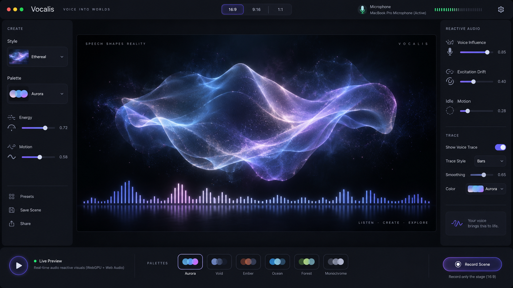
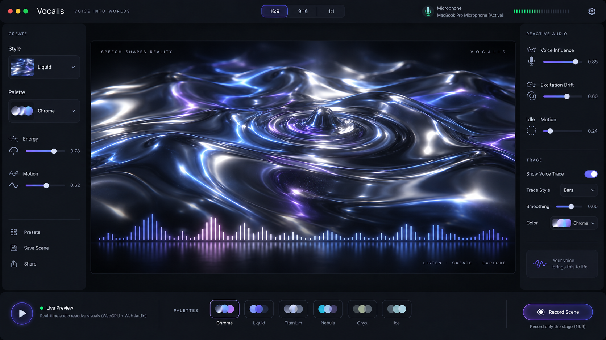
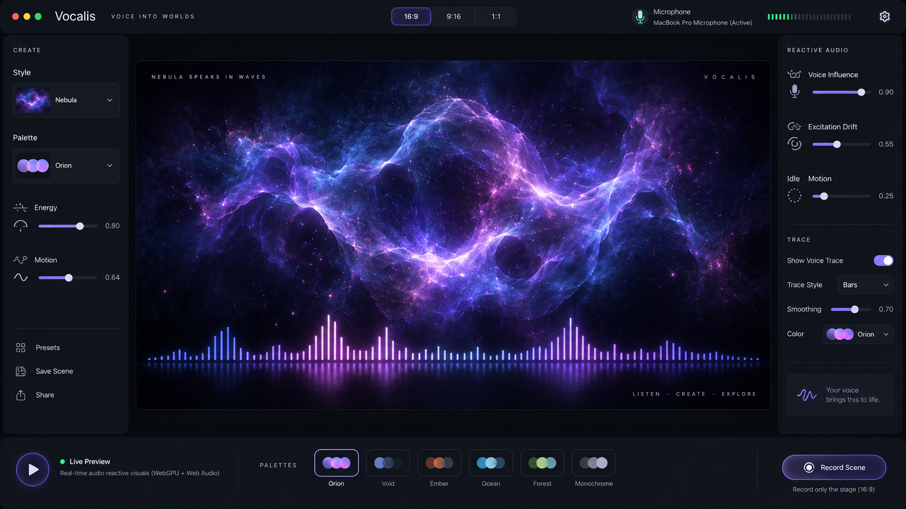
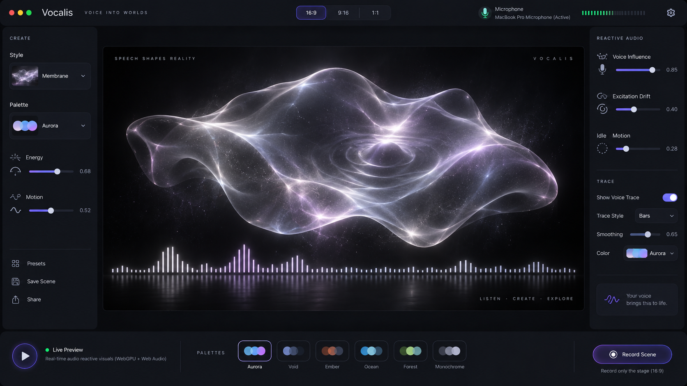
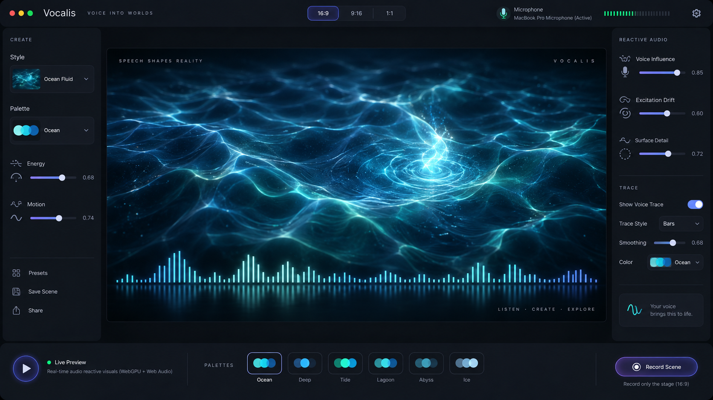
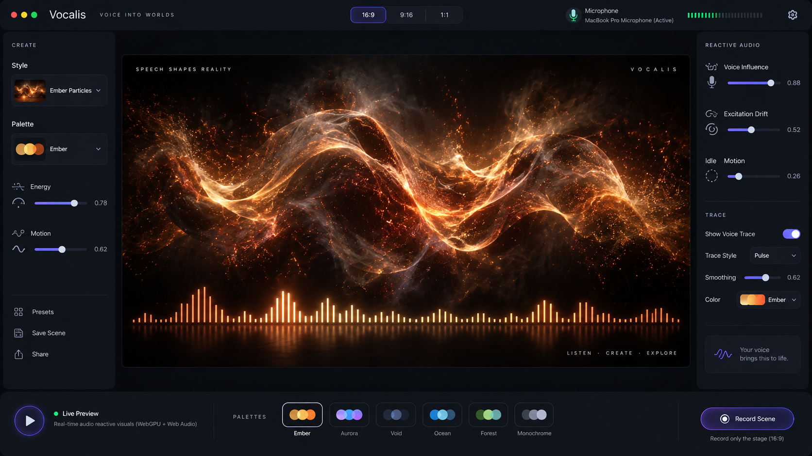
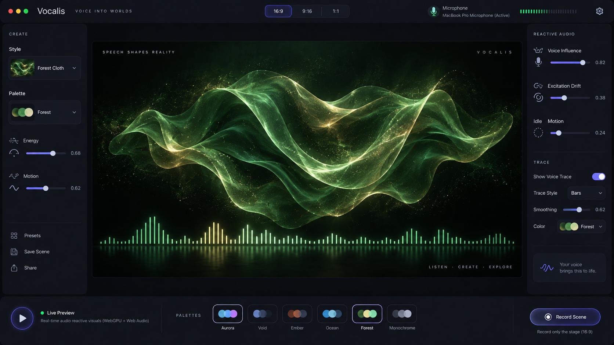
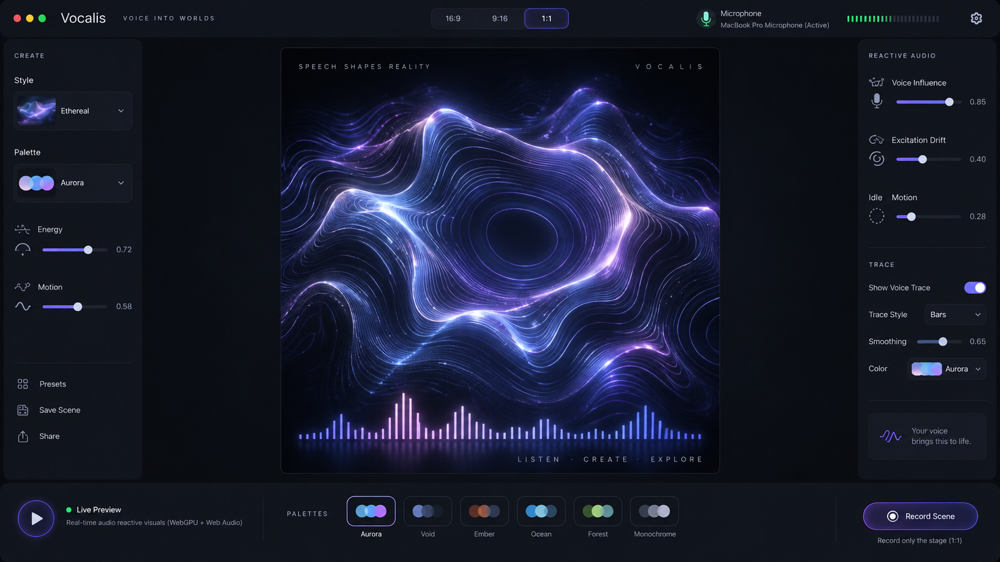
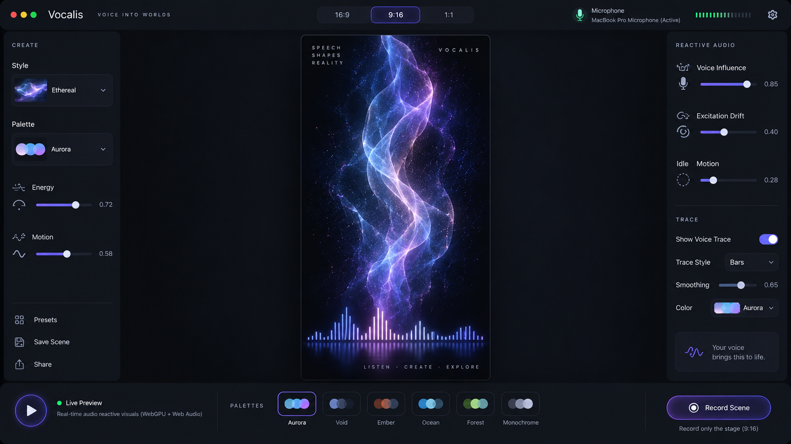
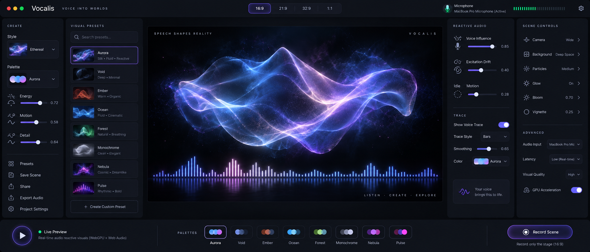

# A00 Product intent, experience, and design contract

This application is a voice-reactive visual instrument for people who want to record themselves speaking without placing a conventional talking-head video, slide deck, waveform utility, or unrelated desktop application on screen. Its purpose is to provide a visually compelling subject that can occupy the recorded frame while the speaker talks. The speaker's voice does not merely drive an equalizer. It disturbs a living visual environment.

The application is implemented as a dependency-free, single-page web application using ordinary HTML, CSS, and JavaScript. Rendering should use WebGPU. Microphone capture and analysis should use the Web Audio APIs and related native browser capabilities. No application framework, shader library, UI toolkit, visualization library, external design system, package manager dependency, build tool, or runtime CDN is required. The application should be understandable by opening the source tree and reading normal JavaScript modules.

The primary experience is desktop. A user opens the application in a WebGPU-capable desktop browser, grants microphone access, chooses a visual preset, adjusts a small number of expressive controls, and positions an external screen-recording application's capture rectangle around the central visual Stage. The surrounding controls remain outside that rectangle. The user can continue changing the visual treatment while speaking without disturbing the recorded area. Those changes should not appear as abrupt theme switches. They should unfold as coherent scene transitions.

The application does not record video. External screen-recording software is responsible for recording. Any recording buttons, labels, or controls appearing in the accepted concept images are visual ideas only and must not be interpreted as a requirement to implement video recording. The application's responsibility ends at creating, sizing, displaying, and animating the Stage cleanly enough that another program can record it.

The accepted visual references establish the design language. They show a dark, premium application shell surrounding a visually isolated Stage; restrained side controls; scene-specific accent colors; a luminous reactive field occupying the center of the Stage; and an elegant Voice Trace near the lower edge. The accepted references include silk-like aurora forms, reflective liquid chrome, nebula forms, translucent membranes, ocean-like fluid surfaces, ember-supported fields, forest-colored fabric, square and portrait Stage layouts, and an ultrawide desktop layout with more configuration visible.

Those images are visual evidence rather than literal UI specifications. The implementation should borrow their strongest decisions and combine them into a coherent product. Text visible inside the conceptual Stage, such as product names, slogans, or decorative phrases, must not survive into the actual recording Stage. The actual Stage contains no branding and no decorative text.

The central principle is that visual quality is not decoration applied after functionality. Visual quality is the functionality.

The user should feel that the scene already has a life of its own before speaking. Silence should not expose a frozen shader waiting for amplitude. The field should breathe slowly, drift, shimmer, fold, or circulate according to its preset. When the user begins speaking, that existing system receives energy. It becomes more animated. Disturbances propagate. Different aspects of the voice influence different scales of movement. The system remembers recent speech for a short time. The end of a sentence does not make the entire world snap back to zero.

A useful mental model is water already moving under a light wind. Speech is not the water itself. Speech throws energy into it.

A quiet phrase might produce shallow movement around a slowly wandering point. A stronger syllable might create a visible impulse that travels across the surface. Several words spoken close together can cause overlapping waves. A sustained sentence can gradually raise the overall energy and complexity of the field. When speech stops, the last disturbances should continue traveling and decaying before the scene returns to its low-energy idle behavior.

The product should feel more like an abstract installation, title sequence, or visual instrument than a music visualizer.

The implementation agent should treat this specification as a precise statement of product intent while still exercising engineering judgment. If an implementation detail is not explicitly resolved here, the agent should choose the solution that best preserves the product's core qualities: elegance, smoothness, predictability, visual coherence, performance, and simplicity. The agent should not stop merely because a small choice is unspecified. It should make a high-quality decision, implement it, test it, and continue.

The implementation agent is expected to work autonomously from the beginning of implementation through a finished, tested application. It should inspect its work repeatedly rather than performing a single implementation pass followed by a final check. Where Playwright or equivalent browser tooling is already installed on the development system, it should use that existing tooling rather than adding unnecessary project dependencies.

The application should not require an account, backend, database, cloud service, analytics service, login flow, synchronization system, audio output subsystem, or video encoding subsystem.

It listens.

It visualizes.

It provides a Stage.

It provides an instrument panel around that Stage.

It leaves recording to the recording software.

## MOCK Screenshots

Those images are better describe how the application should look like. Of course, it should be all like feature-rich, and everything should be actionable. But those images are like screenshots, mock screenshots of future application. The agent must, the agent, this is directive. The agent must explore and read and understand and take notes during the development process from these images very thoroughly, very thoroughly, and explicitly make notes about the alignment of those components and how they fit to the requirements. So this is very important to clearly understand those images. And every element and each element and the resulting product should be very similar, very similar to what we have on these approved screenshots. Of course, those screenshots may be contradictory to each other, and in this case, use your best judgment to decide what is the right thing to do, what is the right call.

























# B00 The Stage, the Control Frame, responsive composition, and the visual language

The application is divided conceptually into two spaces: the Stage and the Control Frame.

The Stage is sacred.

The Control Frame exists to manipulate it.

The Stage is the area intended to be captured by an external screen recorder. It has an explicit aspect ratio and a stable visible boundary. Everything inside it is suitable for appearing in the final video. Everything outside it belongs to the application interface.

The Stage must never contain the product name, settings labels, descriptive copy, instructions, sliders, dropdowns, frame dimensions, microphone labels, tooltips, debug values, preset names, or decorative slogans. It should not contain "Vocalis", "Speech Shapes Reality", "Listen / Create / Explore", or equivalent text even though such text appeared in exploratory images.

The no-text rule is intentional and important.

A viewer of the resulting video should see an abstract reactive visual scene and, when enabled, the Voice Trace. The viewer should not be able to tell which application generated the image from any text embedded in the Stage.

The Stage can contain the Reactive Field, the background environment, particles belonging to the visual simulation, lighting effects, post-processing effects, and the Voice Trace. These are visual content, not application chrome.

The Stage defaults to a 16:9 layout. The user can choose at least three recording frame presets:

```text
16:9
9:16
1:1
```

The 16:9 preset is the primary desktop format. The 9:16 preset is intended for portrait social video. The 1:1 preset supports square output.

The application should preserve the selected aspect ratio exactly while resizing the Stage to fit available space. The Stage is therefore fixed in shape but adaptive in displayed dimensions.

The Stage should not stretch arbitrarily simply because an ultrawide monitor has more horizontal pixels. Once it reaches a useful recording size, additional available real estate should benefit the Control Frame rather than turning the visual scene into an uncontrollably wide canvas.

On a conventional 1920 x 1080 desktop, the Stage should remain large enough to be visually useful while leaving practical controls available around it. A typical layout may display a roughly 16:9 Stage around the center with controls to the left and right, but exact CSS dimensions may be chosen by the implementation agent after testing.

The internal WebGPU canvas should render at an appropriate device-pixel-scaled resolution rather than simply inheriting CSS pixel dimensions. The renderer should avoid unnecessary oversampling, but the image must remain crisp on high-DPI displays.

The application should expose a small set of frame sizing options if they improve practical screen-recording use. Examples might include "Fit", "720p region", or other size-oriented conveniences. Such options are not required to promise a specific external recording resolution. The external screen recorder ultimately determines the captured pixel dimensions.

The Control Frame surrounds the Stage and should behave as an instrument panel. Its panels should feel quieter than the Stage. The scene remains the visual focus.

The accepted mockups demonstrate an appropriate hierarchy: dark panels, restrained separators, compact labels, softly rounded controls, clean typography, and small luminous accents that inherit the scene's current palette.

The base application shell should remain dark and neutral. It should not be repainted wholesale when the preset changes. Instead, each scene produces a Scene Accent derived from its active palette.

The Scene Accent can influence:

```text
selected tabs
slider fills
active toggles
focus outlines
selected preset borders
microphone activity indicators
small status lights
subtle button glows
small icon accents
```

The Scene Accent should not significantly recolor:

```text
main body text
inactive control text
large panel backgrounds
structural separators
the entire application background
```

The product must continue to feel like one application while the visual atmosphere changes.

An Ember preset may therefore create warm amber slider fills and copper glows. Ocean may introduce cyan. Forest may produce green and muted gold. Chrome may use cold silver, blue, and violet. Nebula may lean into violet and magenta.

When the scene transitions from one palette to another, the Scene Accent should transition with it rather than changing instantly.

The user should be able to glance away from the Stage and feel that the surrounding instrument panel belongs to the current scene.

Desktop layout uses three density states.

The first is Compact Desktop. This state is intended for constrained but still desktop-sized windows. The Stage remains the priority. One control rail contains the highest-value controls and secondary controls are available through collapsible sections, drawers, or compact groups.

The second is Standard Desktop. This is the normal layout for a typical full-screen 16:9 display. Primary creative controls occupy a left rail. Reactive audio and Voice Trace controls occupy a right rail. The Stage sits between them.

The third is Wide Desktop. This is intended for ultrawide displays. The Stage remains centered and retains its chosen aspect ratio. Additional horizontal space reveals controls that would otherwise be collapsed, such as preset browsing, scene quality, advanced parameters, additional palette controls, or renderer settings.

The Wide Desktop concept image is an especially useful reference for this behavior. The important lesson is not the exact number of columns. The lesson is that additional width should expose information rather than arbitrarily enlarge the Stage.

Responsive transitions between density states should be intentional and stable. Panels should not jump unpredictably as a window is resized by a few pixels.

The application should use CSS media queries or container-aware layout logic to define the three states clearly.

On mobile, the interaction model changes instead of forcing the desktop Control Frame into a narrow screen.

Mobile has two primary modes: Compose Mode and Performance Mode.

Compose Mode displays a Stage preview and places controls in the remaining screen area, primarily below the preview. The user configures the scene here. The experience can scroll if necessary.

Performance Mode gives visual priority to the Stage and hides the ordinary editing controls. It is the mobile equivalent of presenting the scene for screen recording.

The user switches between Compose Mode and Performance Mode with a horizontal swipe gesture. The direction does not need to have different semantic meaning. Since there are only two primary modes, a horizontal swipe can toggle to the other mode. Swiping again returns.

The implementation should use a reasonable gesture threshold so ordinary taps and slider drags are never mistaken for mode switches. Gesture detection must not steal interaction from sliders, buttons, or other controls.

A short animated transition should make the spatial relationship between Compose and Performance feel natural. The user should understand that these are two views of the same scene, not two separate pages.

Performance Mode may provide a minimal way to leave the mode if gesture input fails or is not discoverable. This escape control should be visually restrained and should disappear when practical. It must not permanently pollute the recorded Stage.

Mobile is intentionally less feature-rich than desktop.

The mobile experience should prefer a stable frame rate over maximum graphical complexity. It may reduce render resolution, particle counts, ray-marching steps, post-processing, blur passes, bloom intensity, shader detail, or other expensive work.

A desktop preset and a mobile rendering of the same preset should clearly belong to the same visual family even if the mobile version is less complex.

WebGPU remains the primary renderer. The application should detect capabilities at runtime. On a mobile browser with sufficient WebGPU support, it should use the reduced quality path automatically. If the required WebGPU capability is unavailable, the application should present a clear compatibility state rather than silently failing.

A completely separate full-quality WebGL renderer is not required.

# C00 Reactive Field, audio behavior, visual styles, presets, transitions, and the Voice Trace

The canonical name for the central visual phenomenon is Reactive Field.

A Reactive Field is the continuous visual system occupying most of the Stage. It evolves autonomously over time and responds to derived voice features.

The word "Field" is deliberately broad. The scene may resemble silk, water, metal, smoke, cosmic matter, particles, an elastic membrane, or a structure without a real-world equivalent.

The application should not expose the internal rendering implementation as the primary mental model for users.

Internally, however, multiple rendering techniques are permitted and expected.

A Style is an internal behavioral family.

A Preset is the primary user-facing scene configuration.

This distinction resolves an important design tension. The engine can use substantially different techniques without forcing the user to learn a different control vocabulary for every renderer.

The initial internal Style families are:

```text
Silk
Membrane
Liquid
Chrome
Nebula
Particles
Ember
```

The implementation agent may share GPU infrastructure between styles. For example, Liquid and Chrome may use related geometry or height-field behavior while applying different shading. Silk and Membrane may share mesh deformation code. This is an implementation choice.

What matters is that each Style produces a genuinely distinct visual character.

Silk should suggest translucent fabric, ribbons, layered folds, and graceful tension.

Membrane should suggest a broad elastic surface that receives localized pressure, produces coherent ripples, and relaxes smoothly.

Liquid should suggest a fluid surface with broad height variation, traveling waves, local disturbances, and rolling currents.

Chrome should behave like reflective or metallic fluid matter. It should have broad liquid-like displacement but use specular, metallic, and environment-like reflections that produce a materially different appearance from ordinary Liquid.

Nebula should suggest volumetric cloud, gas, filaments, luminous dust, depth, and slow cosmic turbulence.

Particles should use particles as a meaningful structural component rather than as confetti. Particles should appear to belong to a field, flow, or coherent force system.

Ember should combine cohesive flowing structure with heat-like particulate behavior, smoke-like deformation, sparks, and warm energy. It is not a particle explosion preset.

All Styles implement the same expressive control vocabulary.

The core normalized controls are:

```text
Energy
Motion
Detail
Voice Influence
Excitation Drift
Idle Motion
```

Palette is handled separately.

The user-facing meaning of these controls must remain stable even when their internal interpretation changes.

Energy controls the overall apparent intensity of the scene.

Motion controls how dynamically the scene evolves.

Detail controls the prominence of small-scale structure.

Voice Influence controls how strongly microphone-derived features disturb the scene.

Excitation Drift controls the speed and range of the wandering disturbance origin.

Idle Motion controls the autonomous activity present during silence.

A user should not need to understand shader parameters such as displacement amplitude, FBM octave count, curl noise scale, normal strength, particle drag, ray step count, or damping coefficients.

Those parameters belong behind the Style implementation.

Presets are the main product concept.

A Preset combines:

```text
a Style
a Palette
core expressive control values
Voice Trace settings
scene-level visual parameters
quality hints where useful
transition preferences where useful
```

Presets live in source code as ordinary JavaScript data.

The application should ship with a curated set of presets that demonstrates the product's visual range. At minimum, the implementation should provide strong versions of the following visual directions:

```text
Aurora
Silk
Membrane
Liquid
Chrome
Nebula
Particles
Ember
Ocean
Forest
Monochrome or Void
```

Names may be slightly refined if the resulting set becomes clearer, but the visual directions must remain.

Aurora should be a luminous, cool-toned silk or membrane composition with violet, blue, and soft pink light.

Silk should emphasize flowing translucent fabric.

Membrane should emphasize a broad continuous elastic surface.

Liquid should emphasize waves, currents, and fluid deformation.

Chrome should emphasize reflective metallic liquid.

Nebula should emphasize deep-space luminous cloud and filament structures.

Particles should demonstrate that the engine can use particulate motion without losing compositional coherence.

Ember should use copper, amber, gold, orange, and smoke-dark tones.

Ocean should be an art-directed Liquid preset rather than merely "Liquid but blue". It should suggest depth, water, cyan light, long rolling surface structures, and localized disturbances.

Forest should remain abstract rather than becoming a literal landscape. The product's visual language is stronger if Forest suggests a canopy, root system, veins, organic branching, leaf-like particulate motion, or green-gold textile structure without rendering photographic trees. It can evoke the feeling of trees and forest structure without turning the Stage into a scene illustration.

Monochrome or Void should demonstrate restraint: dark space, white, pearl, graphite, smoke, and minimal accent color.

A Preset should be selectable quickly. Choosing a preset should immediately begin a Scene Transition rather than replacing the scene on the next frame.

Styles and palettes remain independent.

Each Style may have recommended palettes, and each shipped Preset should represent a deliberately art-directed combination. The user is still free to apply a different palette.

Silk can be Aurora, Ocean, Ember, Monochrome, or another palette.

Chrome can be silver and violet by default but may also be gold, crimson, cyan, or other combinations.

Unusual combinations should be allowed unless they produce a technical failure.

The renderer should avoid implementing arbitrary restrictions based only on taste.

A Scene Transition is the universal transition model for changes that significantly affect the Stage.

When the old and new scene share compatible simulation infrastructure, the engine should interpolate relevant values directly.

When they are incompatible, the transition should still feel materially coherent.

A cross-renderer transition should not feel like one screenshot fading out while a second screenshot fades in.

Instead, the outgoing scene can gradually lose structure, lower contrast, reduce detail, change palette, soften or dissolve, while the incoming scene gains structure through the same evolving color and energy state.

The exact rendering technique is left to the implementation agent.

The perceptual requirement is explicit: the user should experience transformation, not replacement.

A normal Style or Preset transition should generally last somewhere around 1.5 to 3 seconds. A starting value around 1.8 to 2.4 seconds is appropriate.

Minor controls such as Energy or Voice Influence should respond faster and continuously rather than performing a full scene transition.

Changing Palette should interpolate color smoothly.

Changing Voice Trace Style should also use a short visual transition if possible.

The active palette defines the Stage colors and the Scene Accent used by the Control Frame.

The Reactive Field includes a hidden spatial concept called the Excitation Point.

The Excitation Point represents the approximate location at which speech-driven energy enters the field.

It must not remain perfectly centered.

It must not teleport randomly.

It must not travel in straight lines and bounce like a screensaver.

It follows a bounded wandering trajectory.

Conceptually, the point has a position, velocity, and slowly changing steering direction. Low-frequency procedural noise or a similar smooth stochastic process influences the steering. The point can spend time moving gradually toward one region, arc toward another, hesitate, curve back, and wander through the scene as though it has a small amount of intention.

The movement must remain bounded inside a useful interior region of the Stage.

Near a boundary, the point should turn inward gradually through a restoring influence. It should not produce a visible billiard-ball collision.

The point itself is not visible during ordinary use.

Only its consequences are visible.

A debug mode may visualize it for development.

Voice activity determines how strongly the Excitation Point disturbs the field. Voice activity does not normally determine where the point moves.

Styles may derive secondary or echo disturbances from the primary point if doing so improves the visual effect, but the conceptual model should remain simple.

The application's audio analysis should not map raw microphone amplitude directly onto shader displacement.

The audio system should derive a compact set of slowly evolving voice features.

At minimum, the internal feature model should include:

```text
overall voice energy
low-frequency energy
mid-frequency energy
high-frequency energy
transient or impulse strength
slow phrase activity
silence duration
```

A useful implementation can derive these values from Web Audio time-domain and frequency-domain data.

Exact filter boundaries may be tuned by the implementation agent, but speech-appropriate starting bands might roughly separate low body, mid voice content, and high consonant/detail content.

The mapping from frequency analysis to visual response must be deliberately indirect.

Low-frequency energy should mainly influence broad displacement, depth, large waves, or weight.

Mid-frequency energy should mainly influence medium-scale deformation, surface motion, or flow.

High-frequency energy should mainly influence fine detail, shimmer, small particles, highlights, or texture.

Transient energy should be eligible to create localized impulses.

These mappings should pass through smoothing and nonlinear response curves.

The viewer should not be able to read the Reactive Field as a literal spectrogram.

The visual system is interpreting the voice, not plotting it.

The application should maintain a Voice Envelope.

The Voice Envelope is a smoothed representation of recent microphone activity. It should rise fast enough that speech feels responsive and fall slowly enough that motion has weight.

The engine should also detect Speech Impulses.

An isolated word or strong syllable can create a localized impulse.

Several words spoken near each other can create overlapping impulses.

Continuous speech should accumulate energy into a slower activity state.

This produces different behavior for:

```text
one isolated word
several words with pauses
a long sentence
continuous speech
quiet speech
loud speech
silence
```

These cases must not collapse into the same amplitude-to-scale mapping.

For example, consider the following spoken sequence:

```text
"Imagine."

pause

"a surface..."

short pause

"that remembers the shape of your voice."
```

The first word should produce a disturbance that begins propagating.

During the pause, that disturbance should continue moving and fading.

The phrase "a surface" should add another event before the system fully returns to idle.

The final sentence should build a broader activity state because speech continues longer. New impulses should ride on top of that state.

When the speaker stops, the recent phrase should remain visible for a short period as the system dissipates energy.

Silence has more than one meaning.

A tiny pause between syllables should not cause any semantic mode change.

A short pause between words should preserve recent speech state.

A longer pause between phrases should begin a noticeable decay.

Sustained silence should allow the scene to converge toward Idle Motion.

The agent may tune thresholds after observing real microphone behavior. Approximate starting points might treat pauses under a few hundred milliseconds as part of continuous speech, pauses approaching one second as phrase boundaries, and longer silence as entry into idle behavior.

The transition into idle must be gradual.

Idle Motion is not zero.

During sustained silence, the Stage should still have enough motion to feel alive.

Idle Motion should remain visibly less energetic than active speech.

The Voice Trace is a second visual system inside the Stage.

It occupies a restrained band near the lower portion of the Stage by default.

It must remain visually subordinate to the Reactive Field.

It should be readable enough to communicate that the microphone is active, but it should not dominate the composition.

The Voice Trace is not a literal FFT equalizer.

It is a temporal representation of recent voice behavior.

A useful implementation can maintain approximately 48 to 96 bar positions. The exact number should respond to Stage dimensions and device performance.

The trace should use recent smoothed voice features to create correlated groups of bars, broad hills, and graceful decays rather than noisy independent teeth.

One possible implementation places the newest activity near the center and allows older activity to travel or age toward the edges. Another may use a short history buffer mapped across the width. The implementation agent may choose the mapping that produces the most elegant result.

The requirement is that the trace feels designed.

The trace should respond to speech rhythm, recent intensity, and possibly some frequency features without behaving like an off-the-shelf spectrum analyzer.

The user must be able to change Trace Style from controls outside the Stage while recording.

At minimum, the following Voice Trace styles should be provided:

```text
Bars
Soft Bars
Poles
Minimal
```

Bars are crisp vertical bars with controlled smoothing.

Soft Bars use similar geometry with softer edges, bloom, lower contrast, or more interpolation.

Poles can use thinner line-like columns and may optionally extend around a baseline.

Minimal reduces the amount of information, density, height range, or opacity so the trace becomes a subtle indicator.

The user can also turn the Voice Trace off.

Changing Trace Style during an active scene should not cause a harsh single-frame switch if a short transition can be implemented cleanly.

The Stage must still contain no text when the trace is enabled.

The trace may use the active palette or a related high-contrast subset of the active palette.

# D00 How the product should feel in actual use

The specification is not complete unless it describes what the user experiences over time.

Consider a desktop user preparing to record a narrated explanation.

The application opens into a dark interface. The center is immediately understandable as a clean visual Stage. The surrounding panels are visible but visually quiet. A microphone status indicator appears outside the Stage.

If microphone permission has not yet been granted, the interface explains the requirement outside the Stage and provides an obvious way to enable it.

Once permission is granted, the microphone indicator begins showing activity.

The Stage is already moving.

Suppose the default preset is Aurora.

The scene contains a translucent silk-like field suspended in darkness. It drifts slowly. Fine luminous material moves through its folds. The Voice Trace is nearly flat but not mathematically dead.

The user says:

```text
"Testing."
```

The trace rises immediately but smoothly.

Somewhere inside the silk, at a location that is not exactly the center, a disturbance appears. It does not look like a volume slider changing the size of an object. Instead, the fabric receives energy. A ripple, tension line, displacement, or local change begins traveling through the material.

The user remains silent.

The effect continues.

The wave decays.

The scene returns toward its idle rhythm.

Now the user speaks continuously for several seconds.

The system becomes more active.

Large movement gains strength.

Fine detail appears.

The trace forms changing clusters.

The scene is more alive, but it remains controlled. It should not turn into noise merely because the user is speaking loudly.

The user decides that a colder, more metallic scene fits the subject better.

Without stopping the external recording, the user reaches into the Control Frame and selects Chrome.

The old silk form begins transforming.

Its color moves toward colder metallic tones. Its translucent structure loses definition. Smooth liquid ridges emerge. Reflections gather. The new surface becomes coherent.

There is never a frame in which the scene suddenly becomes an unrelated image.

The Control Frame's accent color changes at the same time.

The selected control glow that was previously violet shifts toward chrome-blue.

The user continues talking during this transition.

Voice responsiveness continues throughout the transition.

The scene should never become temporarily deaf because a new renderer is being prepared.

Now imagine the same user selecting Ocean.

The scene changes into deep fluid structure.

The Excitation Point has wandered away from where it was a minute earlier.

A louder phrase causes a stronger local disturbance near its current location. Waves travel outward. Low-frequency energy may create broad rolling displacement while high-frequency detail appears as small surface glints and fine texture.

Now imagine a user selecting Forest.

Forest should not suddenly become a rendered photograph of trees.

Instead, the visual language remains abstract. Green-gold folds, branching luminous structures, fine leaf-like particulate motion, root-like lines, canopy-like layering, or other organic patterns can suggest forest structure.

The user should feel "forest" without the application abandoning its identity as an abstract visual instrument.

Now consider a 1920 x 1080 desktop.

The Standard Desktop layout is active.

The left side contains high-value creative controls. The right side contains reactive-audio and Voice Trace controls.

The user can reach Style or Preset, Palette, Energy, Motion, Detail, Voice Influence, Excitation Drift, Idle Motion, Trace visibility, and Trace Style without covering the Stage.

Less important controls may live in expandable groups.

Now move the same application to an ultrawide monitor.

The Stage retains a deliberate central size.

Instead of becoming excessively large, extra columns appear.

A preset browser can remain open.

Advanced scene controls can remain visible.

Quality settings can be accessible without opening a modal.

The result should feel like a professional instrument expanding into available space.

Now shrink the window toward the Compact Desktop state.

The Stage remains usable.

Secondary groups collapse.

The most important creative controls remain reachable.

The user should not experience a chaotic series of layout changes.

Now consider a mobile user.

The application opens in Compose Mode.

A smaller preview is visible above controls.

The user chooses Ocean, adjusts Voice Influence, changes the Voice Trace from Bars to Minimal, and selects 9:16.

The preview reflects every change.

When ready to record the phone screen, the user swipes horizontally.

The interface transitions into Performance Mode.

The Stage takes over the display.

Editing controls disappear.

The visual continues listening to the microphone.

The user begins the phone's own screen-recording feature.

During recording, the user can swipe horizontally to return to Compose Mode if a change becomes necessary.

After changing a preset or control, another horizontal swipe returns to Performance Mode.

This mobile workflow is intentionally different from desktop.

Desktop permits continuous editing beside the Stage.

Mobile prioritizes a clean full-screen performance view and treats configuration as a neighboring mode.

Consider changing Voice Trace Style during desktop recording.

The user is speaking with Bars enabled.

The bars have a clear rectangular shape.

The user selects Soft Bars in the visible right-hand controls.

The geometry softens and transitions into a more diffused response.

The Stage does not flash.

The Reactive Field does not reset.

The Excitation Point does not jump.

The audio analysis continues.

The user's visual narrative remains continuous.

Consider a quiet environment with background microphone noise.

The application should not interpret a tiny noise floor as constant speech.

The audio system should establish or track a reasonable baseline and use smoothing or thresholding so idle behavior remains distinct from active voice behavior.

The application does not need speech recognition.

It does not care which words are spoken.

It does not transcribe.

It does not send audio to a server.

It does not play audio.

It does not monitor the microphone through speakers.

It only derives local features and uses them to influence graphics.

# E00 Configuration, presets, source organization, and examples for maintainers

The project should remain simple to read and edit.

A recommended source structure is:

```text
/
|-- index.html
|-- README.md
|-- css/
|   `-- app.css
|-- js/
|   |-- main.js
|   |-- app-state.js
|   |-- config/
|   |   |-- defaults.js
|   |   |-- palettes.js
|   |   `-- presets.js
|   |-- audio/
|   |   |-- audio-engine.js
|   |   `-- voice-features.js
|   |-- render/
|   |   |-- renderer.js
|   |   |-- transition.js
|   |   |-- excitation.js
|   |   |-- voice-trace.js
|   |   `-- styles/
|   |       |-- silk.js
|   |       |-- membrane.js
|   |       |-- liquid.js
|   |       |-- chrome.js
|   |       |-- nebula.js
|   |       |-- particles.js
|   |       `-- ember.js
|   `-- ui/
|       |-- controls.js
|       |-- layout.js
|       `-- gestures.js
|-- shaders/
|   `-- ...
`-- assets/
    `-- ...
```

The exact file decomposition may be changed if the implementation agent finds a cleaner organization. The architectural requirement is that configuration data, audio feature extraction, renderer behavior, UI behavior, and individual style implementations are not collapsed into one unmaintainable script.

Use native ES modules.

Do not introduce a bundler merely to support modules.

The application should be served through localhost during development because microphone access and WebGPU depend on secure-context browser behavior. Documentation should not instruct users to rely on opening `index.html` directly from `file://`.

A simple development command may be documented using whatever basic local server is already available on the machine, for example:

```bash
python -m http.server 8000
```

The production version should be served over HTTPS.

Default configuration belongs in an ordinary JavaScript file.

For example:

```js
export const DEFAULTS = {
  frame: {
    aspectRatio: "16:9",
  },

  scene: {
    preset: "aurora",
    transitionDurationMs: 2000,
  },

  controls: {
    energy: 0.62,
    motion: 0.48,
    detail: 0.58,
    voiceInfluence: 0.78,
    excitationDrift: 0.38,
    idleMotion: 0.24,
  },

  trace: {
    enabled: true,
    style: "bars",
    smoothing: 0.7,
    intensity: 0.78,
  },

  quality: {
    desktop: "high",
    mobile: "adaptive",
  },
};
```

The exact values should be tuned against the finished visual output. The example demonstrates the desired configuration shape.

Palettes should also be plain data.

For example:

```js
export const PALETTES = {
  aurora: {
    label: "Aurora",
    colors: ["#6ea8ff", "#9474ff", "#ff9de8"],
    background: "#050711",
  },

  chrome: {
    label: "Chrome",
    colors: ["#cbd6ff", "#728cff", "#aa7cff"],
    background: "#05060a",
  },

  ocean: {
    label: "Ocean",
    colors: ["#51e7e7", "#23aee8", "#315eff"],
    background: "#031019",
  },

  ember: {
    label: "Ember",
    colors: ["#ffd26a", "#ff8a32", "#d44719"],
    background: "#100604",
  },

  forest: {
    label: "Forest",
    colors: ["#82db7a", "#d6d67b", "#2c8b5a"],
    background: "#050b07",
  },
};
```

Presets should be similarly readable.

For example:

```js
export const PRESETS = {
  aurora: {
    label: "Aurora",
    style: "silk",
    palette: "aurora",
    energy: 0.62,
    motion: 0.46,
    detail: 0.64,
    voiceInfluence: 0.82,
    excitationDrift: 0.34,
    idleMotion: 0.22,
    trace: {
      enabled: true,
      style: "bars",
      smoothing: 0.72,
    },
  },

  chrome: {
    label: "Chrome",
    style: "chrome",
    palette: "chrome",
    energy: 0.72,
    motion: 0.5,
    detail: 0.7,
    voiceInfluence: 0.86,
    excitationDrift: 0.42,
    idleMotion: 0.2,
    trace: {
      enabled: true,
      style: "soft-bars",
      smoothing: 0.76,
    },
  },

  ocean: {
    label: "Ocean",
    style: "liquid",
    palette: "ocean",
    energy: 0.64,
    motion: 0.56,
    detail: 0.6,
    voiceInfluence: 0.8,
    excitationDrift: 0.46,
    idleMotion: 0.28,
    trace: {
      enabled: true,
      style: "bars",
      smoothing: 0.74,
    },
  },

  forest: {
    label: "Forest",
    style: "silk",
    palette: "forest",
    energy: 0.56,
    motion: 0.42,
    detail: 0.68,
    voiceInfluence: 0.72,
    excitationDrift: 0.3,
    idleMotion: 0.3,
    trace: {
      enabled: true,
      style: "minimal",
      smoothing: 0.8,
    },
  },
};
```

The code should make adding or editing a preset straightforward.

A technically competent user should be able to open `presets.js`, copy an object, change its label, style, palette, and normalized values, reload the application, and see the new preset.

`README.md` must document this process.

The documentation should explain:

```text
where presets live
where default values live
where palettes live
which Style identifiers are valid
which Trace Style identifiers are valid
which numeric values are normalized from 0 to 1
how to add a preset
how to change the default preset
how to add or alter a palette
how to run the application locally
```

No separate configuration language is necessary.

No JSON schema is necessary.

No settings backend is necessary.

JavaScript is the configuration format.

Runtime adjustments can remain session-scoped in the initial version unless the implementation agent has a compelling reason to add small local persistence. Source-defined presets remain authoritative.

The application should provide a reset behavior so the user can return the current scene to its preset-defined values after experimentation.

A useful renderer contract might resemble:

```js
class StyleRenderer {
  async initialize(device, context) {}

  resize(width, height, pixelRatio) {}

  update({
    time,
    deltaTime,
    controls,
    audio,
    excitation,
    palette,
  }) {}

  render(commandEncoder, targetView) {}

  destroy() {}
}
```

This is illustrative rather than mandatory.

Every style should consume the same high-level control and audio state even when the shader implementation differs.

The application state passed into rendering might conceptually resemble:

```js
const frameState = {
  audio: {
    envelope: 0.48,
    low: 0.42,
    mid: 0.61,
    high: 0.33,
    impulse: 0.18,
    phraseActivity: 0.57,
    silenceMs: 120,
  },

  excitation: {
    x: 0.41,
    y: 0.54,
    vx: 0.02,
    vy: -0.01,
  },

  controls: {
    energy: 0.65,
    motion: 0.52,
    detail: 0.58,
    voiceInfluence: 0.8,
    excitationDrift: 0.4,
    idleMotion: 0.24,
  },
};
```

The exact data model can differ.

What should not differ is the product behavior these values represent.

Shaders may live in standalone `.wgsl` files or in JavaScript template strings. The implementation agent should choose whichever organization is easier to maintain without adding a build pipeline.

Prefer procedural graphics.

Procedural noise, generated fields, mathematical surfaces, particle systems, and GPU-generated textures are preferable to large image dependencies because they scale naturally and support continuous deformation.

If a static local texture materially improves a style, the implementation may include it as a local asset. It must not require a network request to a third-party service at runtime.

If an image-generation tool is available during development, the implementation agent may use it to create local visual assets or texture experiments. Such assets should still be committed locally and treated as application resources, not external runtime dependencies.

# F00 WebGPU rendering, Web Audio analysis, performance, failure behavior, and technical quality

WebGPU is the primary graphics API.

Desktop support may require WebGPU.

The application should detect `navigator.gpu` and other required capabilities during startup.

If support is missing, it should not fail with an empty black Stage or console exception.

Instead, the Control Frame should display a clear compatibility message explaining that a WebGPU-capable browser is required for the full experience.

The message remains outside the Stage.

Renderer initialization should be defensive.

Device loss should be handled where practical.

Resizing should not recreate expensive GPU resources every frame.

The render loop should use `requestAnimationFrame`.

The renderer should separate logical animation timing from frame rate enough that motion does not dramatically change speed between 60 Hz and 120 Hz displays.

Visual smoothing should be time-based rather than frame-count-based.

The implementation should avoid unnecessary CPU-GPU synchronization.

Particle buffers, uniform buffers, render targets, and simulation textures should be reused.

The number of shader passes should remain justified by visible quality.

The agent should profile obvious bottlenecks before assuming that poor performance requires architectural complexity.

The desktop target is smooth, high-quality animation on a reasonably modern WebGPU-capable machine.

A stable frame rate is more important than extreme geometric detail.

Where possible, aim for 60 frames per second.

On lower-performing hardware, adaptive quality is acceptable.

Mobile quality should automatically reduce expensive work.

Potential degradation strategies include:

```text
lower internal render scale
fewer particles
lower simulation resolution
fewer volumetric steps
lower noise octave count
reduced bloom
simpler blur
reduced surface detail
lower Voice Trace density
lower maximum device pixel ratio
```

The visual identity must survive degradation.

Web Audio handles microphone acquisition and feature extraction.

Microphone access begins only after appropriate user interaction or browser permission flow.

The application should use `navigator.mediaDevices.getUserMedia({ audio: true })` or the appropriate equivalent.

Video permission is not required.

The microphone stream should remain local.

No audio samples leave the browser.

No transcription service is used.

No network call is made with microphone data.

The application produces no audio output.

It must not route microphone input to speakers.

It must not synthesize ambient audio.

It must not produce sound effects.

The scope is visual only.

The audio pipeline may use `AudioContext`, `MediaStreamAudioSourceNode`, `AnalyserNode`, filters, an `AudioWorklet`, or another native Web Audio technique according to implementation quality.

For an initial version, `AnalyserNode` is acceptable if it provides sufficiently stable feature data.

The system should derive time-domain RMS or a comparable energy measure.

It should derive a smoothed noise-aware envelope.

It should derive rough low, mid, and high frequency energy.

It should derive a transient measure.

A practical transient detector can consider positive envelope slope, spectral flux, or another simple feature.

The system should maintain a slow phrase activity value.

It should track silence duration.

Feature values should be normalized into stable ranges before reaching render styles.

Each style should consume normalized semantic values rather than raw FFT bin arrays wherever practical.

Automatic noise-floor handling is strongly preferred.

The application should avoid reacting constantly to a silent room's microphone hiss.

During startup or over a rolling quiet period, it may estimate baseline energy.

Threshold behavior should be soft rather than creating a hard visible gate.

Attack and release smoothing should be tuned visually.

The target feeling is immediate enough to follow speech but slow enough to avoid jitter.

The application should behave sensibly when microphone permission is denied.

The Stage can continue its Idle Motion.

The Voice Trace can remain inactive.

The Control Frame should explain that microphone access is unavailable and offer a retry path where browser behavior permits one.

Again, the Stage itself remains free of textual error messages.

The application should behave sensibly if the selected input device disappears.

A robust implementation can fall back to idle state and notify the user outside the Stage.

UI controls should be accessible by keyboard where ordinary HTML controls can provide that behavior.

Use semantic controls.

Do not build basic buttons out of non-interactive `<div>` elements unless there is a compelling reason.

Focus indicators should use the Scene Accent while remaining visible.

Control labels must remain readable over the dark shell.

The Stage itself is primarily visual and need not expose every rendered detail to assistive technology, but application controls and state should use meaningful labels.

The product should not require an external font download. A carefully chosen system font stack is sufficient.

Icons may be implemented with local inline SVG or CSS. Do not add an icon library dependency merely for convenience.

# G00 Implementation discipline, autonomous agent behavior, testing, and visual verification

The coding agent receiving this specification is expected to implement the application end to end.

It should not stop after producing a static UI shell.

It should not stop after creating one effect.

It should not stop after microphone access works.

It should not leave placeholders for accepted core behavior.

It should continue until the Stage, visual styles, presets, transitions, audio feature extraction, Voice Trace, desktop layouts, mobile mode behavior, configuration source files, documentation, and testing are implemented to a coherent level.

The agent should use its best engineering judgment when this specification leaves a low-level choice open.

Examples include:

```text
the exact WebGPU texture format
the exact simulation grid resolution
the exact number of Voice Trace bars
the exact CSS breakpoint values
the exact microphone envelope coefficients
the exact shader noise implementation
the exact transition shader technique
the exact component/file boundaries
```

These are implementation decisions.

The specification intentionally defines perceptual and behavioral outcomes more strongly than incidental mechanics.

The agent should prefer the simplest architecture that can produce the required quality.

"Dependency-free" must not become an excuse to place thousands of unrelated lines into one HTML file.

Likewise, "high quality" must not become an excuse to add a large framework or build system.

Use the browser platform.

Use WebGPU.

Use Web Audio.

Use ES modules.

Use CSS.

Use ordinary source files.

Testing should occur throughout implementation.

The agent should run the application frequently.

It should inspect browser console output.

It should test microphone permission states.

It should resize the viewport.

It should switch presets repeatedly.

It should speak or use a deterministic fake audio input and inspect the resulting behavior.

It should verify that transitions can occur while the audio system remains active.

It should test mobile and desktop layout modes.

If Playwright is already installed on the system, use it.

Do not add Playwright to runtime dependencies merely because it is available as development tooling elsewhere.

Useful automated Playwright coverage includes:

```text
application boot
WebGPU unsupported state
microphone permission UI state
preset selection
palette selection
core slider interaction
Trace Style changes
Voice Trace enable/disable
aspect ratio changes
desktop density breakpoints
mobile Compose/Performance transitions
horizontal swipe gesture
absence of Stage text
scene accent changes
reset-to-preset behavior
```

Where the browser environment permits, test microphone-reactive behavior with deterministic synthetic audio.

One possible approach is to use Chromium's fake media-stream facilities with a generated local audio fixture.

Another is to mock the application's feature source at a narrow test seam so deterministic values such as envelope, impulse, low, mid, and high energy can be injected.

The agent should use whichever method provides reliable tests without distorting production architecture.

A useful synthetic test sequence might contain:

```text
1 second silence
a short isolated burst
500 ms silence
several short bursts
short silence
3 seconds sustained speech-like energy
2 seconds silence
```

The visual feature layer can then be tested for the expected state progression.

For example:

```text
silence -> idle
isolated burst -> impulse
short pause -> decaying impulse, not full reset
multiple bursts -> accumulated activity
sustained input -> elevated phrase activity
long silence -> smooth return toward idle
```

WebGPU visual correctness may not be fully testable through DOM assertions.

The agent should therefore combine automation with visual inspection.

Playwright screenshots are appropriate for layout and UI-state verification.

The agent should inspect representative screenshots at least at:

```text
1920 x 1080 standard desktop
a constrained desktop width
an ultrawide desktop width
a portrait mobile viewport
a landscape mobile viewport if supported
```

The agent should verify each main Preset visually.

The accepted generated concept images should be used as qualitative references for level of polish, not as pixel-perfect golden masters.

The important visual qualities are:

```text
clear Stage hierarchy
no text inside the Stage
rich but controlled central field
smooth motion
elegant Voice Trace
subtle scene-aware UI accents
high contrast without garish neon overload
clean spacing
coherent dark shell
graceful transitions
```

The agent should explicitly test transitions while the microphone is active.

Changing presets must not reset the entire application.

Changing palettes must not create a flash.

Changing Trace Style must not stop audio analysis.

Resizing must not cause GPU errors.

Switching Stage aspect ratio must not place application controls inside the Stage.

The agent should test prolonged operation.

The application should be able to remain open and animating for a meaningful period without runaway memory growth, repeated allocation storms, accumulating event listeners, or progressively degrading frame rate.

The agent should inspect the browser's performance and memory behavior if there are signs of instability.

Documentation is part of completion.

`README.md` should explain startup, browser requirements, microphone permission, external recording workflow, mobile workflow, source-defined presets, defaults, palettes, and customization.

The documentation must clearly state that the application does not record video itself.

The documentation must clearly state that the application does not produce audio.

The documentation must clearly state that microphone analysis is local.

The implementation should contain no dead placeholder buttons copied from the concept art.

If a concept image shows "Share", "Save Scene", "Export Audio", or "Record Scene" but that function is not required by this specification, do not create a nonfunctional control merely to imitate the screenshot.

Only implemented controls belong in the UI.

# H00 Acceptance criteria and validation scenarios

AC-01 - The application runs as a dependency-free web application.

Ensure that the project can run without installing a runtime JavaScript package dependency.

Ensure that the application uses standard HTML, CSS, JavaScript modules, WebGPU, Web Audio, and browser APIs rather than a framework.

Ensure that no runtime CDN is necessary for rendering, controls, icons, shaders, or audio processing.

AC-02 - The Stage is visually and functionally distinct from the Control Frame.

Ensure that the Stage has a clearly defined recording boundary.

Ensure that all configuration controls remain outside the Stage.

Ensure that the Stage remains usable when the surrounding interface changes between desktop density states.

AC-03 - The Stage contains no text.

Ensure that no product name appears inside the Stage.

Ensure that no slogan, instruction, preset name, aspect-ratio label, microphone label, debug value, or decorative text appears inside the Stage.

Ensure that this remains true for every preset, every Stage aspect ratio, desktop Performance state, and mobile Performance Mode.

AC-04 - External software remains responsible for recording.

Ensure that the application does not implement video capture or encoding as a required feature.

Ensure that documentation explains that a screen recorder should capture the Stage rectangle.

Ensure that no misleading functional "Record Scene" button is implemented unless it is merely renamed to a truthful Stage-related action.

AC-05 - The application supports the required Stage formats.

Ensure that 16:9 can be selected.

Ensure that 9:16 can be selected.

Ensure that 1:1 can be selected.

Ensure that changing format maintains a correctly proportioned Stage without stretching the rendered scene.

AC-06 - The Reactive Field remains alive during silence.

Ensure that the selected preset produces low-energy Idle Motion without microphone activity.

Ensure that Idle Motion is visibly calmer than active speech response.

Ensure that the transition from active voice behavior to Idle Motion is gradual rather than instantaneous.

AC-07 - Microphone activity affects the scene through derived features.

Ensure that the renderer does not rely solely on raw volume as the complete interaction model.

Ensure that low, mid, high, transient, envelope, phrase activity, and silence information or their functional equivalents are available to the visual system.

Ensure that different styles can map those semantic features differently while preserving their general perceptual meaning.

AC-08 - An isolated spoken event creates an impulse-like reaction.

Ensure that a short isolated audio burst can create a localized disturbance.

Ensure that the disturbance continues propagating or decaying after the input ends.

Ensure that the scene does not immediately reset when the burst stops.

AC-09 - Sustained speech behaves differently from isolated words.

Ensure that continuous input raises a slower activity state over time.

Ensure that repeated words can accumulate overlapping behavior.

Ensure that sustained speech does not look identical to a single loud impulse held at constant scale.

AC-10 - Short pauses and long silence are visually distinct.

Ensure that a small pause between words preserves recent activity.

Ensure that a longer pause begins an observable decay.

Ensure that prolonged silence returns the scene smoothly toward Idle Motion.

AC-11 - Frequency analysis remains visually indirect.

Ensure that low-frequency energy primarily influences large-scale behavior.

Ensure that higher-frequency information can influence fine structure, shimmer, particle behavior, or comparable details.

Ensure that the field does not visually resemble a literal FFT plot.

AC-12 - The Excitation Point follows a bounded wandering trajectory.

Ensure that the disturbance origin moves gradually through the Stage.

Ensure that it does not teleport randomly.

Ensure that it does not follow obvious straight-line screensaver bouncing.

Ensure that it turns away from boundaries smoothly.

Ensure that it is not visibly marked during normal use.

AC-13 - Presets are the primary user-facing scene unit.

Ensure that users can quickly select among the shipped presets.

Ensure that presets combine Style, Palette, expressive controls, and Voice Trace configuration.

Ensure that changing a preset begins a Scene Transition.

AC-14 - Required visual directions are present.

Ensure that the implementation includes strong scene configurations representing Aurora or equivalent silk light, Silk, Membrane, Liquid, Chrome, Nebula, Particles, Ember, Ocean, Forest, and a restrained monochrome or void treatment.

Ensure that the scenes are visibly distinct from one another.

Ensure that they still feel like members of one product family.

AC-15 - Forest remains abstract and coherent with the product.

Ensure that Forest can evoke canopy, branching, veins, organic folds, root structures, or leaf-like particles.

Ensure that Forest does not become a literal photographic tree landscape unless the abstraction still clearly fits the product.

Ensure that voice responsiveness remains as strong in Forest as in the other major presets.

AC-16 - Style controls have stable semantic meaning.

Ensure that increasing Energy increases perceived intensity.

Ensure that increasing Motion increases perceived dynamic movement.

Ensure that increasing Detail increases small-scale visual structure.

Ensure that increasing Voice Influence strengthens microphone-driven effects.

Ensure that increasing Excitation Drift meaningfully changes wandering behavior.

Ensure that increasing Idle Motion strengthens silent autonomous behavior.

AC-17 - Palettes remain independent from Styles.

Ensure that a user can apply more than one valid palette to a Style.

Ensure that shipped presets still provide art-directed recommended combinations.

Ensure that switching Palette does not unnecessarily recreate unrelated application state.

AC-18 - Scene transitions are graceful.

Ensure that changing between compatible scenes uses interpolation where practical.

Ensure that changing between incompatible style implementations still produces a coherent visual transformation rather than a harsh frame cut.

Ensure that voice responsiveness continues during transitions.

Ensure that the Control Frame Scene Accent transitions with the scene.

AC-19 - The Control Frame uses restrained scene-aware theming.

Ensure that active controls inherit a Scene Accent from the active Palette.

Ensure that structural panel backgrounds remain primarily neutral.

Ensure that text readability remains consistent across palettes.

Ensure that the application still looks like one product after switching between Ember, Ocean, Forest, Chrome, and Nebula.

AC-20 - The Voice Trace is temporal and designed.

Ensure that Voice Trace bars or poles move in correlated, smoothed groups.

Ensure that the trace reflects recent speech behavior rather than exposing a raw noisy FFT directly.

Ensure that it visually decays after speech.

Ensure that it remains subordinate to the Reactive Field.

AC-21 - The user can change Voice Trace presentation during desktop recording.

Ensure that Bars can be selected from visible controls.

Ensure that Soft Bars can be selected.

Ensure that Poles can be selected.

Ensure that Minimal can be selected.

Ensure that the Voice Trace can be disabled.

Ensure that switching Trace Style does not reset the Reactive Field or stop microphone analysis.

AC-22 - Standard desktop layout exposes the primary controls.

Ensure that the user can reach Preset or Style selection, Palette, Energy, Motion, Detail, Voice Influence, Excitation Drift, Idle Motion, Voice Trace visibility, and Trace Style without placing those controls inside the Stage.

Ensure that the Stage remains the visual focal point.

Ensure that controls remain practical at a normal 1920 x 1080 desktop size.

AC-23 - Compact Desktop is intentionally reduced.

Ensure that shrinking the desktop window hides or collapses secondary controls before it compromises the Stage.

Ensure that important creative controls remain accessible.

Ensure that no rapid breakpoint oscillation or severe layout instability occurs around the compact threshold.

AC-24 - Wide Desktop uses ultrawide space productively.

Ensure that an ultrawide viewport reveals additional controls or preset browsing rather than merely stretching the Stage.

Ensure that the Stage remains centered and compositionally deliberate.

Ensure that extra control panels remain outside the recording region.

AC-25 - Mobile provides Compose Mode.

Ensure that mobile Compose Mode shows the Stage preview.

Ensure that editing controls remain accessible in the mobile flow.

Ensure that users can change Preset, Palette, core expressive controls, Stage ratio, and Voice Trace configuration before entering Performance Mode.

AC-26 - Mobile provides Performance Mode.

Ensure that Performance Mode prioritizes the Stage and hides ordinary editing controls.

Ensure that the microphone continues affecting the scene.

Ensure that the Stage remains appropriate for use with the phone's external screen-recording feature.

AC-27 - Mobile mode switching uses horizontal swipe.

Ensure that a deliberate horizontal swipe switches between Compose Mode and Performance Mode.

Ensure that another horizontal swipe returns to the other mode.

Ensure that slider drags and ordinary taps are not accidentally interpreted as mode-switch gestures.

Ensure that a reasonable fallback control exists to leave Performance Mode if necessary.

AC-28 - Mobile rendering degrades gracefully.

Ensure that mobile can reduce rendering quality when needed.

Ensure that lower particle count, lower resolution, reduced post-processing, or comparable optimizations do not destroy the preset's identity.

Ensure that a device without required WebGPU support receives a clear compatibility state instead of a broken scene.

AC-29 - Microphone permission failure is handled cleanly.

Ensure that denying microphone permission does not crash the application.

Ensure that the Stage can continue Idle Motion without microphone access.

Ensure that explanatory text remains outside the Stage.

AC-30 - The application never produces audio.

Ensure that microphone input is not routed to speakers.

Ensure that no synthesized sound, ambient track, or monitoring feature is introduced.

Ensure that audio processing remains dedicated to local analysis.

AC-31 - Microphone data remains local.

Ensure that microphone data is not uploaded to any server.

Ensure that the application does not require a speech-recognition API.

Ensure that the README states that microphone analysis occurs locally.

AC-32 - Presets are editable in ordinary JavaScript.

Ensure that preset definitions exist in a clearly named source file.

Ensure that adding a preset does not require a build pipeline or external tool.

Ensure that preset fields are documented.

Ensure that normalized values are understandable to a maintainer.

AC-33 - Defaults are editable separately from presets.

Ensure that project defaults are stored in a clearly identifiable configuration module.

Ensure that the default Stage ratio and default Preset can be changed from source.

Ensure that changing defaults does not require editing core renderer logic.

AC-34 - Palette definitions are easy to extend.

Ensure that palettes are stored as readable data.

Ensure that a new palette can be added without editing every Style.

Ensure that the UI can derive a Scene Accent from the active palette.

AC-35 - Reset-to-preset behavior exists.

Ensure that after manually changing scene controls, the user can restore the current Preset's defined values.

Ensure that reset uses the same smooth visual principles as ordinary state changes where appropriate.

Ensure that reset does not interrupt microphone analysis.

AC-36 - Visual quality meets the accepted reference direction.

Ensure that the Stage feels cinematic rather than like a default browser demo.

Ensure that the field has depth, lighting, controlled color, and compositional intent.

Ensure that the Voice Trace looks designed rather than like an unstyled equalizer.

Ensure that the dark Control Frame has clean spacing, readable typography, and restrained effects.

AC-37 - The renderer remains stable while controls change.

Ensure that rapidly adjusting sliders does not create GPU errors.

Ensure that repeated preset changes do not leak large amounts of memory.

Ensure that resizing does not leave old GPU resources accumulating indefinitely.

Ensure that the application can remain open and animated for an extended period without progressive degradation.

AC-38 - The agent tests the application with browser automation where practical.

Ensure that automated tests cover startup, control changes, preset selection, Stage ratios, responsive states, mobile mode switching, and absence of Stage text.

Ensure that existing installed Playwright tooling is used when available rather than introducing avoidable runtime dependencies.

Ensure that deterministic audio-feature tests are implemented through an appropriate fake or injected source if ordinary microphone input cannot be automated reliably.

AC-39 - The agent visually inspects representative layouts.

Ensure that the finished application is reviewed at a conventional 1920 x 1080 desktop size.

Ensure that it is reviewed at a constrained desktop size.

Ensure that it is reviewed at an ultrawide size.

Ensure that it is reviewed at a representative mobile portrait size.

Ensure that major presets are inspected rather than assuming that one successful preset proves all renderers are visually correct.

AC-40 - Documentation explains the actual product rather than the exploratory mockups.

Ensure that README documentation clearly says that external software records the Stage.

Ensure that no unimplemented "Save", "Share", "Export Audio", or "Record Scene" function is presented merely because it appeared in a concept image.

Ensure that the instructions explain how to run, configure, and customize the dependency-free application.

AC-41 - Completion means a functioning visual instrument, not a partial prototype.

Ensure that the final delivered application contains working microphone response.

Ensure that it contains multiple materially different Reactive Field styles.

Ensure that it contains curated presets.

Ensure that it contains smooth Scene Transitions.

Ensure that it contains Voice Trace variants.

Ensure that it contains responsive desktop layouts.

Ensure that it contains the mobile Compose/Performance workflow.

Ensure that it contains editable source configuration and documentation.

Ensure that it has been exercised and tested rather than only statically authored.

The implementation is complete when a user can open the application, grant microphone permission, select a scene, speak, watch a polished visual system respond with memory and physical continuity, change the scene while continuing to speak, place an external recording rectangle around a clean text-free Stage, and produce a recording whose visual quality looks intentional enough that the application interface itself disappears from the viewer's attention.
