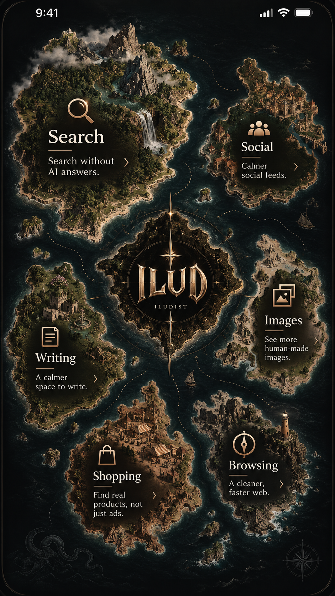

# 01 — Atlas

**Chart of the quieter web.**

One of ten independent interpretations of the ILUD catalogue. Each one reads the same
researched body of remedies and presents it as a different kind of object. This one is a
sea chart.



## The idea

Eight islands, one for each part of ordinary digital life — search, social, images,
writing, shopping, browsing and devices, video and music, reading and everyday. A dotted
course runs from ILUD at the centre of the sea to each of them. You sail to an island,
land in its harbour, and read the charts kept there.

The metaphor is not decoration. Choosing is navigation: you drag the sea, pinch to change
scale, and tap a landmass to go there. A ship actually travels the charted route ahead of
you before the harbour opens.

## How it behaves

| Gesture | What happens |
| --- | --- |
| Drag | Sails the sea, with momentum and a soft edge |
| Pinch / wheel | Changes scale; the chart declutters as you pull back |
| Tap an island | A ship sails the route, then the harbour opens |
| Tap the compass | Toggles between the close view and the whole archipelago |
| Drag a sheet's handle down | Dismisses it, as you would push a card away |
| Back button / Esc | Closes whatever is open, one layer at a time |

**Level of detail.** Labels are drawn in screen space, not map space, so type stays crisp
at every zoom. As you pull back the chart drops the descriptions, then the counts, exactly
as a printed chart's type would if it could.

**Sound.** Every sound is synthesised at runtime with the Web Audio API — there are no
audio files. Water, a sail, a wooden click, a pen mark. The audio context is only created
on your first touch, as mobile browsers require, and there is an on/off control in
**About**. Nothing depends on hearing it.

**Motion.** `prefers-reduced-motion` is respected automatically: sailing becomes an
instant transition, the drift stops, and glide is disabled. It can also be forced on from
**About** for people who want a still chart on a device that does not report the
preference.

## What is in the harbour

Every entry carries its outcome first and its mechanism second — "Search without AI
summaries", not "append a URL parameter". Open one and you get:

- **Do it now** — a single action. Where the remedy is a transformed search, you type your
  query and ILUD opens the prepared destination. Where it is a setting that a web page is
  not allowed to open, ILUD copies the address and says so plainly.
- **What will change** — in plain words, before you commit.
- **By hand, if you prefer** — the manual steps.
- **How this works** — the mechanism, folded away until wanted.
- **Worth knowing** — the caveats, including when something is fragile or regional.
- **If that does not suit** — honest alternatives, including other companies' products.
- **Where this came from** — sources and the date the entry was last checked.

The **logbook** keeps the ones you want again, in `localStorage`. Nothing leaves the
device; there is no analytics, no network call, and no account.

## Running it

It is a static page with no build step and no dependencies.

```
open index.html            # works straight from the file system
python -m http.server      # or serve the folder, if you prefer
```

`data.js` is generated from the shared catalogue in `../_research/`. Regenerate it with:

```
node ../_tools/build-data.js
```

## Files

| File | |
| --- | --- |
| `index.html` | Structure, metadata, splash, sheets |
| `atlas.css` | The whole design system for this interpretation |
| `atlas.js` | Procedural chart, pan/zoom, sailing, sheets, audio, search, logbook |
| `data.js` | The catalogue, copied in from `_research/` — do not edit here |
| `reference.png` | The approved design reference this interpretation is built from |

Everything on the chart is drawn procedurally as SVG from a seeded pseudo-random
generator: coastlines, ridges, mountains, forest, islets, routes. There is no artwork to
download, so the map is identical on every device and the whole app is a few tens of
kilobytes.
