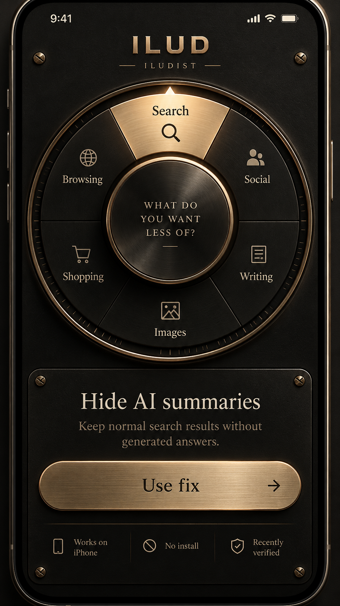

# 02 — Instrument

**Turn the ring. Choose what you want less of. Use the fix.**

One of ten independent interpretations of the ILUD catalogue. This one is a machined
brass instrument: a dial you turn with your thumb.



## The idea

Two concentric detented controls on a single black faceplate.

- **The outer ring** — eight sectors, one for each part of ordinary digital life. Turning
  it brings a sector under the index mark at twelve o'clock, where it lights up in brass.
- **The hub** — once you have chosen a part of your day, the hub becomes a counter.
  Turning it steps through the remedies in that category, one detent at a time.
- **The plaque** — the engraved plate below always shows the remedy currently selected,
  with one primary action: **Use fix**.

Nothing settles between two things. Both controls snap, both click, and both have weight.

## How it behaves

| Gesture | What happens |
| --- | --- |
| Drag the outer ring | Turns with 1:1 tracking, then glides and snaps to the nearest sector |
| Drag the hub | Steps through the remedies of the selected category |
| Tap a sector | Turns to it by the shortest way round |
| Tap the hub | Opens the specification for the current remedy |
| ‹ › under the plaque | Steps the hub one detent, and the hub follows |
| Mouse wheel | One sector per notch |
| ← → ↑ ↓ | Category, then remedy. Enter opens the specification. |
| Drag a drawer's header down | Puts it away |
| Back / Esc | Closes the top drawer |

**Detents.** The ring has eight stops at 45°; the hub has one stop per remedy. Crossing a
stop fires a click and, on Android, a 4–9 ms haptic tap. (iOS Safari does not expose the
Vibration API at all, which is why the feedback is primarily audible.)

**Momentum.** A flick keeps turning and decays at roughly 0.45% per millisecond, then
settles into the nearest detent with a slight sprung overshoot — the way a good selector
switch behaves. Under `prefers-reduced-motion`, momentum is removed entirely and the dial
moves straight to its stop.

**Sound.** Synthesised at runtime — no audio files. The ring's detent is a low, heavy
click (a 2.1 kHz noise burst through a bandpass filter over a 168 Hz body); the hub's is a
lighter jeweller's tick at 3.5 kHz. The audio context is created on your first touch, as
mobile browsers require. There is an on/off switch in **About**, and nothing in the
instrument depends on hearing it.

## The four states

- **The faceplate** — the dial and the plaque. This is the whole app; there is no
  navigation to learn.
- **Specification** — the full entry: what to do now, what will change, the manual steps,
  how the mechanism works, what is worth knowing, honest alternatives, and sources with
  the date each was last checked.
- **Find** — search by service or by symptom, plus five problem-first questions
  ("AI answering for me", "AI deciding what I see", …) for people who do not know the
  name of the thing bothering them. Choosing a result turns the dial to it.
- **Kept** — the fixes you hung on the rack, plus the ones you used recently. Held in
  `localStorage`; nothing leaves the device.

## Running it

Static, no build step, no dependencies.

```
open index.html            # works straight from the file system
```

`data.js` is generated from the shared catalogue in `../_research/`:

```
node ../_tools/build-data.js
```

## Files

| File | |
| --- | --- |
| `index.html` | Faceplate, plaque and drawers |
| `instrument.css` | The whole design system for this interpretation |
| `instrument.js` | Shared core: data indices, preferences, synthesised sound, drawers |
| `dial.js` | The dial — geometry, rotation physics, detents, the plaque |
| `panels.js` | Specification, find, kept, about |
| `data.js` | The catalogue, copied in from `_research/` — do not edit here |

The dial is drawn entirely as SVG from a handful of radii; the knurling, graduations,
sectors and index mark are generated, so it is crisp at any size and weighs nothing.
